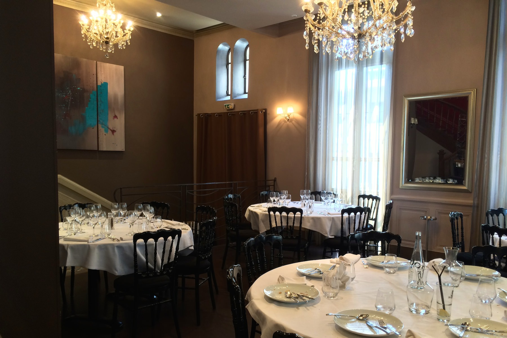
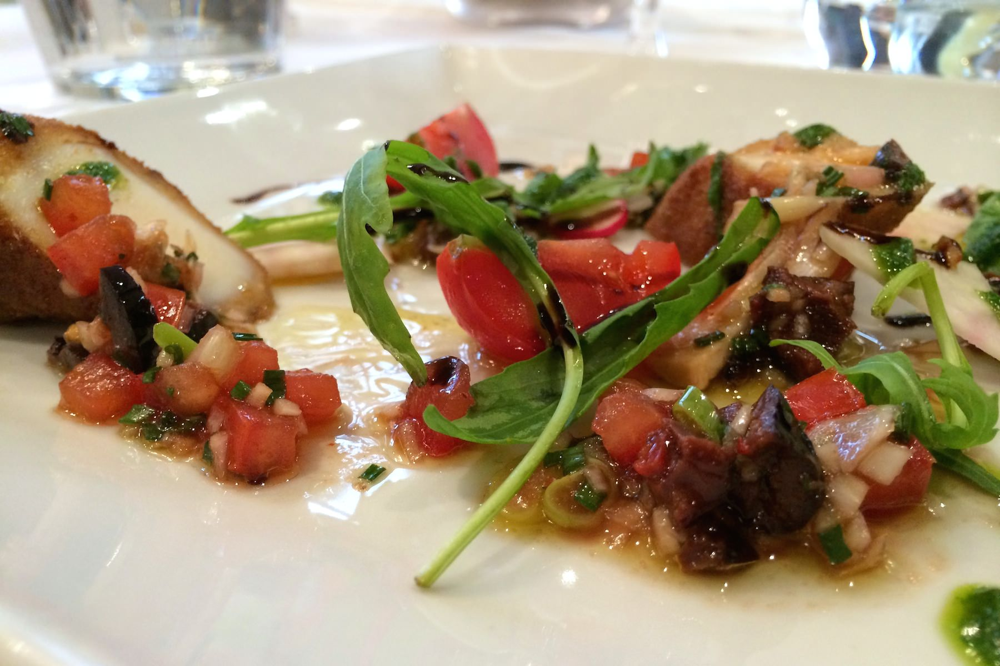
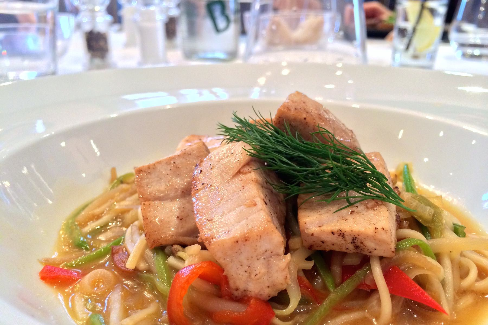
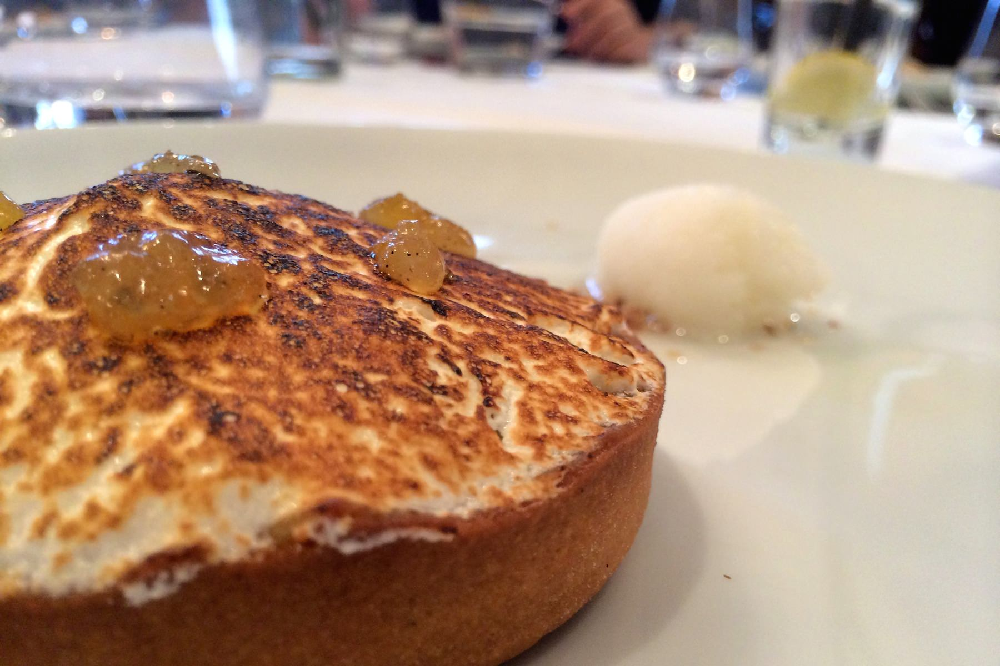

+++
titre = "Le Victoria Hall à Lyon"
title = "Le Victoria Hall à Lyon"
url = "/victoria-hall-lyon"
date = "2014-05-16T13:16:59"
Lastmod = "2014-05-16T13:28:43"
cover = "victoria-hall-lyon.jpg"
categorie = [ "À manger" ]
tag = [ "Bar", "Cuisine française", "Cuisine traditionnelle", "Lounge" ]

+++

Adossé au parc Blandan, pas très loin de la place et du métro Jean Macé, le <a href="http://victoriahall.fr"><strong>Victoria Hall</strong></a> cache bien son jeu. Au carrefour de deux boulevards très passants, cette maison bourgeoise renferme non seulement un restaurant, mais aussi un bar lounge et même une grande terrasse isolée de la circulation. Une bonne surprise dans cette partie de Lyon qui n&rsquo;est pas riche en bonnes adresses : un restaurant à découvrir, surtout si on peut profiter du menu du midi.

Construit au milieu du XIXe siècle, le <strong>Victoria Hall</strong> impose son côté suranné dès l&rsquo;entrée, qui est d&rsquo;ailleurs assez impressionnante avec le grand escalier au fond. Ce n&rsquo;est pas une critique : même si la modernité s&rsquo;est emparée du lieu par quelques touches, notamment par la vaisselle sur les tables, on est ici dans la tradition et ce choix assumé est bien maîtrisé. Le décor est en partie d&rsquo;origine, avec les gros lustres de cristal, l&rsquo;escalier et quelques boiseries. Le tout est cohérent et convaincant et les amateurs apprécieront les touches modernes, à l&rsquo;image de ces tableaux d&rsquo;art contemporain sur certains murs. Contrairement à ce que l&rsquo;on pourrait croire de l&rsquo;extérieur, il y a de la place dans la salle, beaucoup de place. On compte plusieurs grandes tables rondes où l&rsquo;on tiendra facilement à sept ou huit, mais il y a encore d&rsquo;autres tables plus petites à côté du bar, et même une grande table dans un espace semi privatisé. Le midi en semaine, il y a un peu de monde et même si toutes les tables n&rsquo;étaient pas occupés ce jour-là, le niveau sonore était un peu élevé. Le plafond élevé n&rsquo;aide pas sur le plan acoustique et on ne viendra pas ici pour un repas intime, mais plutôt pour un rendez-vous d&rsquo;affaire.

Pour manger, deux choix s&rsquo;offrent à vous le midi : soit vous partez sur le menu du jour, soit vous piochez dans <a href="http://victoriahall.fr/menu-restaurant-lyon-saveurs-du-marche/">la carte</a> renouvelée de temps en temps. Dans ce dernier cas, vous pouvez composer votre menu pour 44 € et trois assiettes, une liberté vraiment agréable avec un choix de viandes et de poissons pour le plat de résistance et une poignée d&rsquo;entrées et de desserts. Chaque midi, un menu différent est proposé avec une entrée et un dessert et, au choix, un plat de viande ou de poisson. Les trois assiettes sont facturées 24 €, ce qui reste raisonnable à Lyon, mais on peut aussi opter pour le plat seul, ou pour deux assiettes à 20 €.

Le chef qui officie au <strong>Victoria Hall</strong> ne se lance pas dans des réalisations extrêmement complexes, il ne va pas chercher les alliances les plus improbables, mais propose plutôt une cuisine simple avec suffisamment d&rsquo;originalité pour ne pas tomber dans le simplisme. En entrée, la seiche panée était d&rsquo;une tendreté remarquable et la sauce vierge constituait un très bon accompagnement. Même si les quantités étaient peut-être un peu justes, il ne s&rsquo;agit que d&rsquo;une entrée et l&rsquo;assiette ouvre agréablement le repas. Pour la suite, le thon mi-cuit était plutôt réussie : la cuisson était correcte, même si le thon blanc se prête moins à l&rsquo;exercice que le rouge, et même si certains morceaux, trop petits, étaient un peu secs. Le défaut principal de l&rsquo;assiette n&rsquo;est pas du côté du poisson, mais plutôt de la sauce dans l&rsquo;esprit thaïlandais qui l&rsquo;accompagne et qui était trop salée. La pièce de bœuf en alternative semblait plus réussie, avec une très belle cuisson. Le dessert était en revanche une vraie réussite : la tarte au citron meringuée maison était faite du jour — la page brisée bien croustillante, ça ne trompe pas — et elle était bien citronnée avec les touches supplémentaires apportées par la marmelade sur le dessus, et le sorbet à côté. Si l&rsquo;on voulait pinailler, on pourrait signaler un léger penchant vers le sucre, mais il faut reconnaître que c&rsquo;est un très bon dessert, simple, mais parfaitement maîtrisé.

La cuisine proposée au <strong>Victoria Hall</strong> ne fait pas d&rsquo;étincelle, mais elle est réussie, tout simplement. Par certains aspects, elle évoque le <a href="http://voiretmanger.fr/mama-shelter-lyon/" title="Le Mama Shelter à Lyon"><strong>Mama Shelter</strong></a> situé à quelques minutes de là, mais on mange mieux ici et en plus on mange pour moins cher. Si vous cherchez une adresse pour un repas d&rsquo;affaire, c&rsquo;est certainement le meilleur choix dans le quartier.

