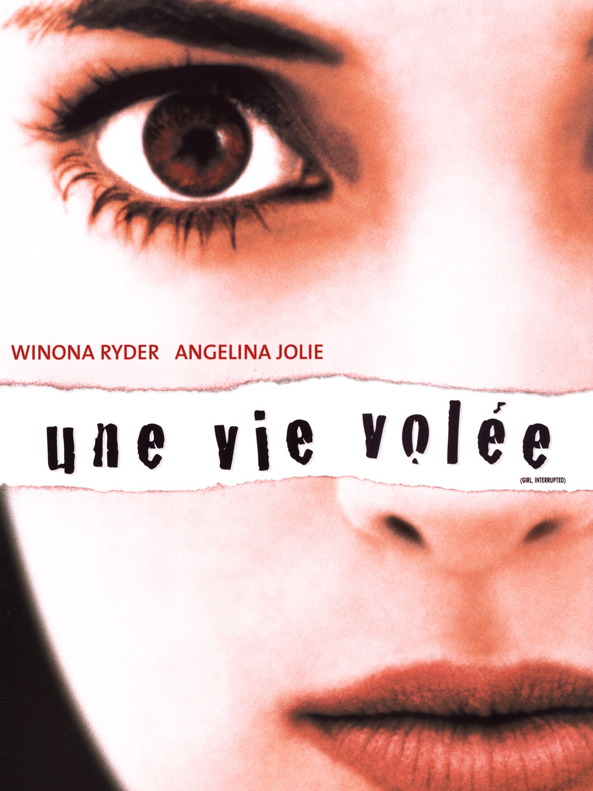
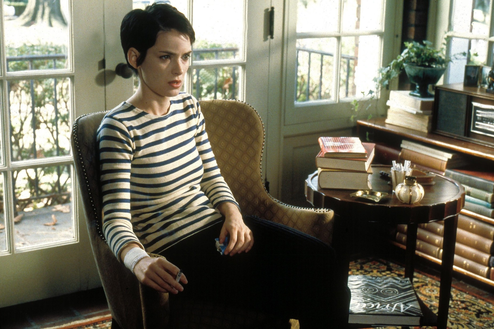
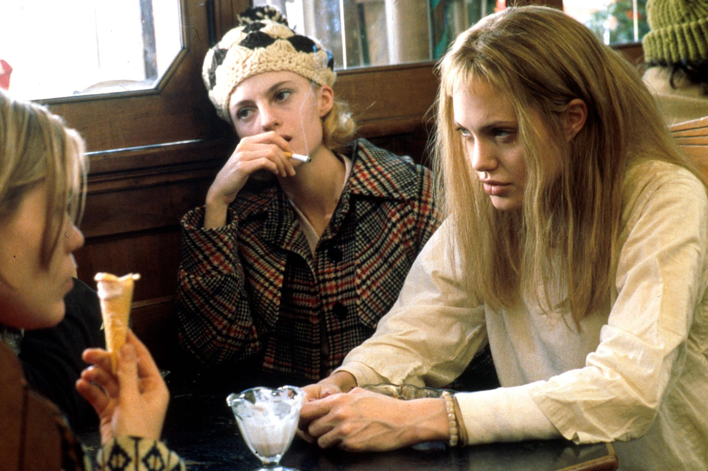

+++
type = "post"
titre = "<em>Une vie volée</em>, James Mangold"
title = "Une vie volée, James Mangold"
url = "/vie-volee-mangold"
date = "2015-06-12T19:03:41"
Lastmod = "2015-06-12T19:24:57"
cover = "vie-volee-winona-ryder-angelina-jolie.jpg"
categorie = [ "À voir" ]
tag = [ "Adaptation littéraire", "Amitié", "Drame", "Folie", "Histoire vraie", "Hôpital", "Mélodrame", "Mort", "Psychologie" ]
createur = [ "James Mangold" ]
acteur = [ "Angelina Jolie", "Whoopi Goldberg", "Winona Ryder" ]
annee = [ "1999" ]
weight = 1999
pays = [ "États-Unis" ]
original = "Girl"

+++

Inspiré d&rsquo;une histoire vraie, <em>Une vie volée</em> raconte l&rsquo;année passée par une jeune fille américaine dans un asile psychiatrique. Un sujet bien sérieux, que James Mangold traite de front, dans un mélodrame très conventionnel, mais qui tire son épingle du jeu malgré tout. Ce n&rsquo;est pas sa réalisation assez banale qui l&rsquo;aide vraiment, mais plutôt son duo d&rsquo;actrices exceptionnel. Winona Ryder est censée avoir le premier rôle et elle se débrouille plutôt bien, mais elle est écrasée par la prestation éblouissante d&rsquo;Angelina Jolie. À l&rsquo;heure des bilans, <em>Une vie volée</em> n&rsquo;est pas le grand film sur les asiles psychiatriques que l&rsquo;on pouvait attendre, mais un drame solide qui vaut surtout pour les prestations de ses deux jeunes actrices.

L&rsquo;histoire se déroule dans l&rsquo;Amérique de la deuxième moitié des années 1960, alors que la guerre au Vietnam bat toujours son plein et que la révolution culturelle est en marche. Susanna, 18 ans, souffre d&rsquo;une dépression chronique et ses parents l&rsquo;incitent fortement à consulter un psychiatre qui l&rsquo;envoie en hôpital psychiatrique après avoir été sauvée <em>in extremis</em> d&rsquo;une overdose d&rsquo;aspirine. La jeune fille a beau se défendre d&rsquo;avoir cherché à se suicider, elle accepte l&rsquo;hospitalisation et puisqu&rsquo;elle est majeure, entre volontairement à l&rsquo;institut Claymore. <em>Une vie volée</em> n&rsquo;explique jamais vraiment pourquoi elle accepte cette situation, alors même qu&rsquo;elle refuse d&rsquo;imaginer qu&rsquo;elle est folle ou même qu&rsquo;elle a un problème au fond. Et c&rsquo;est tant mieux : James Mangold préfère se concentrer sur son internement d&rsquo;un an et sur sa rencontre avec les autres pensionnaires. Tout bascule quand elle rencontre Lisa, une femme plus âgée qu&rsquo;elle et surtout au caractère beaucoup plus marqué. Elle tombe sous son charme et suit son conseil de ne pas prendre les médicaments prescrits.

<em>Une vie volée</em> se concentre essentiellement sur ce couple et même si le scénario ménage un petit peu de place à d&rsquo;autres internées, on sent bien vite que ce sont les deux personnages principaux et même la principale raison d&rsquo;être du long-métrage. James Mangold ne s&rsquo;en cache pas et il accentue même leur relation en créant de toute pièce leur fuite vers un parc d&rsquo;attractions pour renforcer leurs liens. Il faut dire que le cinéaste avait un duo d&rsquo;actrices si puissant qu&rsquo;il aurait eu tort de se priver. Winona Ryder est convaincante dans le rôle de Susanna, même si son jeu est finalement plutôt monotone. À ses côtés, Angelina Jolie est époustouflante : l&rsquo;actrice est parfaite dans le rôle de Lisa, entre hystérie et manipulation. On pourrait arguer qu&rsquo;elle en fait trop, mais l&rsquo;actrice est totalement dans son personnage et son jeu n&rsquo;est jamais inutilement outrancier. On comprend pourquoi les Oscars ont célébré son jeu et la réussite d&rsquo;<em>Une vie volée</em> lui doit incontestablement beaucoup.

James Mangold n&rsquo;évite pas certains travers des mélodrames, à commencer par une musique un petit peu trop larmoyante et un petit peu trop présente. C&rsquo;est surtout sur la fin que l&rsquo;on ressent le plus cette présence un petit peu écrasante, mais il n&rsquo;empêche que le long-métrage mérite malgré tout d&rsquo;être vu. <em>Une vie volée</em> tient entièrement sur les épaules de ses actrices et à défaut d&rsquo;être un grand film sur la folie, c&rsquo;est un drame convaincant.

<h3>Vous voulez <a href="/soutien/">m&rsquo;aider</a> ?</h3>
<ul>
<li><a href="http://www.amazon.fr/gp/product/B0033RA4NA/ref=as_li_ss_tl?ie=UTF8&amp;tag=leblogdenic07-21&amp;linkCode=as2&amp;camp=1642&amp;creative=19458&amp;creativeASIN=B0033RA4NA">Acheter le film en DVD sur Amazon</a></li>
<li><a href="https://itunes.apple.com/fr/movie/une-vie-volee/id374144545?l=en">Acheter ou louer le film sur l&rsquo;iTunes Store</a></li>
<li><a href="http://www.netflix.com/WiMovie/60000428?trkid=50361908">Regarder le film sur Netflix</a></li>
</ul>

