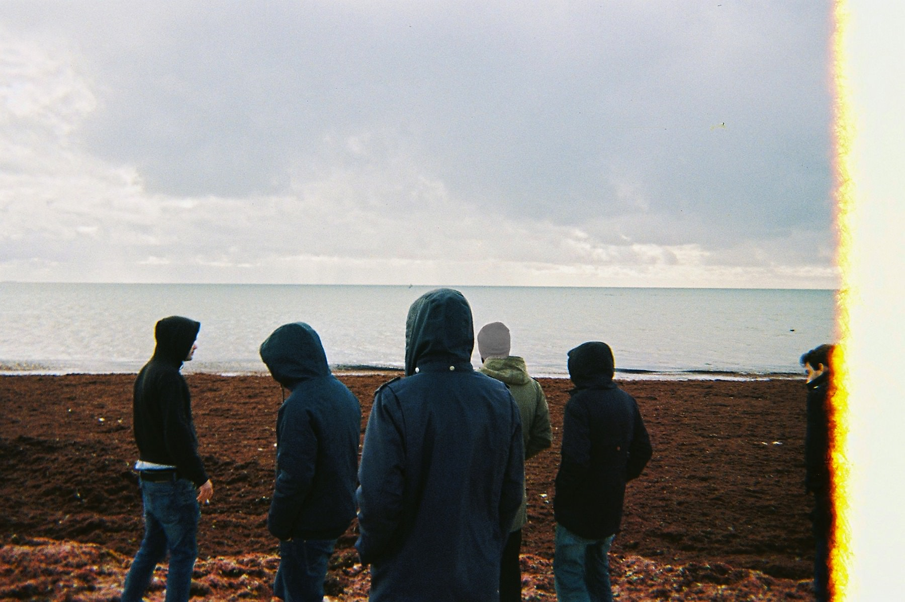
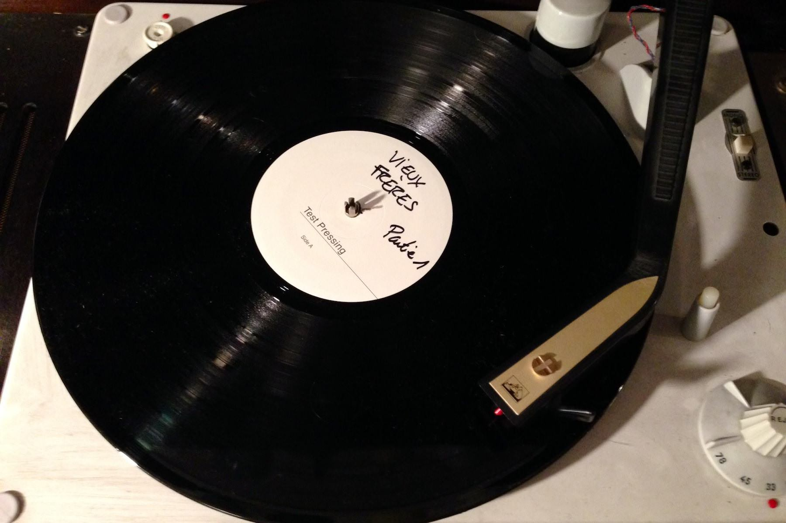

+++
titre = "<em>VIEUX FRÈRES – Partie 1</em>, FAUVE"
title = "VIEUX FRÈRES – Partie 1, FAUVE"
url = "/vieux-freres-partie-1-fauve"
date = "2014-02-13T10:18:47"
Lastmod = "2014-02-13T09:39:31"
cover = "fauve-vieux-freres.jpeg"
categorie = [ "Musique" ]
tag = [ "Chanson", "Rap", "Société", "Spoken Words" ]
createur = [ "FAUVE" ]
annee = [ "2014" ]
weight = 2014
pays = [ "France" ]

+++

Comment, après un succès, revenir sans se répéter ? Comment poursuivre une voie sans tomber dans sa propre caricature ? Le risque était grand, surtout pour FAUVE qui a créé un style assez facile à caricaturer et qui a suscité autant d’amour que de haine l’an dernier. On craignait un peu l’épreuve du premier album, exercice plus complexe que de sortir un morceau de temps en temps sur la toile. D’autant que le premier EP du groupe, <a href="https://itunes.apple.com/fr/album/blizzard-ep/id768699970"><em>BLIZZARD &#8211; EP</em></a>, était très sympa, mais <a href="http://voiretmanger.fr/fauve/">laissait déjà poindre</a> un côté répétitif que le collectif devait absolument éviter, sans perdre son identité. Avec <em>VIEUX FRÈRES — Partie 1</em>, la mission est plutôt réussie. Cette première partie d’un diptyque qui sera complété avec un deuxième album prévu pour la fin de l’année évolue autant sur la forme que sur le fond. On reconnaît le style général, on retrouve des idées déjà expérimentées, mais le groupe a mûri et cela s’entend. À la clé, un très bel album, plus riche et plus travaillé que son prédécesseur, mais aussi moins plombé et plus facile à écouter.

<blockquote class="pull-quote">
Mais avant que ça arrive / je voudrais que tu saches / que j’ai compris / que je passe mes nuits / entre cachetons et insomnies 
Et que je vais me battre / pour reconstruire / un apprenti repenti / et tant pis / si ça me prend toute une vie<cite class="author"> — FAUVE, VIEUX FRÈRES — Partie 1, « VOYOUS »</cite>

</blockquote>

Dès les premières écoutes, on sent que FAUVE a évolué par rapport aux premiers morceaux. Leur musique était manifestement un exutoire et il a fait son effet : même si <em>VIEUX FRÈRES — Partie 1</em> commence avec un premier morceau assez sombre, on entend déjà que le collectif n’est plus aussi désespéré et laisse entendre quelques notes d’espoir. Dans « VOYOUS », c’est la boucle de musique classique<a href="#fn-11155-1" rel="footnote">1</a> qui ajoute une touche lumineuse et égaie un morceau par ailleurs assez dur. Par la suite, les titres s’enchaînent, mais on repère quelque chose de nouveau : des mélodies et même du chant. « <em>INFIRMIÈRE</em> » est peut-être le morceau le plus accessible et le plus lumineux grâce à ses paroles plus légères et surtout son entêtant refrain et sa musique plus travaillée. On n’attendait pas une telle incursion dans une musique presque pop et même si le chanteur de FAUVE n’est pas encore toujours très à l’aise avec le chant, on apprécie cette recherche de nouveautés. Plus tôt, on avait déjà eu un peu de rap traditionnel avec la présence de Georgio dans le premier morceau : ne pas répéter semble avoir été une obsession pendant la conception de cet album et ce n’est pas une mauvaise chose.

<iframe class="aligncenter" src="//www.youtube.com/embed/RyuUNeCrAn4" frameborder="0" allowfullscreen></iframe>

<blockquote class="pull-quote">
Nous sommes de ceux qui ne renoncent pas / des chiens enragés / des teigneux / des acharnés 
Nous sommes de ceux qui comptent bien / devenir capables de tout encaisser 
Nous sommes de ceux qui établissent des stratégies dans l’obscurité / pour reprendre la main 
Jouer selon leurs propres règles et forcer le destin<cite class="author"> — FAUVE, VIEUX FRÈRES — Partie 1, « DE CEUX »</cite>

</blockquote>

FAUVE reste FAUVE et d’autres morceaux ressemblent plus à ceux du premier album. C’est le cas de « DE CEUX » qui reprend un peu la construction des premiers titres avec un côté revendicatif généralement plus discret sur cet album. Mais même là, on note des évolutions et notamment une musique plus rock. De manière générale d’ailleurs, <em>VIEUX FRÈRES — Partie 1</em> est plus travaillé, mieux conçu, plus luxueux. Le collectif a refusé tous les contrats des maisons de disque et a tenu à tout faire en interne, mais on entend bien qu’ils ont évolué et appris. Le format reste court — 40 minutes environ —, mais la diversité est de mise et on apprécie la qualité de certaines orchestrations. L’enregistrement est toujours « fait maison », mais on en a encore moins l’impression, un bon point, même si le premier EP n’était pas particulièrement mauvais sur ce point. Au-delà de la qualité de l’enregistrement, FAUVE expérimente avec de nouvelles tendances et idées. Sur « TUNNEL », ils s’essaient au titre quasiment instrumental, à l’inverse d’autres titres qui accueillent d&rsquo;autres formes d&rsquo;expression.

<blockquote class="pull-quote">
Et bah écoute / je sais pas pour toi /mais pour moi / ce sera 
La tête haute / les couilles sur la table / le poing en l’air / fais-moi confiance avant de finir six pieds sous terre 
J’aurai vécu tout ce qu’il y a à vivre et j’aurai fait tout ce que je peux faire 
Tenté tout ce qu’il y a à tenter / et surtout on m’aura aimé<cite class="author"> — FAUVE, VIEUX FRÈRES — Partie 1, « LOTERIE »</cite>

</blockquote>

L’évolution est aussi sensible sur le fond. FAUVE est souvent moqué pour ses paroles et il faut bien reconnaître qu’elles sont parfois un peu niaises et maladroites. Elles sont aussi sincères, en tout cas c’est l’impression qu’elles donnent, et c’est peut-être encore le plus important. De la même manière que la musique s’éclaire un peu sur <em>VIEUX FRÈRES — Partie 1</em>, les paroles du collectif, elles aussi, s’ouvrent un peu et sont moins négatives. On a quelques lueurs d’espoir et le côté revendicatif de <em>BLIZZARD &#8211; EP</em> est moins présent, même s’il ouvre et ferme l’album avec deux titres assez proches de cet état d&rsquo;esprit. Pour le reste, la dépression, la folie ou le mal-être face à la société ne sont plus les seuls sujets — ils n’ont pas disparu comme « JEUNESSE TALKING BLUES » le montre bien — et on note au passage une entrée plus explicite de l’amour. Et contrairement au premier album, les paroles n’ont plus aucun mystère : l’amour est ici explicitement et complètement hétérosexuel<a href="#fn-11155-2" rel="footnote">2</a> et c’est un peu dommage d’avoir perdu la richesse du doute offerte par le premier EP. Les chansons amoureuses sont très conventionnelles, malgré le diptyque formé par deux titres, « INFIRMIÈRE », « LETTRE À ZOÉ », qui se répondent.

<iframe class="aligncenter" src="//www.youtube.com/embed/xcv0EN3TMZ0" frameborder="0" allowfullscreen></iframe>

Beaucoup de commentateurs évoquent le futur du groupe et se félicitent ou craignent que le phénomène FAUVE disparaisse aussi vite qu’il est apparu. Comment savoir aujourd’hui si <em>VIEUX FRÈRES — Partie 1</em> sera totalement oublié ou si l’on y pensera encore dans six mois, deux ans, vingt ans ? On lit souvent que <a href="http://fr.wikipedia.org/wiki/Diabologum">Diabologum</a> a fait du FAUVE vingt ans avant, mais qui se souvient encore de ce groupe toulousain ? Ses albums ne sont plus disponibles, ni sur les les plateformes légales<a href="#fn-11155-3" rel="footnote">3</a>, ni même sur les illégales, mais on peut écouter <em>#3 (Ce n’est pas perdu pour tout le monde)</em> et les autres albums <a href="http://www.tunesbag.com/r/170513">sur Youtube</a>. L’occasion de découvrir un groupe qui a effectivement eu les mêmes idées avec un chant quasiment parlé, mais une orientation plus rock qui correspond bien à la mode des années 1990. FAUVE a-t-il écouté les morceaux de Diabologum avant d’écrire les siens ? Au moins en partie si l’on en croit <a href="https://www.facebook.com/FAUVEcorp/posts/560162187335574?comment_id=91930578&amp;offset=0&amp;total_comments=10">ce commentaire</a>, mais au fond qu’importe Il n’est certainement pas l’album de l’année, mais ce serait sûrement une erreur de ne pas l’écouter sérieusement pour cette raison. Après tout, on ne peut pas convaincre un public aussi large si l’on n’a rien à dire et le collectif représente à sa manière une époque et une jeunesse désabusée.

<h3>Vous voulez m’aider ?</h3>
<ul>
<li><a href="https://itunes.apple.com/fr/album/vieux-freres-pt.-1/id770839909">Télécharger l’album sur l’iTunes Store</a></li>
<li><a href="http://www.amazon.fr/gp/product/B00H21WQPW/ref=as_li_ss_tl?ie=UTF8&#038;tag=leblogdenic07-21&#038;linkCode=as2&#038;camp=1642&#038;creative=19458&#038;creativeASIN=B00H21WQPW">Acheter l’album sur Amazon</a></li>
<li><a href="http://open.spotify.com/album/7w71atms7VMEw48a3sQ8Wd">Écouter l’album sur Spotify</a></li>
</ul>

<ol>
<li id="fn-11155-1">
Un sample extrait du <em>Trio pour piano et cordes nº 2</em> de Schubert. J’aurais aimé dire que j’ai retrouvé la référence seul, mais il m’a fallu l’aide <a href="http://www.slate.fr/culture/78836/fauve-nique-schubert-le-blizzard">de cet article</a> pour mettre le doigt dessus et me rappeler comment je connaissais cette mélodie : Kubrick l’a utilisé dans <a href="http://voiretmanger.fr/barry-lyndon-kubrick/" title="Barry Lyndon, Stanley Kubrick"><em>Barry Lyndon</em></a>.&#160;<a href="#fnref-11155-1" rev="footnote">&#8617;</a>
</li>
<li id="fn-11155-2">
« INFIRMIÈRE » est explicite : « <em>À une table sur ma gauche / y avait un groupe de filles / dont une qui m&rsquo;a tout de suite plu</em> […]  <em>Mais surtout elle avait l&rsquo;air douce / bienveillante et sereine / comme si elle avait pas renoncé / à rien 
Comme si elle avait jamais douté de la beauté du monde / ni de celles des hommes</em> »&#160;<a href="#fnref-11155-2" rev="footnote">&#8617;</a>
</li>
<li id="fn-11155-3">
On le trouve <a href="http://www.amazon.fr/gp/product/B00004UQVP/ref=as_li_ss_tl?ie=UTF8&amp;tag=leblogdenic07-21&amp;linkCode=as2&amp;camp=1642&amp;creative=19458&amp;creativeASIN=B00004UQVP">sur Amazon</a>, mais à un tarif vraiment pas raisonnable.&#160;<a href="#fnref-11155-3" rev="footnote">&#8617;</a>
</li>
</ol>

