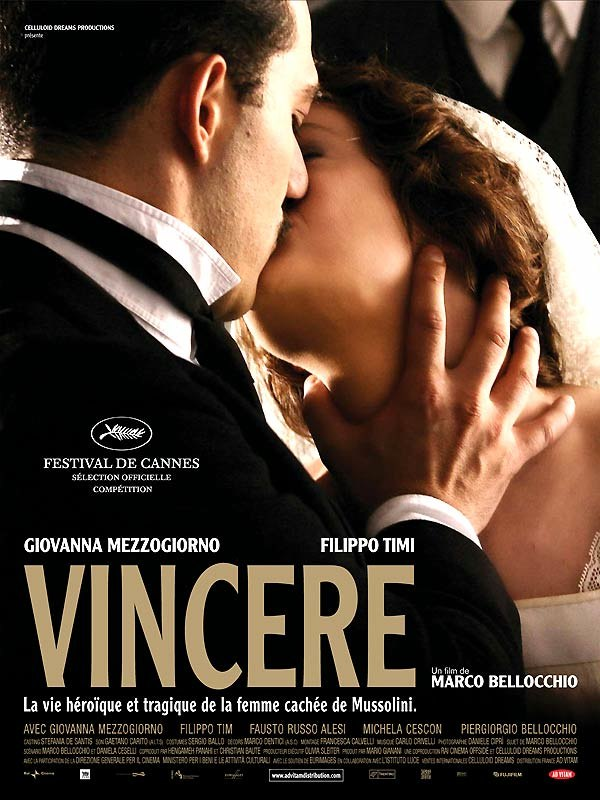
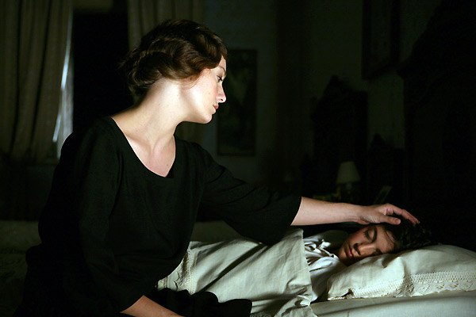
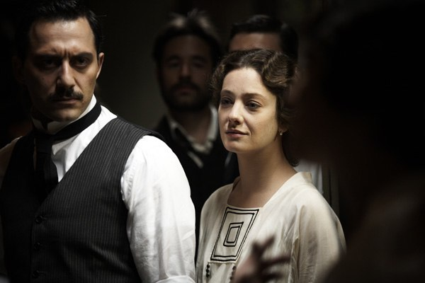
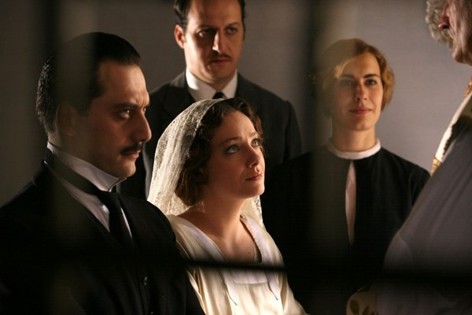

+++
type = "post"
titre = "Vincere, Marco Bellocchio"
title = "Vincere, Marco Bellocchio"
url = "/vincere-bellocchio"
date = "2009-12-09T00:45:46"
Lastmod = "2013-06-07T18:25:13"
cover = "vincere-marco-bellochio.jpeg"
categorie = [ "À voir" ]
tag = [ "Drame", "Histoire" ]
createur = [ "Marco Bellocchio" ]
annee = [ "2009" ]
weight = 2009

+++

Et dire que j&rsquo;ai failli ne pas voir <em>Vincere</em>, accablé par le travail et la multiplication des sorties cinématographiques&#8230; Quelle erreur c&rsquo;eut été tant le film de Marco Bellocchio est intéressant sur le fond comme sur la forme.

<em>Vincere</em> raconte l&rsquo;histoire d&rsquo;Ida Dalser, charmante jeune italienne qui a eu le malheur de croiser la route d&rsquo;un certain Benito Mussolini au début du XXe siècle. Dès le premier regard, ce fut le coup de foudre pour ce socialiste engagé dans les combats révolutionnaires de son temps, un brillant avocat de la cause marxiste, un orateur hors pair. Elle le croise d&rsquo;abord alors qu&rsquo;il démontre l&rsquo;absence de Dieu devant des fidèles convaincus, avant de le retrouver par hasard lors d&rsquo;une manifestation et qu&rsquo;il l&rsquo;utilise comme couverture. D&rsquo;emblée, on sent le décalage entre cette femme qui donnerait sa vie pour l&rsquo;être aimé, et un homme qui n&rsquo;en a pas grand-chose à faire de cette jeune femme quand même mignonne. Bon, c&rsquo;est un homme, alors il profite, mais c&rsquo;est toujours avec distance, froideur presque.

Cette femme sacrifie littéralement tout pour cet homme, allant jusqu&rsquo;à lui offrir sa fortune pour lui permettre de fonder un nouveau journal belliciste en 1914. Mais la guerre justement lui révèle que ce Benito qu&rsquo;elle aimait avait déjà une femme et même une petite fille. Pis, il lui fait clairement comprendre qu&rsquo;entre elle et sa femme officielle, le choix est tout trouvé. Disons-le, il largue sa petite amie comme les gentlemen ne devraient pas le faire, du jour au lendemain puis en la faisant interner pour folie quand elle le gêne trop. Le film se concentre après l&rsquo;abandon sur l&rsquo;enfermement d&rsquo;Ida dans les hospices, ainsi que sur son fils qu&rsquo;elle ne verra plus jamais. Les deux finissent d&rsquo;ailleurs très mal, le fils meurt à 26 ans dans un asile (décidément, appartenir à la famille des Mussolini ne devait pas être facile tous les jours&#8230; surtout quand la famille vous rejette) et la mère meurt plus âgée et affirmant toujours haut et fort qu&rsquo;elle est la femme de Mussolini. Le mystère reste d&rsquo;ailleurs entier, puisqu&rsquo;aucune preuve n&rsquo;a été retrouvée.

Cette petite histoire qui raconte aussi la grande est passionnante, car méconnue. Les études ne manquent pas sur Mussolini, sur l&rsquo;ambitieux, le mégalomane, le fasciste&#8230; mais sur l&rsquo;homme pas vraiment. Apparemment, il était aussi tendre en politique qu&rsquo;en amour, n&rsquo;hésitant pas à rejeter une femme et un fils comme de vulgaires torchons. D&rsquo;ailleurs, c&rsquo;est très intéressant de voir comment ce révolutionnaire se range sagement du côté de ce qu&rsquo;il combattait, à savoir le pouvoir royal et même religieux.

Le film parcourt toute la première moitié du XXe siècle de l&rsquo;histoire italienne, et brosse par la même occasion un portrait du pays à l&rsquo;époque, même s&rsquo;il se concentre sur l&rsquo;histoire d&rsquo;une femme. On découvre néanmoins ainsi un pays encore profondément marqué par la religion catholique, omniprésente et si puissante que Mussolini n&rsquo;a d&rsquo;autre choix que de se lier à elle. On découvre aussi une époque où le débat politique était réel et vif, on en venait aux mains sur de grands sujets tels que la guerre bourgeoise ou révolutionnaire ou l&rsquo;absence de Dieu. Voilà qui ne lasse pas d&rsquo;étonner à une époque où les débats se résument à de vagues conflits personnels qui ne durent que le temps de trouver le prochain conflit.

L&rsquo;histoire s&rsquo;intègre au film de Marco Bellocchio par le biais des images d&rsquo;archives. Un effet peu original, mais efficace et surtout très bien intégré ici. Un acteur joue ainsi Mussolini pendant toute sa montée au pouvoir, en gros jusqu&rsquo;à la Première Guerre mondiale. Mais dès qu&rsquo;il arrive au pouvoir, au début des années 1920 donc, c&rsquo;est le vrai Mussolini qui prend le relais et l&rsquo;acteur disparaît totalement de la circulation&#8230; pour finalement réapparaître dans le rôle du fils devenu jeune adulte, ce qui est très bien vu. C&rsquo;est d&rsquo;autant bien vu que le Mussolini, le vrai, ressemble tellement à une imitation comique de lui-même, avec ses rictus grossiers et ses gestes emportés. Les archives se superposent au film de manière très fluide, sans que l&rsquo;on n’ait jamais le sentiment que le réalisateur a voulu nous coller la réalité pour appuyer son point.

Si cette histoire qui en dit long sur l&rsquo;Histoire est fort intéressante et contribue à l&rsquo;intérêt de <em>Vincere</em>, le film est aussi passionnant pour sa forme. Je ne reviens pas sur l&rsquo;intégration des images d&rsquo;époque. Marco Bellocchio a très clairement réalisé son film avec les grands opéras italiens en tête. Cela se ressent par la place de la musique qui ne se contente pas de violons sirupeux pour les bisous ou d&rsquo;ensembles symphoniques inquiétants pour les moments graves. Non, ce sont de vrais morceaux du répertoire classique qui sont ici intégrés, pour une bande originale du reste fort plaisante. Le résultat est saisissant, d&rsquo;autant qu&rsquo;à plusieurs reprises, les personnages se mettent à chanter dans le film. On a alors vraiment l&rsquo;impression d&rsquo;être téléporté place de l&rsquo;Opéra. Cette impression est renforcée par le choix de certains décors. Je pense notamment à des décors urbains avec arcades et plusieurs plans successifs qui ne feraient pas tache en fond d&rsquo;un opéra. Pareil pour l&rsquo;usage de la fumée à plusieurs reprises, sans compter que le thème même de la folie est on ne peut plus classique dans les opéras&#8230;

En alternance avec ces scènes d&rsquo;envolées lyriques, <em>Vincere</em> se fait plus intime, notamment sur toute la partie à l&rsquo;asile. Le film joue ainsi des contrastes, contrastes que l&rsquo;on retrouve bien sûr entre scènes filmées pour le film et scènes de l&rsquo;époque. On peut aussi le voir dans les projections de films, et notamment celle du <em>Kid</em> de Chaplin qui évidemment fait écho à l&rsquo;histoire de <em>Vincere</em>. Marco Bellocchio passe avec une aisance sidérante d&rsquo;un cinéma assez classique à des délires quasiment issus de la bande dessinée quand du texte se superpose à l&rsquo;écran, comme une onomatopée. Un cinéma audacieux comme l&rsquo;Italie que le jeune Mussolini voulait, et qui propose de très beaux plans, comme l&rsquo;envoi des lettres à travers des barreaux et sur un fond de flocons de neige.

Il y aurait encore beaucoup à dire sans doute sur ce film, sur l&rsquo;excellent jeu des deux acteurs principaux, tant Giovanna Mezzogiorno pour Ida que Filippo Timi pour Mussolini (son regard est vraiment impressionnant). Mais je préfère m&rsquo;arrêter là en vous recommandant une nouvelle fois de voir <em>Vincere</em>. Voilà un film intéressant sur le fond et original par la forme qu&rsquo;il serait dommage de manquer&#8230;

Les avis sont partagés sur les blogs. Je suis en accord avec <a href="http://www.toujoursraison.com/2009/11/vincere.html">Rob Gordon</a> et <a href="http://plan-c.over-blog.com/article-vincere-la-vie-est-vaine-40564686.html">Plan C</a>, mais ni avec <a href="http://www.surlarouteducinema.com/archive/2009/11/28/vincere-de-marco-bellochio.html">Pascale</a>, ni avec <a href="http://nightswimming.hautetfort.com/archive/2009/11/16/vincere.html">Ed de Nightswimming</a>, et ce souvent pour les mêmes raisons&#8230; Accord total avec <a href="http://www.critikat.com/Vincere.html">Critikat</a> qui livre, fidèle à son habitude, une analyse détaillée du film.

<h3>Vous voulez m&rsquo;aider ?<a href="#footnote_0_2215" id="identifier_0_2215" class="footnote-link footnote-identifier-link" title="&Agrave; propos de la publicit&eacute;&hellip;">1</a></h3>
<ul>
<li><a href="http://www.amazon.fr/gp/product/B003S4LEJQ/ref=as_li_ss_tl?ie=UTF8&tag=leblogdenic07-21&linkCode=as2&camp=1642&creative=19458&creativeASIN=B003S4LEJQ">Acheter le film en Blu-Ray sur Amazon</a></li>
<li><a href="http://www.amazon.fr/gp/product/B0038MYNT6/ref=as_li_ss_tl?ie=UTF8&tag=leblogdenic07-21&linkCode=as2&camp=1642&creative=19458&creativeASIN=B0038MYNT6">Acheter le film en DVD sur Amazon</a></li>
</ul>

<ol class="footnotes"><li id="footnote_0_2215" class="footnote"><a href="http://nicolinux.fr/soutien/">À propos de la publicité…</a> [<a href="#identifier_0_2215" class="footnote-link footnote-back-link">&#8617;</a>]</li></ol>
