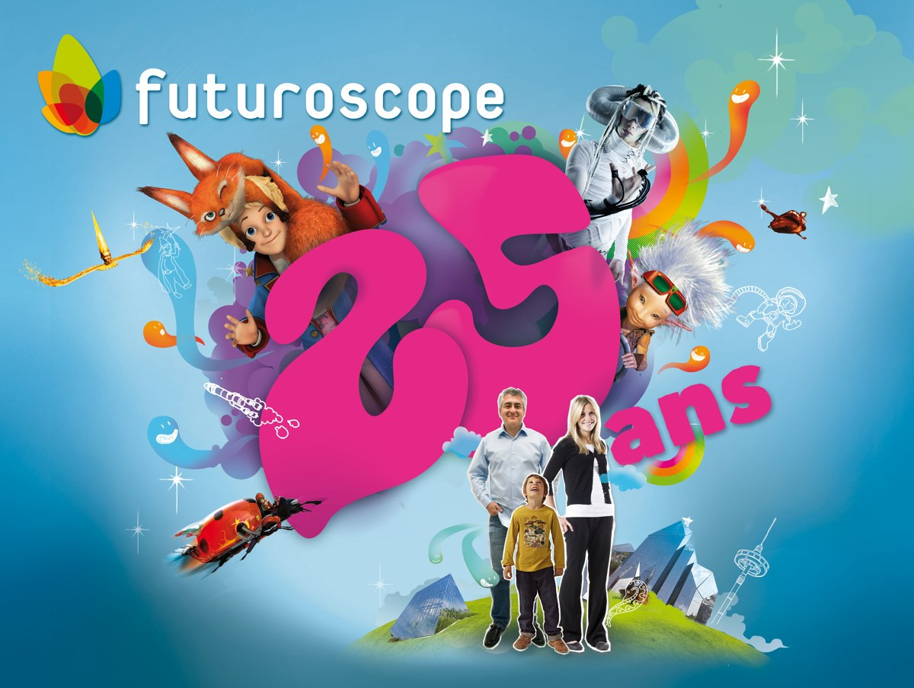
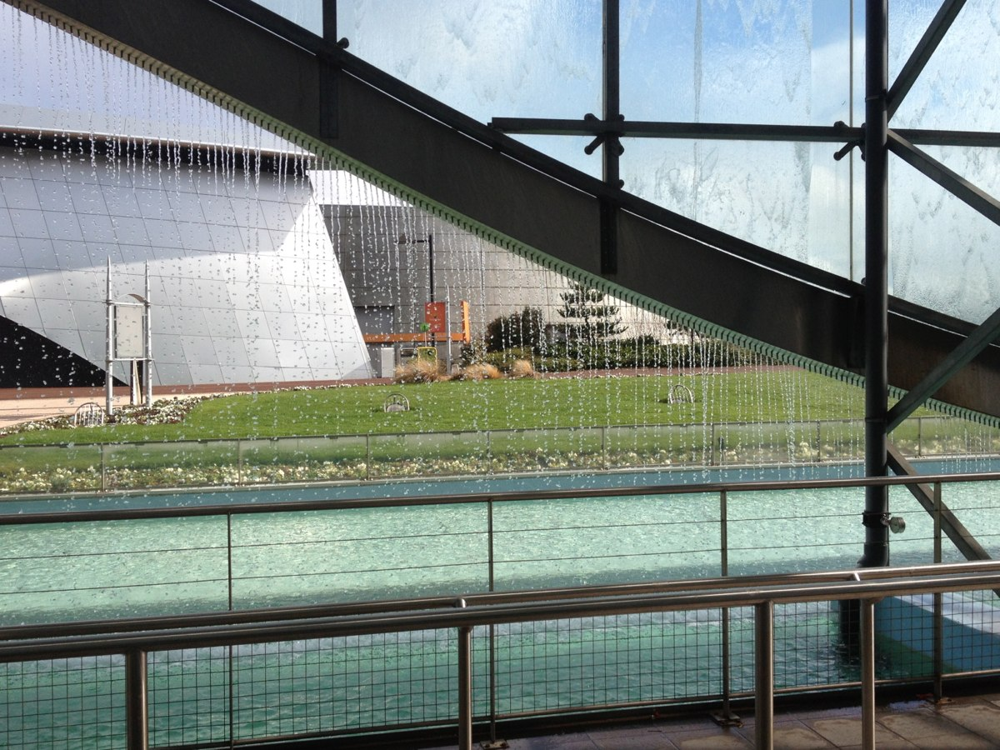
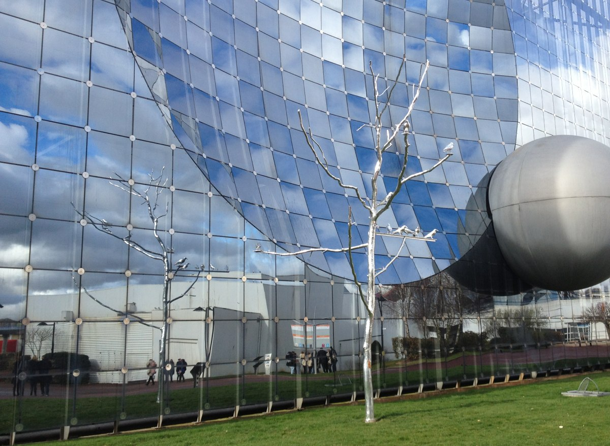
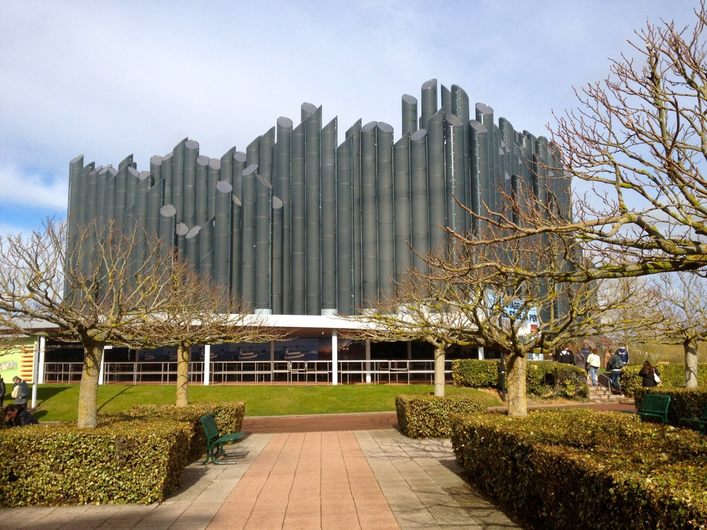

+++
type = "post"
titre = "Une visite au Futuroscope"
title = "Une visite au Futuroscope"
url = "/visite-futuroscope"
date = "2012-03-20T10:27:18"
Lastmod = "2013-09-08T00:23:06"
cover = "futuroscope-poitiers.jpg"
tag = [ "Cinéma", "Parc d'attractions" ]

+++

Le <a href="http://www.futuroscope.com/">Futuroscope</a> fêtera ses 25 ans le 31 mai prochain. Une longévité qui force le respect pour un lieu fondé sur les nouvelles technologies et le cinéma, mais le parc accuse aussi son âge. Si certaines attractions phares conservent tout leur intérêt, la plupart n&rsquo;ont pas assez évolué et ne se sont pas renouvelées. Un manque de renouvellement qui pèse sur le parc, même si le Futuroscope a retrouvé aujourd&rsquo;hui des couleurs, notamment grâce à une modernisation de certains équipements et de l&rsquo;ajout d&rsquo;attractions. Le parc est à l&rsquo;équilibre, mais il risque bien de perdre à nouveau des visiteurs s&rsquo;il ne se renouvelle pas constamment et s&rsquo;il ne se débarrasse pas des dernières reliques du passé.

Situé près de Poitiers, le parc est l&rsquo;une des fiertés du département de la Vienne et cela se voit. La Vienne Dynamique fait partie des attractions phares du nouveau Futuroscope, elle a été modernisée récemment avec un passage au numérique et des écrans ajoutés. Cette attraction est d&rsquo;un genre particulier puisqu&rsquo;elle fait aussi office de… publicité pour le département. La première salle impressionne sur le plan technique grâce au rideau d&rsquo;eau qui fait office d&rsquo;écran de projection, une belle prouesse technologique indéniablement, même si elle nuit parfois à la lisibilité. Le film projeté est cependant assez peu réjouissant puisque cette collection de vignettes sur le département et la mise en avant de ses qualités sont assez caricaturales et bien peu intéressantes. La seconde salle reprend un concept cher au parc : les sièges dynamiques en accord avec un film. Une attraction plus jeune et amusante, mais le principe reste là encore de présenter le département et ses qualités. Le scénario n&rsquo;est pas le point fort du lieu, mais les sièges dynamiques restent efficaces, trop même sans doute. La force des mouvements a été accentuée avec la rénovation de l&rsquo;attraction et à notre passage, l&rsquo;effet était un peu trop puissant par rapport à la dureté des sièges.

Les sièges qui bougent en fonction du film, c&rsquo;est bien le principe central des attractions phares du Futuroscope. On le retrouve un peu partout et avec des implémentations parfois originales. L&rsquo;archétype du genre est certainement le Festival du Dynamique, une salle présente depuis l&rsquo;ouverture et qui propose des films courts (cinq minutes environ), mais qui sont conçus pour bouger le plus possible les spectateurs. Présente très rapidement après l&rsquo;ouverture du parc, cette attraction a aujourd&rsquo;hui très mal vieilli : image de basse qualité et mouvements de sièges non coordonnés. Une deuxième salle sur le même modèle est plus récente et bénéficie surtout d&rsquo;une remise à niveau qui devrait renouveler l&rsquo;intérêt du genre. L&rsquo;attraction la plus connue qui utilise aujourd&rsquo;hui ce procédé est sans doute &laquo;&nbsp;Arthur 4D&nbsp;&raquo;. Située dans le grand bâtiment de l&rsquo;Imax 3D Dynamique, elle a été conçue avec Luc Besson et propose ainsi une plongée dans l&rsquo;univers d&rsquo;<em>Arthur et les Miimoys</em>. L&rsquo;ensemble combine une projection en Imax 3D et des sièges dynamiques dotés d&rsquo;accessoires conçus pour renforcer le réalisme du film et de justifier ainsi la quatrième dimension évoquée par le nom. Vous aurez ainsi l&rsquo;impression de voler réellement avec des ventilateurs, ou même le sentiment que des araignées marchent effectivement sur votre épaule. Cette attraction est vraiment réussie, même si le film est assez court. La force des mouvements est bien dosée et le principe de la 4D est très bien exploité.

© CdePaz</a></em>

Le dynamisme peut prendre d&rsquo;autres formes au Futuroscope, ce qui est plutôt original et bien vu. Attraction ouverte à l&rsquo;occasion des 25 ans du parc, &laquo;&nbsp;Le Petit Prince&nbsp;&raquo; propose pour sa part une projection 4D avec mouvements et excitations des autres sens, mais on reste debout pendant la séance. Le film 3D est projeté sur un large écran et les spectateurs vibrent et se penchent en fonction de l&rsquo;histoire, grâce à une plaque située sous leurs pieds. Pendant la projection, ventilateurs et autres effets renforcent la sensation de réalisme. Bonne idée, même si la longue attente en position debout peut rendre la séance un peu pesante. Plus original encore, &laquo;&nbsp;Le 8e continent&nbsp;&raquo; fait interagir les spectateurs. Au Futuroscope, le visiteur est en général plutôt passif puisqu&rsquo;il se contente le plus souvent de regarder un film. Cette attraction sort du lot en lui demandant de chevaucher une sorte de moto qui est en fait un siège dynamique et surtout de tirer sur des déchets présents à l&rsquo;écran à l&rsquo;aide d&rsquo;un pistolet. Une idée originale avec même les meilleurs joueurs affichés en fin de séance, avec une photo s&rsquo;il vous plait.

Le parc du Futuroscope peine assez logiquement à se renouveler. Son principe de base — proposer des attractions à la pointe de la technologie en matière de cinéma — nécessite des améliorations et nouveautés constantes pour inciter les visiteurs à revenir. Las, les installations dès coûteuses ont ralenti pendant des années le renouvellement et on se retrouve aujourd&rsquo;hui avec des attractions qui ont vraiment mal vieilli. Un bon exemple est sans doute &laquo;&nbsp;Les voyageurs du ciel et de la mer&nbsp;&raquo; qui propose une installation unique en son genre. Le spectateur a en face de lui un écran Imax, mais un autre écran encore plus grand se trouve à 25 mètres sous ses pieds. Une idée géniale qui permet de vraiment donner l&rsquo;impression de voler puisque le spectateur a une vue à la fois devant lui et sous ses pieds. L&rsquo;installation est originale et bien pensée, mais elle a mal vieilli et elle est surtout mal exploitée : le verre est rayé et gène la visibilité de l&rsquo;écran situé en dessous de la salle et les pellicules sont abimées et nécessiteraient une restauration. Plus gênant, le film exploite rarement les deux écrans comme il faut et se contente souvent de dupliquer l&rsquo;image, ce qui bloque le réalisme de l&rsquo;ensemble…

Le principe reste aujourd&rsquo;hui encore tout à fait valide et le Futuroscope mérite une visite, même rapide. Reste qu&rsquo;à près de <a href="http://www.futuroscope.com/tarifs-et-reservation">40 € l&rsquo;entrée</a>, les attractions vieillottes, voire en maintenance (trois en panne lors de notre passage, un dimanche), font tache et sont difficilement pardonnables. On conçoit facilement que le parc ne peut pas être réinventé tous les ans et il faut noter les efforts de modernisation déjà effectués, mais on imagine mal qu&rsquo;une famille voudra y retourner plusieurs fois, contrairement à un parc comme Disneyland ou le parc Asterix. Si vous êtes de passage à Poitiers toutefois, un passage au Futuroscope s&rsquo;impose…

<em>Image de couverture : <a href="http://www.flickr.com/photos/tonio_vega/2904886856/">© Tonio Vega</a></em>

