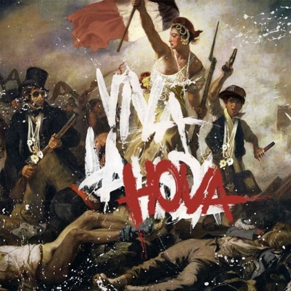

+++
titre = "Viva la Hova : le dialogue des musiques"
title = "Viva la Hova : le dialogue des musiques"
url = "/viva-la-hova-le-dialogue-des-musiques"
date = "2008-11-14T23:53:09"
Lastmod = "2010-02-01T19:22:03"
cover = "viva-la-hova.jpg"
categorie = [ "Musique" ]
tag = [ "Mélange", "Rap", "Rock" ]
createur = [ "Mick Boogie et Terry Urban" ]
annee = [ "2008" ]
weight = 2008
pays = [ "États-Unis" ]

+++

Dans une des newsletters quotidiennes des <em>Inrockuptibles</em>, il était question de <em><a href="http://www.vivalahova.com/">Viva la Hoda</a></em>, un album de bootlegs mélangeant Coldplay et le rappeur Jay-Z. Les Inrocks étant dithyrambiques, je télécharge cet album disponible gratuitement. Eh bien je dois dire que j&rsquo;ai pris une claque, virtuelle certes, mais claque quand même.

<em>Viva La Hova</em> est un projet initié par Mick Boogie et Terry Urban. Le principe de cet album est simple : prenez d&rsquo;un côté les albums de Coldplay, de l&rsquo;autre ceux de Jay-Z, mélangez le tout et vous obtenez un nouvel album. Ce type d&rsquo;album n&rsquo;est pas nouveau, et il y avait déjà eu un bootleg avec Jay-Z et les Beatles, mixant le <em>White Albums</em> des derniers, avec le <em>Black Album</em> du premier, ce qui avait donné le <em>Gray Album</em> de DJ Danger Mouse (depuis devenu superstar grâce à Gnarls Barkley). Mais alors que cet album avait été interdit par les ayants-droits des Beatles, <em>Viva la Hova</em> a été fait en collaboration avec Coldplay et Jay-Z.

Le résultat est étonnant. Les paroles sont le plus souvent laissées au rappeur, ce qui est logique tant sa discographie est plus importante, et tant surtout il chante plus que Chris Martin. En général, Coldplay assure plus la musique, tandis que Jay-Z apporte voix et rythme, même si bien sûr, cela peut changer selon les titres. Les titres ont été produits par des personnes ou groupes différents, dont Coldplay eux-mêmes sur plusieurs titres. Du morceau introductif à la dernière minute, il n&rsquo;y a pas une seconde de silence mais un long morceau très varié.

Musicalement, le résultat est vraiment génial. Les mélodies de Coldplay se fondent parfaitement au rap de Jay-Z, et la voix de Chris Martin apporte un contrepoint bienvenu (ils chantent très différemment en effet, non seulement parce que l&rsquo;un est rappeur quand l&rsquo;autre chante du rock, mais aussi parce que l&rsquo;un est Anglais et l&rsquo;autre Américain). Sur certains morceaux, les deux chanteurs ouvrent un dialogue virtuel si bien fichu que l&rsquo;on pourrait penser à une chanson originale. Ce sont, d&rsquo;ailleurs, des chansons originales : c&rsquo;est bien la force de cet album que de partir de deux œuvres pour en créer une troisième, une vraie œuvre originale et pas simplement un collage grossier.

<em>In fin</em><em>e</em>, <em>Viva la Hova</em> rappelle des projets tels que Gorillaz, soit une musique mêlant toutes les influences. J&rsquo;aime beaucoup ce genre de projets, et là je dois dire que je suis plus que comblé. C&rsquo;est vraiment magique, entraînant, et je ne m&rsquo;en lasse pas.

<h2 id="924_mais-cest-du-rap_1">Mais&#8230; c&rsquo;est du rap !!</h2>

Relisant ce que je viens juste d&rsquo;écrire, j&rsquo;éprouve un sentiment étrange, un mélange de gêne et de plaisir. En effet, il y a quelques années de cela, si j&rsquo;avais entendu <em>Viva la Hova</em>, je serais parti en courant, sans doute en hurlant un <em>Vade Retro Satana</em>s et en faisant une croix avec mes doigts. Oui parce que, globalement, c&rsquo;est du rap. Et pendant très longtemps, je n&rsquo;aimais pas le rap, mais alors pas du tout.

Aujourd&rsquo;hui, j&rsquo;ai découvert plusieurs rappeurs, américains pour la plupart, et franchement, j&rsquo;aime bien. Il n&rsquo;y a qu&rsquo;à voir <a href="http://www.lastfm.fr/user/nicolinux87">mon profil Last.fm</a> pour constater que j&rsquo;écoute beaucoup de rap ces derniers temps. <em>Viva La Hova</em> m&rsquo;a fait découvrir Jay-Z mais il y a eu comme une rupture dans la brèche. J&rsquo;ai aussi découvert NaS et je compte bien étendre mes découvertes à d&rsquo;autres rappeurs américains du même acabit. J&rsquo;ai aussi découvert et beaucoup aimé The Streets, rappeur anglais à l&rsquo;accent londonien à couper au couteau (quel bonheur !) et je sens que de plus en plus de rap passe. Si j&rsquo;ai encore du mal avec le rap français en général, et le rap façon NTM en particulier, là aussi je sens que ça bouge (j&rsquo;aime beaucoup Hocus Pocus par exemple).

C&rsquo;est marrant en tout cas de constater comment nos goûts changent. Cela fait longtemps que, doucement mais sûrement, je me rapproche du rap. Que ce soit avec des disques comme ceux de Gorillaz ou de Gnarls Barkley, ou plus subtilement d&rsquo;artistes comme Day One, j&rsquo;écoute de plus en plus de hip-hoop ou rap (je suis toujours aussi mauvais avec les genres, ça au moins, ça ne change pas) et j&rsquo;écoute avec plaisir des choses que je n&rsquo;aurais jamais imaginé écouté il n&rsquo;y a même pas un an. Évidemment, tout ça fut inconscient et ça n&rsquo;est qu&rsquo;une reconstruction <em>a posteriori</em> que je fais là.

Je suis en tout cas ravi de cette évolution, et en attendant de vous recommander des vrais albums de rap, je vous recommande chaudement ce <em>Viva la Hoda</em> !

