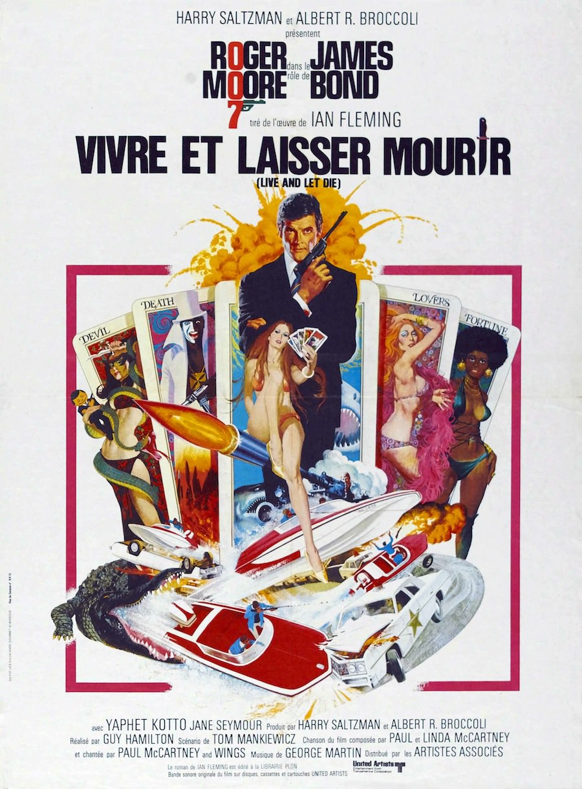
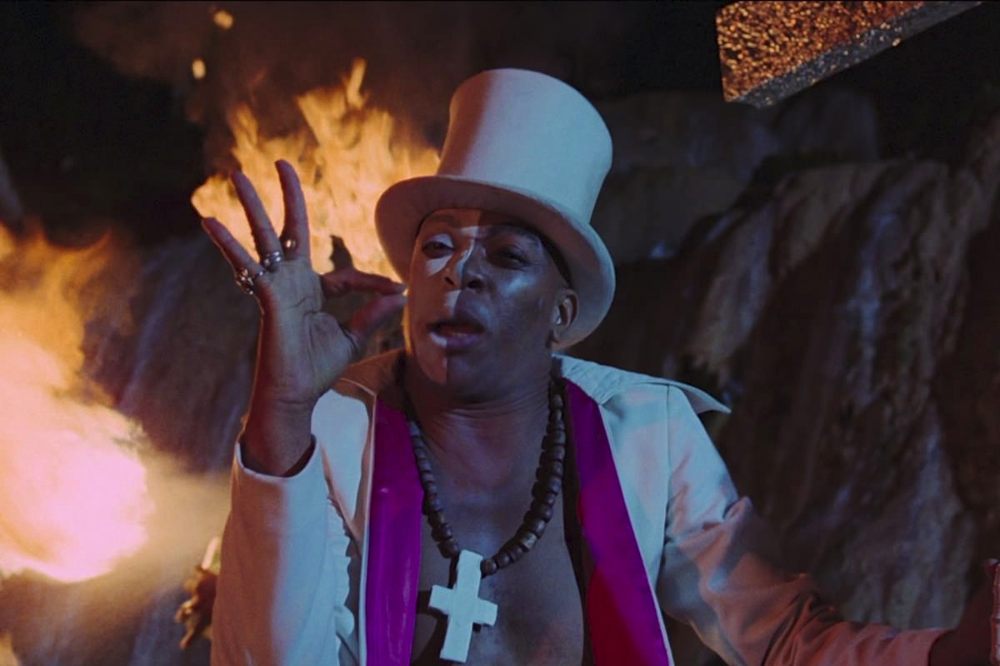

+++
type = "post"
titre = "Vivre et laisser mourir, Guy Hamilton"
title = "Vivre et laisser mourir, Guy Hamilton"
url = "/vivre-et-laisser-mourir-hamilton"
date = "2013-02-10T10:09:54"
Lastmod = "2013-05-11T09:57:27"
cover = "vivre-et-laisser-mourir-roger-moore-hamilton.jpg"
categorie = [ "À voir" ]
tag = [ "Action", "Drogue", "Espionnage", "James Bond", "Mafia" ]
createur = [ "Guy Hamilton" ]
acteur = [ "Clifton James", "Jane Seymour", "Roger Moore", "Yaphet Kotto" ]
annee = [ "1973" ]
weight = 1973
saga = [ "James Bond" ]
pays = [ "États-Unis" ]
original = "Live and let die"

+++

Nouvelle rupture pour la saga <em>James Bond</em>, cette fois pour de bon : Sean Connery ne veut plus interpréter le personnage de l’agent 007, même pour la petite fortune que les producteurs lui proposent après <a href="/2013/02/03/les-diamants-sont-eternels-hamilton/" title="Les diamants sont éternels, Guy Hamilton"><em>Les diamants sont éternels</em></a>. Il faut trouver une nouvelle tête, mais l’échec commercial d’<a href="/2013/01/27/au-service-secret-de-sa-majeste-hunt/" title="Au service secret de sa Majesté, Peter Hunt - À voir et à manger"><em>Au service secret de sa Majesté</em></a> n’encourage pas la production à faire preuve d’un grand optimisme. Roger Moore, qui avait déjà refusé le rôle à deux reprises, finit par accepter cette fois et <em>Vivre et laisser mourir</em> à la lourde tâche de faire oublier le premier James Bond et d’imposer ce nouveau visage. Pour assurer la continuité, Guy Hamilton est à nouveau appelé côté réalisation et on retrouve les personnages récurrents habituels, mais le film prend un grand soin pour différencier ce nouvel agent secret. Au total, un curieux épisode effectivement très différent des sept précédents et le début d’une nouvelle ère pour la saga…

<em>Vivre et laisser mourir</em> sait faire monter la pression : avant le générique d’ouverture, le nouveau James Bond n’apparaît pas. On découvre une série de meurtres aux États-Unis très bien perpétrés par des meurtriers et complices tous noirs. Le générique passé, le film de Guy Hamilton ouvre cette fois sur son personnage principal, au lit avec une fille. On sonne à la porte, James Bond ouvre et tombe sur M, venu en personne lui donner son ordre de mission chez lui. Cette première scène est caractéristique du travail effectué sur cet épisode : une rupture, mais dans la continuité. M est bien présent et c’est toujours Bernard Lee qui l’interprète, tout comme Moneypenny — Lois Maxwell toujours — est encore là pour jouer sur sa relation avec James Bond, c’est d’ailleurs elle qui découvre la fille avec qui l’agent vient de passer la nuit et qui se cache dans le placard. Tout est là comme avant, mais rien ne se passe comme avant. Dans <em>Vivre et laisser mourir</em>, l’agent secret ne vient pas au siège du MI6 pour obtenir ses ordres et il ne rencontre pas Q, mais se fait remettre un unique gadget par Moneypenny. On est dans le symbole, mais ce n’est pas innocent : le personnage incarné par Roger Moore doit s’imposer et marquer sa différence avec son prédécesseur. 

Cette différence est marquée pendant tout l’épisode par d’autres symboles, des éléments qui faisaient la spécificité de l’agent secret le plus connu au monde. Dans <em>Vivre et laisser mourir</em>, le martini vodka à la cuillère a disparu, remplacé par un bourbon whisky sans glace. Les cigarettes de 007 ont été également mises au placard, remplacées par de gros cigares qui modifient incontestablement le personnage. De fait, le James Bond de Roger Moore est différent, même s’il reprend quelques traits de celui de Sean Connery. On retrouve tout d’abord l’humour si caractéristique de l’agent, un flegme tout britannique que ce nouvel acteur va d’ailleurs considérablement accentuer. Ne pouvant, faute d’une musculature digne de ce nom, jouer sur le terrain de son prédécesseur, il va plutôt jouer sur la classe britannique, une idée qui s’avère payante alors que <em>Vivre et laisser mourir</em> l’entraîne dans les bas-fonds de Harlem. L’agent semble vraiment spécial et un peu à part, mais pas au-dessus de la mêlée comme il pouvait l’être jusqu’à présent. James Bond n’est plus du tout infaillible, il est d’ailleurs capturé par son ennemi plus d’une fois dans le film et Guy Hamilton n’hésite pas à le maltraiter. Il s’en sort toujours, notamment grâce à cet humour un peu ironique qui ne quitte jamais vraiment le personnage, ni le visage de l’acteur. Loin des errements de la saga, ce premier épisode avec Roger Moore est au contraire assez réussi sur ce point : l’acteur a réussi à faire une nouvelle proposition et permet à la saga de continuer sur de nouvelles bases.

Il n’y a pas que par son acteur principal que <em>Vivre et laisser mourir</em> se distingue. Surfant sur le succès de <a href="/2013/02/03/les-diamants-sont-eternels-hamilton/" title="Les diamants sont éternels, Guy Hamilton - À voir et à manger"><em>Les diamants sont éternels</em></a>, le huitième film de la saga retourne aux États-Unis et il y reste d’ailleurs pendant toute sa durée. Entre New York, la Nouvelle-Orléans et ses bayous et la Jamaïque, l’enquête de James Bond tourne toujours autour des mêmes personnages. Le SPECTRE n’est plus le méchant, place à un ennemi beaucoup plus banal, mais aussi plus réaliste : Kananga est une sorte de parrain dans la mafia de la drogue. Le scénario de <em>Vivre et laisser mourir</em> n’explicite pas vraiment les raisons des premiers meurtres, mais qu’importe : l’idée est de lancer James Bond à ses trousses, une mission inévitablement très dangereuse, mais qui évite le côté un peu ridicule des précédents opus. Finie la conquête spatiale, place à des motifs plus communs, mais encore une fois plus crédibles. De manière générale, c’est tout le film de Guy Hamilton qui tend au réalisme et qui évite le spectaculaire : en basant son intrigue dans un contexte non seulement contemporain, mais en outre urbain et délabré — New York et Harlem au début des années 1970 —, <em>Vivre et laisser mourir</em> impose des décors qui n’avaient jamais été vus dans la saga. Cet épisode se normalise en quelque sorte et cède aux modes de l’époque, là où on avait tendance à rester dans un cadre géographique et historique original et souvent méconnu. Un changement assez moderne qui est plutôt bienvenu, d’autant que les concepteurs de la saga ont su en garder l’esprit, même dans les séquences les plus réalistes. 

Cette volonté de réalisme se retrouve inévitablement dans la mise en scène. <em>Vivre et laisser mourir</em> est un <em>James Bond</em> plutôt sage, même si l’intégration de séquences vaudou ajoute une pointe d’exotisme, surtout vers la fin du film. C’est tout le film de Guy Hamilton qui est éloigné du côté énorme des précédents opus, un changement qui n’est pas toujours bien digéré par le long-métrage. Le cinéaste semble avoir du mal à savoir que faire de cette nouvelle direction artistique et il hésite un peu entre les genres, pour un résultat inégal, certes, mais finalement plus moderne qu’on aurait pu le croire. <em>Vivre et laisser mourir</em> a le don de surprendre par moment, à l’image de cette séquence à l’aéroport : on s’attend à une course-poursuite dans les airs, mais l’agent secret reste finalement au sol pour une course-poursuite sur roues, mais revue et corrigée. On est moins fan de l’humour assez lourd du policier du fin fond des bayous, mais il ne vient pas gâcher des séquences qui savent rester impressionnantes sur le plan technique, même si le parti-pris du réalisme et l’absence de gadgets n’offrent plus les mêmes possibilités. Dans ce premier épisode de l’ère Roger Moore, on sent que les concepteurs de la saga hésitent encore sur la direction à prendre, mais c’est justement cette hésitation qui rend <em>Vivre et laisser mourir</em> plus intéressant. S’il est un point où le film est une réussite incontestable, c’est sûr sa <a href="http://www.amazon.fr/gp/product/B000087DRN/ref=as_li_ss_tl?ie=UTF8&tag=leblogdenic07-21&linkCode=as2&camp=1642&creative=19458&creativeASIN=B000087DRN">bande originale</a>. Le titre du générique chanté par Paul McCartney a fait date et c’est certainement l’un des meilleurs de la saga, mais la bonne idée de George Martin qui remplace pour la première fois John Barry, c’est de réutiliser la mélodie de ce morceau tout au long du film. Tout en restant dans la tradition musicale de la saga, ce choix offre à <em>Vivre et laisser mourir</em> une unité très agréable. 

Réussir à imposer un successeur à Sean Connery : tel était d’abord l’objectif de <em>Vivre et laisser mourir</em> et on peut dire que c’est une réussite. Le film de Guy Hamilton ne brille certes pas par son originalité, ce n’est pas le <em>James Bond</em> le plus spectaculaire, mais il n’en est pas pour autant inintéressant. Ses hésitations formelles, ses ambitions modestes et son inscription dans un cadre contemporain et réaliste font de cet épisode un film étonnant et qui mérite d’être vu. 

<strong>James Bond reviendra dans… <a href="/2013/02/17/homme-pistolet-or-hamilton/" title="L’homme au pistolet d’or, Guy Hamilton"><em>L&rsquo;homme au pistolet d&rsquo;or</em></a></strong>

<h3>Vous voulez m’aider ?<a href="#footnote_0_8476" id="identifier_0_8476" class="footnote-link footnote-identifier-link" title="&Agrave; propos de la publicit&eacute;&hellip;">1</a></h3>
<ul>
<li><a href="http://www.amazon.fr/gp/product/B001D45CIC/ref=as_li_ss_tl?ie=UTF8&tag=leblogdenic07-21&linkCode=as2&camp=1642&creative=19458&creativeASIN=B001D45CIC">Acheter le film en Blu-Ray sur Amazon</a></li>
<li><a href="http://www.amazon.fr/gp/product/B000NJM5T2/ref=as_li_ss_tl?ie=UTF8&tag=leblogdenic07-21&linkCode=as2&camp=1642&creative=19458&creativeASIN=B000NJM5T2">Acheter le film en DVD sur Amazon</a></li>
<li><a href="https://itunes.apple.com/fr/movie/vivre-et-laisser-mourir-live/id561632350">Acheter ou louer le film sur l’iTunes Store</a></li>
</ul>
<ul>
<li><a href="http://www.amazon.fr/gp/product/B008U6R9B4/ref=as_li_ss_tl?ie=UTF8&amp;tag=leblogdenic07-21&amp;linkCode=as2&amp;camp=1642&amp;creative=19458&amp;creativeASIN=B008U6R9B4">Acheter la trilogie complète en Blu-Ray sur Amazon</a></li>
<li><a href="http://www.amazon.fr/gp/product/B008U6R93C/ref=as_li_ss_tl?ie=UTF8&amp;tag=leblogdenic07-21&amp;linkCode=as2&amp;camp=1642&amp;creative=19458&amp;creativeASIN=B008U6R93C">Acheter la trilogie complète en DVD sur Amazon</a></li>
</ul>

<ol class="footnotes"><li id="footnote_0_8476" class="footnote"><a href="/soutien/">À propos de la publicité…</a> [<a href="#identifier_0_8476" class="footnote-link footnote-back-link">&#8617;</a>]</li></ol>
