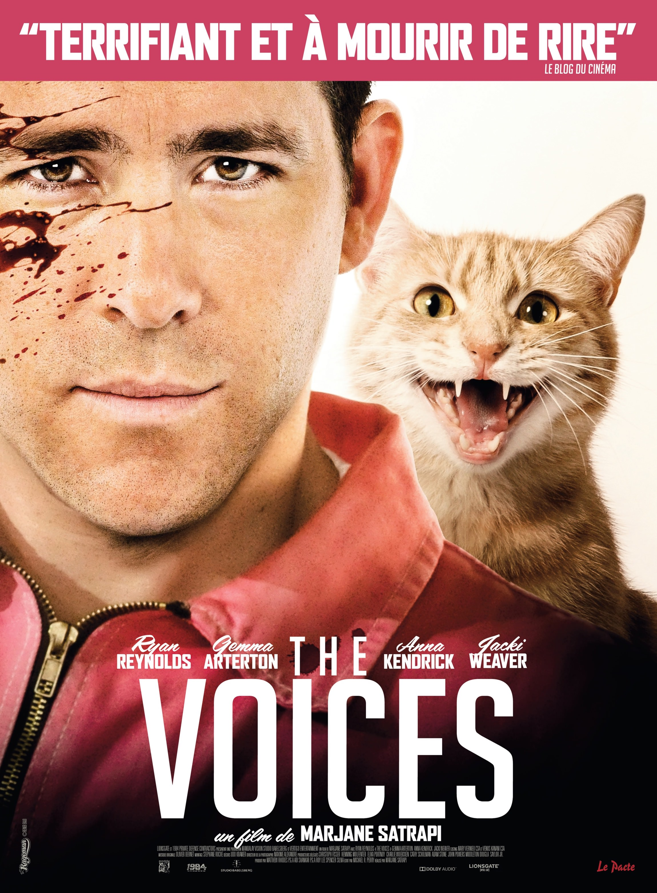
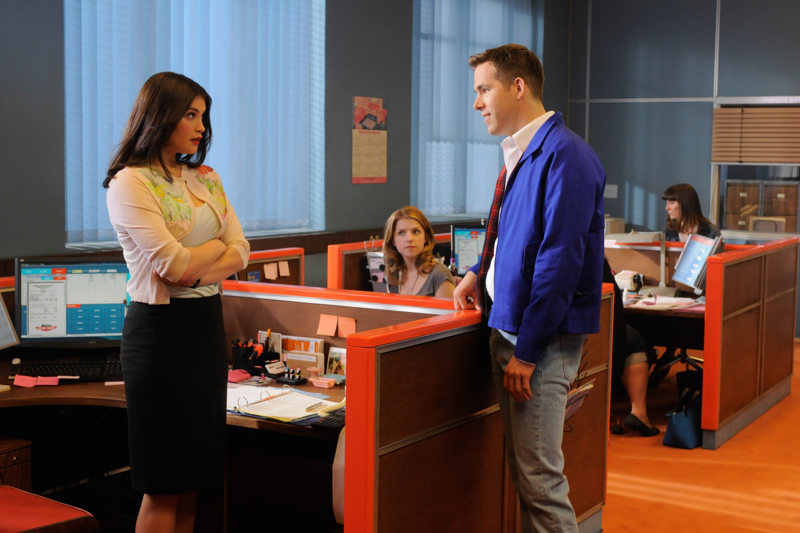
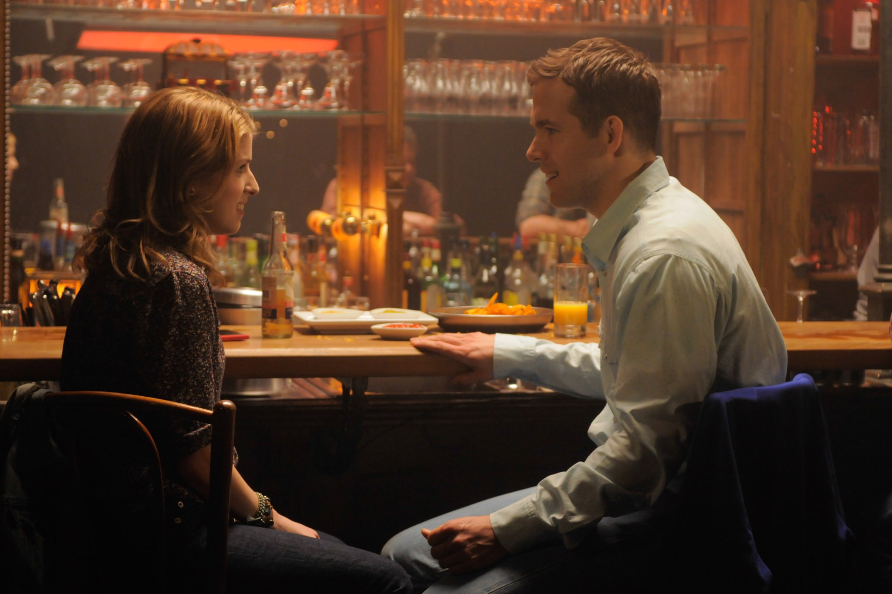

+++
type = "post"
titre = "<em>The Voices</em>, Marjane Satrapi"
title = "The Voices, Marjane Satrapi"
url = "/voices-satrapi"
date = "2015-03-13T23:49:05"
Lastmod = "2015-03-14T17:56:10"
cover = "voices-ryan-reynolds.jpg"
categorie = [ "À voir" ]
tag = [ "Ambiance", "Comédie", "Drame", "Folie", "Horreur", "Mort", "Psychologie", "Serial-killer", "Sorties du mois", "Violence" ]
createur = [ "Marjane Satrapi" ]
acteur = [ "Anna Kendrick", "Gemma Arterton", "Jacki Weaver", "Ryan Reynolds" ]
annee = [ "2015" ]
weight = 2015
pays = [ "Allemagne", "États-Unis" ]

+++

<em>The Voices</em> ouvre sur une séquence qui sonne tellement faux, qu&rsquo;on pourrait d&rsquo;abord croire à une parodie, ou à un navet vraiment raté. Le dernier film de Marjane Satrapi n&rsquo;est ni l&rsquo;un, ni l&rsquo;autre pourtant : la cinéaste raconte en effet une histoire de <em>serial-killer</em>, mais contrairement aux centaines de <em>slasher</em> que l&rsquo;on a l&rsquo;habitude de voir, on est constamment dans la tête… du tueur. Une astuce scénaristique qui change tout, et qui permet à <em>The Voices</em> de trouver une voie originale, tout à la fois sanglante, terrifiante et hilarante. Entre comédie à base d&rsquo;animaux parlants et meurtres horribles, un divertissement très drôle, à ne pas rater si vous avez le cœur bien accroché et que vous ne vénérez pas les chats.

En apparence, Jerry est un type normal. La trentaine, célibataire, il a un boulot assez banal, il est plutôt mignon et il semble bien apprécié de tous ses collègues. Néanmoins, Marjane Satrapi laisse entrevoir dès les premiers instants des failles dans ce personnage beaucoup trop normal. Déjà, parce qu&rsquo;il semble anormalement heureux dans cette usine qui fabrique des baignoires. Et puis ce personnage prend tout au pied de la lettre, un peu trop parfois, ce qui le rend immédiatement suspect. <em>The Voices</em> dévoile progressivement son idée centrale : Jerry est un schizophrène qui entend des voix en permanence. Interné à l&rsquo;enfance après la mort de sa mère, il vit sous la surveillance constance d&rsquo;une psychologue, et surtout des médicaments. Quand il les prend, tout va à peu près correctement, mais quand il les oublie… Jerry voit la vie en rose et il parle avec monsieur Moustache, son chat, et avec Bosco, son chien. Jusque-là, rien de grave, sauf quand on découvre que le chat en question le pousse à tuer des gens pour le plaisir, et que l&rsquo;on se rappelle qu&rsquo;il prend tout au pied de la lettre. <em>The Voices</em> dresse ainsi le portrait d&rsquo;un psychopathe <em>serial-killer</em>, mais sans jamais adopter le regard de la victime. Un choix assez original, qui renouvelle un genre souvent vu au cinéma, et qui permet en outre au film de s&rsquo;éloigner des canons du genre de l&rsquo;horreur et d&rsquo;adopter un ton beaucoup plus personnel.

Alors que le scénario de <em>The Voices</em> emprunte largement au <em>slasher</em>, ce sous-genre de l&rsquo;horreur centré sur la mise à mort progressive de tous les personnages, le traitement de Marjane Satrapi n&rsquo;a rien à voir. L&rsquo;horreur pointe bien son nez par moment, avec quelques plans sanglants qui justifient totalement l&rsquo;avertissement — si vous ne supportez pas la vue du sang ou d&rsquo;organes sanguinolents, n&rsquo;allez pas voir ce film —, mais elle reste finalement très contenue. À la place, on a une comédie qui peut se faire par moment vraiment très drôle, tendance humour noir naturellement. Il y a le chat, incarnation du côté obscur de Jerry, qui provoque le rire par le décalage entre ce que l&rsquo;on attend en temps normal de cet animal de compagnie et ce que ses propos disent. Au passage, la cinéaste semble régler quelques comptes avec les félins domestiques et les chats en prennent pour leur grade : ils ne sont bons qu&rsquo;à manger et à exercer une pression tyrannique sur leurs maîtres. Entre deux mises à mort, <em>The Voices</em> a tout du conte avec ses couleurs vives et ses scènes anormalement accentuées. L&rsquo;ensemble est très étonnant et plutôt plaisant, surtout parce que l&rsquo;on ne sait jamais sur quel pied danser. Comédie noire, parodie de film d&rsquo;horreur, ou bien critique acerbe de notre société… ou encore tout cela à la fois. On ne sait pas exactement ce qu&rsquo;a voulu faire Marjane Satrapi, mais force est de constater que c&rsquo;est assez plaisant.

Huit ans après son excellent film d&rsquo;animation autobiographique <a href="/persepolis-satrapi-paronnaud/" title="Persepolis, Marjane Satrapi et Vincent Paronnaud"><em>Persepolis</em></a>, Marjane Satrapi change totalement de genre et s&rsquo;essaie à l&rsquo;horreur, tendance guimauve parodique. Un choix surprenant, mais qui fonctionne vraiment bien. Il faut dire qu&rsquo;au-delà de l&rsquo;histoire pas toujours très cohérente, le film peut compter sur quelques acteurs vraiment bons. Dans le lot, Ryan Reynolds habitué jusque-là plutôt aux navets, se révèle dans ce rôle de psychopathe un peu niais que l&rsquo;on a envie d&rsquo;aimer. Il est vraiment excellent et la réussite du projet lui doit beaucoup. <em>The Voices</em> n&rsquo;est peut-être pas un chef-d&rsquo;œuvre, mais c&rsquo;est un divertissement amusant, à voir !

