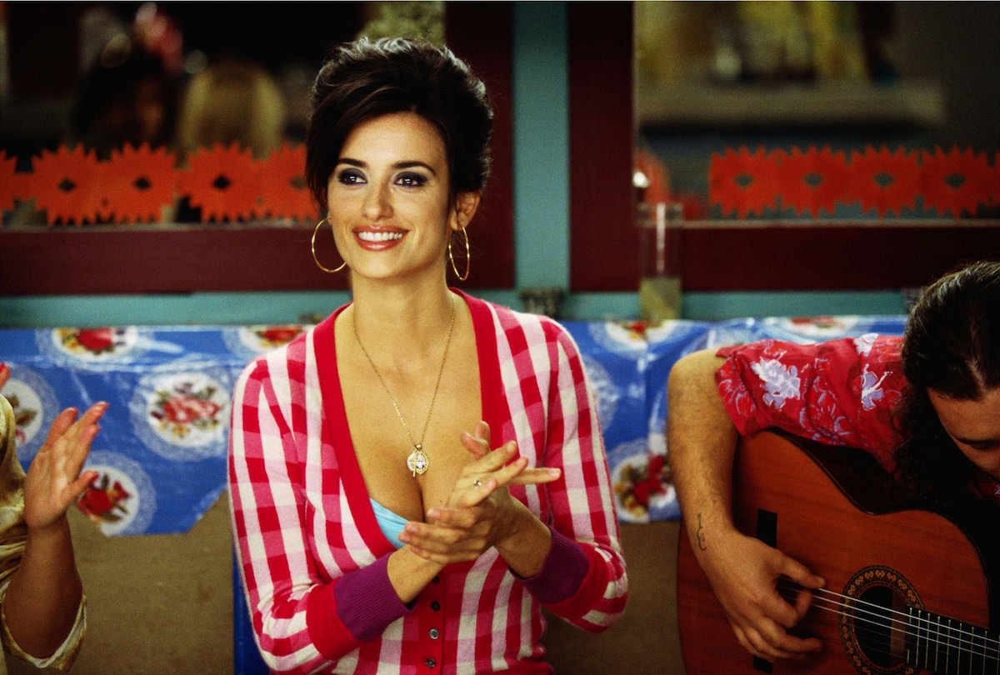

+++
type = "post"
titre = "<em>Volver</em>, Pedro Almodóvar"
title = "Volver, Pedro Almodóvar"
url = "/volver-almodovar"
date = "2012-08-15T01:15:46"
Lastmod = "2014-08-30T23:09:10"
cover = "volver-almodovar.jpg"
categorie = [ "À voir" ]
tag = [ "Drame", "Famille", "Fantastique", "Mort" ]
createur = [ "Pedro Almodóvar" ]
acteur = [ "Carmen Maura", "Lola Dueñas", "Penélope Cruz" ]
annee = [ "2006" ]
weight = 2006
pays = [ "Espagne" ]

+++

<em>Volver</em>, &laquo;&nbsp;revenir&nbsp;&raquo; en espagnol, est l&rsquo;un des meilleurs films de Pedro Almodóvar dans ces dernières années. Il rassemble les thèmes fétiches du cinéaste espagnol, mais aussi ses acteurs, ou plutôt ses actrices dans ce long-métrage extrêmement féminin. <em>Volver</em> est un film complexe par les multiples thèmes qu&rsquo;il brasse, un drame qui n&rsquo;a rien de glauque malgré son sujet, une très belle plongée au cœur des vies de quelques femmes. À voir et à revoir…

Raimunda vit avec sa fille et son mari dans un quartier populaire de Madrid. Elle enchaîne les petits boulots, mais cela ne lui suffit pas pour mener la belle vie, d&rsquo;autant que son époux vient d&rsquo;être licencié. La famille vit pauvrement,mais sans problème jusqu&rsquo;au jour où Raimunda trouve son mari ensanglanté dans la cuisine. Paula, sa fille, l&rsquo;a tué d&rsquo;un coup de couteau alors qu&rsquo;il tentait d&rsquo;abuser sexuellement d&rsquo;elle. Plutôt que d&rsquo;appeler la police, la jeune femme décide de masquer le crime : elle nettoie soigneusement sa cuisine, avant de descendre le cadavre dans le congélateur du restaurant au pied de son immeuble, profitant de l&rsquo;absence de son propriétaire. Pendant ce temps, sa tante qui s&rsquo;est longtemps chargée de l&rsquo;élever meurt à la campagne et elle est partagée entre ses devoirs familiaux et son nouveau travail puisque, par un heureux hasard de circonstances, Raimunda reprend le restaurant. C&rsquo;est alors que sa mère, censée être morte plusieurs années auparavant dans un incendie, réapparaît mystérieusement…

Pedro Almodóvar fait partie de ces réalisateurs qui construisent leurs œuvres cinématographiques autour des mêmes sujets, répétés à l&rsquo;infini sur autant de variations. <em>Volver</em> traite à nouveau de la famille, des rapports parfois difficiles entre les générations et surtout de femmes. Les hommes ont quasiment déserté et ceux qui se risque à une apparition ne marquent jamais par leur présence, soit qu&rsquo;ils disparaissent trop vite — le mari de Raimunda —, soit qu&rsquo;ils sont trop insignifiants dans l&rsquo;histoire. Pis, les rôles masculins sont le plus souvent négatifs, à l&rsquo;image de ce père incestueux qui semble n&rsquo;avoir que ce qu&rsquo;il mérite, tant sa mort est traitée comme s&rsquo;il ne s&rsquo;agissait que d&rsquo;un élément insignifiant. Le film pourrait alors tendre vers le thriller, avec la question épineuse du cadavre qu&rsquo;il faut éliminer, mais ce n&rsquo;est jamais un enjeu essentiel pour Pedro Almodóvar et le cinéaste élimine bien vite ce problème. Ce qui l&rsquo;intéresse déjà plus, ce sont ses femmes : non pas un personnage principal, mais un chapelet de rôles féminins qui transcende les générations ou les classes sociales. Dès la séquence d&rsquo;ouverture où on les voit toutes s&rsquo;agiter dans un cimetière à nettoyer des tombes, <em>Volver</em> marque par le regard qu&rsquo;il porte sur cet univers typiquement féminin. Plus tard, c&rsquo;est le regard inquisiteur, voire dénonciateur, d&rsquo;une assemblée d&rsquo;hommes à un enterrement qui frappe : une femme s&rsquo;est trompée, elle a osé sortir dans le patio réservé aux hommes, alors qu&rsquo;elle est attendue à l&rsquo;étage, avec les autres femmes.

Cette première séquence donne aussi le ton : <em>Volver</em> n&rsquo;est pas un film très gai, même si la légèreté y trouve parfois une place. La mort reste malgré tout présente pendant les deux heures qu&rsquo;il dure et tous les personnages doivent l&rsquo;affronter, au sens figuré comme au sens propre. On y meurt de vieillesse, de maladie, mais aussi d&rsquo;un meurtre qui vient protéger contre le désir d&rsquo;inceste. Tout cela n&rsquo;est pas très drôle, mais Pedro Almodóvar ne réalise pas pour autant un film noir et pesant, bien au contraire. La mort n&rsquo;est pas sur-dramatisée, elle est même un évènement tout à fait normal, à tel point que cela ne choque personne qu&rsquo;une femme s&rsquo;occupe de sa propre tombe comme s&rsquo;il s&rsquo;agissait d&rsquo;une résidence secondaire. On accepte ce passage, qui n&rsquo;est pas considéré comme une fin, puisque les morts peuvent revenir. Le réalisateur a pour habitude d&rsquo;infuser ses films d&rsquo;un peu de fantastique, comme le récent <a title="La Piel que Habito, Pedro Almodóvar" href="/2011/08/17/la-piel-que-habito-almodovar/"><em>La Piel que Habito</em></a> l&rsquo;a très bien montré. Ici, ce sont les morts qui font des apparitions et aident même les vivants. On n&rsquo;en dira pas trop de peur de dévoiler des éléments clés de l&rsquo;intrigue, mais même si le fantastique n&rsquo;est pas présent, <em>Volver</em> se construit entièrement sur le mensonge. Il y a une histoire, mais tous les personnages n&rsquo;en ont qu&rsquo;une vision partielle ou biaisée. Toutes mentent plus ou moins, et différemment en fonction de l&rsquo;interlocuteur, ce qui donne lieu à des scènes surprenantes et des dialogues surréalistes que seul le spectateur, qui a un point de vue global, peut vraiment comprendre. Il faut saluer sur ce point le scénario particulièrement bien écrit et qui n&rsquo;a pas volé sa palme cannoise.

L&rsquo;ensemble des actrices a également été récompensé à Cannes pour leur performance et il faut bien avouer que <em>Volver</em> n&rsquo;aurait pas été possible sans elles. On retrouve beaucoup de têtes connues des amateurs de Pedro Almodóvar : le cinéaste affectionne les actrices, mais en particulier certaines actrices. Pénélope Cruz est une habituée et elle est ici vraiment remarquable dans le rôle principal, de même que Carmen Maura qui a souvent tourné avec ce réalisateur et qui compose une mère très touchante. Les autres actrices ne déméritent pas et l&rsquo;ensemble est toujours parfaitement crédible et réussi. Même si le fantastique n&rsquo;est jamais loin, le cinéaste reste sur une approche assez simple de la mise en scène, avec malgré tout quelques plans plus poétiques ou mystérieux dans un champ d&rsquo;éoliennes ou sur fond de tags sur un mur. La plus grande réussite, en mise en scène comme ailleurs, tient souvent dans la simplicité et Pedro Almodóvar parvient justement à proposer de magnifiques plans avec peu de choses. Ce n&rsquo;est jamais aussi vrai que lorsque la fille découvre sa mère cachée sous un lit pour la première fois, une magnifique séquence.

<em>Volver</em> fait partie de ces films simples en apparence, mais qui utilisent leur apparente simplicité comme une force. Pedro Almodóvar déroule une histoire finalement plutôt complexe et qui implique plusieurs générations et surtout des personnages qui n&rsquo;arrêtent pas de mentir avec une simplicité déconcertante. Jouant sur les ambiances et sur les genres, le cinéaste déconcerte pour un résultat brillant, tantôt drôle, tantôt émouvant, toujours juste.

<h3>Vous voulez <a href="/soutien/">m&rsquo;aider</a> ?</h3>
<ul>
<li><a href="http://www.amazon.fr/gp/product/B000N3T0DM/ref=as_li_ss_tl?ie=UTF8&amp;tag=leblogdenic07-21&amp;linkCode=as2&amp;camp=1642&amp;creative=19458&amp;creativeASIN=B000N3T0DM">Acheter le film en Blu-ray sur Amazon</a></li>
<li><a href="http://www.amazon.fr/gp/product/B000I0S4Z0/ref=as_li_ss_tl?ie=UTF8&amp;tag=leblogdenic07-21&amp;linkCode=as2&amp;camp=1642&amp;creative=19458&amp;creativeASIN=B000I0S4Z0">Acheter le film en DVD sur Amazon</a></li>
<li><a href="http://itunes.apple.com/fr/movie/volver/id383609623">Acheter ou louer le film sur l&rsquo;iTunes Store</a></li>
</ul>

