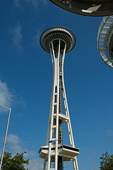
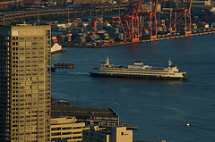
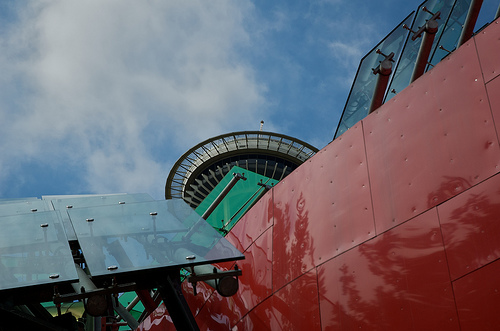
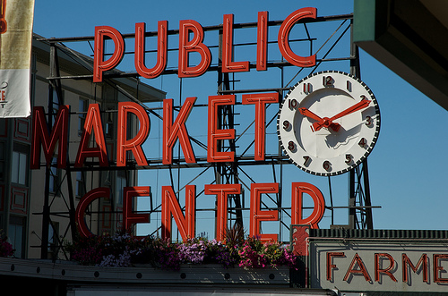
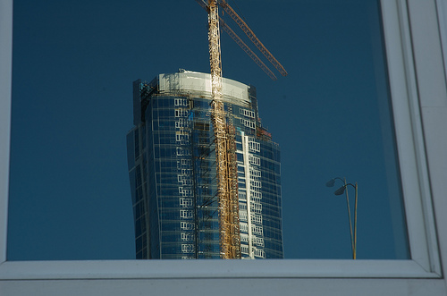
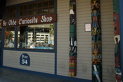
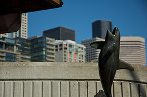
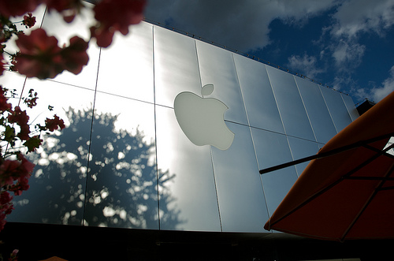

+++
type = "post"
titre = "Voyage en Amérique (août 2008) — Billet n°1 : Seattle"
title = "Voyage en Amérique (août 2008) — Billet n°1 : Seattle"
url = "/voyage-en-amerique-1"
date = "2008-08-13T06:19:11"
Lastmod = "2010-02-02T00:41:38"
cover = "seattle-downtown.jpg"
tag = [ "Seattle", "Vacances" ]
pays = [ "États-Unis" ]

+++

Notre voyage aux États-Unis (et Canada) a commencé par Seattle, capitale de l’État du Washington mais situé, dans une logique très peu américaine et quasiment française, à l’opposé de la capitale fédérale qui porte pourtant aussi ce nom. Mais Seattle n’est pas une ville de la côte Est  : c’est au contraire la ville la plus au Nord-Ouest des États-Unis, à la limite avec le Canada et Vancouver. Située au bout d’une importante et vieille voie de chemin de fer partant de la côte Est, Seattle est un sympathique ville en bord de mer et à flanc de colline, dans le même esprit que San Francisco même si ses routes montant du « Waterfront » sont loin d’être aussi pentues et impressionnantes&#8230;

Contrairement à San Francisco, Seattle est une ville clairement américaine et ce par bien des aspects. Comme j’avais pu m’en apercevoir en cherchant un moyen d’aller sans voiture de notre hôtel à l’Apple Store, à Seattle, la voiture est reine et les piétons sont soit des pauvres, soit des écolos gauchistes et sûrement anti-Bush, bref, des fainéants ou des types suspects. La norme, c’est une voire deux grosses voitures. Depuis notre dernier voyage outre-atlantique, il y a quatre ans de cela, le prix de l’essence a en gros doublé passant de 2 $ en moyenne le gallon (soit quatre litres, soit en gros 0,50 $ le litre !) à 4 $ en moyenne aujourd’hui. Il semble pourtant que cette forte augmentation du prix de l’essence n’ait pas incité la masse des Américains à changer de voiture au profit de petites voitures économes, même si les publicités pour les voitures hybrides pullulent dans les rues. Mais la norme reste le gros 4&#215;4 ou pick-up automatique au moteur inaudible et très puissant, consommant plusieurs gallons aux 100 miles. Seattle est donc adapté aux centaines de milliers de voitures qui passent dans ses rues : ces dernières sont droites et larges, les parkings couvrent littéralement la ville, les passages piétons se font rares et le feu rouge court. Le centre de la ville est aussi parcouru par deux Interstate qui coupe littéralement la ville  ; la 99 coupe surplombe notamment le Waterfront de manière assez impressionnante, rendant la vue et le quartier très agréables à n’en pas douter. Je suppose que ceux qui habitent sous les voies doivent être heureux du bruit permanent. Si certaines villes françaises sont aussi traversées par d’importantes routes et autoroutes, rien de pareil n’y existe. D’ailleurs, il ne serait même pas pensable d’avoir la même chose en France : aux États-Unis, la voiture est reine, et l’on n’a aucune considération architecturale mal venue, le plus efficace est l’objectif !

Le bus existe pourtant, sans doute pour répondre à une forte demande de la part d’une population pauvre importante et en majorité noire. Le trajet entre l’aéroport et Seattle « <em>Downtown</em> » était, à cet égard, très révélateur : nous étions entre touristes et indigènes divers mais majoritairement noir. Le fond du bus, où nous nous sommes retrouvés, était plein du djeuns de banlieue mais version Seattle donc avec amples <em>baggies</em> et t-shirts qui couvrent ce que le <em>baggy</em> ne couvre pas. Nous avons été, pour ainsi dire, plongés dans l’ambiance américaine dès notre arrivée&#8230;

Autre caractéristique typiquement américaine : Seattle s’étend en hauteur en son centre, puis en longueur pour le reste. À Seattle comme à Los Angeles (parmi les villes américaines que je connais, c’est-à-dire peu), il n’y a jamais eu de plans d’urbanisme quelconque, il n’y a eu que des lotissements à perte de vue composés de maisons construites individuellement et quelque peu anarchiquement. La seule chose qui semble avoir été prévu au départ est le réseau viaire, à angles droits comme il se doit. On retrouve là le principe des lotissements Loucheur, dans la France du début du XXe siècle : à partir de la gare, on construisait un réseau de routes bien droites délimitant des terrains où chacun bâtissait sa maison comme il l’entendait. Étonnant de voir que ce modèle semble persister dans cette région du monde&#8230;

J’ai dit que Seattle, contrairement à San Francisco, était une ville bien américaine : je ne vais pas dire le contraire maintenant, mais je voudrais tempérer un peu cette affirmation. Si, effectivement, Seattle est par certains aspects l’archétype même de la ville américaine — ville qui par ailleurs a vu naître le premier Starbucks Coffe mais aussi patrie de Microsoft et Boeing, deux multinationales américaines par excellence —, par d’autres elle serait plus proche des villes à l’européenne. Ainsi, il existe vraiment un centre-ville clairement défini et reconnaissable à Seattle, ce qui n’est pas le cas de Los Angeles, ville américaine par excellence, elle. Par ailleurs, le quartier universitaire ressemble fortement aux universités anglaises, ou plutôt aux vieilles universités de la côte Est qui copièrent, lors de leur construction, les universités anglaises (en même temps, les Américains sont des Anglais, à la base&#8230;). <em>University District</em>, par certains aspects, et toute proportions conservées, c’est un peu la cité universitaire de Seattle ! Pike Market enfin est un marché permanent construit en bord de mer au début du siècle précédent et il s’agit d’un marché très peu Américain dans l’esprit. Les étals de poissonnerie en enfilade à côté de stands de t-shirts pour touriste ou de légumes et fruits en abondance, on se serait cru en Europe voire dans un souk nord-africain  !

Ceci dit, Seattle reste d’abord et avant tout une ville américaine, sans doute pas autant son archétype que pouvait l’être Los Angeles cependant. Mais les gratte-ciels qui abondent dans le centre sont là pour le rappeler, nous sommes en Amérique. La place centrale, si tant est que l’on puisse parler de place centrale à Seattle, contient une sorte de galerie marchande là où le fameux monorail de Seattle construit dans les années 1960 arrive. En fait de galerie marchande, il s’agit d’un étonnant système  : une dizaine au moins de fast-foods divers et variés — du classique MacDo jusqu’à une improbable crêperie, en passant par les traditionnels barbecues ou les très américains milk-shakes aux protéines animales pour « <em>shape your body</em> » — y sont rassemblés autour de chaises et de tables et les indigènes y viennent pour boire et manger. Ce genre d’énorme centre à manger est en fait quelque chose de commun dans ce pays, comme on le verra plus tard, mais il faut bien l’avouer, cela surprend la première fois  !

Nous avons commencé par grignoter dans ce fameux centre, sitôt installé à l’hôtel, car les journées de 34 heures, décalage horaire aidant, ce n’est pas facile&#8230; Mais apparemment, cela était somme toute banal, de manger en plein milieu de l’après-midi. C’est un poncif de dire que les Américains mangent mal et n’importe quand, mais cela reflète la stricte vérité. Quand on voit qu’ils engloutissent à 16 heures une travers de porc avec je ne sais quelle sauce sucrée, on se dit que l’obésité ambiante s’explique facilement. Celle-ci peut aller très loin, à un point que l’on a du mal à imaginer avant d’y être confronté soi-même  : on a ainsi vu une femme en fauteuil roulant, allongée, dont les pieds étaient cachés dans&#8230; la graisse de ses jambes ! Il y aurait eu une caméra et, mettons, Tim Burton derrière que j’aurais été moins étonné. C’était vraiment affreux à voir&#8230;

Ce qui m’amène à évoquer ce fameux <em>American Way Of Life</em> qui a fait rêver des générations entières, et qui fait encore rêver même si ce mode de vie est aujourd’hui critiqué. Vous me direz, je passe du coq à l’âne, mais il y a un lien. Il semble que l’on puisse résumer ce mode de vie à un principe : tout ce qu’un Américain fait, il le fait à fond. Il ne se pose jamais la question des conséquences, que ce soit sur lui-même (obésité par exemple ; cf<em> Supersize me</em> en guise d’argumentaire) ou sur les autres (réchauffement climatique par exemple). Aux États-Unis, on a des voitures aux moteurs énormes et qui consomment énormément parce que c’est bien plus confortable, il faut l’avouer. De même, la climatisation est omniprésente, allant jusqu’à rendre le pull obligatoire puisque que la climatisation est en route quelle que soit la température extérieure. Les routes sont larges pour permettre à ces voitures de passer, et balafrent éventuellement une ville si tel doit être le cas. Les plats servis au restaurant sont énormes, quitte à rendre le <em>doggy-bag</em> indispensable.

Il faut bien l’avouer, ce mode de vie a de bons aspects, plein même. On comprend dès lors pourquoi les Américains n’en veulent pas changer, ne veulent pas s’adapter au mode de vie bien plus mesuré des Européens. Difficile de leur en vouloir et pourtant, difficile de ne pas s’adapter aussi. Vu d’ici cependant, le réchauffement climatique semble bien loin et ne se ressent qu’entre deux climatisations&#8230;

Sur ces considérations, ce premier billet se termine ! La suite, au prochain épisode&#8230;

<h2 id="214_a-voira-faire_1"><strong>À voir/À faire :</strong></h2>
<h3 id="214_a-voir-a-seattle%c2%_1">À voir à Seattle : </h3>

 

&#8211; Space Needle vaut vraiment le coup pour voir la ville sur 360°. Nous y sommes allés le soir, au moment du coucher du soleil, c’est un bon moment. Si vous en avez les moyens, le restaurant tournant situé en haut est sympa. C’est cher pour la nourriture servie (ça, faut bien le dire, la France est bien LE pays de la gastronomie : ce restaurant servait de la bonne nourriture, mais rien d’exceptionnel) mais on paye aussi (surtout) la vue (cf la première image de ce billet, ou les deux exemples ci-dessous).

</a>

&#8211;  Au pied de la tour, il y a le « Seattle Center », un parc avec notamment un musée de la musique et de la SF dans un bâtiment construit par Gerry. À défaut d’entrer, se ballader autour du monument lui-même (qui représente, paraît-il, une guitare écrasée&#8230; bon, il faut chercher) est indispensable ! Le musée de la musique vaut la peine pour la musique que l’on peut faire soi-même (on peut même enregistrer un vrai CD ou faire un vrai faux concert !) ; le reste n’a d’intérêt que si l’on est vraiment fan de Jimmy Hendrix. La partie SF n’a pas un intérêt révolutionnaire même si ça n’est pas désagréable.

&#8211; Pike Market Place vaut aussi vraiment le déplacement, notamment pour ses étals de poissonnerie et pour la vue. À y faire absolument : la traditionnelle photo avec le <a href="http://en.wikipedia.org/wiki/Image:Pike_Place_Piggy_2008.JPG">cochon</a>&#8230;

&#8211;  Le Downtown autour de Pike et Pine Streets est sympa dans le genre. On se ballade entre les tours, c’est sympa.

&#8211; Le magasin « Ye Old Curiosity Shop » sur le quai 54 : un magasin ancien, comme son nom l’indique, et plein de touristes mais aussi de curiosités en tout genre. À voir notamment (car il y a littéralement des centaines de choses à voir) : les têtes réduites, un poussin à quatre pattes, un cochon à plein de pattes, des squelettes&#8230; Un conseil : y entrer sans sac à dos car c’est très étroit.

<h3 id="214_ce-que-l%e2%80%99on-_1">Ce que l’on n’est pas obligé de faire à Seattle :</h3>

&#8211; Prendre le monorail, c’est cher et pas très utile sur le plan géographique. Bon, on ne l’a pas fait, donc ce sont les guides qui le disent. Mais il y avait énormément de monde, ça coûtait effectivement cher pour le service offert. En même temps, c’est le premier monorail au monde (il paraît) et c’est typique, alors si vous avez le temps&#8230;

&#8211; L’aquarium qui est sympa mais pas indispensable à mon avis. Faut dire que je ne suis pas fan des aquarium alors forcément&#8230; Disons que l’on a vu mieux ailleurs et qu’il est assez commun.

&#8211; Visiter Chinatown : on y a été pour que ma sœur trouve des CD de Japan pop, mais sinon, ça ne vaut vraiment pas le détour, surtout quand on a déjà vu celui de San Francisco.

&#8211;  Visiter le Starbucks original, le premier du genre. Il est situé à Pike Market si vous êtes fan absolu de Starbucks Coffe. Sinon, on ne peut même pas s’y asseoir, c’est bondé, et c’est tout pareil que les autres au niveau de ce que l’on y consomme.

&#8211; La visite de l’University District, au Nord de la ville, n’est franchement pas obligatoire. On n’a fait qu’y passer rapidement, ça avait l’air sympa, mais c’est compliqué de s’y rendre sans voiture et ça n’est pas indispensable je pense (si ce n&rsquo;est, of course, pour l&rsquo;Apple Store&#8230;)

<h3>Toutes les photos de Seattle&#8230;</h3>

Vous pouvez voir l&rsquo;ensemble des photos de Seattle dans l&rsquo;<a href="http://www.flickr.com/photos/28496877@N07/sets/72157606945366338/">album FlickR</a> sur le voyage&#8230;

Article recensé par le 

