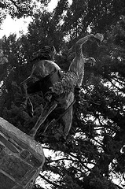
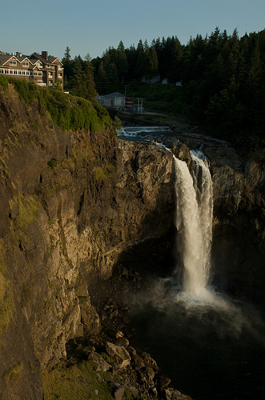
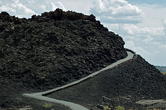
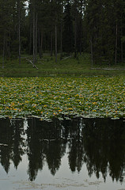

+++
titre = "Voyage en Amérique (août 2008) — Billet n°2 : Sur la route&#8230;"
title = "Voyage en Amérique (août 2008) — Billet n°2 : Sur la route&#8230;"
url = "/voyage-en-amerique-2"
date = "2008-08-25T21:59:45"
Lastmod = "2010-02-02T01:11:39"
cover = "on-the-road-us.jpg"
tag = [ "Nature", "Paysage", "Société" ]
pays = [ "États-Unis" ]

+++

Après Seattle, c’est-à-dire la grande ville, nous sommes partis en direction de Yellowstone National Park, plein Est. Les États-Unis sont un très grand pays : bordant deux océans différents, couvrant quatre fuseaux horaires différents, ce vaste État fait la modique somme de plus de 14 fois la France&#8230; Ainsi, et assez logiquement il faut bien le dire, toutes les distances y sont très importantes et l’espace est vaste. Les miles s’accumulent sans fin et si la conversion miles/kilomètres rend ces distances moins impressionnantes, ce n’est qu’une impression. Il n’y a pas de mystère : aux États-Unis, on roule beaucoup et longtemps, d’autant que les limitations de vitesse sont relativement basses et scrupuleusement respectées (on ne rigole pas avec la loi de ce côté-ci de l’Atlantique). Du coup, pour un Seattle/Yellowstone en <em>RV<a href="#footnote_0_223" id="identifier_0_223" class="footnote-link footnote-identifier-link" title="Recreational Vehicle pour les incultes. Soit, en gros, un camping-car&hellip;">1</a></em> , il faut compter trois jours. </em>

Rouler sur les routes américaines revient à traverser le pays donc à visiter « l’Amérique profonde » qui ne ressemble pas du tout à la diagonale du vide française. Le Massif Central paraît bien plus vivant et peuplé que le Montana profond : il faut dire que l’on se situe alors au cœur de la région dite des Grandes Plaines qui ressemblerait plus, si l’on tenait à faire la comparaison, au Bassin parisien français. Mais à l’américaine. Donc en bien plus grand, mais vraiment plus grand. Du coup, entre deux ranchs, il y a des miles de&#8230; rien si ce n’est des prairies à perte de vue. La sensation du vide se fait, mécaniquement, encore plus forte et les longues et droites routes qui se perdent dans le lointain ne peuvent que renforcer encore cette sensation.

Le plus intéressant reste encore ce que l’on peut difficilement qualifier de villes, à peine de bourgs, mais pas non plus de villages. En fait, il s’agit plutôt de la version moderne des villes du far-west telles qu’on les voit dans Lucky-Luke (ou les <em>westerns</em>, comme le lecteur préférera) : autour d’une rue, une série de maisons a été posée, avec en général une station service et un petit commerce de proximité (et, <em>of course</em>, les deux ou trois édifices de culte selon les cas). Mais pas un chat dans les rues et quand on y passe avec le soleil plombant de l’après-midi, l’illusion de se retrouver dans un film est totale. Mais non, il ne s’agit que de la réalité.

Phénomène étrange à observer dans ces régions désertes (enfin, peu peuplées disons), les courses. Le supermarché tel que nous le connaissons en France a été inventé aux États-Unis et à dire vrai, les « <em>malls </em>» américains ressemblent assez fortement à nos grandes surfaces de périphéries urbaines. Autour de quelques grandes routes, d’énormes parkings sont entourés de magasins divers et variés. Mais il existe des différences sensibles entre le <em>mall</em> urbain, comme celui que nous avons visité à Seattle, et le <em>mall</em> « rural » — si le terme avait un sens aux USA, ce qui reste à prouver, mais disons alors de l’Amérique profonde. Ce dernier est clairement fait pour un pays où les courses ne peuvent être faites que très rarement du fait des distances et des temps de parcours. Ainsi, tout y est proposé en énormes conditionnements : du cheddar orange (peut-on encore parler de fromage ?) en paquets de 2,1 kg ; des céréales en énormes sacs façon croquettes pour chien (mais il s’agissait bien de céréales après vérification) ; un rayon surgelé énorme avec littéralement de tout, etc. Au moins, quand on doit faire, comme dans notre cas, des courses pour une famille nombreuse, c’est plus simple. En tout cas, ce fut assez amusant et permet aussi, par la même occasion, de vérifier que l’alimentation de l’Américain moyen contient bien de très grosses quantités, en plus d’être de piètre qualité.

<h2><strong>En vrac : </strong></h2>

&#8211; Si le réseau routier américain est en général de bonne qualité, il peut arriver des choses étonnantes comme l’arrêt aussi brutal qu’imprévu de la route « normale » pour une route en travaux consistant en fait à un chemin de terre. Je peux vous dire qu’en <em>RV</em> de 30 <em>feet</em> (soit la modique somme de 9,14 mètres), cela fait plutôt bizarre. Surtout quand, Amérique obligeant, ces travaux durent sur des kilomètres et des kilomètres. Heureusement, aucune assiette n’a été cassée mais on a été secoué comme rarement auparavant !

&#8211; Dans le genre « ville de cow-boy », je recommande Jackson Hole (un nom pareil, ça ne s’invente pas !), au Sud de Grand Téton et Yellowstone. C’est une ville qui semble sortie tout droit d’un film, et qui est clairement destinée aux touristes, malheureusement quand on voit les prix qui y sont pratiqués. Néanmoins, une pause y vaut la peine, ne serait-ce que pour la place principale du bourg avec ses arcades en bois de cerfs et sa statue-symbole de l&rsquo;État du Wyoming (cf les photos).

</a>

&#8211; Pour les amateurs de la célèbre série <em>Twin Peaks</em> et pour les autres, je recommande un arrêt aux Snoqualmie Falls. La cascade est en fait très impressionnante, ça vaut le coup d’œil&#8230;

<h3><strong>Notes rapides sur deux sites traversés : 
</strong></h3>

Nous sommes passés rapidement par deux sites différents et je ne savais où les caser, donc ce sera ici !

<h4><strong><a title="Plus d'info sur Craters of the Moon" href="http://en.wikipedia.org/wiki/Craters_of_the_Moon_National_Monument_and_Preserve">Craters of the Moon National Monument </a></strong><strong>: </strong></h4>

Pas vraiment un parc, mais un « <em>National monument</em> » : à dire vrai, la différence est ténue, si ce n’est la taille&#8230; Dans notre cas, il s’agit d’une étonnante vallée constituée d’une belle couche de lave. Rien de très étonnant, sauf que la lave y est réellement omniprésente et surtout a refroidi d’une façon étonnante, disons de manière très heurtée. Et une fois au cœur de la vallée, on se croirait en effet sur une autre planète, alors pourquoi pas sur la lune !

L’effet vient tant de la couleur du lieu — le noir domine en effet, comme les quelques photos ci-dessous essaient de le montrer — que de l’absence quasi totale de végétation — idem. Il faut dire que les conditions pour survivre sont rudes : la température du sol monte très haut en été et l’eau est quasiment totalement absente. Les plantes sont donc plutôt de type plantes grasses et elles emmagasinent de l’eau quand il y en a pour quand il n’y en aura plus.

Le paysage est en tout cas étonnant et vaut de s’arrêter si on passe par là, ce qui est tout à possible entre Seattle et Yellowstone notamment. Je ne sais pas, par contre, si le détour vaut le coup&#8230;

<h4><strong>Grand Téton National Park</strong></h4>

Ce parc est situé à l’immédiate proximité du Yellowstone National Park, au Sud de ce dernier. Bien plus petit, il est aussi bien moins connu, la notoriété de son grand voisin septentrional ne lui laissant, pour ainsi dire, aucune chance de ce côté.

Pourtant, ce parc n’est pas inintéressant, loin de là, même si il faut absolument le faire par beau temps : si vous vous y rendez comme nous, par mauvais temps, vous ne verrez pas la montagne et les fameux trois « Tétons » (oui, c’est du français dans le texte) et le parc perd alors de son intérêt (ces deux-trois photos, hélas, le montrent).

Toutes ces photos, et bien d&rsquo;autres sont disponibles sur <a title="Album Flickr" href="http://www.flickr.com/photos/nicolinux/sets/72157606945366338/">FlickR</a>&#8230;

<ol class="footnotes"><li id="footnote_0_223" class="footnote"><em>Recreational Vehicle </em>pour les incultes. Soit, en gros, un camping-car&#8230;<em> [<a href="#identifier_0_223" class="footnote-link footnote-back-link">&#8617;</a>]</li></ol>
