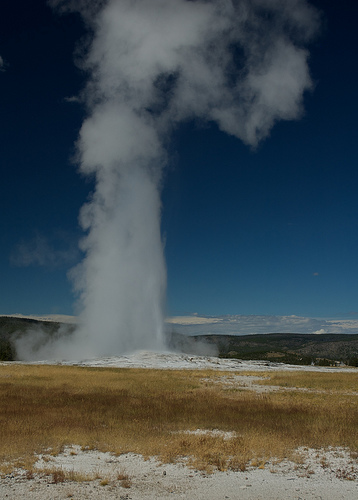
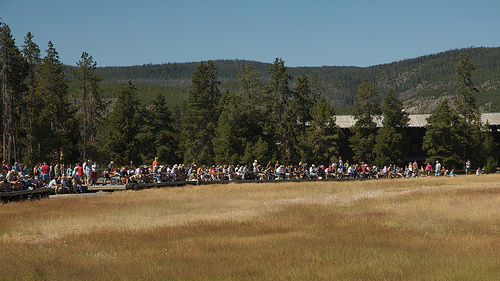
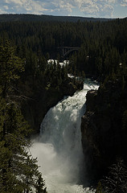
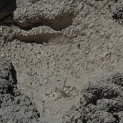

+++
titre = "Voyage en Amérique (août 2008) — Billet n°3 : Yellowstone National Park"
title = "Voyage en Amérique (août 2008) — Billet n°3 : Yellowstone National Park"
url = "/voyage-en-amerique-3"
date = "2008-09-01T23:11:21"
Lastmod = "2010-02-02T00:51:19"
cover = "yellowstone-park.jpg"
tag = [ "Nature", "Paysage", "Tourisme", "Vacances" ]
pays = [ "États-Unis" ]

+++

<strong>Note de l’auteur</strong> : cher lecteur, ce billet te semblera sans doute un peu long car le Yellowstone National Park vaut bien la peine d’en parler longtemps. Mais si tu es pressé, tu peux toujours aller directement tout en bas, à la catégorie « En bref ». Ceci dit, entre nous, tu pourrais rater des choses intéressantes entre les deux, et des photos, peut-être même, éventuellement, de belles photos&#8230;

<h2 id="255_presentation-general_1">Présentation générale</h2>

Présenter Yellowstone est une sorte de défi : par où commencer en effet ? Bon, commençons comme l’historien que j’aurais pu être, par le commencement. Yellowstone, en effet, est le premier parc national du monde : quand cet espace géographique fut déclaré zone protégée par le président Grant le premier mars 1872, il n’existait alors aucun autre exemple dans le monde d’un espace déclaré n’appartenir à personne si ce n’est à l’État, et protégé contre toute une série d’atteintes.

Mais quelle mouche avait donc bien pu piquer ce président Grant en ce début 1872 ? Yellowstone avait été découvert par les Américains au début du siècle, pendant l’hiver 1807-1808 par un des membres de la fameuse expédition Lewis et Clarke, mais ni par Lewis, ni par Clarke contrairement à ce que pourraient indiquer les nombreux noms de lacs ou forêts du parc. C’est un trappeur, un certain John Colter qui passa le premier dans le coin. Évidemment, les Indiens connaissaient l’endroit depuis longtemps et l’utilisaient abondamment, en particulier pour sa ressource en bisons et en obsidienne, cailloux indispensable à la formation de flèches. Mais cette première découverte, liée au commerce de la fourrure, ne mène à rien avant la découverte d’or, dans les années 1860 : ce fut alors un raz-de-marée tel que celui décrit par Chaplin (euh, là j’extrapole un peu). Toujours est-il que ces chercheurs d’or rentraient de Yellowstone vers l’Est, où tout se passait à l’époque, et rapportaient des récits extraordinaires : ils parlaient d’un pays à la pierre jaune où l’eau sortait du sol et montait vers le ciel et où le sol bouillait et fumait.

La curiosité des gens au pouvoir ayant été aiguisée, une première expédition scientifique fut alors envoyée en 1869, une seconde en 1870, puis enfin une troisième en 1871 qui contenait notamment un photographe et un peintre qui rapportèrent des clichés et tableaux extraordinaires de la région. Ces expéditions permirent aux gens au pouvoir à l’époque d’avoir accès à une importante masse d’informations. Ces dernières les conduisirent à prendre cette décision révolutionnaire à l’époque de protéger une région et de la mettre sous la juridiction de l’État en créant le premier parc national de l’histoire. Depuis, le succès du parc ne s’est jamais démenti et Yellowstone reste l’un des parcs les plus visités des États-Unis.

Et ce succès n’est bien sûr pas un hasard. Yellowstone est bel et bien un parc extraordinaire par sa richesse, sa diversité et ses beautés. La diversité provient naturellement de sa taille : Yellowstone est un parc immense, totalisant 8990 km2, soit quelques 290 km2 de plus que la Corse, pour vous donner un point de repère. Vous imaginez bien, dans ces conditions, que le Yellowstone ne se fait pas en une journée ! Si vous vous contentez de faire la double boucle de routes du parc, il faudra compter deux jours en faisant des pauses ultra-rapides (cela fait 150 miles de route, et pas des autoroutes bien sûr, donc on n’avance que lentement). Nous sommes restés quatre jours dans le parc et nous ne l’avons qu’effleurés très superficiellement. En fait, vous pourriez rester des semaines dans le parc sans vous ennuyer (sachez, par exemple, qu’il n’y a pas moins de 1940 km de sentiers balisés dans le parc !)&#8230;

Géographiquement et grossièrement, le Yellowstone National Park est un haut plateau d’altitude entouré de montagnes, ces dernières rendant le plateau relativement peu accessibles, ce qui explique son exploration tardive. Toute cette zone est entièrement volcanique : la partie centrale du parc est en fait constituée par une caldera qui est le témoin d’une gigantesque éruption volcanique ayant eu lieu il y a déjà pas mal d’année et qui a posé les bases de ce paysage. Une longue glaciation a ensuite remodelé les paysages pour aboutir à ce qui existe aujourd’hui, un paysage complexe et magnifique.

Ce paysage a été profondément transformé au cours de l’été 1988 pendant lequel des feux de forêt d’une ampleur inégalée (avec flammes montant à 80 mètres de hauteur quand même) ont détruit environ 36% de la forêt de Yellowstone. Le feu n’a pu être maîtrisé par l’homme, malgré des moyens titanesques mis en œuvre (10 000 pompiers, avions-cargos, hélicoptères&#8230;) et seules les premières neiges, en septembre, ont éteint le feu ; preuve, s’il en fallait, de la faiblesse de l’homme face à la nature&#8230; Aujourd’hui, les traces de cet incendie sont visibles partout : le feu a en fait été très superficiel, les flammes ayant avancé très rapidement mais ne s’étant pas attardées et du coup il reste des troncs noircis. Mais la forêt repousse et ça n’est franchement pas désagréable, au contraire même parfois : le feu a souvent dégagé les paysages&#8230; De toute manière, ce feu est bien la preuve que Yellowstone est un endroit vivant, en constante évolution.

Deux éléments font du Yellowstone National Park un endroit exceptionnel : la faune et les activités volcaniques. Ce parc est ainsi une vaste réserve animalière pleine d’ours, de bisons et autres cerfs et fait le bonheur de tous les amoureux de nos amies les bêtes.

Mais ce qui fait la véritable originalité du lieu, c’est bien le volcanisme. Comme je l’ai dit, le parc a été formé par une gigantesque éruption volcanique qui a formé les paysages par les coulées de lave. Mais le volcanisme ne s’est pas arrêté à cette époque, loin de là, il a simplement changé de forme et évolué vers un volcanisme thermal constitué de geysers, de fumaroles et de boue bouillante. Tous ces phénomènes sont réunis dans le parc qui est même le lieu au monde où le plus de geysers sont concentrés : avec 200 geysers, Yellowstone compte les 2/3 des geysers dans le monde. Ces phénomènes naturels sont vraiment surprenants et intéressants&#8230;

Bref, il y a de quoi faire à Yellowstone, alors voici deux/trois éléments pour vous donner d’en voir plus ! 😉

<h2 id="255_journal-de-visite_1">Journal de visite</h2>

Une fois n’est pas coutume, je vais écrire un petit texte chaque jour à Yellowstone. La raison ? La richesse du lieu tout simplement ! Ce parc n’est pas considéré comme l’un des plus beaux parcs des États-Unis pour rien. De plus, avec une telle superficie, il y a de quoi faire&#8230; Du coup, le billet va être orienté plus dans un sens « guide touristique » si j’ose dire et peut-être moins personnel&#8230; Je modère cependant : ce qui suit ne cherche en rien à remplacer un vrai guide<a href="#footnote_0_255" id="identifier_0_255" class="footnote-link footnote-identifier-link" title="Je recommande, mais en anglais, The Rough Guide to Yellowstone et Grand T&eacute;ton, &eacute;dition Rough Guides. En fran&ccedil;ais, il y a bien s&ucirc;r les classiques guide du Routard (il en existe un sur les Parcs nationaux de l&rsquo;Ouest am&eacute;ricain et Las V&eacute;gas) et guides Bleus, pareil sur Ouest Am&eacute;ricain, Parcs Nationaux.">1</a>. De plus, les livrets vendus 50 cents sur tous les sites d’importance sont très bien faits, avec carte et explications. Et les nombreux <em>rangers</em> du parc sont disponibles pour répondre aux questions éventuelles&#8230;

<h3 id="255_jour-n%c2%b01-old-fa_1">Jour n°1 : Old Faithful geyser et les environs</h3>

On commence par du grand classique, sans doute la partie la plus célèbre du parc, au moins l’une des plus connues. Il s’agit d’une zone volcanique (ce qui, le lecteur attentif l’aura noté — l’auteur remercie ici tous ses lecteurs, même ceux qui ne sont pas attentifs, qu’ils soient pardonnés !<a href="#footnote_1_255" id="identifier_1_255" class="footnote-link footnote-identifier-link" title="Oui, c&rsquo;est jour de f&ecirc;te aujourd&rsquo;hui&hellip;">2</a> — ne manque pas de logique dans une caldeira volcanique&#8230;) constituée essentiellement de geysers. C’est même considéré, excusez du peu, comme la plus grande concentration de geysers au monde. À dire vrai, il n’y a de geysers que dans trois zones du monde, en Islande, en Nouvelle-Zélande et ici, à Yellowstone où les 2/3 des geysers du monde se trouvent.

Cette présentation générale étant faite, pourquoi « Old Faithful » ? Pour ceux qui ne suivraient toujours pas, c’est le nom d’un geyser mais pas de n’importe quel geyser. Une traduction mauvaise de son nom donnerait quelque chose comme « Le vieux fidèle » : ce geyser en effet est d’une régularité assez exemplaire, offrant à ses fans massivement assemblés une éruption toutes les 92 minutes, à plus ou moins dix minutes quand même<a href="#footnote_2_255" id="identifier_2_255" class="footnote-link footnote-identifier-link" title="Et en fait, &ccedil;a d&eacute;pend de plein de choses, donc renseignez-vous&hellip;">3</a>. De ce fait, rien n’est trop grand, rien n’est trop beau pour lui. Autour d’un périmètre de sécurité respectable (ben oui, un geyser, ça projette de l’eau bouillante quand même) ont ainsi été installées des rangées de bancs. Avant chaque éruption annoncée, ces derniers se remplissent rapidement de touristes venus admirer le geyser. C’est du grand spectacle, à l’américaine, c’est extrêmement bien fait : on peut même garer sa voiture, venir à l’heure dite et repartir immédiatement. Les cars de touristes asiatiques (les Chinois semblant être les plus nombreux, une preuve de plus, s’il en fallait, de la richesse de ce pays) faisant tous les États-Unis en une semaine passent à Yellowstone pour le voir, avec la plus belle vue sur le canyon (cf ci-dessous) et un passage à Mammoth (idem).

Entre nous, avouons-le, le parc est plein de geysers et l’Old Faithful est loin d’être le meilleur. Il est impressionnant, certes (cf la photo ci-dessus), mais je préfère largement d’autres geysers pour ma part. Car si vous voulez en faire plus que le touriste moyen, vous pourrez, depuis Old Faithful, visiter tout le bassin et découvrir ainsi des merveilles de la nature. Sans entrer dans des détails scientifiques complexes (auxquels, de toute façon, je n’entends goutte), sachez que l’eau sortie des profondeurs de la terre avec violence (geysers) ou pas (bassins d’eau, des « <em>pools</em> » comme ils disent ici) offrent des conditions de vie assez insupportable (c’est chaud, et en plus il y a plein de cochonneries dans l’eau, comme du souffre et autres) mais qui conviennent néanmoins (il en faut pour tous les goûts) à des tas de bestioles et autres algues microscopiques mais néanmoins colorées. Du coup, la présence d’eau et de geysers conduit à produire des plages de couleurs magnifiques, souvent tendant vers le vert et l’orange, mais il y a aussi de magnifiques bleus, du jaune, etc. Les quelques photos présentes ici ne rendent pas justice à ce que l’œil humain voit. En clair, en vrai, c’est bien mieux !

Après une ballade au milieu des geysers (qui chauffent et sentent mauvais, il faut savoir le reconnaître), je recommande un arrêt à l’Old Faithfull Inn (oui, ils ont le chic pour les noms) qui est, comme son nom l’indique, l’auberge située à proximité immédiate du geyser. Outre pour son eau fraîche dispensée dans les toilettes, le bâtiment lui-même vaut le détour. Tout en bois, construit au début du XIXe siècle, il est vraiment étonnant et esthétique. Ça ne coûte pas cher (contrairement aux sandwiches vendus sur place, chers et pas fameux, je ne recommanderai pas ; le Routard recommande le restaurant par contre, mais nous n’avons pas testé) et c’est bien.

<strong>En bref, à ne pas rater :</strong>

<ul>
<li>Old Faithful quand même, ne serait-ce que pour la masse de touriste autour, et puis c’est le rituel : ne pas y aller, ce serait comme aller au Louvre sans passer voir la Joconde !</li>
<li>La Geyser Hill, juste au-dessus d’Old Faithful est un chemin rapide et qui donne un bon aperçu de tous les phénomènes volcaniques liés à de l’eau. Si vous êtes pressés, faites au moins ça&#8230;</li>
<li> &#8230; mais ça serait dommage de rater le reste, et en particulier Castle Geyser, très impressionnant, et la Morning Glory Pool, tout au Nord, et qui est un bon exemple de bassin avec plein de couleurs. Mais entre nous, tout vaut le coup&#8230;</li>
<li>Si vous avez le temps, le Black Sand Basin, à l’Est et le Biscuit Basin, au Nord, valent le détour mais en voiture cette fois. À voir en particulier, un immense bassin souvent pris en photo de haut pour les cartes postales et qui est en effet assez impressionnant. En fait, comme vous vous en rendrez vite compte, il y a des dizaines de sites à geyser dans Yellowstone : aucun ne se ressemble vraiment, donc tous valent le détour même si, fondamentalement, ça reste la même chose donc vous en aurez peut-être vite assez&#8230;</li>
</ul>

<h3 id="255_jour-n%c2%b02-norris_1">Jour n°2 : Norris geyser basin</h3>

Pour notre deuxième jour, histoire de ne pas se dépayser trop rapidement, nous avons vu un autre bassin de Geyser, le Norris Geyser Basin. Ce bassin diffère de celui d’Old Faithful par plusieurs aspects : il est très acide, ce qui est apparemment rare et permet l’émergence de nombreuses petites bêtes dans l’eau, offrant aux touristes des couleurs vraiment magnifiques, autour de l’orange et du vert essentiellement. Par ailleurs, il s’agit de la zone la plus chaude et la plus concernée par les tremblements de terre du parc : en résulte un paysage très changeant et le plus grand geyser au monde, le Steamboat geyser, capable d’éjecter de l’eau à 300 pieds de haut (soit 91 mètres) ! Bon, malheureusement la forte activité sismique conduit aussi à une forte instabilité des éruptions qui sont totalement imprévisibles et finalement assez rare. Ainsi, la dernière éruption majeure (oui car il y en a aussi des petites) du Steamboat geyser remonte à la mi-2005 et on ne sait pas quand sera la prochaine&#8230;

La ballade n’est pas très longue et plutôt agréable car ce bassin est ombragé, au moins pour une partie. Les couleurs sont vraiment magnifiques, mais avec le soleil uniquement car elles ne se révèlent vraiment qu’avec le soleil. Cela ne vaut pas que pour ici, maintenant que j’y pense, c’est valable partout.

À noter que les odeurs sont aussi plus fortes et prenantes qu’à Old Faithful. Ceux qui ne supportent pas l’odeur d’œufs pourris en seront prévenus ! 😉

<h3 id="255_jour-n%c2%b03-yellow_1">Jour n°3 : Yellowstone canyon</h3>

Le canyon de Yellowstone est clairement un passage obligé. Si la canyon est d’origine volcanique, comme tout dans le parc, le volcanisme n’est pas l’intérêt principal du canyon : les paysages à couper le souffle le sont. Devant ce canyon, on retrouve les mêmes sensations que devant le Great Canyon. Même si le Yellowstone Canyon est bien plus petit, il n’en n’est pas moins aussi impressionnant et vraiment magnifique. Dès les débuts du tourisme à Yellowstone, le canyon a marqué les esprits : il faut dire que c’est, je crois, le premier à avoir été découvert. Le nom même du parc vient de ce lieu puisque la pierre jaune y domine clairement. Deux cascades ajoutent encore une note spéciale à ce canyon et complètent un tableau magnifique.

D’ailleurs, ça n’est pas pour rien qu’un point de vue se nomme « Artist Point ». Au sud du Canyon, à l’extrémité de la route se trouve l’endroit qui passe pour être le point de vue le plus photographié de tout Yellowstone. En arrivant, on comprend pourquoi : la vue est vraiment magnifique, totalement photogénique et on ne peut s’empêcher de prendre la même photo carte-postale que des dizaines d’autres touristes tant on se sent, en quelque sorte, subjugué par tant de beauté. Ci-dessous, voici ma version personnelle de ce point de vue pour vous en donner une idée, mais mieux vaut s’y rendre pour bien apprécier le lieu.

Le reste du canyon vaut certainement la piene mais toute la partie nord était fermée pour travaux quand nous y étions. Le reste de la famille a aussi fait le « Uncle Tom’s Trail » qui est en fait un escalier descendant droit dans le canyon et au cœur d’une des deux cascades. Étant sensible au vertige, je suis resté en haut de ces 300 marches de métal ajouré. Il paraît que la descente vaut la peine, pas tellement l’arrivée, et que la remontée est très dure. <em>In fine</em>, je suis sceptique sur l’intérêt de la chose si ce n’est, peut-être, pour son côté historique (c’est l’une des premières attractions à touristes du parc)&#8230;

<h3 id="255_jour-n%c2%b04-mammot_1">Jour n°4 : Mammoth Hot Spring</h3>

Le quatrième jour, nous avons fini en beauté ! Enfin, nous aurions dû finir en beauté&#8230; En effet, Mammoth Hot Spring est le lieu le plus souvent utilisé, avec le Canyon, pour illustrer Yellowstone. Sur les images, on voit des sortes de bassins successivement disposés le long de la pente, dans lesquels de l’eau coule, l’un après l’autre, et aux couleurs sublimes, tournant toutes autour de l’orange mais dans une infinie variation.

Nous nous attendions logiquement à voir la même chose. Les jours précédents ne nous avaient pas déçu, niveau couleurs, et nous espérions déjà réaliser de magnifiques photos. Las, nous sommes rentrés globalement bredouilles&#8230; En effet, ce que les magnifiques photos des couvertures de livres sur Yellowstone ne disent pas, c’est qu’elles ont toutes été prises à une période humide, probablement en mi-saison, soit au printemps, soit en automne. Car, comme je l’ai déjà exposé plus haut, la couleur vient d’algues et autre micro-organismes qui vivent obligatoirement dans l’eau. Donc sans eau, pas de couleur, c’est logique ! Et en plein mois d’août, un mois d’août par ailleurs particulièrement sec d’après un <em>ranger </em>du parc, il n’y avait pas d’eau. Du coup, les bassins étaient bien là, mais pas les couleurs : ils étaient blancs, seulement blancs.

Bon, j’exagérais un peu sur le bredouille. Dans la partie la plus haute du site (la Main Terrace), il y a toujours de l’eau et c’était magnifique. Je crois même pouvoir avancer que nous avons vu ici les plus belles choses de Yellowstone. Disons que si on était venu à la bonne saison, le plaisir en aurait été décuplé. Ceci dit, même sans couleurs, passer à Mammoth est clairement un passage obligé à Yellowstone&#8230;

<h2 id="255_conseils-generaux_1">Conseils généraux :</h2>

<h3 id="255_a-propos-de-nos-amie_1">À propos de nos amies les bêtes : </h3>

Si vous aimez les bêtes en tout genre, le plus souvent à poils, vous ne serez pas déçu à Yellowstone ! En fait, des tas de gens ne viennent dans le parc que pour les bêtes. Personnellement, ça n’est pas ma tasse de thé mais devant tous ces animaux, j’ai mitraillé à l’appareil (voir ci-dessous quelques échantillons). Il y en a plein de partout, et notamment sur les routes : un bison est passé devant nous une fois, un autre derrière une autre fois. Comme en général tout le monde s’arrête pour prendre des photos, ça ne pose pas trop de problème mais mieux vaut être vigilant.

Vous aurez l’occasion de voir deux animaux très facilement, car il existe deux énormes troupeaux localisés en permanence dans deux vallées différentes. Si vous voulez voir des cerfs et autres biches, rendez-vous le long de la Madison River, entre l’entrée Ouest du parc et Madison en gros. Si vous voulez voir des bisons, allez le long de la Yellowstone River, entre Canyon Village et le lac. Vous ne pourrez pas les manquer, pas plus que les hordes de touristes qui arrêtent leur voiture au milieu de la route pour prendre les bestioles en photo.

On vous le dira et redira en permanence si vous allez à Yellowstone, mais tant pis, on ne le dit jamais assez : toutes ces bêtes sont sauvages et dangereuses, le bison tout particulièrement. Lors d’une ballade, on s’est trouvé coincé entre une femelle et deux males, autant vous dire qu’on a vraiment eu peur (ben oui, ces gentilles bêtes sont tout de suite moins sympathiques quand elles se tapent dessus, surtout quand vous vous trouvez au milieu&#8230;). Les bisons courent bien plus vite que nous, sautent très haut, et ont deux belles cornes qui peuvent vous écharper en moins de deux. Donc restez loin d’elle et évitez le Mud Volcano Trail le matin ou le soir pendant les périodes de chasse à la demoiselle, car ils adorent y être à ces moments là&#8230;

Par ailleurs, il y a des ours vraiment pas sympa qu’il vaut mieux éviter comme la peste. On n’en n’a vu aucun, et à dire vrai, tant mieux. Vous aurez par contre en permanence des messages sympathiques comme « Be bear aware » ou « A fed bear is a dead bear » (un ours nourri est un ours mort : cela fait référence au fait que si vous nourrissez les ours, ils apprécient plus cette nourriture facile et oublient leur nourriture normale ; avec le temps, ils réclament aux touristes la nourriture, deviennent aggressifs, dangereux et sont finalement tués &#8230;<a href="#footnote_3_255" id="identifier_3_255" class="footnote-link footnote-identifier-link" title="Ben oui, la vie d&rsquo;un touriste vaut mieux que celle d&rsquo;un ours : pensez donc, ces derniers entrent dans le parc sans payer de droit d&rsquo;entr&eacute;e, et ils ne passent m&ecirc;me pas aux boutiques de souvenirs !">4</a>) Oh, et il y a le fameux élan que l’on est censé pouvoir voir mais comme il n’en reste que 200, répartis sur une telle surface, autant dire que vous n’aurez aucune chance d’en voir (enfin, qui sait&#8230;). Il paraît aussi qu’il y a plein de loups mais on n’en n’a vu aucun&#8230;

Il y a aussi des tas de bestioles diverses et présentes un peu partout : des oiseaux de toute sorte (beaucoup de corbeaux mais aussi des rapaces), des écureuils (plein&#8230;), des sortes de petites marmottes, à moins que ça ne soit de gros rats, des coyotes&#8230; Ah, et énormément de moustiques sur une note moins sympathique.

En bref, si vous aimez les animaux, vous ne serez pas déçus ! Pour les photos, le pied et le téléobjectif sont plus qu’utiles (voyez, ça évite d’approcher les bêtes en question).

<h3 id="255_a-propos-de-nos-amis_1">À propos de nos amis (?) les touristes :</h3>

Encore plus nombreux que les bisons, les touristes pullulent à Yellowstone ! Si vous avez la chance de vous y rendre, vous pourrez alors augmenter encore les effectifs du troupeau&#8230; En été, si les touristes sont vraiment nombreux, le parc est aussi très grand donc globalement, la gène sera moins importante qu’elle n’aurait pu l’être. En fait, seuls deux ou trois points du parc ressemblent à la côte d’Azur : Artist Point sur le canyon (où, quand nous étions, les cars pleins de touristes succédaient aux cars pleins de touristes), Old Faithfull, mais même Mammoth était plutôt tranquille.

Les touristes sont en majorité fainéants et en restent aux passages obligés. De ce fait, si vous voulez être tranquilles, vous n’avez qu’une chose à faire : aller plus loin que les passages obligés. Ainsi, à Mammoth, il y a pas mal de monde en bas, mais beaucoup moins en haut. À Old Faithful, le monde se concentre autour du geyser du même nom, le reste du bassin est plus calme. Globalement, on ne se sent pas géné par les touristes.

Ceci dit, sachez-le, il y a du monde à Yellowstone, c’est ainsi et c’est normal quand on voit le parc.

<h3 id="255_a-propos-des-sites-q_1">À propos des sites que je n’ai pas évoqué plus haut&#8230;</h3>

Sur les quatre jours où nous étions au parc, nous avons fait plus que les quatre sites cités ci-dessus même si, à chaque fois, ces derniers étaient clairement les plus importants du lot. Mais nous avons aussi fait des pauses à certains endroits, plus petits, mais qui valent le détour, ou pas&#8230; Voici quelques mots sur chaque, dans l’ordre où j’y pense, donc dans le désordre total sur le plan géographique&#8230; :

<h4 id="255_mud-volcano_1">Mud Volcano</h4>

Un autre site de geysers et autres, situé au plein cœur de la vallée des bisons et, justement, c’est un repère de bisons. C’est sympa, mais disons que nous l’avons fait après des tas de geysers, donc on était un peu blasé. C’est intéressant pour la « Cooking Hillside » qui est en fait une colline entière recouverte autrefois de forêt mais qui s’est mise à chauffer et la forêt a alors disparu. Mais ça n’est pas, à mon sens, un passage obligé, sauf si l’on est fan de bisons (voir, ci-dessous, les conseils généraux sur les animaux).

<h4 id="255_artists-paintpots_1">Artists Paintpots</h4>

Encore une zone de volcanisme aquatique (si j’ose dire) spécialisée, celle-ci, dans la boue bouillante. Le Fountain Pot à proprement parler varie selon les saisons et le taux d’humidité : en été, c’est plutôt intéressant puisque la boue étant très sèche, elle est envoyée très haut et projette de la boue un peu partout. Les photos rendent pas très bien la chose mais c’est rigolo. Sinon, la marche d’approche est un peu longue et ça n’est pas vraiment un passage obligé&#8230;

<h4 id="255_firehole-lake-drive_1">Firehole Lake Drive</h4>

Une « <em>One-Way</em> » sympathique et surtout, quand nous y sommes passés en tout cas, relativement calme car peu empruntée par les touristes. À voir donc si vous en avez le temps&#8230;

<h4 id="255_petrified-tree_1">Petrified Tree</h4>

<strong> </strong>Comme son nom l’indique, il s’agit d’un arbre pétrifié par les cendres de la principale éruption à Yellowstone. Un arbre transformé en pierre, c’était intéressant sur le papier mais les touristes qui nous précèdent ont aussi aimé et des trois arbres présents à l’origine, il n’en reste plus qu’<a href="http://www.flickr.com/photos/nicolinux/2830139477/in/set-72157607215315538/">un morceau de tronc</a> qui, franchement, ne vaut pas le détour&#8230;

<h4 id="255_fountain-pot-area_1">Fountain Pot Area</h4>

Une autre zone de geysers assez diverse puisqu’il y a à la fois des geysers, des fumaroles et de la boue. S’arrêter vaut le coup&#8230;

<h4 id="255_roaring-mountain_1">Roaring Mountain</h4>

Montagne qui, comme son nom l’indique, devrait grogner. Mais, ainsi que le panneau l’indique, cela fait longtemps que ça ne grogne plus. Bon, c’est sur la route de Mammoth alors vous pouvez faire une pause&#8230; (<a href="http://www.flickr.com/photos/nicolinux/2830139477/in/set-72157607215315538/">clic pour une photo</a>)

Yellowstone étant d’une richesse égale à sa taille, je n’ai bien sûr pas tout évoqué. Non seulement nous n’avons pas tout fait (en quatre jours, c’est mission impossible) mais en plus, j’ai oublié des choses que nous avons fait. Le mieux, à Yellowstone, c’est encore de s’arrêter souvent et regarder.

<h2 id="255_en-bref-le-yellowsto_1">En bref, le Yellowstone National Parc d’après l’auteur de ce blog :</h2>

<h3 id="255_ce-que-l%e2%80%99on-_1">Ce que l’on doit absolument faire à Yellowstone</h3>
<ul>
<li>Old Faithful et le geyser basin, évidemment, en regardant préalablement les horaires prévus pour le geyser, au Visitor Center. Essayez de ne pas vous arrêter à Old Faithful lui-même&#8230;</li>
<li> Le Yellowstone Canyon, évidemment aussi&#8230; Ne pas oublier une rapide visite du Visitor Center, avec un musée intéressant pour comprendre les origines géologiques du parc. J’ai trouvé ça clair et intéressant. Et si vous êtes pressés, il n’y a qu’une seule chose à faire au canyon : voir l’Artist Point.</li>
<li>Mammoth Spring évidemment enfin. Si vous avez le choix, privilégiez la mi-saison, évitez l’été, mais sinon ça vaut le déplacement quand même.</li>
</ul>

<h3 id="255_ce-que-l%e2%80%99on-_2">Ce que l’on peut faire à Yellowstone</h3>
<ul>
<li>Si vous avez le choix, je recommande d’entrer dans le parc par l’Ouest. La vallée y est assez magnifique et offre une belle introduction au parc.</li>
<li>Le <a href="http://www.flickr.com/photos/nicolinux/2830143069/in/set-72157607215315538/">Yellowstone Lake</a>, immense lac central, vaut le coup d’œil, au moins. Le matin, il est très calme, le soir il est plus énervé. À voir autour, le plus vieil hôtel du parc, à Lake Village. On peut aussi prendre un bateau pour voir une île, au milieu, avec plein de bêtes, mais nous n’avons pas testé&#8230;</li>
<li>Norris Geyser Basin vaut aussi une visite : moins impressionnant que le bassin d’Old Faithful, certes, il est aussi plus coloré et différent, donc&#8230;</li>
<li>Emprunter la route entre Canyon Village et Roosevelt Lodge est une bonne idée : on passe par un col à plus de 3000 mètres, et <a href="http://www.flickr.com/photos/nicolinux/2830968886/in/set-72157607215315538/">c’est vraiment beau</a>.</li>
<li>Au pied de Mammoth, le petit village qui s’est installé est sympathique. On peut visiter l’ancien fort militaire installé ici, mais nous ne l’avons pas fait. Dans le musée du Visitor Center, il y a les photos et tableaux de l’expédition de 1870 : ça vaut le coup d’y passer rapidement.</li>
</ul>

<h3 id="255_ce-que-l%e2%80%99on-_3">Ce que l’on peut ne pas faire à Yellowstone</h3>
<ul>
<li>Le <a href="http://www.flickr.com/photos/nicolinux/2830139477/in/set-72157607215315538/">Petrified Tree</a> ne vaut vraiment pas le déplacement, d’autant que l’on ne peut pas approcher l’arbre pétrifié en question&#8230;</li>
<li>Par ailleurs, cette partie Nord du parc, autour du Roosevelt Lodge, n’est pas un passage obligé à mon avis, sauf si vous avez le temps. Les Tower Fall valent quand même une pause si vous êtes dans le coin&#8230;</li>
<li>L’obsidian Cliff, entre Norris et Mammoth, est l’endroit où les Indiens (pas d’Inde, les <em>Native Americans</em>) récupéraient l’obsidienne avec laquelle ils faisaient leur flèches. C’est pas mal mais ça ne vaut pas le détour. Si vous passez par là, arrêtez vous une minute ou deux.</li>
</ul>

<h2 id="255_pour-en-savoir-encor_1">Pour en savoir (encore) plus&#8230;</h2>
<ul>
<li><a title="Yellowstone - Wikipedia fr" href="http://fr.wikipedia.org/wiki/Parc_national_de_Yellowstone">Yellowstone National Park selon Wikipedia</a> (<a title="Yellowstone - Wikipedia en" href="http://en.wikipedia.org/wiki/Yellowstone_National_Park">en anglais, c&rsquo;est mieux, mais en anglais</a>)</li>
<li><a title="Yellowstone" href="http://www.nps.gov/yell/">Yellowstone National Park selon le gouvernement américain</a> : plein d&rsquo;informations pratiques, des plans, etc.</li>
<li><a href="http://www.yellowstonepark.com/">Yellowstone National Park, site officiel</a> : aussi plein d&rsquo;informations, et avec en prime un podcast gratuit (en anglais) pour tout connaître sur le site ! Sont trop forts ces Américains&#8230;</li>
</ul>

<h2 id="255_lensemble-des-photos_1">L&rsquo;ensemble des photos de Yellowstone</h2>

Elles sont bien plus nombreuses que les quelques exemples présentés ici et sont disponibles sur FlickR : <a href="http://www.flickr.com/photos/nicolinux/sets/72157607215315538/">album Yellowstone</a> | <a href="http://www.flickr.com/photos/nicolinux/sets/72157606945366338/">classeur du voyage</a>

<strong>Note de l&rsquo;auteur </strong>(et oui, encore lui) :il manque encore les photos des bestioles, ça vient&#8230;

<ol class="footnotes"><li id="footnote_0_255" class="footnote">Je recommande, mais en anglais, <em>The Rough Guide to Yellowstone et Grand Téton</em>, édition Rough Guides. En français, il y a bien sûr les classiques guide du Routard (il en existe un sur les <em>Parcs nationaux de l’Ouest américain et Las Végas</em>) et guides Bleus, pareil sur <em>Ouest Américain, Parcs Nationaux</em>. [<a href="#identifier_0_255" class="footnote-link footnote-back-link">&#8617;</a>]</li><li id="footnote_1_255" class="footnote">Oui, c’est jour de fête aujourd’hui&#8230; [<a href="#identifier_1_255" class="footnote-link footnote-back-link">&#8617;</a>]</li><li id="footnote_2_255" class="footnote">Et en fait, ça dépend de plein de choses, donc renseignez-vous&#8230; [<a href="#identifier_2_255" class="footnote-link footnote-back-link">&#8617;</a>]</li><li id="footnote_3_255" class="footnote">Ben oui, la vie d’un touriste vaut mieux que celle d’un ours : pensez donc, ces derniers entrent dans le parc sans payer de droit d’entrée, et ils ne passent même pas aux boutiques de souvenirs ! [<a href="#identifier_3_255" class="footnote-link footnote-back-link">&#8617;</a>]</li></ol>
