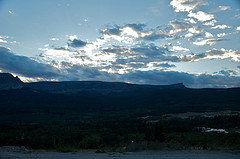
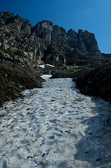

+++
titre = "Voyage en Amérique (août 2008) — Billet n°4 : Glaciers National Park"
title = "Voyage en Amérique (août 2008) — Billet n°4 : Glaciers National Park"
url = "/voyage-en-amerique-4"
date = "2008-09-02T04:08:03"
Lastmod = "2010-02-02T00:55:01"
cover = "glaciers-national-park.jpg"
tag = [ "Animaux", "Marche", "Vacances" ]
pays = [ "États-Unis" ]

+++

Ce billet sera plus court que la moyenne puisque nous ne sommes pas restés longtemps dans ce parc, et nous ne l’avons donc qu’à peine effleuré&#8230; Pourtant, il vaut clairement le détour.

Une différence essentielle frappe par rapport à Yellowstone : Glaciers est clairement un parc destiné aux marcheurs, et globalement aux bons marcheurs. Les chemins balisés sont déjà globalement pas faciles (voire très difficiles selon les standards américains) et le parc ne se révèle vraiment qu’en « <em>backcountry</em> », c’est-à-dire à la française un peu, en partant avec une carte et un bon équipement. Le public est donc, logiquement, différent : en moyenne plus jeune, il s’agit moins de touristes en <em>RV</em> ne s’arrêtant qu’aux points de vue que de touristes en voiture légére et laissée au parking à l’entrée, voire des touristes sans voiture du tout. Pour les <em>RV</em>, la question est d’ailleurs vite réglée : les plus gros sont interdits dans le parc, dont le notre que nous laissons à l’entrée avant de prendre la navette gratuite du parc. En effet, c’est une première pour ce voyage : une navette gratuite est proposée dans un parc ! Il y a quatre ans, les navettes étaient courantes, que ce soit à Grand Canyon, à Zyon et dans bien d’autres parcs que nous avons eu la chance de visiter. Cette année, ni Grand Téton, ni Yellowstone n’en proposaient, et les suivants sembleraient ne pas en proposer non plus. Pourtant, il y aurait de quoi : est-ce bien compliqué de mettre en place un service de navettes, fussent-elles payantes ?<a href="#footnote_0_399" id="identifier_0_399" class="footnote-link footnote-identifier-link" title="Ceci dit, les navettes sont une bonne id&eacute;e, mais malheureusement mise en place de mani&egrave;re assez m&eacute;diocre dans le parc. Le probl&egrave;me est qu&rsquo;ils semblent avoir totalement sous-estim&eacute; leur int&eacute;r&ecirc;t, et il y en a peu et que des petites (pour passer partout). R&eacute;sultat, si vous &ecirc;tes plus de deux, il faudra consid&eacute;rer de se s&eacute;parer aux heures de pointe et prendre votre mal en patience.">1</a>

Navettes ou pas navettes, il y a de toute façon beaucoup de monde dans ce parc. Ou plutôt, il n’y a pas tant de monde que ça, mais le parc n’est pas grand, et surtout les routes sont très étroites (on comprend bien, une fois sur les routes, pourquoi celles-ci sont interdits aux plus longs véhicules&#8230;). Les voitures individuelles et les navettes de toute sorte, gratuites ou privées, abondent et avec les travaux qu’il y avait lors de notre passage (il faut dire que la route, vieille de 75 ans, n’avait jamais été réparée), les temps d’attente ont été souvent longs. En tout cas aux heures des touristes : nous sommes partis tôt (8 heures environ) pour faire une longue ballade, et il n’y avait pas un chat, et seulement des marcheurs. Au retour par contre, vers 16/17 heures, nous nous sommes retrouvés en plein rush de touristes et là, il y avait du monde.

Bon, venons-en au principal : que voir, que faire à Glaciers National Park ? Que faire, ça c’est facile, des ballades, à pied bien sûr même si la route qui traverse le parc vaut, dans son genre, le détour, mais le parc ne se découvre vraiment qu’à pieds. Il y a énormément de choses à y voir et avant tout des vues à couper le souffle, littéralement. Quand on entre par Saint-Mary (au Sud-Est), on entre par une route qui suit un lac sur quasiment 10 miles avant de monter, et quand l’heure va bien (c’est-à-dire tôt le matin<a href="#footnote_1_399" id="identifier_1_399" class="footnote-link footnote-identifier-link" title="D&eacute;sol&eacute;, l&rsquo;avenir est r&eacute;serv&eacute; etc.">2</a>), c’est vraiment magnifique. Malheureusement, nous étions en navette, et je n’ai pu prendre aucune photo. Il faut donc y aller pour le voir mais les montagnes surmontées de glacier et se reflétant dans les eaux calmes du lac c’est, comment dire, magique.

À voir aussi, pour les amateurs, des tas de bêtes et en particulier des chèvres de montagne qui montent sur des pentes si raides qu’on aurait dit qu’elles les escaladaient. On voit aussi des tas d’écureuils (même si en fait ce ne sont pas des écureuils mais bon, moi, les détails animaliers&#8230;((Bon, s&rsquo;il s&rsquo;agit d&rsquo;être précis, c&rsquo;étaient des <em><a href="http://en.wikipedia.org/wiki/Chipmunk">chipmunks</a> </em>ou <a href="http://fr.wikipedia.org/wiki/Tamia">Tamia</a> en français&#8230; Ces bestioles sont, je cite, &laquo;&nbsp;trop mignonnes&nbsp;&raquo; mais aussi pas idiotes : j&rsquo;ai voulu jouer au plus malin avec l&rsquo;une d&rsquo;entre eux, et j&rsquo;ai perdu mon cookie&#8230;))) pas sauvages du tout (c’est peu dire) et des marmottes plus difficiles à voir car plus sauvages, elles. C’est aussi un pays à ours si ça vous tente&#8230; Bref, la routine niveau animalier, mais si vous n&rsquo;avez pas vu Yellowstone ou si c&rsquo;est votre truc, vous serez comblés !

Si vous êtes pressés mais voulez quand même vous ballader, je ne peux que vous recommander la ballade que nous avons faite : elle part du Logan Pass Visitor Center et suit en gros la route (mais en haut) jusqu&rsquo;à &laquo;&nbsp;The Loop&nbsp;&raquo;. Elle fait quelque chose comme 17 kilomètres mais la majeure partie de ces derniers se fait en gros le long de la courbe de niveau, plus exactement de la limite de séparation des eaux (entre l’Atlantique et le Pacifique qui passe bien à ce niveau). Dire que c’est plat serait exagéré mais disons que ça pourrait être pire. Et on est à flanc de montagne, dans des chemins souvent creusés dans la roche : sensibles au vertige, soyez prévenus, c’est assez vertigineux ! Mais je suis passé, en regardant le mur, donc ça va encore. Et du côté vide, il faut bien l’avouer, c’est tout simplement magnifique.

La ballade passe par un chalet où l’on peut dormir mais sans eau ni électricité à disposition, donc prévoyez plein d’eau. Si vous êtes distraits, vous pourrez toujours acheter une bouteille d&rsquo;eau : 5 dollars les 50 centilitres, vous verrez vous la dégusterez ! Le paysage de la haut est sinon magnifique, comme ces quelques photos tentent (vainement ?) de le montrer.

La descente sur The Loop est loin d&rsquo;être la partie la plus agréable de la ballade puisque vous devez descendre pendant 4 miles, ça n&rsquo;en finit pas. Mais bon, c&rsquo;est un mal nécessaire pour retrouver la route, en bas. Et si vous préférez, le chalet mentionné précédemment est un point de départ pour plein de ballades beaucoup moins simples mais qui doivent valoir la peine. De toute façon, ce parc est clairement fait pour les ballades, donc vous aurez de quoi faire.

<h2 id="399_waterton-national-pa_1">Waterton National Park, ou le Glaciers National Park côté canadien :</h2>

Les frontières entre les États-Unis et le Canada ont été fixées non seulement arbitrairement — une belle ligne droite d’Est en Ouest — mais aussi à partir de la côte Est et à une époque où on ne connaissait rien de l’Ouest. Du coup, la frontière est à ce niveau droite et coupe au milieu et à peu près n’importe où. Ainsi, le parc des Glaciers est situé de part et d’autres de la frontière et si les noms diffèrent et s’il n’est pas facile de passer aisément d’un côté à l’autre<a href="#footnote_2_399" id="identifier_2_399" class="footnote-link footnote-identifier-link" title="Voir &agrave; ce sujet le billet Le Canada : a Canadian Way of Life ? &mdash; euh&hellip; quand il sera disponible&hellip;">3</a>, il s’agit bel et bien cependant du même parc.

Il y a néanmoins quelques différences sensibles entre les deux côtés. Le côté canadien ressemble fortement à une station balnéaire et l’on pourrait, presque, se croire en Suisse ou dans une de nos stations de montagne. Le public est donc assez différent, l’ambiance est moins  aux randonnées de montagne qu’aux ballades en bateau sur le lac. Mais cette partie n’en n’est pas moins intéressante pour autant. Attention, par contre, aux pièges à touriste que vous pourrez apercevoir à tous les coins de rue, à peu près&#8230; Ceci dit, le petit bourg de Waterton Park est sympathique, avec un air de ville européenne : ça fait une petite coupure si l&rsquo;on veut.

Si vous voulez marcher un peu, il y a une ballade sympathique qui part du Cameron Lake et qui conduit aux portes des États-Unis, portes que l&rsquo;on ne doit bien sûr pas franchir, officiellement en raison des ours (la bonne blague)&#8230;

<pre><strong>Note de l'auteur</strong> : les photos arrivent doucement, mais elles arrivent ! ;)</pre>
<ol class="footnotes"><li id="footnote_0_399" class="footnote">Ceci dit, les navettes sont une bonne idée, mais malheureusement mise en place de manière assez médiocre dans le parc. Le problème est qu’ils semblent avoir totalement sous-estimé leur intérêt, et il y en a peu et que des petites (pour passer partout). Résultat, si vous êtes plus de deux, il faudra considérer de se séparer aux heures de pointe et prendre votre mal en patience. [<a href="#identifier_0_399" class="footnote-link footnote-back-link">&#8617;</a>]</li><li id="footnote_1_399" class="footnote">Désolé, l’avenir est réservé etc. [<a href="#identifier_1_399" class="footnote-link footnote-back-link">&#8617;</a>]</li><li id="footnote_2_399" class="footnote">Voir à ce sujet le billet Le Canada : a Canadian Way of Life ? — euh&#8230; quand il sera disponible&#8230; [<a href="#identifier_2_399" class="footnote-link footnote-back-link">&#8617;</a>]</li></ol>
