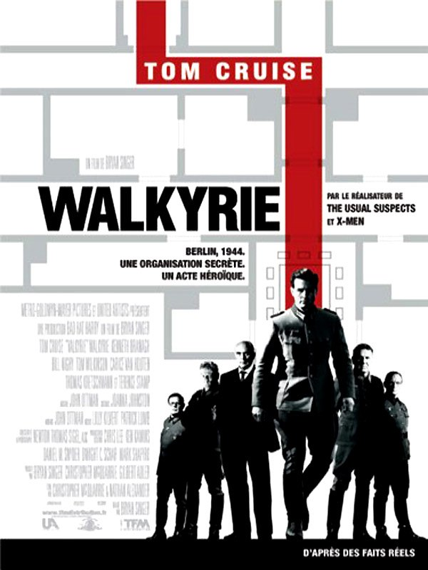
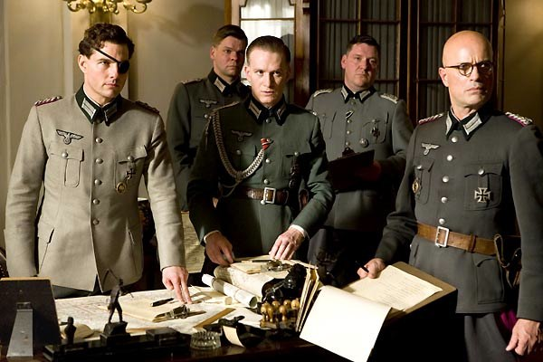
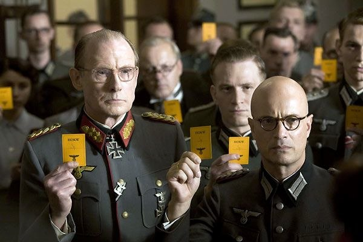

+++
type = "post"
titre = "Walkyrie, Bryan Singer"
title = "Walkyrie, Bryan Singer"
url = "/walkyrie-singer"
date = "2010-03-13T00:07:31"
Lastmod = "2010-03-13T00:22:14"
cover = "operation-walkyrie-tom-cruise.jpg"
categorie = [ "À voir" ]
tag = [ "Blockbuster", "Histoire", "Hollywood", "Résistance", "Seconde guerre mondiale", "Tom Cruise", "Vite oublié" ]
createur = [ "Bryan Singer" ]
acteur = [ "Tom Cruise" ]
annee = [ "2009" ]
weight = 2009
pays = [ "États-Unis" ]

+++

J&rsquo;avais consciencieusement évité <em>Walkyrie</em>, dernier film de Bryan Singer, lors de sa sortie en salles, il y a plus d&rsquo;un an déjà. Cette glorification de la résistance d&rsquo;une partie de l&rsquo;armée allemande pendant la Seconde Guerre mondiale ne m&rsquo;inspirait guère confiance, d&rsquo;autant que Tom Cruise y incarne l&rsquo;officier responsable de &laquo;&nbsp;l&rsquo;acte héroïque&nbsp;&raquo; mis en avant par l&rsquo;affiche. Au détour d&rsquo;une soirée en famille devant le petit écran, j&rsquo;ai vu le film. Eh bien mon idée première était la bonne : il n&rsquo;y a vraiment pas grand-chose à sauver de cette opération Walkyrie hollywoodienne.

<a href="http://www.allocine.fr/film/fichefilm_gen_cfilm=127129.html">

</a>

Au départ, ce fut une <a href="http://fr.wikipedia.org/wiki/Complot_du_20_juillet">histoire vraie</a>. Celle d&rsquo;une poignée d&rsquo;hommes politiques et de militaires qui, au cœur de la guerre et alors que les revers se multiplient contre l&rsquo;Allemagne nazie, estime que Hitler est devenu un danger pour le pays, son pire ennemi même. Pour sauver ce qu&rsquo;ils nomment &laquo;&nbsp;Allemagne sacrée&nbsp;&raquo;, ils décident qu&rsquo;il faut éliminer le dictateur en place depuis une dizaine d&rsquo;années, prendre le pouvoir et demander aux alliés une trêve avant qu&rsquo;il ne soit trop tard. Mais leur plan échoua totalement et ne devint finalement que l&rsquo;une des nombreuses tentatives d&rsquo;attentats contre Hitler, ce dernier s&rsquo;en sortant finalement avec quelques éraflures. Ce complot, le dernier contre le Führer, fut massif et profond comme en témoignèrent les représailles : 200 condamnés à mort, dont un maréchal, une petite vingtaine de généraux, un ministre, trois secrétaires d&rsquo;État… C&rsquo;était ainsi tout un pan du régime nazi qui fut impliqué dans ce complot du 20 juillet.

Le film se concentre sur le colonel Claus von Stauffenberg, soit l&rsquo;homme qui pose la bombe. Héros de guerre mutilé dans les campagnes africaines, il prend conscience de l&rsquo;échec obligatoire à terme de la Wehrmacht et entre alors dans la résistance. <em>Walkyrie</em> commence par présenter son accident, présenté clairement comme l&rsquo;élément qui déclenche la prise de conscience. On suit alors l&rsquo;élaboration du complot, les premières tentatives, et finalement toute la journée du complot. Le film se clôt, logiquement, sur son exécution.

Le sujet est passionnant évidemment, et on voit très bien ce qui a motivé Hollywood, mais aussi l&rsquo;Allemagne puisque le film possède la double nationalité. Mais un bon sujet ne fait pas un bon film, et Bryan Singer le prouve magistralement. <em>Walkyrie</em> souffre de deux défauts extrêmement gênants : l&rsquo;absence totale de réalisme historique d&rsquo;une part, et une lourdeur permanente d&rsquo;autre part. On ne croit pas plus d&rsquo;une demi-seconde au complot, au régime nazi, ou à cet homme prêt à tout sacrifier par patriotisme. Certes, Tom Cruise n&rsquo;est pas responsable de son statut, mais force est de constater que l&rsquo;on peine à l&rsquo;identifier comme officier de la Wehrmacht. Cela vaut d&rsquo;ailleurs pour tous les autres acteurs, aux accents américains parfaits. Le choix de tourner le film en anglais fait certainement sens sur le plan marketing, mais c&rsquo;est une catastrophe totale pour un film historique censé faire vrai ! Montrer Hitler sans tourner en ridicule l&rsquo;homme qu&rsquo;il fut relève toujours de la gageure, mais quand en plus il s&rsquo;exprime en anglais… C&rsquo;est bien simple, si vous avez déjà entendu ou vu le dictateur, vous ne pourrez voir autre chose qu&rsquo;un acteur avec une moustache. C&rsquo;est l&rsquo;ensemble du film qui fait faux, on ne croit à rien, ni à ces avions qui font des trajets front russe/Berlin en quelques heures à peine, ni à ces révolutionnaires qui se retrouvent à 250 et qui se trimbalent avec des cartes jaunes sans être inquiétés par un régime pourtant peu connu pour sa mollesse.

On arrive à l&rsquo;autre gros défaut du film, sa lourdeur. Bryan Singer semble avoir totalement oublié de faire confiance à l&rsquo;intelligence de ses spectateurs, il préfère au contraire appuyer le moindre élément d&rsquo;effets aussi discrets qu&rsquo;un éléphant dans un magasin de porcelaine. L&rsquo;exemple typique est fourni lorsque notre héros revient chez lui, ses enfants mettent le disque de la <em>Walkyrie</em> de Wagner et intervient alors un bombardement. Évidemment, les walkyries entonnent alors le chant guerrier si connu et la caméra descend sur le tourne-disque, jusqu&rsquo;au rond central où le nom de l&rsquo;opéra est indiqué en gros et finit même par remplir l&rsquo;écran. Si l&rsquo;on n&rsquo;avait pas compris d&rsquo;où venait le nom de l&rsquo;opération, nous voilà désormais fixés. On sent tout venir bien avant les personnages, la musique est aussi lourde qu&rsquo;omniprésente… Ce film est un peu une caricature du blockbuster bien lourd, mais à message, parce que voyez, le nazisme, c&rsquo;est le mal.

<em>Walkyrie</em> n&rsquo;est pas totalement inintéressant. Le film réussit même, parfois, à montrer l&rsquo;organisation parfaite de l&rsquo;armée allemande, organisation si parfaite qu&rsquo;elle en devient contre-productive quand deux ordres d&rsquo;arrestation strictement inverses sont envoyés à la même personne, par exemple. On voit aussi à quel point un coup d&rsquo;État tient en peu de choses, et en l&rsquo;occurrence en quelques heures d&rsquo;attente en trop. Tom Cruise y confirme aussi son très mauvais jeu d&rsquo;acteur, sur un autre plan.

Bref, heureusement que je ne l&rsquo;avais pas vu sur grand écran. Là, au moins, on pouvait faire tous les commentaires désobligeants que l&rsquo;on voulait, sans gêner une salle entière. Mais réflexion faite, on peut aussi très bien s&rsquo;abstenir de le voir.

