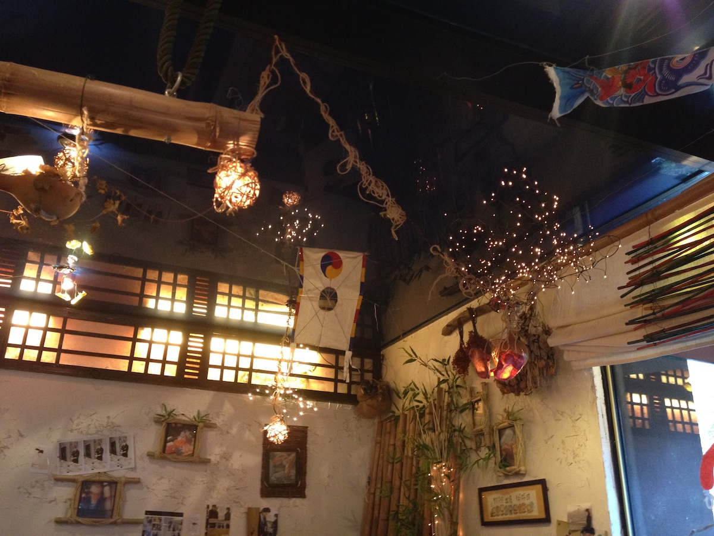
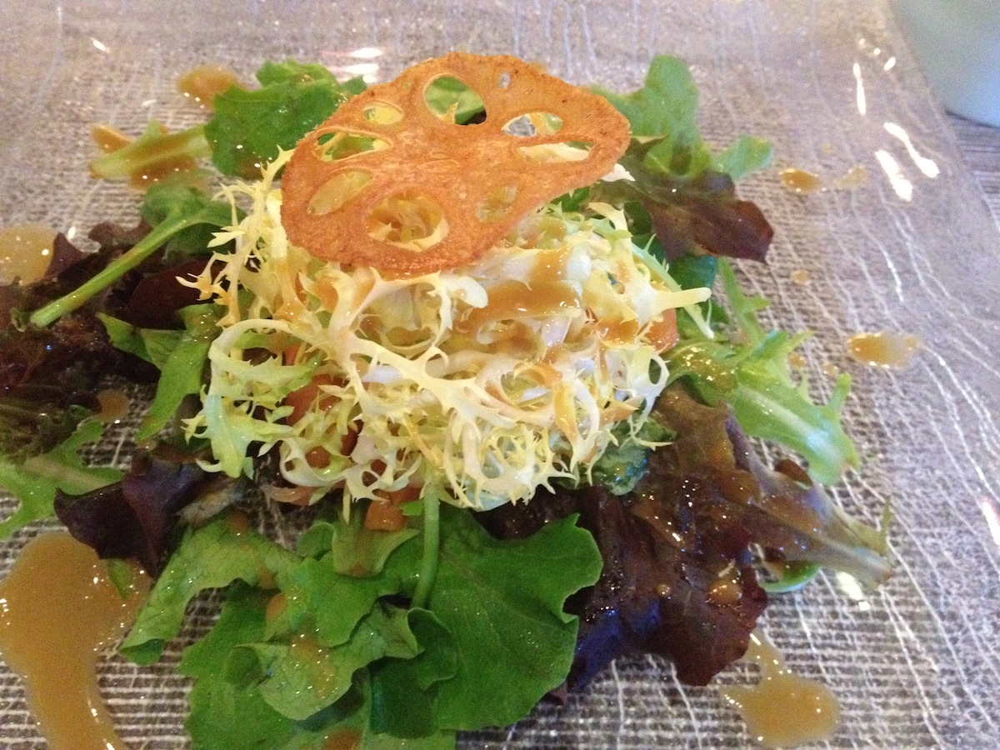
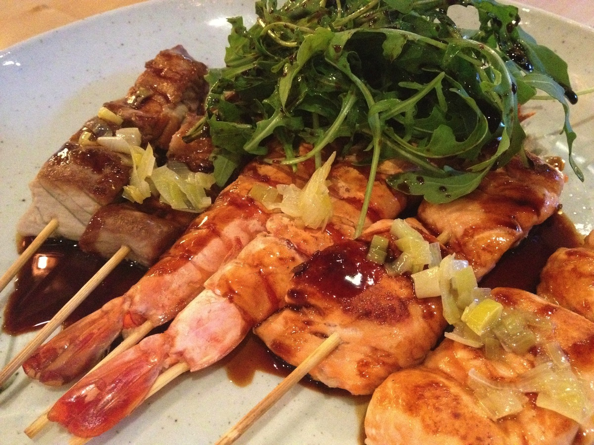
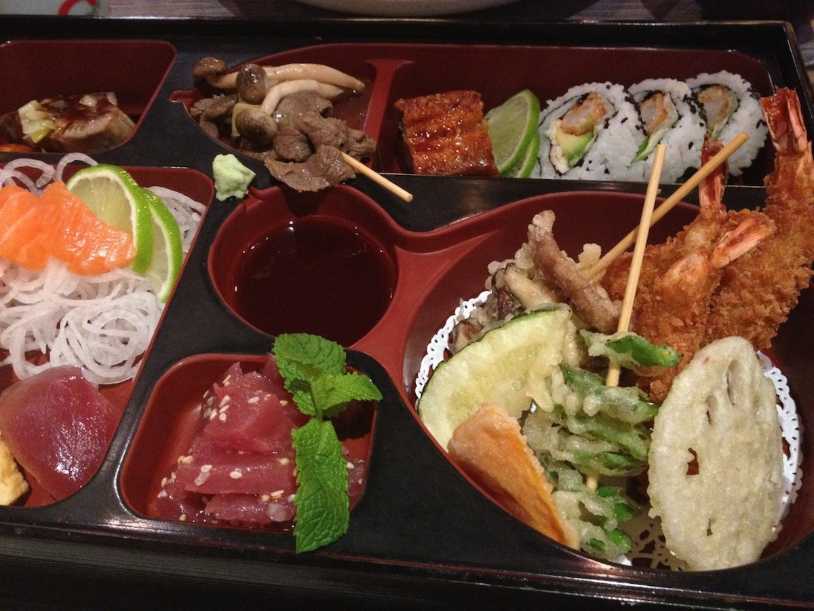
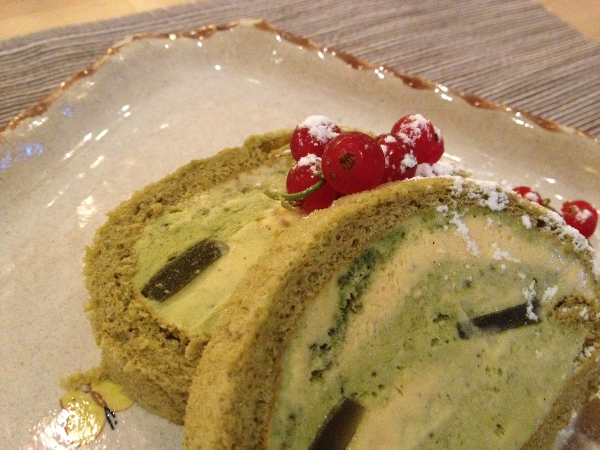

+++
type = "post"
titre = "Le Wasabi à Lyon"
title = "Le Wasabi à Lyon"
url = "/wasabi-lyon"
date = "2012-06-21T00:15:52"
Lastmod = "2015-03-15T00:38:29"
cover = "wasabi-japonais-lyon.jpg"
categorie = [ "À manger" ]
tag = [ "Cuisine japonaise" ]

+++

Vous cherchez un restaurant japonais un peu plus classe que la version sushis en boîte pour une soirée sympa ? Le <a title="" href="http://wasabi.lyon.free.fr/"><strong>Wasabi</strong></a> est peut-être la solution qu&rsquo;il vous faut. Cette adresse située dans un quartier de Lyon assez peu branché, quoique proche d&rsquo;un centre universitaire, n&rsquo;a rien de l&rsquo;esprit fast-food que la majorité des restaurants japonais propose. L&rsquo;univers nippon est ici bien respecté et la cuisine sort des sentiers battus, quoique l&rsquo;on reste trop proche des incontournables du genre pour le prix demandé. Un bon plan toutefois pour une soirée agréable et intime.

La devanture verte et fleurie rappelle un peu les jardins à la japonaise, mais ce sont surtout les bandes de tissus devant la porte d&rsquo;entrée du <strong>Wasabi</strong> qui évoquent le Japon. Passez la porte et vous entrez dans un univers étonnant. Le pays du Soleil levant n&rsquo;est pas loin, mais les propriétaires sont allés chercher ailleurs et l&rsquo;ensemble compose un univers touffu et disparate assez amusant. Des petites guirlandes lumineuses sont accrochées en grappe un peu partout, on trouve aussi des décors en bambou et autres branches d&rsquo;arbres, des illustrations japonaises, des mots écrits en japonais, mais aussi des figurines. Au fond, on reconnaît le traditionnel lieu de confection des sushis, sashimis et macis et les serveurs, tous d&rsquo;origine asiatique, complètent ce tableau original. L&rsquo;ambiance est en tout cas feutrée et plutôt intimiste, même si les petites tables sont assez proches.

La carte du <strong>Wasabi</strong> n&rsquo;est pas celle de n&rsquo;importe quel restaurant japonais. Oubliez les menus « D2 » et les photos des plats, on a ici affaire à un vrai restaurant, avec des menus qui ont un vrai nom et les seules photos que l&rsquo;on trouvera sur la carte sont des représentations des (nombreuses) bouteilles de saké proposées. Les prix sont eux aussi plus proches de l&rsquo;univers du restaurant gastronomique, que du japonais sur le pouce. Comptez une trentaine d&rsquo;euros pour la plupart des menus, mais la facture monte vite si vous ajoutez une boisson, voire un dessert. Inutile par ailleurs d&rsquo;espérer se passer d&rsquo;un menu, les éléments à la carte ne sont pas intéressants sur le plan financier. On l&rsquo;évoquait, les amateurs de saké seront aux anges au <strong>Wasabi</strong> : le restaurant propose une impressionnante variété avec à chaque fois un descriptif des saveurs à attendre. Ce soir-là, nous avons essayé les deux cocktails maison pour ouvrir le repas : si le Saké Tonic — un Gin Tonic avec du Saké… — était correct, l&rsquo;autre cocktail à base de pêche était surtout sucré.

Malgré cette présentation, le <strong>Wasabi</strong> reste assez proche de l&rsquo;offre d&rsquo;un japonais bas de gamme. Les menus sont tous composés d&rsquo;une salade et d&rsquo;une soupe miso, parfois d&rsquo;un bol de riz, tandis que l&rsquo;on retrouve les assortiments de poissons cru (sushi, sashimi et maki) et de brochettes. Sans surprise non plus, plusieurs compositions sont proposées en fonction de votre appétit, de votre budget et de vos goûts. L&rsquo;un des menus est ainsi composé de six brochettes de poisson et de fruits de mer, quand un autre nommé Bento rassemble des éléments variés pour une dégustation assez large de la cuisine japonaise. On regrette malgré tout le manque de diversité : étant donné le cadre et le positionnement tarifaire, on aurait aimé goûter des plats typiquement japonais, quelque chose que l&rsquo;on n&rsquo;aurait pas l&rsquo;habitude de manger en France. Mis à part la fondue japonaise qui se mange à deux au minimum et qui se commande la veille, on reste en terrain connu au <strong>Wasabi</strong> et c&rsquo;est un petit peu dommage.

Si la carte nous a un peu déçu par son manque d&rsquo;originalité, la qualité des plats a été fort heureusement irréprochable. Dès l&rsquo;arrivée de la salade qui ouvre ici comme ailleurs le repas, le <strong>Wasabi</strong> marque la différence. Il ne s&rsquo;agissait pas d&rsquo;un peu de chou dans un bol, mais d&rsquo;une belle salade avec du mesclun, un peu de chou blanc et quelques morceaux de saumon cru, le tout étant relevé par une très agréable sauce. Si la soupe miso n&rsquo;a, en revanche, pas fait d&rsquo;étincelles, les plats qui composent l&rsquo;essentiel du menu étaient à la hauteur. Les brochettes de poisson par exemple n&rsquo;étaient pas du tout trop cuites comme c&rsquo;est souvent le cas : le saumon cuit à la perfection était ainsi tendre et savoureux. Les gambas n&rsquo;étaient pas de petites crevettes et le thon était lui aussi très bien cuit. De son côté, F. a opté pour le menu Bento et la boîte qu&rsquo;on lui a servi regorgeait de petites préparations toutes plus gourmandes les unes que les autres : tempura de légumes et gambas, maki d&rsquo;anguilles, brochette de bœuf, sashimi de saumons, etc. Bon point : le serveur détaille les différents éléments et recommande un ordre de dégustation. Le tout est très bon et relativement copieux, même si on pourrait en avoir plus pour le prix demandé. Un bon point en revanche concerne les desserts du <strong>Wasabi</strong> : trop rares en temps normal dans les restaurants japonais, ils sont ici majoritairement faits maison et ils sont originaux. La buche glacée au thé vert était très savoureuse et permet de finir un repas sur une note assez légère.

Si le prix de sa carte ne vous effraie pas, le <strong>Wasabi</strong> est une excellente alternative aux restaurants japonais traditionnels. Le cadre est plus agréable pour une soirée tranquille et surtout la qualité des plats servis est largement supérieure à ce que l&rsquo;on a l&rsquo;habitude de trouver sur ce segment. À recommander pour les amateurs de cuisine japonaise…

