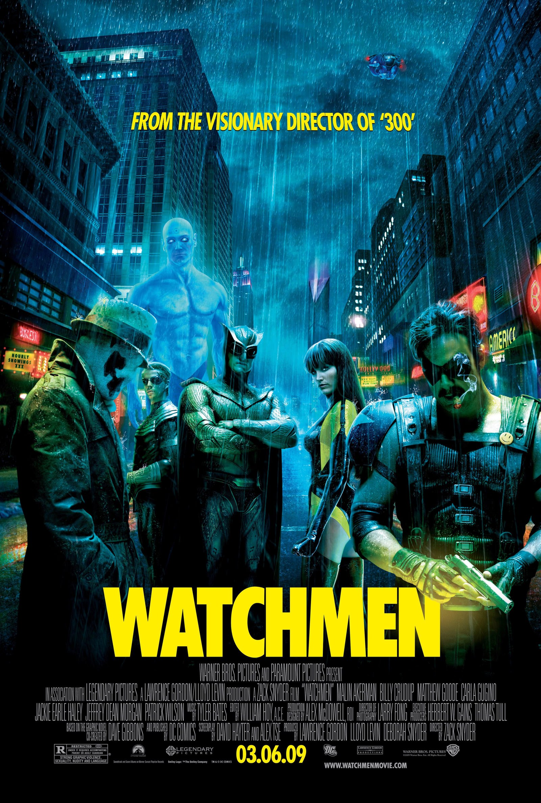
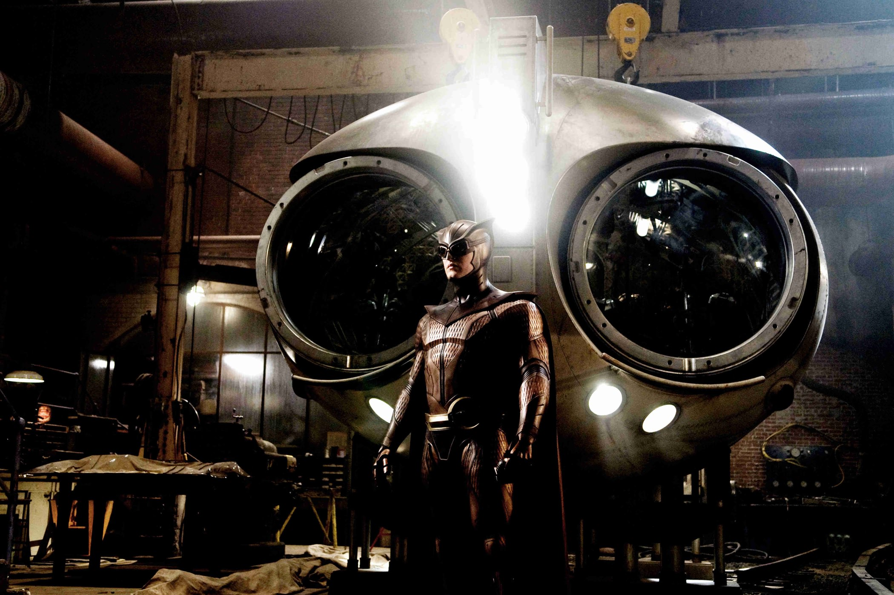

+++
titre = "<em>Watchmen : les Gardiens</em>, Zack Snyder"
title = "Watchmen : les Gardiens, Zack Snyder"
url = "/watchmen-gardiens-snyder"
date = "2014-12-13T20:31:28"
Lastmod = "2014-12-13T20:35:35"
cover = "watchmen-gardiens-zack-snyder.jpg"
categorie = [ "À voir" ]
tag = [ "Action", "Adaptation bande-dessinée", "Blockbuster", "Comics", "Drame", "Guerre froide", "Société", "Superhéros", "Violence" ]
createur = [ "Zack Snyder" ]
acteur = [ "Billy Crudup", "Carla Gugino", "Jackie Earle Haley", "Jeffrey Dean Morgan", "Malin Akerman", "Matthew Goode", "Patrick Wilson" ]
annee = [ "2009" ]
weight = 2009
pays = [ "États-Unis" ]
original = "Watchmen"

+++

Les adaptations de comics se sont multipliées au cinéma depuis quelques années et elles sont toujours très populaires. <em>Watchmen : les Gardiens</em> n&rsquo;a pourtant connu qu&rsquo;un succès modeste à sa sortie, en 2009. Ce n&rsquo;est pas faute de proposer une histoire centrée non pas sur un superhéros, mais sur une dizaine de héros et ce n&rsquo;est pas faute, non plus, de mettre en avant le réalisateur de <em>300</em>. Le succès relativement faible de cette adaptation là est cependant assez facile à comprendre quand on revoit le film : Zack Snyder a signé une œuvre très sombre, pas forcément aussi simple d&rsquo;accès que les autres adaptations de comics. Pour autant, <em>Watchmen : les Gardiens</em> est peut-être l&rsquo;une des adaptations les plus intéressantes par sa noirceur et son côté totalement désespéré. Le cinéaste utilise ses effets à l&rsquo;excès, mais l&rsquo;histoire reste extrêmement forte : un blockbuster à (re)découvrir !

<em>Watchmen : les Gardiens</em> commence par le meurtre d&rsquo;un superhéros. D&rsquo;emblée, Zack Snyder marque sa différence par rapport à tous les autres films du genre en créant une ambiance très sombre et guère valorisante, bien éloignée de ce que l&rsquo;on a l&rsquo;habitude de voir dans ce genre de blockbusters. Et on ne découvre pas un superhéros fringant et puissant, comme on pourrait s&rsquo;y attendre, mais un type âgé et bouffi par l&rsquo;alcool qui n&rsquo;a plus sa force d&rsquo;antan. Et cela se voit : Edward Blake, dit Le Comédien, ne peut pas faire grand-chose contre son assaillant, qui reste à ce moment inconnu. Il se fait détruire lors d&rsquo;une séquence de combat qui frappe par sa violence extrême et il finit par être jeté par la fenêtre et tué. Passé cette introduction bien sombre, <em>Watchmen : les Gardiens</em> retrouve un peu de lumière avec un générique en forme de rétrospective. Le réalisateur nous explique ainsi en quelques secondes toute l&rsquo;histoire de ces superhéros et ce qui aurait probablement été le cœur du récit dans un autre film est ici expédié avec une série de photos souvenirs et de scènes au ralenti. Sur un fond de Bob Dylan (« <em>The Times They Are a-Changin&rsquo;</em> »), on assiste à la formation d&rsquo;un groupe de superhéros assez similaires, dans l&rsquo;esprit, aux Avengers de Marvel. Puis on voit les années qui passent, les héros qui vieillissent, la relève qui prend la place et enfin la mise au placard, quand la société rejette ces superhéros d&rsquo;antan. De fait, quand le film commence, on est alors dans les années 1980 d&rsquo;un univers parallèle où la Guerre froide est sur le point de se transformer en guerre nucléaire, et où les héros d&rsquo;autrefois sont entrés dans la vie active pour la plupart. Le scénario se met en place autour du meurtre qui ouvre <em>Watchmen : les Gardiens</em>. Un autre héros, Rorschach, est persuadé que quelqu&rsquo;un en veut aux anciens gardiens et qu&rsquo;ils vont tous être assassinés, les uns après les autres. Il se met alors à contacter ses anciens collègues et le récit filmé par Zack Snyder se déploie autour d&rsquo;une sorte d&rsquo;enquête, alors que la guerre est imminente.

Résumer <em>Watchmen : les Gardiens</em> est assez difficile, non pas que l&rsquo;histoire soit vraiment incompréhensible, mais plutôt parce qu&rsquo;elle n&rsquo;est ni linéaire, ni centrée sur un seul personnage. Pendant plus de 2h40, Zack Snyder multiplie les flashbacks qui permettent, peu à peu, de tout comprendre et le film ne cesse de passer d&rsquo;un personnage à l&rsquo;autre. Il y a le comédien, Rorschach, mais aussi le Hibou, le Spectre Joyeux, le docteur Manhattan, Ozymandias… et encore, il y a parfois deux personnages, un par génération des Watchmen. Le comics d&rsquo;Alan Moore et de Dave Gibbons est lui-même marqué par cette densité et cette intrigue complexe et l&rsquo;adaptation est assez fidèle, du moins dans l&rsquo;esprit. Sur le fond, il y a quelques <a href="http://fr.wikipedia.org/wiki/Watchmen_:_Les_Gardiens#Diff.C3.A9rences_entre_le_film_et_le_comic">différences assez nettes</a> entre les deux œuvres, mais la proposition de Zack Snyder est plutôt convaincante. En effet, la grande force de ce film, c&rsquo;est sa noirceur et son côté désespéré. On est loin des adaptations de comics de base, non seulement parce que les superhéros ne sont pas ces personnes dotées de pouvoirs qui font toujours le bien, mais des gens « normaux » et qui sont rejetés par la société, mais aussi parce qu&rsquo;ils ne gagnent pas vraiment à la fin. Sans trop en dévoiler, disons simplement que la victoire attendue n&rsquo;est pas nette et que, à cet égard aussi, <em>Watchmen : les Gardiens</em> est plus complexe que la moyenne. Alors certes, Zack Snyder multiplie les ralentis et il impose une forme très reconnaissable, avec une image désaturée et souvent contrastée par une pointe de couleur vive — le fameux badge jaune du Comédien, par exemple. Certes, cette forme qui était déjà au cœur de <em>300</em>, son précédent film, est un peu lourde et on aimerait parfois qu&rsquo;il se calme un peu, mais en même temps c&rsquo;est aussi ce qui explique la réussite du projet. Est-ce parce que l&rsquo;on retrouve l&rsquo;ambiance du comics original ou simplement parce que ce style correspond bien au sujet et à l&rsquo;ambiance du film ? Qu&rsquo;importe, cela fonctionne bien et le long-métrage est très agréable à regarder. Par ailleurs, s&rsquo;il est long et s&rsquo;il n&rsquo;est pas aussi rythmé qu&rsquo;un blockbuster classique, on ne s&rsquo;ennuie pas une seule fois, preuve que le sujet passionne.

Pour son troisième film, Zack Snyder s&rsquo;attaque à l&rsquo;univers des comics et il y apporte sa forme reconnaissable entre toutes. On pouvait craindre le pire, mais <em>Watchmen : les Gardiens</em> est une réussite, probablement parce que l&rsquo;œuvre originale est si forte et que le film lui est assez fidèle. La noirceur de cet univers et de ces superhéros à la retraite est très bien rendue et on apprécie toute la thématique autour du héros qui peut devenir le pire ennemi d&rsquo;une société. Pour la première fois, on voit des héros de comics profondément antipathiques et qui plus est misanthropes, mais c&rsquo;est ce qui les rend aussi intéressants et même attachants. <em>Watchmen : les Gardiens</em> est peut-être trop complexe pour rencontrer un public aussi large que les autres adaptations de comics, mais ça n&rsquo;en fait pas un film moins réussi pour autant. Bien au contraire…

<h3>Vous voulez <a href="http://voiretmanger.fr/soutien/">m&rsquo;aider</a> ?</h3>
<ul>
<li><a href="http://www.amazon.fr/gp/product/B004IPWXS0/ref=as_li_ss_tl?ie=UTF8&amp;tag=leblogdenic07-21&amp;linkCode=as2&amp;camp=1642&amp;creative=19458&amp;creativeASIN=B004IPWXS0">Acheter le film en Blu-ray sur Amazon</a></li>
<li><a href="http://www.amazon.fr/gp/product/B003AYPN7I/ref=as_li_ss_tl?ie=UTF8&amp;tag=leblogdenic07-21&amp;linkCode=as2&amp;camp=1642&amp;creative=19458&amp;creativeASIN=B003AYPN7I">Acheter le film en DVD sur Amazon</a></li>
<li><a href="https://itunes.apple.com/fr/movie/watchmen-les-gardiens-vost/id385493688">Acheter ou louer le film sur l&rsquo;iTunes Store</a></li>
<li><a href="http://www.netflix.com/WiMovie/70099111?">Regarder le film sur Netflix</a></li>
</ul>

