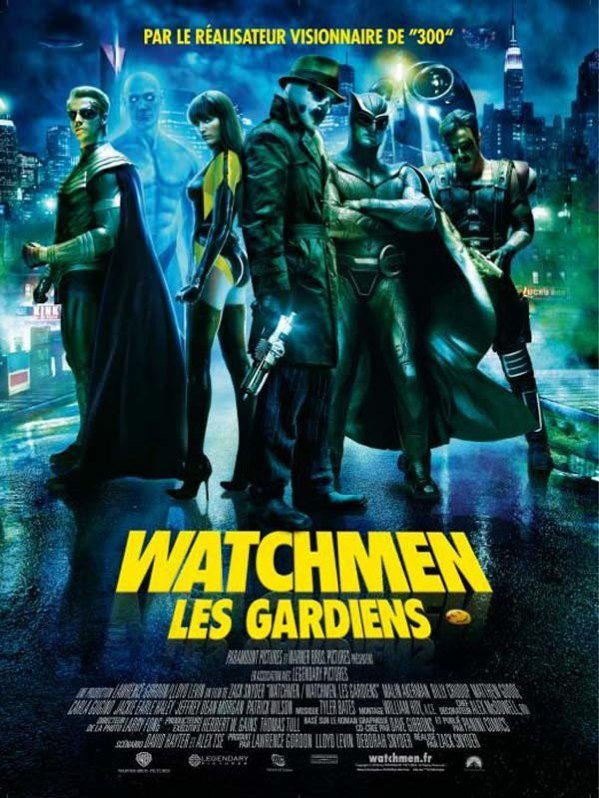
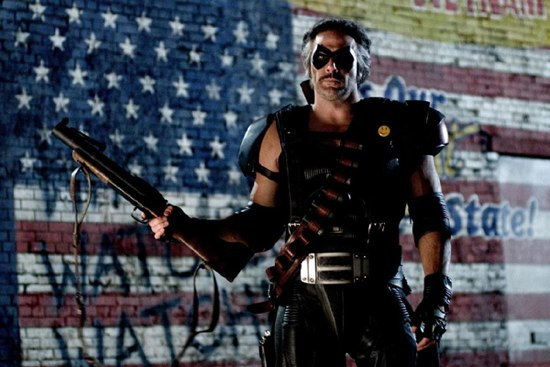

+++
titre = "Watchmen, Zack Snyder"
title = "Watchmen, Zack Snyder"
url = "/watchmen-zack-snyder"
date = "2009-03-05T15:17:59"
Lastmod = "2014-12-13T20:38:20"
cover = "watchmen1.jpg"
categorie = [ "Archives du blog" ]

+++

<strong>Depuis cet article « historique », j’ai publié une nouvelle critique du film : <a href="http://voiretmanger.fr/watchmen-gardiens-snyder/" title="Watchmen : les Gardiens, Zack Snyder"><em>Watchmen : les Gardiens</em>, Zack Snyder</a></strong>

Hier soir, premier jour de sortie, je suis allé voir <em>Watchmen</em>, le film de la semaine (en tout cas, le film délire, avec <em>Harvey Milk</em> en film sérieux). Certes, je n&rsquo;étais pas seul<a href="#footnote_0_1309" id="identifier_0_1309" class="footnote-link footnote-identifier-link" title="D&rsquo;ailleurs, &agrave; ce propos, c&rsquo;est amusant de voir que la salle &eacute;tait tr&egrave;s tr&egrave;s masculine. Ce qui n&rsquo;est pas &eacute;tonnant quand on sait qu&rsquo;&ecirc;tre geek, c&rsquo;est d&rsquo;abord &ecirc;tre un geek (m&ecirc;me s&rsquo;il y a des &laquo;&nbsp;geekettes&nbsp;&raquo;), mais je ne m&rsquo;attendais pas &agrave; un tel ph&eacute;nom&egrave;ne&hellip;">1</a>, mais cela en valait la peine.

<em>Watchmen</em> est l&rsquo;adaptation d&rsquo;un <em>comics</em> tardif : paru en 1986, il a provoqué en son temps une petite révolution en présentant pour la première fois des superhéros noirs, fragiles, impuissants, attaqués par la société, voire carrément malades. Par bien des aspects, ce <em>comics</em> a signé la fin des superhéros à l&rsquo;ancienne, comme s&rsquo;ils n&rsquo;avaient plus leur place dans la modernité post guerre froide qui s&rsquo;annonçait déjà. Cette œuvre était aussi apparemment (je ne l&rsquo;ai pas lue) fort complexe sur le plan scénaristique, et l&rsquo;adaptation cinématographique se veut très fidèle.

Et de fait, <em>Watchmen</em> n&rsquo;est pas un film si facile que cela : si je le classe volontiers dans les blockbusters, il n&rsquo;en reprend pas les scénarios téléphonés, aux intrigues bien visibles et qui évitent comme la peste le moindre doute. À aucun moment, le scénario essaie de nous aider et il se contente de suivre, quasiment case après cases, l&rsquo;œuvre originale. Toute la réussite du film tient, à mon avis, dans cet aspect, mais autant le savoir : comme l&rsquo;<a href="http://www.toujoursraison.com/2009/02/watchmen-les-gardiens.html">indique Rob Gordon</a>, si vous n&rsquo;aimez pas les comics et ne faites pas un vrai effort pour rentrer dans l&rsquo;histoire, vous risquez de trouver le temps très long. Le film dure 2h40 et surtout, il est atypique par le rythme : loin de se résumer à une série de combats entre gentils et vilains avant le final avec le big-boss, <em>Watchmen</em> impose un rythme assez lent et uniquement interrompu de quelques pics de violence.

Vous l&rsquo;aurez compris, résumer un tel film sans en dévoiler la fin relève de la gageure. En gros, il s&rsquo;agit de l&rsquo;histoire de quelques anciens superflics qui faisaient la loi dans les années 1960/1970 (on ne sait pas bien) et qui sont, au début du film, à la retraite, seuls, un peu désespérés, voire carrément malades. Le film s&rsquo;ouvre sur le meurtre de l&rsquo;un d&rsquo;entre eux, et consiste ensuite à découvrir qui en veut aux Watchmen et pourquoi. Ce point de départ est étonnant dans un tel film : si l&rsquo;on a vu, récemment, des remises en cause de la figure du superhéros (Spiderman bien sûr, mais aussi Batman dans <em><a href="http://voiretmanger.fr/2008/08/04/the-dark-night/">The Dark Night</a></em>), on n&rsquo;en avait jamais vu qui commence sur de tels losers. Qu&rsquo;on se le dise, un superhéros vieillit mal : il grossit, a besoin de lunettes, tombe dans l&rsquo;alcool et tente, tant bien que mal, de s&rsquo;adapter à la dure vie &laquo;&nbsp;normale&nbsp;&raquo;. Autant dire qu&rsquo;ils ne font pas envie et c&rsquo;est assez impressionnant de voire une telle image au cinéma.

L&rsquo;impression est renforcée par le génial générique de début, où nous est présenté le passé de jeunes et beaux superhéros aimés de tous. Le film se construit sur une succession de flash-back qui, au contraire, évoquent la déchéance : l&rsquo;un tue une femme qui porte son enfant, l&rsquo;autre se fait quasiment violer par un autre superhéros, tandis que tous sont rejetés par une société pacifiste qui ne veut plus d&rsquo;eux. Ils sont finalement tous obligés de &laquo;&nbsp;tomber le masque&nbsp;&raquo;, sauf l&rsquo;un d&rsquo;entre eux, Rorschach qui est sans doute d&rsquo;ailleurs le plus intéressant dans le film.

La violence est traitée différemment de la production habituelle : elle est certes omniprésente, mais pas présente tout le temps. Elle surgit plutôt sans prévenir, brutalement, avant de se calmer tout aussi rapidement. L&rsquo;ouverture du film est à cet égard intéressante : la violence apparaît brusquement, mais elle est comme compensée par la musique et se termine sur ce sourire jaune qui offre, paradoxalement, un apaisement. Plus tard, dans la rue, un combat arrive brusquement, se fait bref, et se termine par les rires des deux héros, comme si rien ne s&rsquo;était passé. Même l&rsquo;affrontement final déçoit si l&rsquo;on attend un combat épique et tout se règle finalement par la télévision.

En fait, c&rsquo;est la violence même qui est le sujet du film comme on s&rsquo;en aperçoit à la toute fin, grâce à un scénario pas si simpliste qu&rsquo;il n&rsquo;en paraît initialement. Une fin marquée par une destruction à grande échelle inattendue dans les histoires classiques de superhéros et qui montre bien, à nouveau, l&rsquo;originalité de <em>Watchmen</em>. Plus classique est le personnage de Dr. Manhattan, un scientifique transformé par une expérience malheureuse qui devient un surhomme doté de superpouvoirs comme la capacité de changer de taille ou d&rsquo;exploser des ennemis dans une masse de chair assez réussie dans le genre. Plus intéressante est la thématique de l&rsquo;éloignement par rapport à des humains et l&rsquo;incompréhension des deux côtés, mais aussi son rôle actif, quoiqu&rsquo;involontaire, dans le plan du méchant. Ou comment le sauveur de l&rsquo;Amérique (dans le film, l&rsquo;Amérique gagne la guerre du Vietnam grâce à lui) devient son pire ennemi, et même celui des Russes (rappelons que le film se déroule en 1985, certes un 1985 uchronique, mais la guerre froide est toujours là).

Il y aurait encore énormément de choses à dire sur ce film vraiment très riche, notamment sur son rapport au temps, ou encore sur les modes de narration (mélange avec un journal intime), mais j&rsquo;ai déjà été trop long. Je signalerai juste, sur un plan plus technique, que Zack Snyder, le réalisateur de <em>300</em> semble s&rsquo;être ici un peu calmé sur les effets et que ça n&rsquo;est pas si mal, <em>Watchmen</em> évitant ainsi le statut, certes rigolo, de film purement esthétique et complètement barré. Les effets sont bien sûr nombreux ici, mais mis au service de l&rsquo;histoire.

Signalons aussi une bande-son mêlant un peu de tout, comme c&rsquo;est très à la mode, mais plutôt efficace, avec des décalages intéressants (même si pas forcément très originaux), comme <em>Hallelujah</em> sur la scène de sexe ou le <em>Requiem</em> de Mozart qui se pointe à l&rsquo;improviste. Bon, les Walkyries au Vietnam, c&rsquo;était quand même un peu téléphoné&#8230;

Pour conclure, je recommande chaudement ce film, pour peu que l&rsquo;on accepte un film atypique, noir, assez lent, assez déconstruit dans la narration même si on est loin d&rsquo;un film expérimental. Le film est moins évident qu&rsquo;il n&rsquo;en avait l&rsquo;air, grâce à une adaptation rigoureuse du <em>comics</em>. Par contre, pas besoin de connaître ce dernier par cœur avant de voir le film, on comprend très bien sans (en tout cas, j&rsquo;ai très bien compris et n&rsquo;ai jamais lu l&rsquo;original). Le nombre de départs pendant la séance ayant été assez élevé, je soupçonne que l&rsquo;efficace promotion du film en a trompé plus d&rsquo;un, donc soyez prévenus !

<strong>À lire</strong>, la critique dithyrambique des <em><a href="http://www.lesinrocks.com/cine/cinema-article/article/watchmen/">Inrockuptibles</a></em> qui ont vraiment adoré et offrent une analyse plus fouillée que d&rsquo;habitude. <a href="http://www.critikat.com/Watchmen-Les-Gardiens.html">Critikat</a> propose également une critique détaillée, un peu moins positive néanmoins, tandis que c&rsquo;est le service minimum pour <a href="http://www.telerama.fr/cinema/films/watchmen-les-gardiens,373109,critique.php"><em>Télérama</em></a> avec une critique en demi-teinte.

<h3>Vous voulez m&rsquo;aider ?<a href="#footnote_1_1309" id="identifier_1_1309" class="footnote-link footnote-identifier-link" title="&Agrave; propos de la publicit&eacute;&hellip;">2</a></h3>
<ul>
<li><a href="http://www.amazon.fr/gp/product/B004IPWXS0/ref=as_li_ss_tl?ie=UTF8&#038;tag=leblogdenic07-21&#038;linkCode=as2&#038;camp=1642&#038;creative=19458&#038;creativeASIN=B004IPWXS0">Acheter le film en Blu-Ray sur Amazon</a></li>
<li><a href="http://www.amazon.fr/gp/product/B003AYPN7I/ref=as_li_ss_tl?ie=UTF8&#038;tag=leblogdenic07-21&#038;linkCode=as2&#038;camp=1642&#038;creative=19458&#038;creativeASIN=B003AYPN7I">Acheter le film en DVD sur Amazon</a></li>
<li><a href="http://itunes.apple.com/fr/movie/watchmen-les-gardiens-vost/id385493688">Acheter le film sur l&rsquo;iTunes Store</a></li>
</ul>

<ol class="footnotes"><li id="footnote_0_1309" class="footnote">D&rsquo;ailleurs, à ce propos, c&rsquo;est amusant de voir que la salle était très très masculine. Ce qui n&rsquo;est pas étonnant quand on sait qu&rsquo;être geek, c&rsquo;est d&rsquo;abord être un geek (même s&rsquo;il y a des &laquo;&nbsp;geekettes&nbsp;&raquo;), mais je ne m&rsquo;attendais pas à un tel phénomène&#8230; [<a href="#identifier_0_1309" class="footnote-link footnote-back-link">&#8617;</a>]</li><li id="footnote_1_1309" class="footnote"><a href="http://voiretmanger.fr/soutien/">À propos de la publicité…</a> [<a href="#identifier_1_1309" class="footnote-link footnote-back-link">&#8617;</a>]</li></ol>
