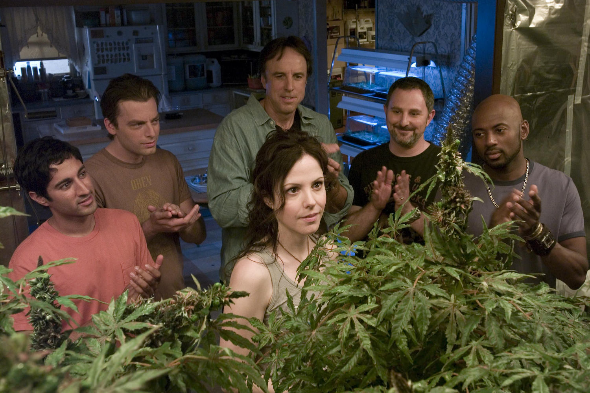
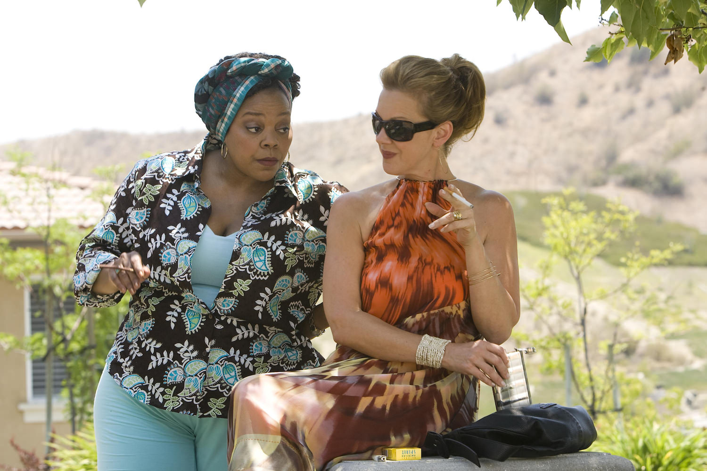
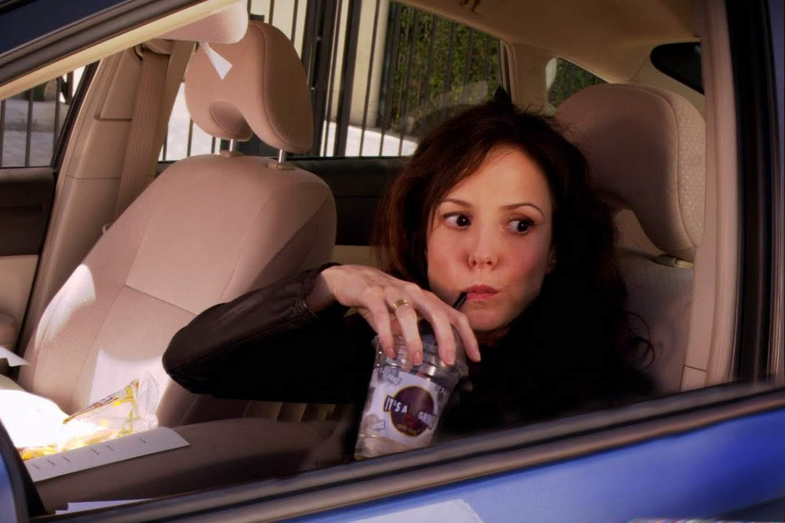

+++
type = "post"
titre = "<em>Weeds</em>, Jenji Kohan (Showtime)"
title = "Weeds, Jenji Kohan (Showtime)"
url = "/weeds-kohan-showtime"
date = "2013-10-20T22:54:03"
Lastmod = "2013-10-20T23:00:12"
cover = "weeds-mary-louise-parker.jpg"
categorie = [ "À voir" ]
tag = [ "Adolescence", "Banlieue", "Comédie", "Drame", "Drogue", "Enfance", "Famille", "Mafia", "Série", "Société" ]
createur = [ "Jenji Kohan", "Showtime" ]
acteur = [ "Alexander Gould", "Elizabeth Perkins", "Hunter Parrish", "Justin Kirk", "Kevin Nealon", "Mary-Louise Parker", "Tonye Patano" ]
annee = [ "2005" ]
weight = 2005
pays = [ "États-Unis" ]

+++

Avant AMC et son <a href="/breaking-bad-gilligan/" title="Breaking Bad, Vince Gilligan (AMC)"><em>Breaking Bad</em></a>, Showtime avait déjà imaginé une série basée entièrement sur une idée surprenante. Dans les deux cas, un évènement tragique ou dramatique oblige une personne tout à fait normale à changer du tout au tout et à produire et vendre de la drogue pour vivre. Son nom l’indique sans aucune équivoque, <em>Weeds</em> créé par Jenji Kohan en 2005, partait sur l’idée de la marijuana qu’une jeune veuve allait vendre dans sa banlieue américaine chic. À partir de cette idée très simple, Showtime a réussi à produire pas moins de huit saisons. Il faut bien avouer, en voyant les premiers épisodes, que l’on avait du mal à cerner comment les scénaristes, mais <em>Weeds</em> fait partie de ces séries qui ne cessent de s’embellir au fil des épisodes. Ce qui commence comme une blague se transforme progressivement en une grande série, décapante, amusante et aussi émouvante. Personnages aussi barrés qu’excellents, situations toujours plus grotesques, Jenji Kohan a signé l’une des grandes séries de ces dernières années, à ne rater sous aucun prétexte.

Quand <em>Weeds</em> commence, Nancy Botwin vient tout juste de perdre Judah, son époux. Un banal accident domestique et cette femme au foyer qui n’a jamais vraiment rien fait de sa vie, à part élever ses deux fils, Silas et Shane, doit trouver un travail pour ne pas quitter Agrestic, lotissement chic, mais très coûteux. Une situation de départ assez simple, mais la solution trouvée par la jeune veuve est plus atypique, puisqu’elle décide… de vendre du cannabis dans son quartier. Les riches Américains qui y vivent le parfait <em>American Dream</em> sont parfaits en apparence, mais sous le vernis impeccable se cachent toujours des situations compliquées et fumer un peu de marijuana est courant. Seul problème, il faut faire avec des dealers venus de la banlieue et donc, par définition, inquiétant. Nancy fait un relais parfait en présentant bien et c’est sur cette idée de simplifier le commerce de la drogue douce prisée des beaux quartiers que Jenji Kohan commence sa série. Le format très court — 30 minutes par épisode — oblige un traitement rapide et <em>Weeds</em> frappe dès ses premiers épisodes par son style extrêmement incisif, totalement immoral et assez jouissif. On découvre vite une galerie de personnages complètement barrés que l’on ne quittera plus par la suite, jusqu’au dernier épisode de la huitième et ultime saison pour certains. Au début, tout va pour le mieux pour la famille Botwin, mais très vite, un des principaux moteurs de la série entre en action : la catastrophe.

Comment tenir une série complète sur une idée aussi réduite que celle qui lance <em>Weeds</em> ? À cette question, les scénaristes ont eu une réponse plutôt astucieuse : les problèmes. Si l’affaire de Nancy Botwin s’engage assez bien, elle multiplie rapidement les catastrophes en se mettant à dos les gangs locaux et même les stucs locaux. Mexicains et Arméniens se mettent contre elle et les deux premières saisons ne sont vite qu’un enchaînement de malheurs qui viennent s’accumuler. Partant sur le ton d’une comédie assez noire, <em>Weeds</em> tend peu à peu vers une fin beaucoup plus sérieuse, en passant par une série de catastrophes qui limitent toutes les périodes où tout va bien à un épisode, souvent moins. C’est un parti-pris dangereux, car il pourrait vite devenir lassant à être trop systématique, mais Jenji Kohan a su l’exploiter au mieux. Loin de porter sa série du côté de la caricature un peu ridicule, cette idée entretient au contraire en permanence l’inventivité des scénaristes et c’est bien elle qui, au fond, fait la réussite de l’ensemble. On peut difficilement s’avancer dans les saisons sans dévoiler l’un des multiples et souvent spectaculaires retournements de situations. <em>Weeds</em> a su en tout cas se développer à partir d’une histoire assez banale, s’étendre jusqu’à former une série très ambitieuse qui compense sa brièveté — 102 épisodes de 30 minutes, soit une cinquantaine d’heures en tout — par le foisonnement de ses idées. Les personnages changent constamment de situation sur tous les plans, professionnel, émotionnel et social, ils vont quitter la banlieue originale pour aller dans plusieurs endroits, etc. Le récit joue aussi très astucieusement des ellipses temporelles, laissant passer ici quelques semaines, là un mois, voire même quelques années entre deux saisons, jusqu’à terminer dans un futur proche. 

Quand <em>Weeds</em> se termine, on a le sentiment très étrange de quitter une famille. Sentiment étrange, qui est aussi peut-être la marque des meilleures séries : il ne surviendrait certainement pas avec des personnages mal écrits. Comme toutes les bonnes séries, celle-ci est d’abord affaire de bons personnages. Il n’y en a pas un pour rattraper l’autre et la normalité est une question très relative chez Jenji Kohan. Derrière les personnages, il faut saluer les acteurs, à commencer par une Mary Louise Parker tout simplement parfaite dans le rôle principal. Cette mère de famille prête à tout pour sauver ses proches, mais qui les entraîne en même temps dans une spirale infernale est un personnage remarquable qui justifie à lui seul une bonne partie de la réussite de la série. Cette femme forte, pleine de faiblesses aussi, égoïste autant qu’elle peut être généreuse et vrai aimant à problèmes aussi, n’est pas le seul argument de <em>Weeds</em> qui peut compter sur une galerie de personnages souvent loufoques et parfois même complètement fous à lier. On apprécie tout particulièrement les personnages des deux fils, Silas et Shane, et surtout leur évolution. Dans la première saison, le premier est un adolescent qui découvre les filles quand le second n’est encore qu’un enfant. Au fil des épisodes et des saisons, ils grandissent et murissent et il faut saluer ici Hunter Parrish et Alexander Gould qui ont fait un travail remarquable pour faire évoluer leurs personnages. Le dernier, qui interprète Shane, surprend en devenant un jeune homme crédible, mais son frère n’est pas en reste. On devrait aussi mentionner Justin Kirk, excellent en Andy, l’oncle et beau-frère qui suit la famille tout au long de la série, mais aussi Kevin Nealon, hilarant en Doug Wilson, ou encore Elizabeth Perkins qui a droit à l’un des meilleurs rôles de <em>Weeds</em>, Celia Hodes. Mention spéciale pour Tonye Patano qui compose une Heylia James, fournisseur de drogue et mama afro-américaine, attachante et terrifiante à la fois. 

<em>Weeds</em> est peut-être l’une des séries les plus improbables qui soient. Débutant sur une idée simple, pour ne pas dire simpliste, elle devient au fil des saisons une vraie réussite, d’une richesse scénaristique incroyable. Jenji Kohan a bien réussi son coup : avec l’histoire déjantée de la famille Botwin, dealers de cannabis de mère en fils, il compose un portrait au vitriol de l’Amérique contemporaine. On s’amuse, c’est sûr, mais au fond, on suit une histoire émouvante de personnages pas toujours très nets, mais qui font tout pour s’en sortir. <em>Weeds</em> mérite indéniablement d’être vue pour la qualité de ses personnages et pour l’imagination ébouriffante déployée tout au long de ses huit saisons. Une série qui commence modestement, mais qui se termine au sommet et que l’on quitte avec regret…

<h3>Vous voulez m&rsquo;aider ?<a href="#footnote_0_10431" id="identifier_0_10431" class="footnote-link footnote-identifier-link" title="&Agrave; propos de la publicit&eacute;&hellip;">1</a></h3>
<ul>
<li><a href="http://www.amazon.fr/mn/search/?_encoding=UTF8&tag=leblogdenic07-21&linkCode=as2&camp=1642&creative=19458&field-keywords=weeds&ie=UTF8&qid=1382302008&rnid=383374011&url=search-alias%3Daps"><em>Weeds</em> en Blu-Ray ou en DVD sur Amazon</a></li>
<li><a href="https://search.itunes.apple.com/WebObjects/MZSearch.woa/wa/search?submit=edit&term=weeds#tvSeason"><em>Weeds</em> en téléchargement sur l&rsquo;iTunes Store</a></li>
</ul>

<ol class="footnotes"><li id="footnote_0_10431" class="footnote"><a href="/soutien/">À propos de la publicité…</a> [<a href="#identifier_0_10431" class="footnote-link footnote-back-link">&#8617;</a>]</li></ol>
