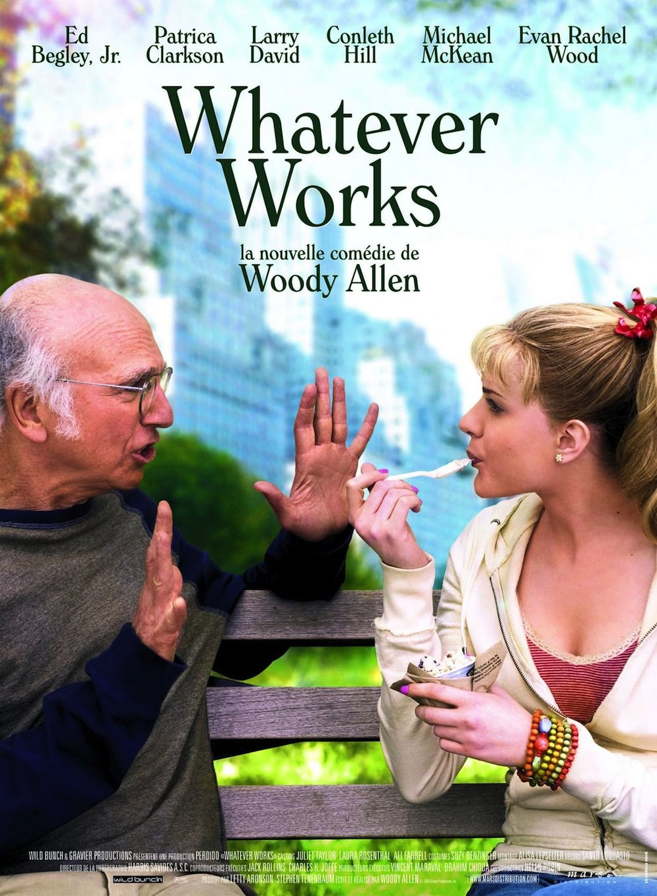
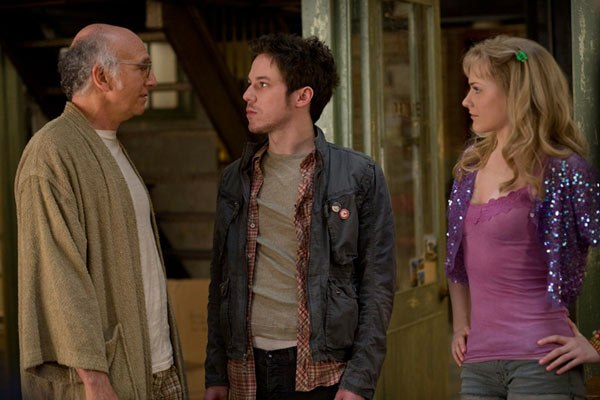

+++
type = "post"
titre = "<em>Whatever Works</em>, Woody Allen"
title = "Whatever Works, Woody Allen"
url = "/whatever-works-allen"
date = "2009-07-05T01:51:52"
Lastmod = "2014-10-28T21:24:15"
cover = "whatever-works-larry-david-woody-allen.jpg"
categorie = [ "À voir" ]
tag = [ "Comédie", "Humour", "Philosophie", "Société" ]
createur = [ "Woody Allen" ]
acteur = [ "Ed Begley Jr.", "Evan Rachel Wood", "Larry David", "Patricia Clarkson" ]
annee = [ "2009" ]
weight = 2009
pays = [ "États-Unis" ]

+++

J&rsquo;ai une confiance absolue en Woody Allen, une confiance aveugle même au point que je suis allé voir <em>Whatever Works</em>, son film 2009, sans même avoir le début du commencement d&rsquo;une idée sur son histoire. Et comme d&rsquo;habitude, la déception ne fut pas au rendez-vous : entre leçon philosophique et comédie bobo à New York, 2009 est un très bon cru, qui tranche de manière assez nette avec le précédent et excellent <em><a href="http://voiretmanger.fr/2008/10/11/vicky-cristina-barcelona-woody-allen/">Vicky Cristina Barcelona</a></em>.

<em>Whatever Works</em> se distingue déjà par le retour à New York, qui est devenue, au fil des films &laquo;&nbsp;la ville de Woody Allen&nbsp;&raquo;, après une pause européenne assez brillante de quatre films, depuis <em>Match Point</em> jusqu&rsquo;à celui de l&rsquo;année dernière. Le cinéaste prend manifestement du plaisir à nous montrer &laquo;&nbsp;sa ville&nbsp;&raquo;, même si le film se passe essentiellement dans un nombre réduit de lieux, et souvent en intérieur. Le retour est aussi celui de ses personnages fétiches, des sortes de bobo new-yorkais. Le retour, enfin, est aussi synonyme de retour à l&rsquo;humour noir très teinté de philosophie.

Tous ces retours signalent un film très &laquo;&nbsp;allenien&nbsp;&raquo;, à la limite même de l&rsquo;autocaricature. Évidemment, le générique n&rsquo;a pas évolué d&rsquo;un iota (on a toujours cette même police blanche sur fond noir, et cette même musique, un vieux morceau de jazz), mais la première scène qui présente quelques amis en train de discuter dans une rue de New York est très caractéristique de ce que l&rsquo;imaginaire collectif retient d&rsquo;un film de Woody Allen. Tous les ingrédients sont réunis : un vieux New-Yorkais intellectuel et aigri, une blonde naïve et de multiples seconds rôles prêts à amorcer les fameux dialogues des films de Woody Allen.

Si Woody Allen ne passe pas devant la caméra, c&rsquo;est comme s&rsquo;il y était. Le personnage principal de <em>Whatever Works</em>, Boris, joué par Larry David, méconnu de ce côté de l&rsquo;océan mais superstar de l&rsquo;autre est en effet un double parfait du réalisateur. Génie misanthrope convaincu de son génie (comme il aime à le répéter, il est quasiment prix Nobel de physique), il veut ignorer le reste de l&rsquo;humanité, guère plus digne que des chenilles rampantes. Dire qu&rsquo;il est désabusé serait un euphémisme et sa conception très noire du monde apporte beaucoup au film, notamment en humour.

<em>Whatever Works</em> est indéniablement très drôle. On est le plus souvent dans le marivaudage le plus simple, l&rsquo;amour étant, comme toujours, la thématique essentielle pour ne pas dire unique du film. Le réalisateur prend un malin plaisir à confronter des personnages très différents (en gros, des intellos new-yorkais et des bouseux du Mississippi) et surtout à transformer les seconds au contact des premiers. Le film semble dire que le contact de New York suffit à transformer une prude chrétienne en une artiste vivant dans un &laquo;&nbsp;ménage à trois&nbsp;&raquo; (en français dans le texte) ou à provoquer le coming-out tardif d&rsquo;un reaganien rigoriste.

Sur le mode du théâtre, les personnages entrent successivement dans le film, dans ce qui ressemble vraiment au plaisir presque puéril du metteur en scène créateur qui peut tout et se permet tout. C&rsquo;est aussi l&rsquo;occasion pour Woody Allen de faire rire et à en croire la salle, c&rsquo;est réussi.

Mais <em>Whatever Works</em> marque son originalité sur deux points. Tout d&rsquo;abord, Boris commence le film immédiatement en nous parlant directement, face à la caméra, comme si la convention cinématographique s&rsquo;interrompait brutalement. Le principe est connu, mais ce qui est intéressant ici, c&rsquo;est que seul Boris agit comme s&rsquo;il avait conscience de l&rsquo;artifice du cinéma, tous les autres personnages le prenant pour un cinglé. Cette spécificité du personnage renforce l&rsquo;idée d&rsquo;un lien entre le réalisateur et le personnage et apporte, en tout cas à mes yeux, un peu d&rsquo;originalité bienvenue.

Mais surtout, le film se distingue par la présence de la philosophie. Peut-être est-ce une déformation de mes trois années de khâgne, mais je n&rsquo;ai pas pu m&rsquo;empêcher de voir de la philosophie dans ce film, avec le principe de base qu&rsquo;énonce le titre : &laquo;&nbsp;Whatever Works&nbsp;&raquo;, soit en gros &laquo;&nbsp;tant que ça marche&nbsp;&raquo;. Quelque part entre le fameux &laquo;&nbsp;<em>Carpe Diem</em>&laquo;&nbsp;, le pragmatisme et le nihilisme nietzschéen, ce principe devient principe de vie selon Boris, et donc selon Woody Allen.

À plusieurs reprises, le film énonce ainsi des morales philosophiques ou des leçons de vie toujours assez noires sur l&rsquo;absence d&rsquo;intérêt de la vie humaine, sur le mal profond inhérent à l&rsquo;humanité et sur le désespoir de toute vie. Le problème de Boris est qu&rsquo;il a conscience de cela, tandis que le reste de l&rsquo;humanité l&rsquo;ignore, ce qui lui vaut tout son mépris. Le film illustre, en tout cas, à merveille la sentence au moins dans le domaine amoureux. Chose on ne peut plus étonnante, Woody Allen se permet même un happy-end qui, stupeur, fonctionne même assez bien !

Cette philosophie plutôt noire, inspirée certainement des présocratiques (mes parties de solitaire pendant les cours de philo m&rsquo;empêchent d&rsquo;aller plus loin), est présente dans toute l&rsquo;œuvre du cinéaste new-yorkais. À ma connaissance, c&rsquo;est néanmoins la première fois qu&rsquo;elle est aussi explicitement présente et importante.

En définitive, les critiques évoquent souvent un Woody Allen mineur. Peut-être, mais un Woody Allen, aussi mineur fut-il, est toujours un bon film et celui-ci ne déroge pas à la règle. Malgré son âge et le nombre de films à son actif, Woody Allen reste définitivement un grand réalisateur à suivre. Rendez-vous est déjà pris pour le film de l&rsquo;année prochaine&#8230;

Je recommande aussi la lecture de la critique sur <strong><a href="http://www.playlistsociety.fr/2009/07/whatever-works-de-woody-allen-910.html">Playlist Society</a></strong>&#8230;

<h3>Vous voulez m&rsquo;aider ?<a href="#footnote_0_1621" id="identifier_0_1621" class="footnote-link footnote-identifier-link" title="&Agrave; propos de la publicit&eacute;&hellip;">1</a></h3>
<ul>
<li><a href="http://www.amazon.fr/gp/product/B002NRBXXG/ref=as_li_ss_tl?ie=UTF8&#038;tag=leblogdenic07-21&#038;linkCode=as2&#038;camp=1642&#038;creative=19458&#038;creativeASIN=B002NRBXXG">Acheter le film en Blu-Ray sur Amazon</a></li>
<li><a href="http://www.amazon.fr/gp/product/B002NRBXX6/ref=as_li_ss_tl?ie=UTF8&#038;tag=leblogdenic07-21&#038;linkCode=as2&#038;camp=1642&#038;creative=19458&#038;creativeASIN=B002NRBXX6">Acheter le film en DVD sur Amazon</a></li>
<li><a href="https://itunes.apple.com/fr/movie/whatever-works/id379470837">Acheter ou louer le film sur l&rsquo;iTunes Store</a></li>
</ul>

<ol class="footnotes"><li id="footnote_0_1621" class="footnote"><a href="http://voiretmanger.fr/soutien/">À propos de la publicité…</a> [<a href="#identifier_0_1621" class="footnote-link footnote-back-link">&#8617;</a>]</li></ol>
