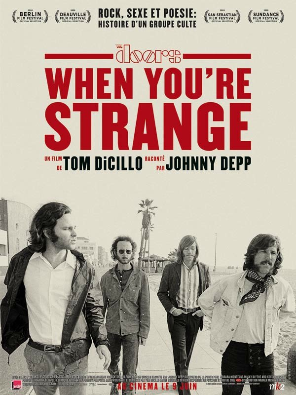
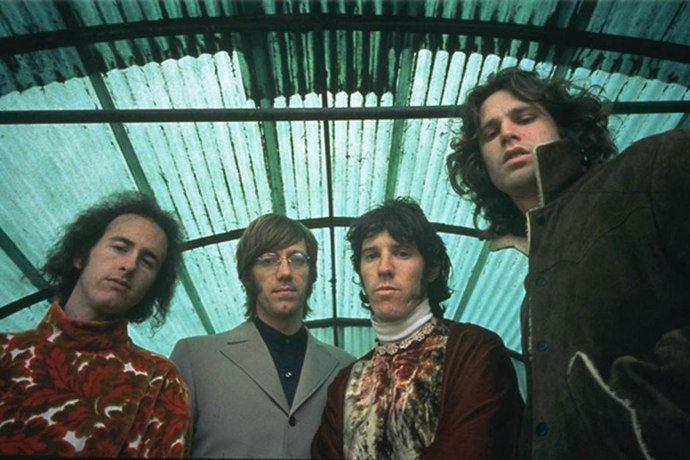
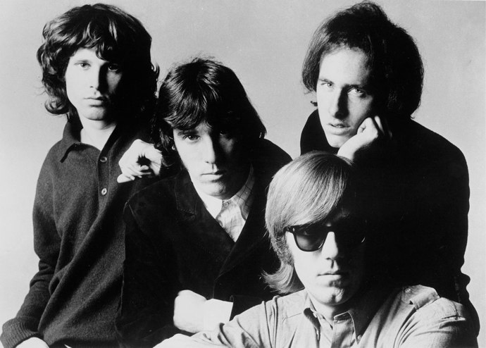

+++
type = "post"
titre = "When You&rsquo;re Strange, Tom DiCillo"
title = "When You're Strange, Tom DiCillo"
url = "/when-you-re-strange-dicillo"
date = "2010-06-09T23:52:55"
Lastmod = "2010-06-10T14:27:26"
cover = "doors-when-you-re-strange-dicillo.jpg"
categorie = [ "À voir" ]
tag = [ "Documentaire", "Drogue", "Légende", "Musique", "Rock", "Société" ]
createur = [ "Tom DiCillo" ]
acteur = [ "Johnny Depp" ]
annee = [ "2010" ]
weight = 2010
pays = [ "États-Unis" ]

+++

The Doors, groupe mythique entré dans la légende avec la mort prématurée de Jim Morrison, son leader, au début des années 1970. Groupe de la contre-culture qui n&rsquo;a symboliquement pas résisté au retour de bâton post-Vietnam. <em>When You&rsquo;re Strange</em>, film de Tom DiCillo, revient sur la courte vie du groupe en s&rsquo;attardant en particulier sur son chanteur aussi imbibé qu&rsquo;illuminé. Le film prend le parti à contre-courant d&rsquo;éviter absolument le biopic en ne présentant que des images d&rsquo;archives. Un documentaire assez brillant, très clair grâce à la narration assurée par la célèbre voix de Johnny Deep. Une voix qui est parfois un peu trop présente et qui couvre un peu trop la musique à mon goût.

<a href="http://www.allocine.fr/film/fichefilm_gen_cfilm=143451.html" target="_blank">

</a>

En s&rsquo;éteignant à Paris en juillet 1971, Jim Morrison est entré dans le club très select des rockeurs morts très jeunes et entrés immédiatement dans la légende. Une entrée immédiate, mais déjà bien préparée lors de sa courte carrière en tant que chanteur et leader du groupe américain The Doors. Depuis sa naissance en 1965 à Los Angeles, le groupe a en effet connu un succès aussi immédiat qu&rsquo;intense, surclassant même aux États-Unis les énormes stars qu&rsquo;étaient les Beatles ou les Rolling-Stones à l&rsquo;époque. Un succès lié en très grande partie à la figure de Jim Morrison, jeune chanteur qui semble pénétré, habité même par la musique. Mais aussi un alcoolique sous l&rsquo;emprise quasiment permanente des drogues dures et qui fait rapidement connaître le groupe pour ses concerts chaotiques où Jim Morrison semblait toujours à deux doigts d&rsquo;y laisser sa peau. Son addiction était telle qu&rsquo;il était du genre incontrôlable : il aura ainsi fallu un an pour enregistrer un des derniers albums, alors qu&rsquo;il n&rsquo;apparaissait plus que saoul, ou drogué. Sur la fin, il a même eu de graves ennuis avec la justice américaine et a été condamné pour atteintes aux bonnes mœurs<a href="#footnote_0_3411" id="identifier_0_3411" class="footnote-link footnote-identifier-link" title="Il fut un temps o&ugrave; montrer ses appareils g&eacute;niteurs &agrave; la t&eacute;l&eacute;vision n&rsquo;&eacute;tait pas le but ultime de toute star qui se respecte, et o&ugrave;, m&ecirc;me, c&rsquo;&eacute;tait strictement interdit. Dingue, non ?">1</a>.

Comme le montre très bien <em>When You&rsquo;re Strange</em>, Jim Morrison est sans doute la première rock-star au sens moderne du terme de l&rsquo;histoire de la musique. C&rsquo;est le premier à s&rsquo;être forgé une image, une légende même, et à profiter et jouer de cette image. Le film montre des fans totalement hystériques hurler à la vue de leur idole (bien avant <em>Twilight</em>, donc…) et prêtes à tout pour approcher voire, consécration ultime, toucher Jim. Certains concerts étaient du coup totalement surréalistes, avec une vingtaine de policiers en permanence autour de la star pour la protéger. Les concerts sont aujourd&rsquo;hui beaucoup mieux organisés, avec des salles dédiées à cet effet, mais à l&rsquo;époque on organisait des concerts un peu où on pouvait, dans un hangar par exemple. Et les spectateurs vivaient de manière très intense les concerts, au point de perdre totalement la raison. Le récit du documentaire évoque à plusieurs reprises l&rsquo;état de transe dans lequel Jim Morrison était pendant les concerts, un état communicatif à en juger par les images d&rsquo;archives présentées par Tom DiCillo. À propos de Jim Morrison, on apprend une foule d&rsquo;autres choses, comme son rejet complet de sa famille, au point que celle-ci apprend l&rsquo;existence des Doors en constatant que le jeune homme sur la pochette de l&rsquo;album ressemblait fort à leur Jim<a href="#footnote_1_3411" id="identifier_1_3411" class="footnote-link footnote-identifier-link" title="Le gar&ccedil;on avait pris soin d&rsquo;indiquer, dans sa biographie officielle : &laquo;&nbsp;Family : dead.&nbsp;&raquo; Pr&eacute;cisons que son p&egrave;re &eacute;tait militaire et a &eacute;crit &agrave; son fils qu&rsquo;il ferait mieux de penser &agrave; un vrai boulot, parce que franchement, il n&rsquo;&eacute;tait pas dou&eacute; au chant. Charmante famille&hellip;">2</a>…

Le documentaire évoquant un groupe, sa musique est évidemment un sujet abordé. <em>When You&rsquo;re Strange</em> évoque ainsi le style si particulier des Doors, un style marqué par l&rsquo;absence de basse remplacée par l&rsquo;orgue si typique des années 1960, un jeu de batterie très présent et hérité du jazz, et une guitare aux influences de flamenco. Sans parler évidemment de la voix si particulière de Jim Morrison, pas forcément mélodique, mais chargée d&rsquo;émotion et très forte. Le documentaire présente de nombreuses images de concert qui montrent à l&rsquo;habitué des concerts contemporains que je suis à quel point les concerts ont changé. Je l&rsquo;ai déjà évoqué, mais les policiers directement sur la scène pour protéger la star m&rsquo;ont vraiment impressionné, autant que la manière avec laquelle ils balancent, littéralement, tous ceux qui osent monter sur la scène. On voit aussi des images lors des enregistrements, l&rsquo;occasion de constater que l&rsquo;implication de Jim dans ses paroles n&rsquo;était pas feinte pour la scène.

Au-delà du groupe, <em>When You&rsquo;re Strange</em> offre un plongeon dans la société américaine des années 1960. Une société encore marquée par la rigueur protestante, mais aussi tiraillée par une extraordinaire volonté de liberté symbolisée par le mouvement hippie et les protestations contre la guerre au Vietnam. The Doors participe naturellement de ce mouvement et promeut l&rsquo;usage des drogues (la fameuse chanson &laquo;&nbsp;<em>Light My Fire</em>&nbsp;&raquo; n&rsquo;est rien d&rsquo;autre), tout en dénonçant la guerre. Jim Morrison est une icône de ces mouvances hippies par son mode de vie : constamment drogué (LSD puis cocaïne au programme), il enchaîne les aventures amoureuses et tient des propos salaces en public. Ses multiples arrestations par la police, souvent pendant les concerts, témoignent quant à elles de l&rsquo;hypocrisie d&rsquo;une société finalement encore très puritaine. Tom DiCillo réussit sans peine à mettre le doigt sur le problème en pointant le fait que les mêmes policiers qui protégeaient le chanteur venaient aussi l&rsquo;arrêter peu après…

<em>When You&rsquo;re Strange</em> est donc un documentaire assez passionnant sur un groupe, son leader de légende et une époque. Je regrette juste que le récit, correctement assumé par Johnny Depp (un peu monocorde quand même), rien que cela, prenne autant de place. Si ce choix permet à tout un chacun de voir le documentaire et le comprendre entièrement sans rien connaître à l&rsquo;histoire américaine des années 1960, il enlève néanmoins de la musique et j&rsquo;aurais préféré entendre encore plus les Doors. Je pense par ailleurs que l&rsquo;image pouvait largement se suffire à elle-même, quitte à rajouter ici ou là quelques mots à l&rsquo;écran. Cela dit, j&rsquo;ai beaucoup apprécié le fait qu&rsquo;il n&rsquo;y ait vraiment que des images d&rsquo;archives. Il faut dire que les Doors étaient apparemment filmés en permanence, quand ce n&rsquo;était pas Jim Morrison, qui a commencé par faire des études cinématographiques, qui se filme jusqu&rsquo;à mettre en scène sa propre mort de manière aussi réaliste que, forcément, troublante, comme s&rsquo;il avait prévu ce qui se passerait.

J&rsquo;en profite d&rsquo;ailleurs pour passer un message à toutes les stars ou futures stars qui me lisent<a href="#footnote_2_3411" id="identifier_2_3411" class="footnote-link footnote-identifier-link" title="Oui, bon, &ccedil;a va&hellip;">3</a> : par pitié, faites-vous filmer de votre vivant, n&rsquo;hésitez pas, filmez tout, ne laissez aucun vide ! Ça ne servira peut-être pas, mais cela épargnera aux générations à venir de pénibles biopics sur vos vies. Merci par avance.

Avis positifs sur la blogosphère, que ce soit <a href="http://www.plan-c.fr/article-when-you-re-strange-les-doors-rallument-leur-flamme-46938124.html">Alexandre</a>, <a href="http://myscreens.fr/2010/cinema/when-youre-strange-la-critique/">Fred</a> ou <a href="http://nivrae.fr/2010/06/01/critique-cinema-when-youre-strange-the-doors/">Nivrae</a>. <a href="http://www.critikat.com/When-You-re-Strange-un-film-sur.html">Critikat</a> tempère en regrettant également la trop forte présence de Johnny Depp. J&rsquo;ai peur que l&rsquo;on soit encore totalement en accord : la narration est de trop, mais elle ne gâche pas pour autant le plaisir du film. Plaisir qui tient finalement beaucoup à Jim Morrison qui n&rsquo;a certainement pas volé son statut de légende…

<ol class="footnotes"><li id="footnote_0_3411" class="footnote">Il fut un temps où montrer ses appareils géniteurs à la télévision n&rsquo;était pas le but ultime de toute star qui se respecte, et où, même, c&rsquo;était strictement interdit. Dingue, non ? [<a href="#identifier_0_3411" class="footnote-link footnote-back-link">&#8617;</a>]</li><li id="footnote_1_3411" class="footnote">Le garçon avait pris soin d&rsquo;indiquer, dans sa biographie officielle : &laquo;&nbsp;<em>Family : dead.</em>&nbsp;&raquo; Précisons que son père était militaire et a écrit à son fils qu&rsquo;il ferait mieux de penser à un vrai boulot, parce que franchement, il n’était pas doué au chant. Charmante famille… [<a href="#identifier_1_3411" class="footnote-link footnote-back-link">&#8617;</a>]</li><li id="footnote_2_3411" class="footnote">Oui, bon, ça va&#8230; [<a href="#identifier_2_3411" class="footnote-link footnote-back-link">&#8617;</a>]</li></ol>
