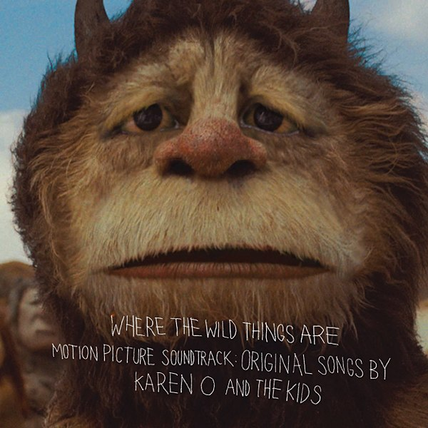
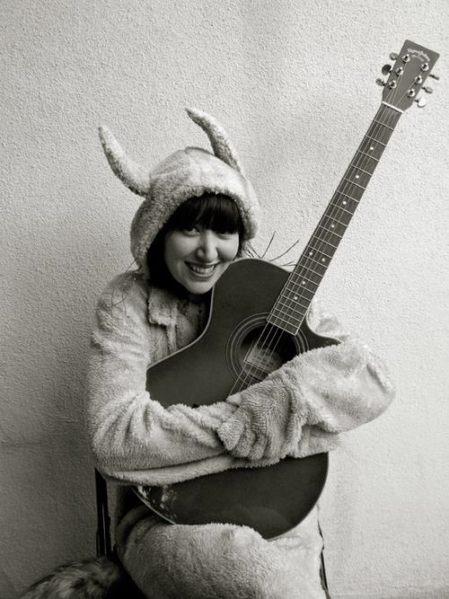
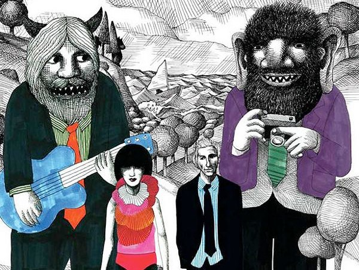

+++
type = "post"
titre = "<em>Where the Wild Things Are</em>, Karen O and the Kids"
title = "Where the Wild Things Are, Karen O and the Kids"
url = "/where-the-wild-things-are-karen-o"
date = "2010-01-31T23:18:52"
Lastmod = "2015-02-06T19:01:27"
cover = "where-the-wild-things-are-karen-o.jpg"
categorie = [ "Musique" ]
tag = [ "Bande-originale", "Rock" ]
createur = [ "Karen O" ]
annee = [ "2009" ]
weight = 2009
pays = [ "États-Unis" ]

+++

Je m&rsquo;intéresse en général assez peu aux bandes originales. En moyenne, on a en effet au choix une compilation de morceaux sans grand intérêt ou une musique &laquo;&nbsp;originale&nbsp;&raquo; qui se limite aux violons pour les scènes d&rsquo;amour et les cuivres pour quand ça va mal. Certaines bandes originales se dégagent nettement du lot, des compilations intelligentes et mêlées d&rsquo;extraits de film (je pense ici à Tarantino bien sûr) ou des créations originales dignes d&rsquo;intérêt. La bande originale de <em><a href="http://voiretmanger.fr/2009/12/18/max-maximonstres-jonze/">Max et les Maximonstres</a></em> écrite par Karen O, chanteuse des Yeah Yeah Yeahs entre dans cette dernière catégorie.

Comme l&rsquo;indique la pochette, Karen O s&rsquo;est accompagnée d&rsquo;enfants. Cela tombe sous le sens pour l&rsquo;adaptation d&rsquo;un livre pour enfants, mais encore fallait-il y penser et surtout éviter le piège du chœur d&rsquo;enfants un peu niais. C&rsquo;est mission réussie sur cet album doté de la même très belle noirceur que le film pour un résultat aux antipodes de la musique de films pour enfants façon Walt Disney. Cette bande originale est même plus proche dans l&rsquo;esprit de celle de <em>La Route</em> de Nick Cave et Warren Ellis, même si elle de termine sur une note plus positive ou lumineuse. L&rsquo;ambiance générale n&rsquo;est pas aux sons légers et pop, mais plutôt à la mélancolie à l&rsquo;image d&rsquo;un titre comme &laquo;&nbsp;<em>Hidaway</em>&laquo;&nbsp;, aussi mélancolique par la musique que par les paroles.

<em>Where the Wild Things Are</em> n&rsquo;est cependant pas un album triste, ou dépressif. Peut être est-ce lié à la présence de voix d&rsquo;enfants, mais il me semble même au contraire parcouru par une forme de joie qui ne se traduit certes pas de manière colorée, mais qui est bien réelle. L&rsquo;amour est célébré à plusieurs reprises au cours de l&rsquo;album au travers du thème &laquo;&nbsp;<em>All is Love</em>&nbsp;&raquo; et ainsi, même si la mélancolie reste présente, elle ne plombe pas l&rsquo;album. On retrouve en fait la dualité d&rsquo;un film pour enfants très adulte et finalement à déconseiller aux plus jeunes. La bande-originale est à l&rsquo;image du film, à la fois très belle, douce, et capable aussi de violence (&laquo;&nbsp;<em>Animal</em>&laquo;&nbsp;) et de noirceur. L&rsquo;écoute de <em>Where the Wild Things Are</em> a quelque chose d&rsquo;angoissant, sans qu&rsquo;il soit forcément possible de mettre des mots sur ce qui provoque cette angoisse. Là encore, je crois que la bande originale colle parfaitement à un film qui angoissait parce qu&rsquo;on le sent imprévisible, on sent que tout peut arriver, que la folie peut s&rsquo;immiscer sans prévenir. La bande originale, comme le film, ne respire pas la stabilité, on les sent au contraire instables. À cet égard, le choix de commencer &laquo;&nbsp;<em>Animal</em>&nbsp;&raquo; avec un extrait du film parmi les plus impressionnants ou les maximonstres révèlent une nature bien plus sombre que ce que leurs peluches laissaient entendre est très significatif de cette angoisse permanente du disque. Le titre est d&rsquo;ailleurs certainement le plus noir du disque, avec ses cris sauvages qui rappellent la monstruosité des créatures. Pas vraiment une musique adaptée pour un dessin animé, mais justement <em>Max et les Maximonstres</em> n&rsquo;est pas un dessin animé.

La voix de Karen O se fait souvent douce, comme pour une comptine, à l&rsquo;image du titre d&rsquo;ouverture, mais pas seulement. Sur &laquo;&nbsp;<em>Worried Shoes</em>&laquo;&nbsp;, cette voix douce est aussi inquiète que le titre le laissait entrevoir. Souvent, ce sont les voix des enfants que l&rsquo;on entend. Ces enfants ne sont pas très nombreux, l&rsquo;idée n&rsquo;étant surtout pas de refaire la bande originale des <em>Choristes</em>. Non, ici, les enfants n&rsquo;ont pas forcément les plus belles voix du monde (si tant est que les plus belles voix ressemblent à celles de Jean-Baptiste Maunier, ce qui reste à prouver), mais ils ont surtout des voix naturelles, franches, des voix qui sonnent vrai. Ils ne chantent pas forcément juste, parfois ils se contentent même de cris (&laquo;&nbsp;<em>Rumpus</em>&laquo;&nbsp;), mais c&rsquo;est toujours très beau et émouvant. Les paroles n&rsquo;accompagnent pas systématiquement le chant et le chœur comme la chanteuse se contentent parfois d&rsquo;une mélodie sans mettre de mots dessus, ce qui n&rsquo;est pas pour me déplaire.

L&rsquo;instrumentation n&rsquo;est pas imposante ici, sans tomber pour autant dans le minimalisme. Le piano est très présent, régulièrement accompagné de la guitare (sèche le plus souvent) et d&rsquo;autres instruments encore. L&rsquo;orchestre symphonique n&rsquo;a, on l&rsquo;aura compris pas sa place ici et c&rsquo;est une très bonne chose. Comme il est souvent d&rsquo;usage sur les bandes originales, de courts extraits sonores du film sont ajoutés ici ou là pour former de petites touches subtiles fort sympathiques. Il s&rsquo;agit essentiellement de courts extraits de dialogue qui ne sont pas balancés au hasard, mais servent plutôt à introduire tel ou tel titre. Le film n&rsquo;écrase jamais vraiment la musique, même si, bien sûr, cet album reste l&rsquo;accompagnement d&rsquo;un film et est donc formaté en ce sens.

<em><a href="http://voiretmanger.fr/2009/12/18/max-maximonstres-jonze/">Max et les Maximonstres</a></em> était excellent sur les écrans. Pendant la séance, mon attention n&rsquo;avait pas été spécialement attirée par la musique, mais quand j&rsquo;y repense, je me souviens effectivement d&rsquo;une ambiance sonore atypique, sans forcément pouvoir l&rsquo;expliquer. Après avoir écouté l&rsquo;album réalisé par Karen O pour accompagner le film, je peux le faire : si le film était excellent, sa bande-originale l&rsquo;est encore plus. Il ne s&rsquo;agit nullement d&rsquo;un album au rabais, composé à la va-vite pour accompagner le film. Bien au contraire, <em>Where the Wild Things Are</em> est un album passionnant, aussi beau que terrifiant, à l&rsquo;image du film.

À lire également, les très bonnes critiques de <a href="http://thevioletteroll.wordpress.com/2010/01/11/karen-o-and-the-kids-where-the-wild-things-are/">Mauve</a> et <a href="http://www.playlistsociety.fr/2010/01/karen-o-and-kids-where-wild-things-are.html">Benjamin</a>.

<h3>Vous voulez m&rsquo;aider ?</h3>
<ul>
<li><a href="http://www.amazon.fr/gp/product/B002M2N9MA/ref=as_li_ss_tl?ie=UTF8&tag=leblogdenic07-21&linkCode=as2&camp=1642&creative=19458&creativeASIN=B002M2N9MA">Acheter l&rsquo;album en CD sur Amazon</a> (<a href="http://www.amazon.fr/gp/product/B002Q3OEP6/ref=as_li_ss_tl?ie=UTF8&tag=leblogdenic07-21&linkCode=as2&camp=1642&creative=19458&creativeASIN=B002Q3OEP6" target="_blank">téléchargement MP3</a>)</li>
<li><a href="http://itunes.apple.com/fr/album/where-wild-things-are-motion/id332268908">Acheter l&rsquo;album sur l&rsquo;iTunes Store</a></li>
</ul>

