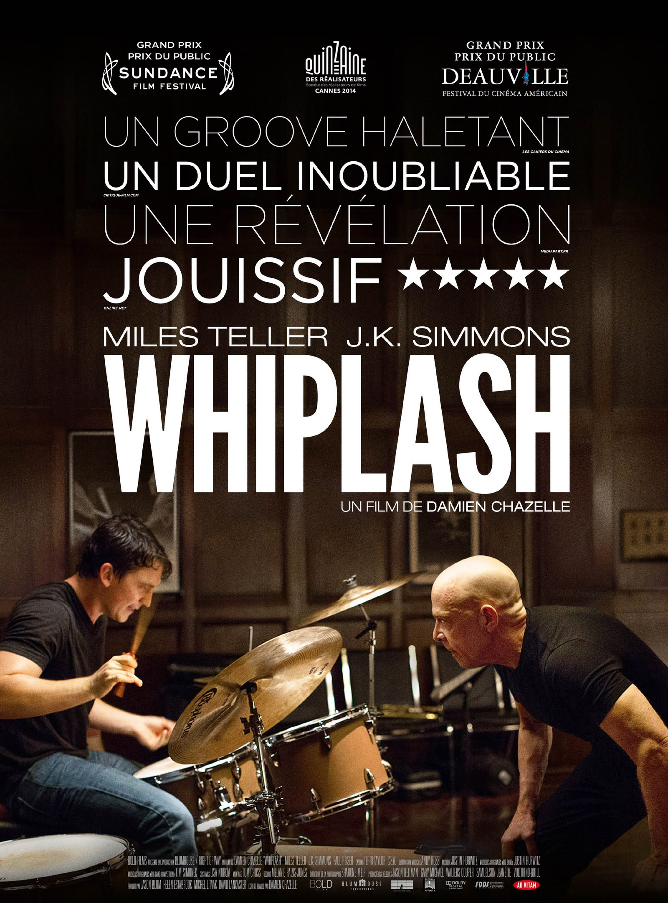
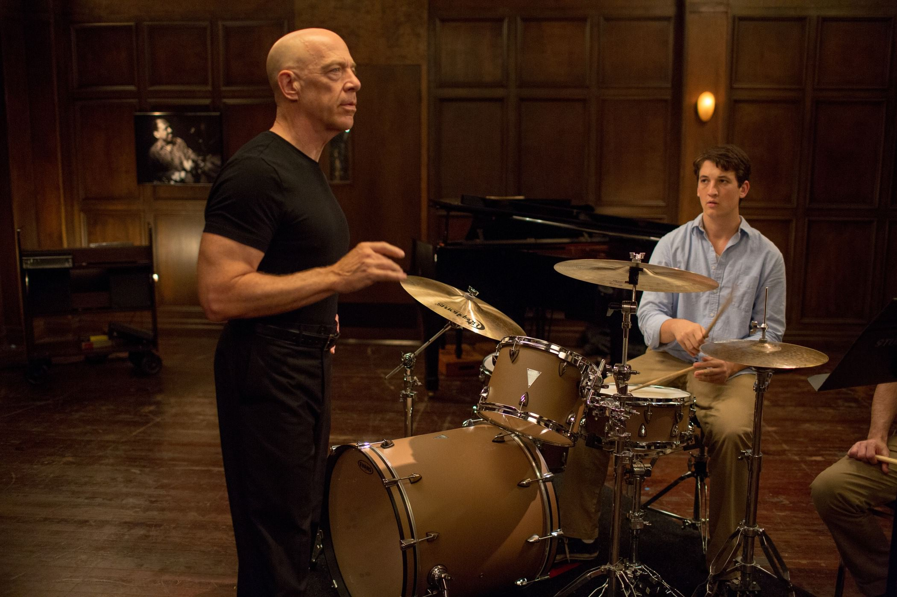
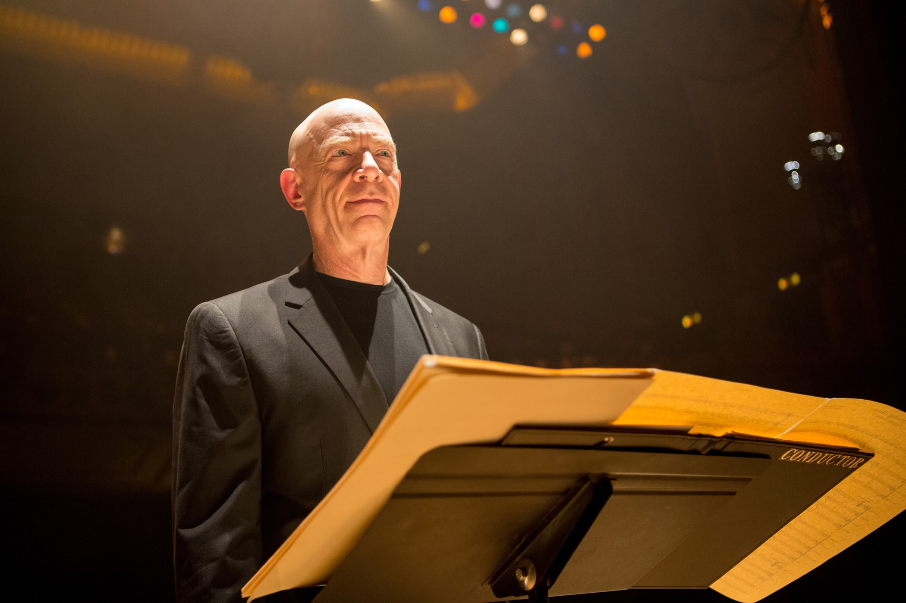

+++
type = "post"
titre = "<em>Whiplash</em>, Damien Chazelle"
title = "Whiplash, Damien Chazelle"
url = "/whiplash-chazelle"
date = "2014-12-28T15:56:44"
Lastmod = "2015-05-04T17:06:24"
cover = "whiplash-miles-teller.jpg"
categorie = [ "À voir" ]
tag = [ "Drame", "Enseignement", "Jazz", "Musique", "Sorties du mois" ]
createur = [ "Damien Chazelle" ]
acteur = [ "J.K. Simmons", "Miles Teller", "Paul Reiser" ]
annee = [ "2014" ]
weight = 2014
pays = [ "États-Unis" ]

+++

Pour son premier long-métrage, Damien Chazelle a choisi un sujet original en filmant un apprentissage, dans la douleur, de l&rsquo;art difficile de la batterie jazz. Résumé ainsi, <em>Whiplash</em> ne donne pas forcément envie, mais on aurait tort de s&rsquo;arrêter à des préjugés sur l&rsquo;instrument ou son usage : avec deux personnages parfaitement bien écrits et remarquablement bien interprétés, le film est d&rsquo;une intensité rare au cinéma. La confrontation du maître et de l&rsquo;élève donne lieu à quelques scènes épuisantes, et c&rsquo;est une excellente chose : le jeune cinéaste a réussi à capter toute l&rsquo;énergie dégagée par son batteur et c&rsquo;est une vraie réussite. Porté par une excellente <a href="http://www.amazon.fr/gp/product/B00MZ3WMMY/ref=as_li_ss_tl?ie=UTF8&amp;tag=leblogdenic07-21&amp;linkCode=as2&amp;camp=1642&amp;creative=19458&amp;creativeASIN=B00MZ3WMMY">bande originale</a> composée de quelques classiques du jazz, <em>Whiplash</em> est sans conteste une des meilleures surprises de cette fin d&rsquo;année, à voir absolument !

Comme beaucoup d&rsquo;autres jeunes de son âge, Andrew, 19 ans, a un rêve. Mais contrairement à la majorité de ses pairs, son rêve est un petit peu particulier, puisqu&rsquo;il ne rêve que d&rsquo;une chose : devenir un excellent batteur jazz, capable de rivaliser avec les plus grandes légendes du genre. Depuis qu&rsquo;il est tout petit, il ne rêve que de cela et même si sa famille n&rsquo;a jamais fait de musique, il est non seulement obstiné, mais en plus assez doué. Quand <em>Whiplash</em> commence, on le voit répéter dans l&rsquo;école où il prend des cours pour se professionnaliser et on sent dès cette première scène que c&rsquo;est bien plus qu&rsquo;un futur métier, c&rsquo;est d&rsquo;abord et avant tout une passion. Une passion qui le pousse à tout faire pour atteindre son but, quitte à se mettre en danger. Damien Chazelle introduit vite le deuxième élément déterminant de son film, à savoir Terence Fletcher, le professeur le plus impitoyable et le plus craint de l&rsquo;école, mais aussi le meilleur d&rsquo;entre tous, celui qui découvre le plus de talents et qui a le plus de chance de les porter très loin. Andrew s&rsquo;est inscrit dans cette école, la meilleure du pays selon lui, presque uniquement pour être remarqué par ce professeur, et c&rsquo;est naturellement ce qui arrive au début du film. Le mentor remarque le don naturel du jeune homme et l&rsquo;invite à joindre son groupe de jazz, le plus exigeant de l&rsquo;école et vainqueur d&rsquo;une multitude de concours. Tout semble aller pour le mieux, mais <em>Whiplash</em> interroge cet engagement aveugle d&rsquo;Andrew pour la musique. Le personnage est convaincu de son talent, mais il est vite rabaissé par Fletcher, dont l&rsquo;exigence légendaire n&rsquo;a d&rsquo;égal que sa tendance à briser les élèves en les poussant si loin que certains en viennent à se suicider. Persuadé d&rsquo;être à sa place, le personnage de Damien Chazelle sert les dents et endure tout, jusqu&rsquo;au sang. À plusieurs reprises, une scène se termine avec une batterie maculée de sang, une image très forte qui en dit long sur l&rsquo;engagement d&rsquo;Andrew. Face à cette violence qui est d&rsquo;autant plus forte qu&rsquo;il se l&rsquo;inflige à lui-même, on peut lever les yeux au ciel, mais on peut aussi saluer son engagement. Damien Chazelle ne tranche pas, même si la fin va dans un sens que l&rsquo;on se gardera bien de dévoiler ici.

Ce traitement, que l&rsquo;on pourrait qualifier de neutre, est aussi celui qui est réservé au personnage de Terence Fletcher, le professeur tortionnaire. Incontestablement, c&rsquo;est l&rsquo;un des personnages les plus intenses que l&rsquo;on ait vu cette année au cinéma, car son enseignement n&rsquo;est pas du tout tendre et respectueux. Plutôt que d&rsquo;encourager ses élèves, il les traite de tous les noms et souvent d&rsquo;insultes qui tournent autour de leur prétendue homosexualité, quand il ne s&rsquo;en prend pas violemment à leurs parents. Même s&rsquo;il n&rsquo;en vient jamais au physique, il engueule ses élèves jusqu&rsquo;à les faire craquer et ces musiciens professionnels qui ont souvent une vingtaine d&rsquo;années pleurent comme des madeleines… quand ils ne se suicident pas. Face à un tel portrait, on pourrait croire que <em>Whiplash</em> condamne vivement ce personnage, mais les choses sont plus complexes. En effet, cette méthode est pratiquement barbare, mais elle donne aussi des résultats et les élèves l&rsquo;acceptent finalement, presque comme une nécessité. D&rsquo;ailleurs, le professeur s&rsquo;en justifie lui-même dans une scène où il explique qu&rsquo;il faut pousser les gens au-delà de leurs limites pour atteindre le génie des grands musiciens de jazz. Au total, le personnage imaginé par Damien Chazelle n&rsquo;est pas unicolore et il fallait un acteur suffisamment doué pour en incarner les différentes facettes. On peut dire que le cinéaste est bien tombé en choisissant J.K. Simmons : l&rsquo;acteur trop souvent cantonné aux seconds rôles est génial dans ce rôle de professeur sévère, pour ne pas dire violent. Il est toujours crédible et ne tombe jamais dans la caricature, mais il s&rsquo;exprime avec une violence incroyable et il est vraiment parfait pour le rôle. Face à lui, il fallait un jeune acteur suffisamment présent à l&rsquo;écran pour ne pas être écrasé dans le duo qu&rsquo;ils forment, et là encore, Damien Chazelle a trouvé la bonne personne. Miles Teller a déjà bénéficié d&rsquo;un coup de projecteur grâce à <a href="/divergente-burger/" title="Divergente, Neil Burger"><em>Divergente</em></a>, mais on retiendra plutôt sa participation dans ce film. Il est à l&rsquo;image de <em>Whiplash</em> : sa présence intense crève l&rsquo;écran et on a hâte de voir ce que la suite de sa carrière nous réserve.

Le sujet de <em>Whiplash</em> pourrait effrayer, mais ce serait une erreur. Après avoir vu ce film, vous allez probablement considérer le jazz en général, et la batterie jazz en particulier, sous un autre jour. Damien Chazelle propose une histoire extrêmement intense, mais aussi passionnante : on ne sort jamais vraiment de la confrontation entre le maître et l&rsquo;élève, et c&rsquo;est un vrai plaisir de la suivre. On pourrait reprocher une mise en scène un peu lourde, mais il est incontestable qu&rsquo;elle est aussi très efficace et plutôt bien vue. Ajoutons à cela quelques morceaux de jazz vraiment excellents — à (re)découvrir sur la <a href="http://www.amazon.fr/gp/product/B00MZ3WMMY/ref=as_li_ss_tl?ie=UTF8&amp;tag=leblogdenic07-21&amp;linkCode=as2&amp;camp=1642&amp;creative=19458&amp;creativeASIN=B00MZ3WMMY">bande originale</a> qui accompagne le film — et on obtient un excellent long-métrage. Comme son jeune acteur, Damien Chazelle est un réalisateur que l&rsquo;on ne perdra de vue, tant ce premier film est bien maîtrisé et convaincant. <em>Whiplash</em> est un coup de cœur à ne pas rater !

<h3>Vous voulez <a href="/soutien/">m&rsquo;aider</a> ?</h3>
<ul>
<li><a href="http://www.amazon.fr/gp/product/B00SIYDL5Q/ref=as_li_ss_tl?ie=UTF8&amp;tag=leblogdenic07-21&amp;linkCode=as2&amp;camp=1642&amp;creative=19458&amp;creativeASIN=B00SIYDL5Q">Acheter le film en Blu-ray sur Amazon</a></li>
<li><a href="http://www.amazon.fr/gp/product/B00SIYDJV2/ref=as_li_ss_tl?ie=UTF8&amp;tag=leblogdenic07-21&amp;linkCode=as2&amp;camp=1642&amp;creative=19458&amp;creativeASIN=B00SIYDJV2">Acheter le film en DVD sur Amazon</a></li>
<li><a href="https://itunes.apple.com/fr/movie/whiplash/id964052958?uo=4&amp;at=11lvtR">Acheter ou louer le film sur l&rsquo;iTunes Store</a></li>
</ul>

