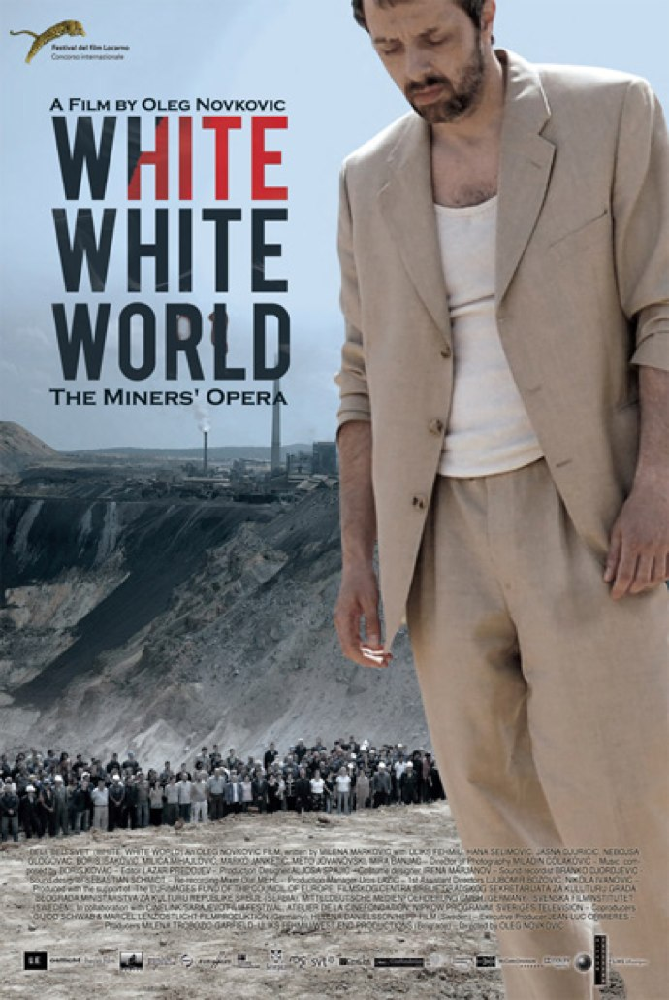
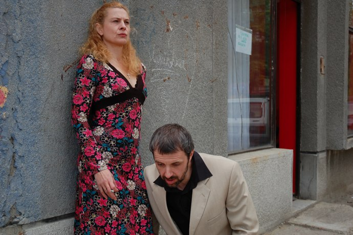
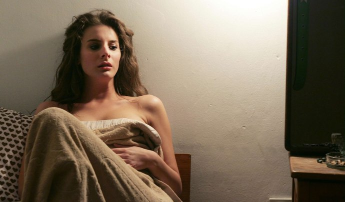

+++
type = "post"
titre = "White White World, Oleg Novkovic"
title = "White White World, Oleg Novkovic"
url = "/white-white-world-novkovic"
date = "2010-12-20T00:25:09"
Lastmod = "2010-12-18T16:42:21"
cover = "beli-beli-svet.jpg"
categorie = [ "À voir" ]
tag = [ "Amour", "Arcs 2010", "Famille", "Festival", "Musique", "Société", "Tragedie" ]
createur = [ "Oleg Novkovic" ]
annee = [ "2011" ]
weight = 2011
pays = [ "Serbie" ]

+++

<a href="http://www.lesarcs-filmfest.com/2010/accueil/">

</a>

&laquo;&nbsp;L&rsquo;opéra des mineurs&nbsp;&raquo; sous-titre l&rsquo;affiche de <em>White White World</em>, dernier film du cinéaste serbe Oleg Novkovic. Si ce sous-titre paraît mystérieux, il s&rsquo;éclaire quand on sait que le film est partiellement chanté avec même la présence d&rsquo;un chœur comme on le devine sur l&rsquo;affiche. Mais l&rsquo;opéra est aussi lié à l&rsquo;histoire du film, ancrée dans la tragédie antique autant que dans l&rsquo;actualité d&rsquo;une ville en crise. <em>White White World</em> n&rsquo;est pas sans intérêt, mais son ton décalé ne plaira pas à tout le monde.

<a href="http://www.allocine.fr/film/fichefilm_gen_cfilm=184276.html">

</a>

King est patron d&rsquo;un bar à Bor, Serbie. Ancien mineur dans l&rsquo;immense mine de cuivre de la ville, il s&rsquo;est reconverti comme beaucoup d&rsquo;autres habitants suite à la fermeture de l&rsquo;exploitation minière. Le boulot se passe bien, mais voilà que ressurgit son passé en la présence de Ruzica, une femme avec laquelle il a eu une affaire quelques années auparavant. Suite à cette affaire, Ruzica avait tué son mari qui voulait se venger en tuant King, son meilleur ami. Ce meurtre a valu à Ruzica quelques années de prison. En sortant, même si elle aime toujours King, elle préfère épouser Whithie, l&rsquo;homme qui l&rsquo;a aidé avant et pendant la prison, un homme qui l&rsquo;aime et qui lui permet de reconstruire une famille. Ruzica a en effet une fille, Rosa, qui est alors en fin d&rsquo;adolescence. La jeune fille boit, se drogue et couche un peu avec le premier venu. Un soir, elle finit au bar de King et ce dernier est immédiatement séduit par cette fille qui lui rappelle sans doute la Ruzica jeune qu&rsquo;il a aussi aimé. Mais King ne veut pas s&rsquo;attacher, il profite de la vie sans se poser de questions, préférant fuir sur sa moto plutôt que de s&rsquo;y confronter. Or voilà que Rosa s&rsquo;attache à lui…

<em>White White World</em> est un drame familial assez classique où les générations se croisent, tout comme les couples actuels ou anciens. Le retour de Ruzica dérange tout et casse l&rsquo;équilibre précaire qui s&rsquo;était établi au sein de la famille élargie. Équilibre qui est présenté au début du film, notamment par les courses effectuées par le grand-père alcoolique. Ruzica revenue, le passé explose : le frère de son mari veut la tuer pour se venger, King ne veut pas en entendre parler, sa fille se serait bien passée d&rsquo;une mère qui n&rsquo;a jamais vraiment fait preuve d&rsquo;amour envers elle, etc. Très vite, les problèmes s&rsquo;accumulent et le film s&rsquo;enfonce dans la noirceur d&rsquo;un drame qui tourne à la tragédie. Les anciennes affaires de sexe ressurgissent et des hommes se découvrent brutalement pères. Rosa est l&rsquo;épicentre des problèmes dans le film : c&rsquo;est elle qui séduit King, elle qui fréquente un copain drogué qu&rsquo;elle utilise pour se droguer ou passer le temps sans l&rsquo;aimer pour autant alors que lui est fou amoureux, elle aussi qui va contraindre sa mère à se sacrifier à nouveau dans le déchaînement de violence final. Ajoutons à cela une pincée d&rsquo;inceste et on obtient un film extrêmement noir, peut-être même un peu trop. Avouons-le, on finit par se lasser de ce déchaînement de problèmes comme si tout devait nécessairement mal se passer dans cette famille, comme si l&rsquo;espoir d&rsquo;une amélioration n&rsquo;était même pas permis.

Trop de noirceur, peut-être, mais <em>White White World</em> respecte bien son sous-titre en cela. On retrouve, dans cet accablement total de tous les personnages du film, quelque chose du destin tragique ou de la volonté divine, c&rsquo;est selon. Ruzica est à cet égard une vraie héroïne tragique avec son sacrifice final, tandis que King est puni physiquement de n&rsquo;avoir pas su regarder correctement ceux qui l&rsquo;entourent, de n&rsquo;avoir pas accepté la vérité ou de ne pas supporter la vision du présent. Rosa est également punie par la perte de tous ceux qu&rsquo;elle aimait, ou tous ceux qui l&rsquo;aimaient : elle finira absolument seule, abandonnée par le sort. C&rsquo;est un peu beaucoup, mais Oleg Novkovic n&rsquo;a jamais souhaité proposer un documentaire sur Bor, ville décidément à la mode dans le cinéma serbe. L&rsquo;arrière-plan social est aussi présent, mais contrairement à <em><a href="/2010/12/20/tilva-ros-lezaic/">Tilva Roš</a></em>, <em>White White World</em> ne l&rsquo;explicite jamais : la crise que connaît la ville suite à la fermeture de la mine est visible sur certains plans, mais il n&rsquo;en sera jamais question. On voit ainsi des rassemblements ouvriers, des manifestations, mais c&rsquo;est tout et le film aurait tout aussi bien pu se passer dans une autre ville.

Mais si <em>White White World</em> s&rsquo;éloigne aussi du réalisme documentaire, c&rsquo;est par la présence de séquences chantées. Chaque personnage important a ainsi droit à une chanson qui lui permet d&rsquo;exprimer plus justement ce qu&rsquo;il ressent vraiment. Ce sont des chansons assez simples, plutôt tristes, on s&rsquo;en doute, chantées en serbe bien sûr, avec une musique des Balkans assez classique. Dans l&rsquo;esprit, ces moments chantés rappellent ce qu&rsquo;avait fait Christophe Honoré avec ses <em>Chansons d&rsquo;amour</em> : ce sont aussi les acteurs qui chantent, ils n&rsquo;ont donc pas forcément de magnifiques voix, mais le résultat est plus naturel, si tant est qu&rsquo;une chanson dans un film puisse être qualifiée de naturel. Cet aspect-là de <em>White White World</em> n&rsquo;est pas le plus réussi, même s&rsquo;il crée en effet une ambiance qui évoque de loin l&rsquo;opéra. C&rsquo;est surtout le cas pour le plan final composé d&rsquo;une immense chorale de mineurs devant ce qui reste de leur mine, à savoir un vaste trou vide et inutile. L&rsquo;appréciation des chants sera affaire de goûts, mais il est vrai que ce choix procure au film une impression générale de décalage qui surprend et fait l&rsquo;originalité de <em>White White World</em> : on a parfois le sentiment que le film est aussi drogué que Rosa et son copain. Et après tout, ce n&rsquo;est pas forcément une mauvaise chose.

Sentiment mitigé face à <em>White White World</em>, cet &laquo;&nbsp;opéra des mineurs&nbsp;&raquo; serbes. La tragédie que vit cette famille est un peu trop complète pour ne pas considérer que le film en fait un peu trop dans le registre des malheurs qui n&rsquo;arrivent jamais seuls. En même temps, le film se range explicitement du côté de l&rsquo;opéra et on peut aussi considérer que ces malheurs sont simplement le signe de la tragédie, le genre. Oleg Novkovic a fait le choix de faire chanter ses personnages, un choix surprenant au premier abord, mais qui se révèle assez malin à la fois pour renforcer l&rsquo;opéra et pour offrir à son film un décalage original.

<em>Sortie en salles à une date inconnue</em>

