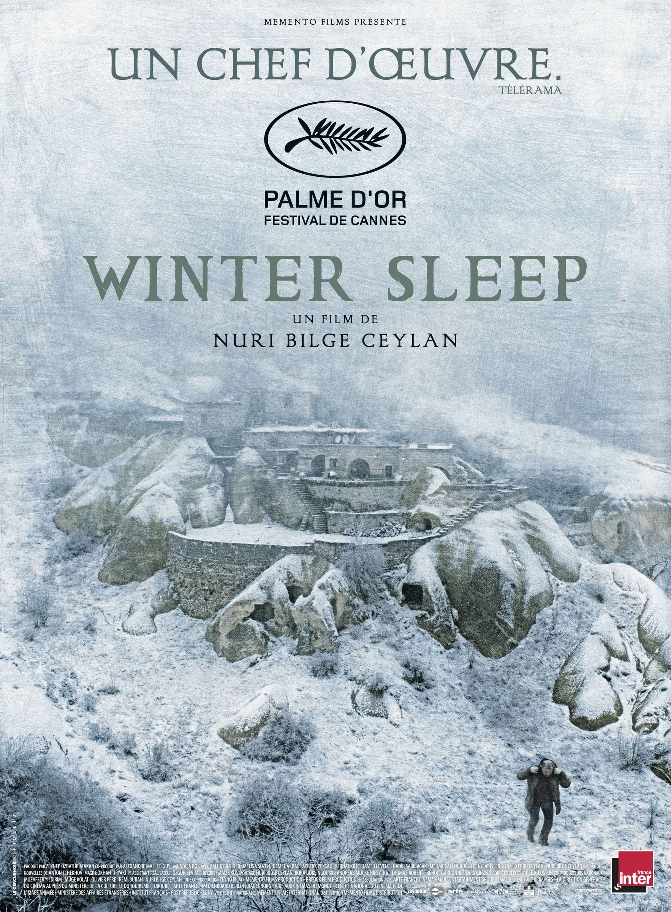
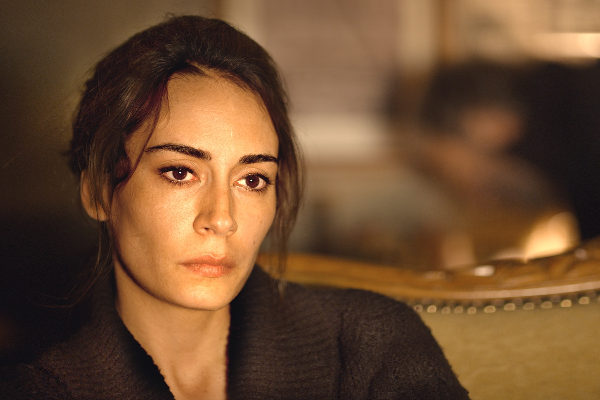

+++
type = "post"
titre = "<em>Winter Sleep</em>, Nuri Bilge Ceylan (Palme d&rsquo;or 2014)"
title = "Winter Sleep, Nuri Bilge Ceylan (Palme d'or 2014)"
url = "/winter-sleep-ceylan"
date = "2014-08-10T02:07:00"
Lastmod = "2014-08-11T10:35:34"
cover = "winter-sleep.jpg"
categorie = [ "À voir" ]
tag = [ "Acteurs", "Ambiance", "Amour", "Drame", "Famille", "Festival de Cannes", "Morale", "Palme d'or", "Philosophie", "Sorties du mois", "Vie" ]
createur = [ "Nuri Bilge Ceylan" ]
acteur = [ "Ayberk Pekcan", "Demet Akbağ", "Haluk Bilginer", "Melisa Sözen" ]
annee = [ "2014" ]
weight = 2014
saga = [ "Palmes d'or" ]
pays = [ "Turquie" ]
original = "Kış Uykusu"

+++

Fidèle à sa réputation, le Festival de Cannes a, cette année encore, récompensé de sa plus haute distinction un film exigeant. Sur plus de trois heures, le cinéaste turc Nuri Bilge Ceylan raconte l&rsquo;histoire d&rsquo;un ancien comédien devenu propriétaire d&rsquo;un hôtel au cœur d&rsquo;Anatolie en plein hiver. Résumé ainsi, <em>Winter Sleep</em> ferait fuir même le cinéphile le plus enthousiaste, mais la Palme d&rsquo;or 2014 n&rsquo;est absolument pas le film vide et chiant que l&rsquo;on pourrait imaginer. Certes, le réalisateur sait prendre son temps et poser une ambiance plutôt qu&rsquo;une intrigue, mais on ne s&rsquo;ennuie jamais pendant le film, à tel point que l&rsquo;on est presque surpris quand la séance se termine. <em>Winter Sleep</em> est un film bavard plein de conversations passionnantes, une œuvre dense, belle et terrifiante, une vraie réussite que vous auriez tort de rater sous prétexte qu&rsquo;elle dure un peu longtemps.

Dès les premiers plans, Nuri Bilge Ceylan pose un élément clé de son film : le décor, et en l&rsquo;occurence les terres désolées d&rsquo;Anatolie. On est au cœur de l&rsquo;hiver, et la nature semble presque absente, comme morte et même les maisons ne font rien pour égayer ce paysage désert. <em>Winter Sleep</em> se déroule en Cappadoce, une région à l&rsquo;est de la Turquie où l&rsquo;homme a construit sous la terre, à une époque où il fallait se protéger contre d&rsquo;éventuelles invasions. Rien de tel ici, mais les troglodytes font beaucoup dans cette ambiance particulière qui s&rsquo;impose très vite. Avant même que les personnages apparaissent, avant même que l&rsquo;intrigue ne se mette en place, on sent une violence sourde dans cet environnement qui semble hostile à l&rsquo;homme. Aydin, le personnage principal, est le propriétaire d&rsquo;un hôtel perdu dans cette région assez touristique. Cet ancien acteur de théâtre qui a connu apparemment le succès bien des années auparavant est venu se retirer ici, pour accueillir des touristes et pour écrire. Il s&rsquo;est mis en tête de raconter l&rsquo;histoire du théâtre turc et il publie chaque semaine un éditorial dans un journal local. Une vie paisible partagée avec Nihal, son épouse bien plus jeune que lui, et Tecla, sa sœur qui vient de divorcer quand commence <em>Winter Sleep</em>. Une vie que l&rsquo;on imagine tranquille, mais qui est présentée immédiatement sous le signe des tensions. Nuri Bilge Ceylan commence d&rsquo;ailleurs par évoquer un fait divers sans importance en soi, mais qui va cristalliser la majorité de l&rsquo;intrigue par la suite. Une pierre lancée par un garçon, une vitre brisée et un conflit avec les parents qui ne paient pas leurs loyers : il suffit au réalisateur de quelques minutes et quelques plans pour prévenir les spectateurs. Tout n&rsquo;est pas rose dans cette Anatolie sauvage et si Aydin est un homme riche qui semble généreux, ce personnage est d&rsquo;entrée présenté de manière beaucoup plus complexe. Puisque la durée ne lui fait pas peur, Nuri Bilge Ceylan a tout le temps de raconter beaucoup de choses. De fait, <em>Winter Sleep</em> repose sur un scénario finalement plus complexe qu&rsquo;il ne pouvait en avoir l&rsquo;air : il y a la gestion de l&rsquo;hôtel, mais aussi les problèmes avec la famille du garçon qui est trop pauvre pour payer ses loyers, mais au fond, l&rsquo;essentiel est ailleurs.

C&rsquo;est dans les pièces confortablement meublées de l&rsquo;hôtel troglodytique que le plus important se déroule : ces pièces isolées par la rudesse de l&rsquo;hiver et par l&rsquo;isolation géographique deviennent le théâtre de conflits familiaux et surtout d&rsquo;une mise à nu pour les trois personnages principaux. Aydin est un ancien acteur, comme il ne manque pas de le rappeler à quiconque s&rsquo;intéresse à lui, et il est encore un très bon acteur. Enjoué et commerçant avec les clients, il est aussi un homme droit et moral qui passe la majorité de ses journées à penser en écrivant ses éditoriaux. En apparence, il est un homme bon et irréprochable, mais on sent très vite que ce n&rsquo;est qu&rsquo;une apparence. Le personnage principal de <em>Winter Sleep</em> est aussi un être insensible et odieux, qui ne veut pas s&rsquo;occuper des affaires un peu sinistres liées à ces locations et qui préfère reporter la faute sur Hidayet, son homme à tout faire, et sur un système qui conduirait à l&rsquo;envoi automatique d&rsquo;un huissier en cas d&rsquo;impayé. Il est apparemment très riche, l&rsquo;argent n&rsquo;a aucune importance pour lui, mais il se permet des jugements de valeur sur les pauvres, critiquant leur manque de sens de l&rsquo;esthétisme, leurs chaussures boueuses ou encore leurs jardins mal entretenus. Nuri Bilge Ceylan dresse un portrait peu flatteur de cet homme qui semble ne trouver de plaisir qu&rsquo;en écrivant des articles moraux où il se permet de juger la religion sous le seul prisme de l&rsquo;imam du village, obséquieux et un peu sale. Cet homme qui a aussi enfermé sa femme, lui retirant <em>de facto</em> toute autonomie, toute raison de vivre. Certaines scènes de <em>Winter Sleep</em> sont si intenses qu&rsquo;elles sont gênantes : on est mal à l&rsquo;aise face à la violence psychologique de ce mari qui retire à sa femme ce qui lui permettait de vivre. Il le fait pour de bonnes raisons, certes, mais comme l&rsquo;exprime très bien sa femme, sa bonté et sa morale lui servent de prétexte pour étouffer les autres. Pendant le film, quelques scènes majeures atteignent ainsi des niveaux rarement vus au cinéma. Tous ces dialogues, tantôt entre Aydin et sa femme, tantôt avec sa sœur qui finit par lui dire ses quatre vérités au cours d&rsquo;une scène presque éprouvante, tantôt encore avec cet instituteur qui a le malheur de critiquer ses motivations, tous ces dialogues sont autant de moyens de mettre à nu pas seulement le personnage principal, mais aussi tous les autres personnages imaginés par Nuri Bilge Ceylan.

C&rsquo;est peut-être le plus surprenant : <em>Winter Sleep</em> nous tient en haleine pendant plus de trois heures avec des personnages qui sont tous, sans exception, insupportables. À des degrés divers, ils sont à la fois des victimes, et en même temps des responsables de leurs propres maux. La femme rejette aussi son mari quand il veut l&rsquo;aider, la sœur se permet de critiquer tout en étant dans la passivité et l&rsquo;orgueil de la famille pauvre finit par les perdre. Si l&rsquo;on ne s&rsquo;ennuie pas, et mieux, si l&rsquo;on est happé par ces récits, c&rsquo;est bien aussi grâce aux acteurs réunis ici. Haluk Bilginer est d&rsquo;une précision folle dans son rôle d&rsquo;ancien acteur fier qui détruit les autres parfois sans le vouloir. Face à lui, Demet Akbağ et Melisa Sözen qui incarnent respectivement sa sœur et sa femme, sont impressionnantes dans cette brutalité sourde et cette grande douleur qu&rsquo;elle partage. Ce trio d&rsquo;acteurs est vraiment excellent, et on ne peut surestimer son importance dans la réussite du projet. Le dernier long-métrage de Nuri Bilge Ceylan est aussi une réussite dans son écriture si fluide que l&rsquo;on en oublierait presque, parfois, qu&rsquo;il ne s&rsquo;agit que d&rsquo;un film. <em>Winter Sleep</em> n&rsquo;a pas reçu la Palme d&rsquo;or par goût de la provocation : certes, c&rsquo;est un film turc de 3h16 sur un hôtel perdu en Anatolie, mais c&rsquo;est d&rsquo;abord et avant tout un grand film, à ne rater sous aucun prétexte.

