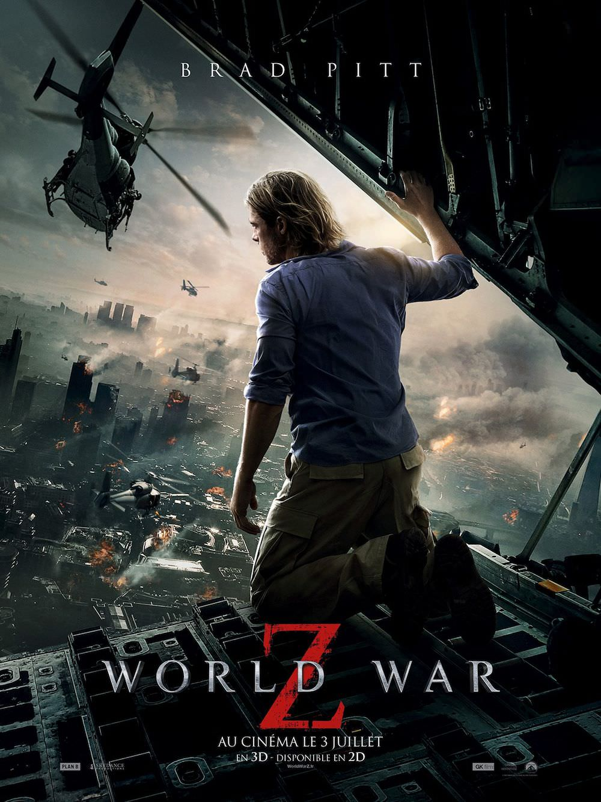
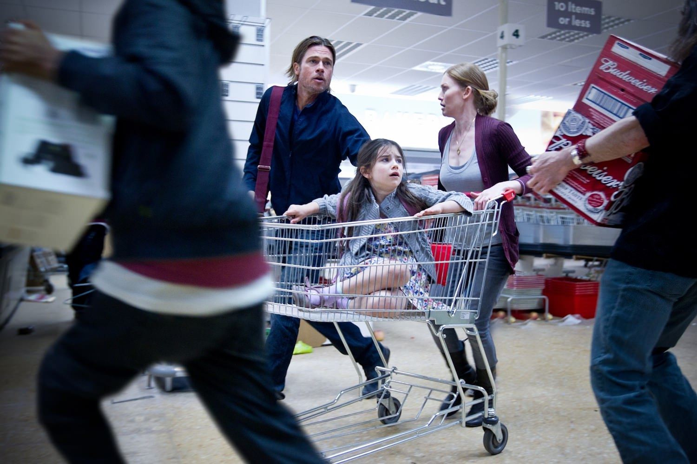
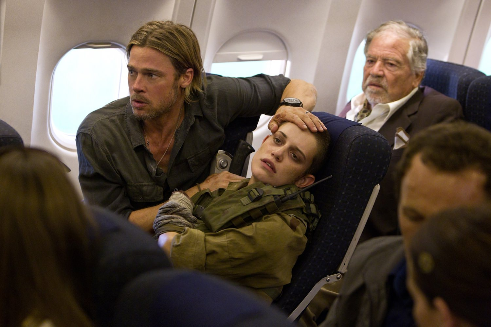

+++
type = "post"
titre = "<em>World War Z</em>, de Marc Forster"
title = "World War Z, de Marc Forster"
url = "/world-war-z-forster"
date = "2013-07-05T00:01:52"
Lastmod = "2013-07-05T10:44:58"
cover = "world-war-z-brad-pitt-marc-forster.jpg"
categorie = [ "À voir" ]
tag = [ "Action", "Apocalypse", "Blockbuster", "Horreur", "Maladie", "Science-Fiction", "Sorties du mois", "Vite oublié", "Zombie" ]
createur = [ "Marc Forster" ]
acteur = [ "Brad Pitt", "Daniella Kertesz", "Fana Mokoena", "Mireille Enos" ]
annee = [ "2013" ]
weight = 2013
pays = [ "États-Unis" ]

+++

Un film de zombies à l’échelle planétaire : voilà l’idée saugrenue de ce <em>World War Z</em> qui porte bien son nom. Alors que ce genre est en général l’occasion de films fauchés et donc forcément réduits à une petite zone géographique, Marc Forster filme une planète post-apocalyptique ou l’énorme majorité de la population a été réduite à l’état de morts-vivants. Une idée réjouissante, mais également dangereuse : de fait, <em>World War Z</em> n’évite pas tous les pièges du genre et tombe parfois dans une surenchère d’action ou d’émotion un peu dommageable. Reste que le spectacle est bien au rendez-vous et que Marc Forster signe là un film catastrophe plus impressionnant que la moyenne. À voir pour le plaisir coupable du blockbuster donc, et puis à oublier dans la foulée…

Comme tout bon film de zombies qui se respecte, <em>World War Z</em> ne se perd pas en futilités. Après un générique qui pose un peu le contexte socio-environnemental — une planète surpeuplée où l’équilibre naturel est mis à mal par la population en trop grand nombre —, après avoir présenté les personnages principaux, Marc Forster envoie ses premiers zombies et lance en même temps l’énorme machinerie de son blockbuster. On l’évoquait en préambule, on a plutôt l’habitude de voir quelques zombies dans un lieu donné ; cette fois, il faut voir les choses en grand. Le film raconte l’histoire d’une pandémie qui apparaît quelque part en Inde et qui se propage en un temps très court au monde entier. Tous les pays sont concernés et même si on s’occupera surtout des États-Unis — Hollywood oblige… —, <em>World War Z</em> a la bonne idée de nous emmener en différents points du globe pour constater que le problème est le même partout. On a rarement vu autant de morts-vivants dans un même film et rarement en autant d’endroits différents. L’une des scènes les plus fortes se déroule d’ailleurs à Jérusalem, bien loin de l’Amérique du Nord que l’on quitte en fait après une première partie qui s’y déroule entièrement. Sur ce point, Marc Forster a fait un bon travail et il n’est pas tombé dans le cliché du film d’action censé évoquer des problèmes planétaires, mais qui ne se déroule que sur le sol américain. Il l’évite, mais partiellement seulement : où que le héros aille, il reste en terrain connu, on y parle toujours anglais et il retrouve toujours des compatriotes, même lorsqu’il se rend dans une base militaire sud-coréenne. C’est un peu facile, mais il fallait bien un scénario adapté avant tout aux envies du public américain et il faut convenir que <em>World War Z</em> fonctionne très bien sur le mode planétaire et parvient à donner le sentiment plutôt inquiétant que le monde entier tombe dans une sorte d’apocalypse à base de zombies. 

Si le long-métrage est plutôt convaincant dans son côté planétaire et s’il contient plusieurs scènes d’action vraiment impressionnantes avec des centaines de milliers de zombies qui s’agglutinent pour former des marées humaines, <em>World War Z</em> n’évite pour autant pas quelques clichés un peu lourds. Nonobstant le placement produit le plus visible de l&rsquo;année (Pepsi n&rsquo;a pas perdu son argent…), tous tournent en fait autour des personnages principaux et même du héros, qui est une vraie caricature de héros de blockbuster. Brad Pitt incarne Gerry Lane, l’homme qui va sauver la planète en trouvant, quasiment seul, la solution pour résister face aux morts-vivants. On n’en dira pas trop de peur de dévoiler la solution plutôt originale trouvée par les scénaristes, mais il n’empêche que faire reposer l’intrigue entière sur ce personnage est une erreur qui diminue l’importance de l’épidémie. Alors que Marc Forster filme ce qui est censé être une menace de premier ordre sur l’humanité tout entière, rien que ça, son héros doit trouver une solution seul, comme si tous les survivants n’en avaient cure. Ce n’est pas réaliste et c’est pénible, car on sait d’emblée qu’il n’arrivera rien de grave à ce personnage. <em>World War Z</em> épargne d’ailleurs beaucoup trop de personnages importants, là encore une faute de réalisme, et le long-métrage n’évite malheureusement pas les scènes familiales où l’émotion est surlignée à coups de grandes nappes de violons. La <a href="http://www.amazon.fr/gp/product/B00CPSVAY0/ref=as_li_ss_tl?ie=UTF8&tag=leblogdenic07-21&linkCode=as2&camp=1642&creative=19458&creativeASIN=B00CPSVAY0">bande originale</a> composée par Marco Beltrami n’est d’ailleurs guère passionnante et jamais originale. Heureusement, il y a les zombies et ceux de Marc Forster sont plus atypiques. Les caractéristiques incontournables ont bien été conservées — ils sont carnassiers et transmettent leur maladie par les morsures, ils ne peuvent être vraiment tués que par le feu, ils ont un comportement plus animal qu’humain —, mais <em>World War Z</em> les modifie aussi sur quelques points. Ils sont très rapides et surtout ils agissent comme un tout, illustrant d’ailleurs mieux que tout la formule « marrée humaine ». C’est une excellente solution pour renouveler un peu le genre et apporter aux zombies une pointe de modernité. 

<em>World War Z</em> est loin d’être un chef d’œuvre qui fera date, mais cela n’a sans doute jamais été l’ambition de Marc Forster. À condition de prendre son film pour ce qu’il est vraiment, à savoir un divertissement estival un peu bête, mais très efficace, ce long-métrage est une réussite. Rythmé et intense, le film dégage même, sur quelques scènes, un stress puissant. Certes, <em>World War Z</em> n’est pas sans défaut, à commencer par sa fin ouverte qui appelle avec une franchise pénible la suite qui est déjà prévue, mais il faut reconnaître que le spectacle est au rendez-vous. À condition d’apprécier les zombies, Marc Forster signe une réalisation fun et très bien réalisée… ce n’est déjà pas si mal. 

