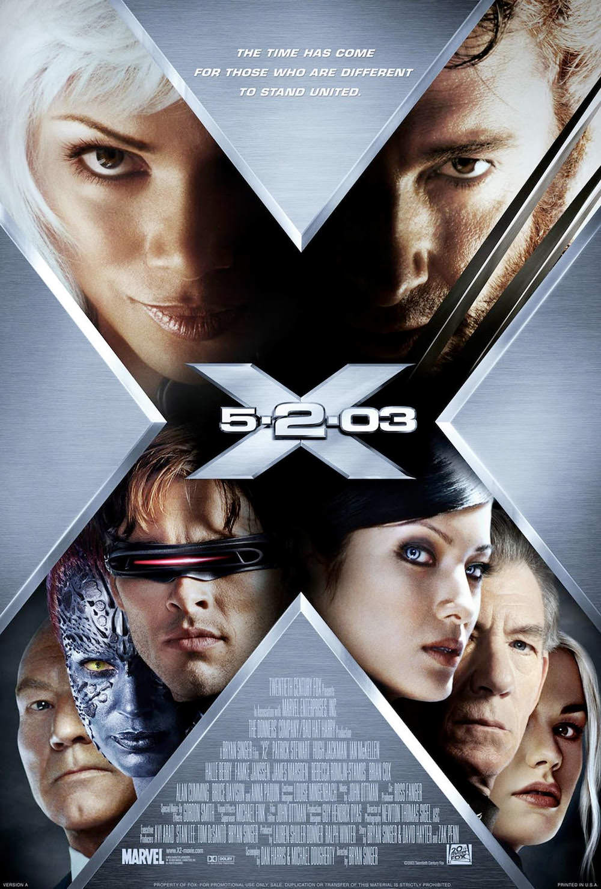
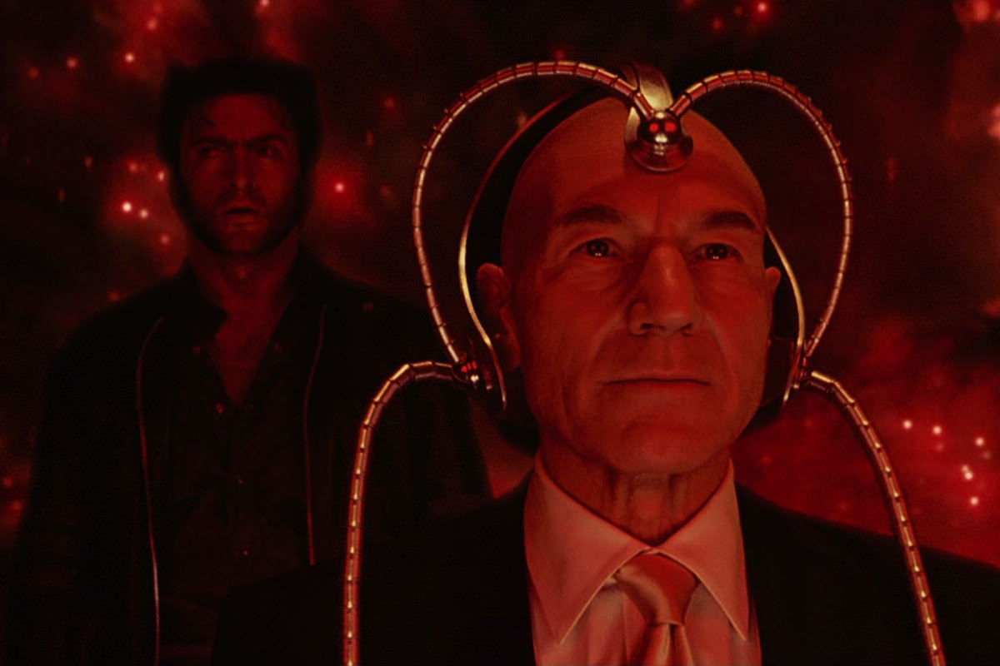
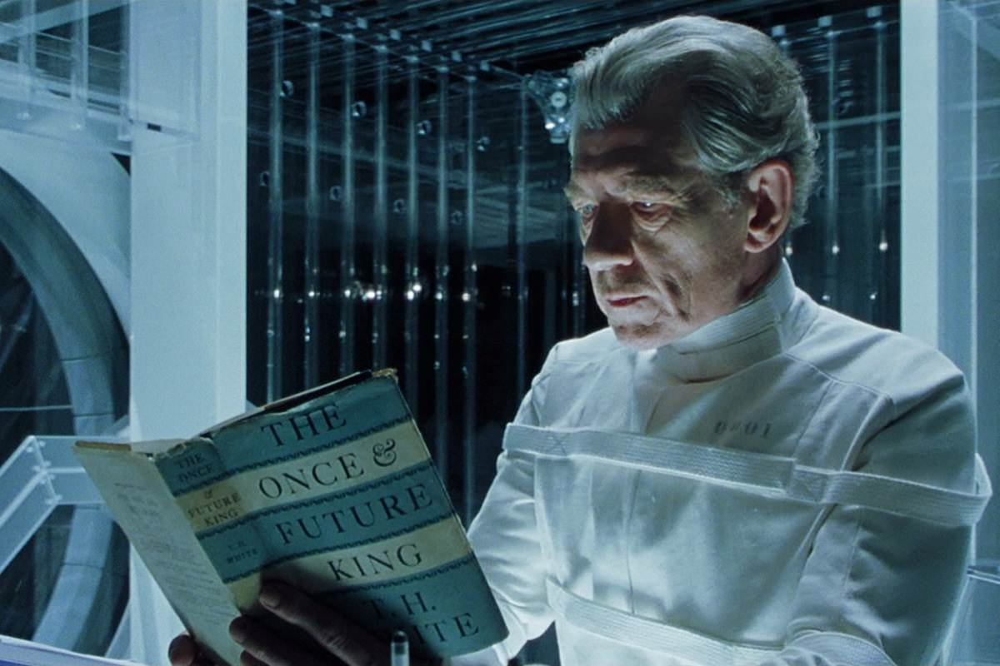

+++
type = "post"
titre = "<em>X-Men 2</em>, Bryan Singer"
title = "X-Men 2, Bryan Singer"
url = "/x-men-2-singer"
date = "2013-11-12T21:38:10"
Lastmod = "2013-12-10T22:28:55"
cover = "x-men-2-bryan-singer.jpg"
categorie = [ "À voir" ]
tag = [ "Action", "Adaptation bande-dessinée", "Blockbuster", "Comics", "Science-Fiction", "Société", "Superhéros" ]
createur = [ "Bryan Singer" ]
acteur = [ "Anna Paquin", "Brian Cox", "Famke Janssen", "Halle Berry", "Hugh Jackman", "Ian McKellen", "James Marsden", "Patrick Stewart", "Rebecca Romijn" ]
annee = [ "2003" ]
weight = 2003
saga = [ "X-Men" ]
pays = [ "États-Unis" ]
original = "X2"

+++

En 2000, <a href="http://voiretmanger.fr/x-men-singer/" title="X-Men, Bryan Singer"><em>X-Men</em></a> a été un gros succès critique et public. Une suite s’est ainsi imposée naturellement et Bryan Singer commence à y travailler deux mois seulement après la sortie du film. Avec son accent politique, <em>X-Men</em> apportait un regard neuf sur les superhéros et il fallait une suite à la hauteur de cette ouverture ambitieuse. L’équipe ne change pas et Bryan Singer signe <em>X-Men 2</em> qui reprend peu de temps après le premier volet. Après l’opposition entre deux clans de mutants, cette suite revient à une lutte plus classique entre mutants et humains, mais sans oublier pour autant les divisions internes côté mutants. Plus porté sur l’action, un petit peu moins politique, ce deuxième volet est peut-être moins original, il n’est pas moins réussi pour autant. Pendant plus de deux heures, on assiste à un grand spectacle très réussi : une belle suite pour la jeune <a href="http://voiretmanger.fr/saga/x-men/">saga <em>X-Men</em></a>, incontestablement.

L’action reprend peu de temps après la fin de <em>X-Men</em> qui avait écarté la menace Magnéto et apaisé les relations entre les mutants et les humains. Du moins, c’est ce que l’on croyait : <em>X-Men 2</em> commence alors que les tensions repartent de plus belle entre les deux groupes. Bryan Singer ouvre même son film avec une séquence très spectaculaire dans la Maison-Blanche : un mutant capable de se téléreporter mène une attaque d’une efficacité redoutable sur le palais présidentiel et va jusqu’à menacer directement le président américain. Cette attaque au niveau le plus haut de l’État relance le débat et l’école pour jeunes mutants de Charles Xavier est directement visée par le pouvoir en place. En apparence, c’est la guerre entre humains et mutants, mais les choses sont une nouvelle fois plus complexes qu’elles n’en ont l’air. Comme on l’apprend vite, c’est un homme qui tire les ficelles derrière ces opérations : le général William Striker, spécialiste des mutants dans l’armée américaine, qui cherche à annihiler tous les mutants et à se venger contre Professeur X qui n’a pas su soigner son fils mutant quelques années auparavant. Face à cette menace, les ennemis d’hier s’allient comme le rappelle l’affiche du film et <em>X-Men 2</em> voit ainsi la réunion de Magnéto et des X-Men. Ensemble, ils vont tout mettre en œuvre pour contrer les plans du militaire, dans ce long-métrage plus violent que son prédécesseur. Bryan Singer opte pour une formule moins originale, sans toutefois oublier les enjeux politiques. Ils ne sont plus aussi visibles qu&rsquo;avant — le Président des États-Unis n&rsquo;apparaît que brièvement —, mais ils sont tout aussi importants et peut-être même plus encore qu&rsquo;auparavant. Dans ce nouvel épisode, ce sont les enfants qui sont au cœur des enjeux avec deux personnages essentiels et terribles en même temps : on a d&rsquo;un côté Bobby/Iceman qui fait un véritable coming-out en avouant à ses parents sa mutation et qui est rejeté par sa famille d&rsquo;une façon assez cruelle. Pire encore, le fils de Striker, Jason, n&rsquo;est pas seulement rejeté par son père quand ce dernier découvre qu&rsquo;il est un mutant, il est exploité contre son propre être. Une métaphore qui ne doit rien au hasard chez Bryan Singer, cinéaste ouvertement gay : à travers cette histoire de mutation se dessine une histoire de l&rsquo;homosexualité qui prend une tout autre saveur. 

Plus encore que dans le premier volet, <em>X-Men 2</em> suit tout particulièrement le sort de Wolverine. Ce mutant est intéressant par son histoire mystérieuse et par son statut à part. Quand ce nouvel épisode commence, le personnage s’est plus ou moins bien intégré aux autres mutants de l’école et il est même le seul présent lorsque l’armée passe à l’action. Par la suite, son histoire personnelle occupe une place centrale en parallèle du conflit entre mutants et humains. Bryan Singer profite de ce nouveau long-métrage pour lever les derniers voiles de mystère sur le personnage qui retrouve progressivement sa mémoire. La confrontation avec Striker qui est à l’origine de ce qu’il est, fait partie des moments forts de l’histoire. Plus encore, Hugh Jackman se révèle dans ce rôle qui semble avoir été écrit pour lui et l’acteur en impose par sa présence éclatante à l’écran. Les autres mutants n’en sont pas oubliés pour autant : bien qu’il joue un rôle central dans le récit, on voit moins Professeur X, mais à la place on passe du temps avec son ennemi et ancien ami Magnéto. Devenu célèbre pour son rôle de Gandalf, Ian McKellen est parfaitement juste pour interpréter ce mutant déterminé et plus dangereux qu’il n’en a l’air. Parmi les moments forts de la saga, on retiendra sans doute son départ de la prison de plastique… On apprécie les nouveaux mutants, mais les personnages les plus réussis sont ceux qui doutent et <em>X-Men 2</em> laisse une belle place à deux d’entre eux. Il y a Pyro (Aaron Stanford), brimé par ses amis qui finit par changer de camp. Il y a surtout Jean Grey, gros point fort du scénario de Bryan Singer : ce mutant doté de capacités proches du Professeur X doute de sa force depuis le premier épisode, mais prend ainsi de l’importance au point de devenir le mutant le plus puissant. Alors qu’elle est au cœur d’un triangle amoureux avec Wolverine et un autre mutant, elle opère un changement essentiel à la fin. Difficile d’en dire plus, mais ce personnage écrit avec toute la précision nécessaire est essentiel ici et il convient de saluer la performance de Famke Janssen. 

Certes, <em>X-Men 2</em> est moins original que son prédécesseur, mais Bryan Singer a su conserver tous les points forts de la saga dans cet épisode plus ample et plus spectaculaire encore. Épisode de rupture, puisque la guerre entre humains et mutants éclate au grand jour ; épisode d’unions, même si les dissensions au sein du groupe des mutants restent bien sensibles ; épisode toujours aussi politique, même si ces questions prennent une forme nouvelle bien différente. Ce blockbuster adapté de comics offre à nouveau du spectacle de haut niveau — et avec des effets spéciaux qui ont mieux vieilli —, mais aussi un fond vraiment intéressant : dix ans après, on le revoit avec toujours autant de plaisir !

<h3>Vous voulez m&rsquo;aider ?<a href="#footnote_0_10547" id="identifier_0_10547" class="footnote-link footnote-identifier-link" title="&Agrave; propos de la publicit&eacute;&hellip;">1</a></h3>
<ul>
<li><a href="http://www.amazon.fr/gp/product/B003Z421X2/ref=as_li_ss_tl?ie=UTF8&#038;tag=leblogdenic07-21&#038;linkCode=as2&#038;camp=1642&#038;creative=19458&#038;creativeASIN=B003Z421X2">Acheter le film en Blu-Ray sur Amazon</a></li>
<li><a href="http://www.amazon.fr/gp/product/B0000CEWVF/ref=as_li_ss_tl?ie=UTF8&#038;tag=leblogdenic07-21&#038;linkCode=as2&#038;camp=1642&#038;creative=19458&#038;creativeASIN=B0000CEWVF">Acheter le film en DVD sur Amazon</a></li>
<li><a href="https://itunes.apple.com/fr/movie/x-men-2/id364909812">Acheter ou louer le film sur l&rsquo;iTunes Store</a></li>
</ul>
<ul>
<li><a href="http://www.amazon.fr/gp/product/B00E3X9XNA/ref=as_li_ss_tl?ie=UTF8&#038;tag=leblogdenic07-21&#038;linkCode=as2&#038;camp=1642&#038;creative=19458&#038;creativeASIN=B00E3X9XNA">Acheter la saga <em>X-Men</em> en Blu-Ray sur Amazon</a></li>
<li><a href="http://www.amazon.fr/gp/product/B00E3X9X12/ref=as_li_ss_tl?ie=UTF8&#038;tag=leblogdenic07-21&#038;linkCode=as2&#038;camp=1642&#038;creative=19458&#038;creativeASIN=B00E3X9X12">Acheter la saga <em>X-Men</em> en DVD sur Amazon</a></li>
</ul>

<ol class="footnotes"><li id="footnote_0_10547" class="footnote"><a href="http://voiretmanger.fr/soutien/">À propos de la publicité…</a> [<a href="#identifier_0_10547" class="footnote-link footnote-back-link">&#8617;</a>]</li></ol>
