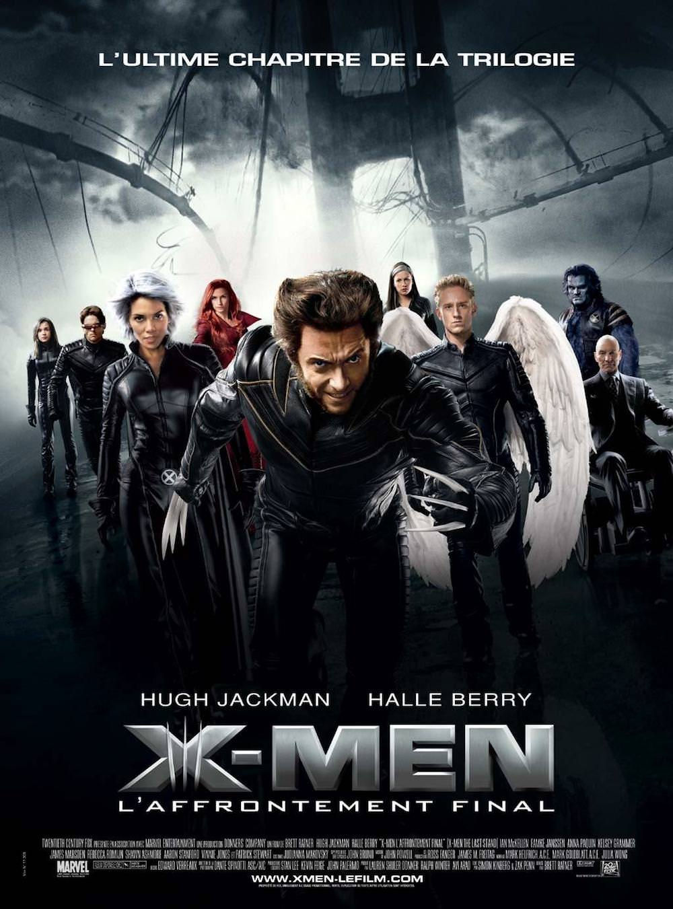
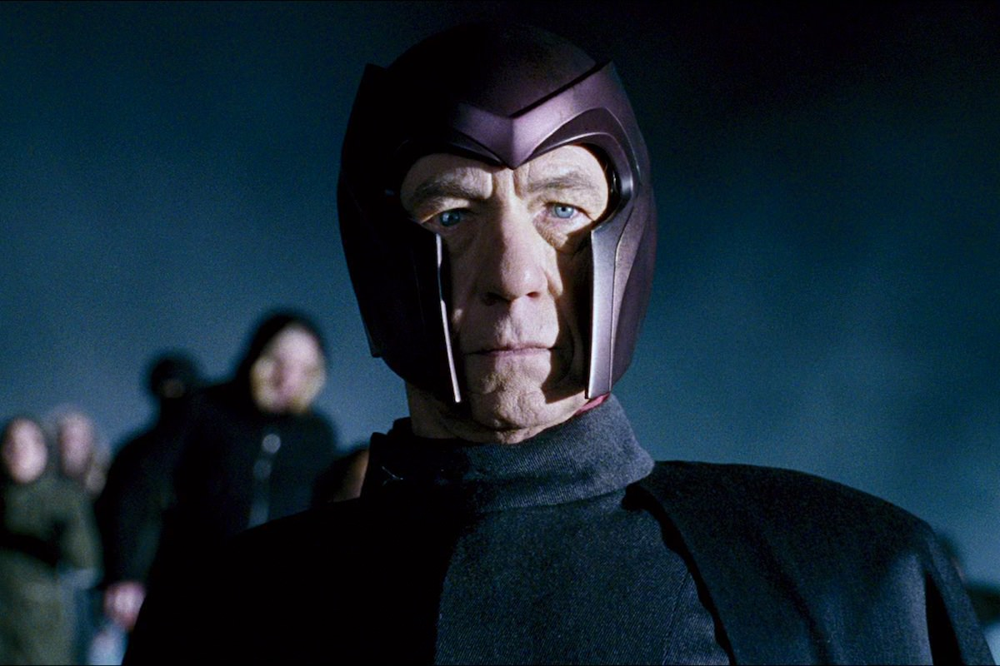
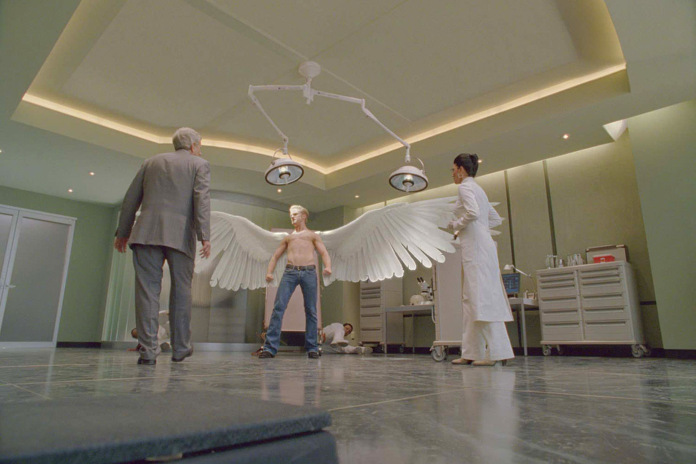

+++
type = "post"
titre = "<em>X-Men l&rsquo;affrontement final</em>, Brett Ratner"
title = "X-Men l'affrontement final, Brett Ratner"
url = "/x-men-affrontement-final-ratner"
date = "2013-11-17T12:45:12"
Lastmod = "2014-05-25T15:39:54"
cover = "x-men-affrontement-final-hugh-jackman.jpg"
categorie = [ "À voir" ]
tag = [ "Action", "Adaptation bande-dessinée", "Blockbuster", "Comics", "Fantastique", "Superhéros", "Vite oublié" ]
createur = [ "Brett Ratner" ]
acteur = [ "Anna Paquin", "Famke Janssen", "Halle Berry", "Hugh Jackman", "Ian McKellen", "Patrick Stewart", "Rebecca Romijn", "Shawn Ashmore" ]
annee = [ "2006" ]
weight = 2006
saga = [ "X-Men" ]
pays = [ "États-Unis" ]
original = "X-Men : The Last Stand"

+++

« <em>L’ultime chapitre de la trilogie</em> » : l’affiche ne laisse pas de place aux doutes et Brett Ratner a fait tout ce qu’il a pu pour effectivement clore la saga <em>X-Men</em>. Ce troisième volet nommé judicieusement <em>X-Men l’affrontement final</em> ouvre les hostilités à la fois entre mutants et humains, comme dans <a href="http://voiretmanger.fr/x-men-2-singer/" title="X-Men 2, Bryan Singer"><em>X-Men 2</em></a>, mais aussi entre mutants, comme dans <a href="http://voiretmanger.fr/x-men-singer/" title="X-Men, Bryan Singer"><em>X-Men</em></a>. Une sorte de synthèse qui aurait pu donner un film spectaculaire et intelligent, mais ce n’est malheureusement pas le cas. Spectaculaire, le long-métrage de Brett Ratner l’est avec quelques séquences vraiment réussies. Le cinéaste a toutefois complètement oublié l’aspect original de la saga, ce qui distinguait ces superhéros de tous les autres et <em>X-Men l’affrontement final</em> n’est plus qu’un blockbuster un peu bête et très rapidement oublié. Dommage, la série méritait mieux que cette conclusion à la hache…

Suivant très précisément le deuxième volet, <em>X-Men l’affrontement final</em> commence alors que Scott ne parvient toujours pas à se remettre de la mort de Jean à la fin de <em>X-Men 2</em>. C’est donc Wolverine qui le remplace et qui aide Tornade à former les jeunes mutants de l’école de Charles Xavier. Le ton s’est durci entre les deux épisodes et c’est une formation militaire qui est ainsi donnée aux jeunes mutants. Même si, en théorie, ils n’apprennent qu’à se défendre, on sent bien que l’époque n’est plus la même et qu’il va falloir se battre. De fait, Brett Ratner ne fait pas trainer en longueur son film et introduit rapidement le sujet central. Un mutant a le pouvoir un peu particulier de désactiver la mutation et le gouvernement américain, sous prétexte d’offrir le choix, en fait secrètement une arme. Une déclaration de guerre pour Magnéto qui sort de sa cachette pour passer à l’action : il recrute des mutants pour former son armée avec la ferme intention non seulement d’arrêter la production de cette arme, mais aussi d’attaquer en retour les humains. Sans surprise, le scénario fait s’interposer les X-Men restants qui vont tout faire pour arrêter Magnéto et ses hommes, tandis que l’armée américaine mène ses actions contre les mutants. <em>X-Men l’affrontement final</em> commence avec un scénario plutôt intéressant, ou plutôt qui aurait pu être intéressant. Avec ces trois groupes qui s’opposent, la question politique aurait pu surgir et Brett Ratner aurait pu interroger la question de la mutation comme maladie ou non, mais il n’en fait rien. Assez paresseux, le film se contente d’un affrontement très classique, un blockbuster d’action sans grande particularité, même s’il est souvent très efficace, il faut le reconnaître. La scène d’attaque de la prison de Mystique est très bien réalisée et le combat final à Alcatraz offre du spectacle d’un bon niveau, même si le faux-raccord monstrueux<a href="#footnote_0_10572" id="identifier_0_10572" class="footnote-link footnote-identifier-link" title="Le pont est d&eacute;plac&eacute; de jour, le combat qui se d&eacute;roule juste apr&egrave;s se fait en pleine nuit&hellip;">1</a> gache un peu la fête.

Divertissant, <em>X-Men l’affrontement final</em> manque toutefois de la finesse de ses prédécesseurs, tandis que le scénario élimine dès les premières minutes plusieurs personnages clés de la saga avec une désinvolture troublante. En soi, qu’un personnage principal soit éliminé n’est pas un mauvais signe : les scénarios qui ont le sens du sacrifice sont souvent meilleurs. Reste que Brett Ratner le fait d’abord pour mettre en avant de nouveaux personnages, des mutants que l’on découvre ici, mais qui n’ont pas le droit à un développement aussi important que les autres et qui sont, de ce fait, assez inintéressants. Il y a Kitty qui passe à travers les murs, mais qui n’est vraiment pas un personnage intéressant. Pire, le cas &laquo;&nbsp;Archangel&nbsp;&raquo; qui est passionnant sur le papier, mais qui n’est même pas traité par le film. Ce fils détesté par son père pour sa mutation qui décide de se rebeller aurait pu ouvrir une réflexion sur l’adolescence et les attentes parentales, mais ce personnage n’apparaît à l’écran que pour son rôle utilitaire dans le combat. <em>X-Men l’affrontement final</em> maltraite même le personnage de Jean, sans doute le mutant le plus intéressant avec ses doutes et sa puissance. Ici, elle ne sert une nouvelle fois qu’à faire avancer l’intrigue et à créer un suspense totalement artificiel à la fin : c’est un peu dommage d’en avoir fait ça. D’ailleurs, on ne comprend pas bien ce que l’histoire de classes de mutants vient faire : la saga s’en était passée jusque-là, pourquoi les introduire dans ce troisième volet ? Le long-métrage ne fait pas confiance à ses spectateurs et préfère tout leur expliquer, quitte à inventer une classification chiffrée qui n’a jamais été évoquée précédemment. Au total, les personnages rassemblés ici peinent à intéresser, comme ils pouvaient le faire auparavant. Même Professeur X et Magnéto déçoivent quelque peu, tout comme Wolverine qui est rentré dans le rang et n’a plus guère d’intérêt. 

Décevant : c’est le terme qui convient le mieux à ce <em>X-Men l’affrontement final</em>. Le film n’est pas totalement raté, c’est un divertissement assez efficace, mais il a perdu tout ce qui faisait l’originalité de la saga. À trop retirer de personnages clés, à en ajouter trop d’inintéressants et en oubliant totalement l’aspect politique de la série, Brett Ratner ne propose qu’un film banal. Bryan Singer aurait-il fait mieux s’il n’avait pas privilégié Superman ? Difficile de le dire, mais on a tendance à lui accorder le bénéfice du doute, d’autant que le reboot de la saga a plutôt bien commencé avec <a href="http://voiretmanger.fr/x-men-commencement-vaughn/" title="X-Men : Le Commencement, Matthew Vaughn"><em>X-Men : Le Commencement</em></a>. Espérons que la suite sera du même niveau…

<h3>Vous voulez m’aider ?<a href="#footnote_1_10572" id="identifier_1_10572" class="footnote-link footnote-identifier-link" title="&Agrave; propos de la publicit&eacute;&hellip;">2</a></h3>
<ul>
<li><a href="http://www.amazon.fr/gp/product/B003T0M62I/ref=as_li_ss_tl?ie=UTF8&#038;tag=leblogdenic07-21&#038;linkCode=as2&#038;camp=1642&#038;creative=19458&#038;creativeASIN=B003T0M62I">Acheter le film en Blu-Ray sur Amazon</a></li>
<li><a href="http://www.amazon.fr/gp/product/B000I0S52M/ref=as_li_ss_tl?ie=UTF8&#038;tag=leblogdenic07-21&#038;linkCode=as2&#038;camp=1642&#038;creative=19458&#038;creativeASIN=B000I0S52M">Acheter le film en DVD sur Amazon</a></li>
<li><a href="https://itunes.apple.com/fr/movie/x-men-laffrontement-final/id433331666">Acheter ou louer le film sur l’iTunes Store</a></li>
</ul>
<ul>
<li><a href="http://www.amazon.fr/gp/product/B00E3X9XNA/ref=as_li_ss_tl?ie=UTF8&#038;tag=leblogdenic07-21&#038;linkCode=as2&#038;camp=1642&#038;creative=19458&#038;creativeASIN=B00E3X9XNA">Acheter la saga <em>X-Men</em> en Blu-Ray sur Amazon</a></li>
<li><a href="http://www.amazon.fr/gp/product/B00E3X9X12/ref=as_li_ss_tl?ie=UTF8&#038;tag=leblogdenic07-21&#038;linkCode=as2&#038;camp=1642&#038;creative=19458&#038;creativeASIN=B00E3X9X12">Acheter la saga <em>X-Men</em> en DVD sur Amazon</a></li>
</ul>

<ol class="footnotes"><li id="footnote_0_10572" class="footnote">Le pont est déplacé de jour, le combat qui se déroule juste après se fait en pleine nuit… [<a href="#identifier_0_10572" class="footnote-link footnote-back-link">&#8617;</a>]</li><li id="footnote_1_10572" class="footnote"><a href="http://voiretmanger.fr/soutien/">À propos de la publicité…</a> [<a href="#identifier_1_10572" class="footnote-link footnote-back-link">&#8617;</a>]</li></ol>
