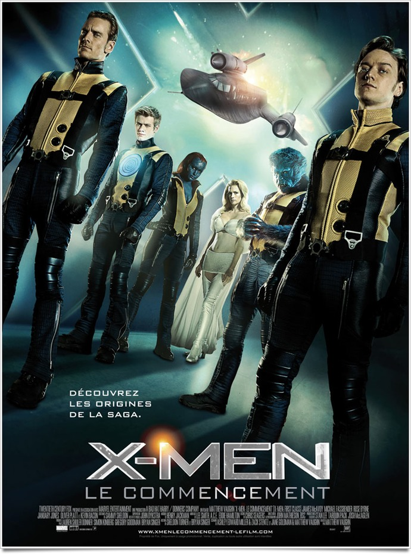
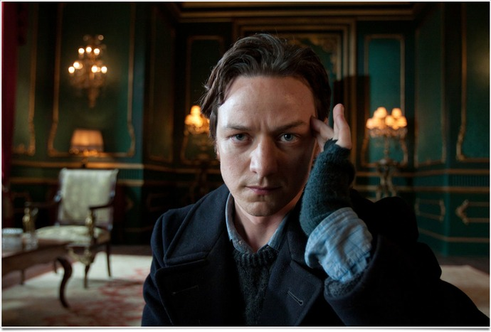
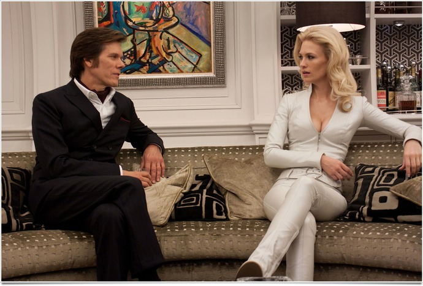

+++
type = "post"
titre = "<em>X-Men : Le Commencement</em>, Matthew Vaughn"
title = "X-Men : Le Commencement, Matthew Vaughn"
url = "/x-men-commencement-vaughn"
date = "2011-06-02T00:41:38"
Lastmod = "2015-02-22T14:09:17"
cover = "x-men-commencement-vaughn.jpg"
categorie = [ "À voir" ]
tag = [ "Blockbuster", "Comics", "Fantastique", "Histoire", "Science-Fiction" ]
createur = [ "Matthew Vaughn" ]
acteur = [ "James McAvoy", "Jennifer Lawrence", "Michael Fassbender" ]
annee = [ "2011" ]
weight = 2011
saga = [ "X-Men" ]
pays = [ "États-Unis" ]
original = "X-Men: First Class"

+++

Après une trilogie assez ambitieuse et globalement plutôt réussie malgré un film très commun, la juteuse licence <em>X-Men</em> revient avec un préquel. <em>X-Men : Le Commencement</em> laisse dès le titre peu de doutes sur son contenu : il s&rsquo;agit de découvrir les différents super-héros au tout début, quand les mutants n&rsquo;étaient que des enfants dotés de pouvoir incompris. Le film de Matthew Vaughn, réalisateur du plaisant <em><a href="http://voiretmanger.fr/2010/03/29/kick-ass-vaughn/">Kick-Ass</a></em>, se déroule majoritairement au cœur de la Guerre froide, dans une réécriture de l&rsquo;histoire plutôt bien vue. Un film plaisant, même si l&rsquo;on ne connaît rien à l&rsquo;histoire.

<em>X-Men : Le commencement</em> remonte aux origines. La trilogie l&rsquo;avait fait en partie et on connaissait quelques moments clés, mais l&rsquo;origine du conflit qui oppose les mutants devient ici le sujet même du film. Ce dernier ouvre sur la découverte en parallèle de leurs pouvoirs par Erik, futur Magneto, d&rsquo;un côté et par Charles Xavier, futur Professeur X, de l&rsquo;autre. Le premier exerce son pouvoir pour la première fois dans un camp de concentration. Il n&rsquo;est alors qu&rsquo;un enfant qui ne supporte pas de voir partir ses parents et il tord la grille du camp par ses pouvoirs magnétiques. Charles de son côté rencontre très jeune la future Mystique et se lie d&rsquo;amitié avec la jeune fille. Les deux mutants piliers de l&rsquo;histoire sont ainsi révélés par le film qui se déroule néanmoins bien des années plus tard. Erik poursuit l&rsquo;officier nazi qui a tué sa mère devant ses yeux bien des années auparavant, tandis que Charles expose au monde scientifique l&rsquo;existence des mutations par une thèse à Oxford, avant d&rsquo;être recruté par la CIA qui cherche alors à en savoir plus sur ces mutants et en particulier sur Shaw. Ce dernier s&rsquo;avère en fait être l&rsquo;ancien officier nazi que poursuit Erik et c&rsquo;est au cours d&rsquo;une action de la CIA pour arrêter cet homme qui est aussi un mutant extrêmement puissant qu&rsquo;Erik et Charles se rencontrent. Ce dernier parvient à convaincre Erik de travailler avec la CIA pour se venger de Shaw et ensemble ils forment une équipe de mutants prêts à en découvre, les futurs X-Men.

Plus encore que les super-pouvoirs des superhéros, l&rsquo;intérêt des comics réside dans les contradictions de ces hommes surhumains. Dès lors, l&rsquo;origine du superhéros est toujours un élément extrêmement important et le projet de <em>X-Men : Le Commencement</em> intéresse d&rsquo;emblée pour cette raison. Le film apporte une explication scientifique à la mutation : les explosions nucléaires de la Seconde Guerre mondiale ont accéléré le processus d&rsquo;évolution naturelle et ont créé de nombreux mutants sur la planète. Ces hommes et femmes sont dotés d&rsquo;un ou plusieurs pouvoirs qui sont plus ou moins discrets et plus ou moins puissants. Chaque mutant découvre plus ou moins par hasard son pouvoir et apprend ensuite à le contrôler, ce que montre bien ce film. Ce qui compte n&rsquo;est pas tant la modification génétique initiale que ce que le mutant décide d&rsquo;en faire. Deux mutants, Mystique et Hank, doutent de l&rsquo;intérêt de leurs pouvoirs et hésitent à les annuler, ou du moins à les dissimuler pour rentrer dans le rang. Cette thématique qui était centrale dans la trilogie est déjà essentielle ici et c&rsquo;est parce que Hank veut masquer sa différence qu&rsquo;il devient Le Fauve, bête poilue bleue qui ne laisse plus vraiment de doute sur sa nature. Les superhéros sont toujours ce qu&rsquo;ils choisissent d&rsquo;être et c&rsquo;est particulièrement vrai dans <em>X-Men : Le Commencement</em>. Au cours du film, deux camps se dessinent parmi les mutants : d&rsquo;un côté ceux qui veulent s&rsquo;intégrer aux humains, combattre à leur côté et faire de la mutation un aspect normal ; de l&rsquo;autre ceux qui pensent que les humains et les mutants sont irréconciliables et qu&rsquo;un seul groupe survivra après l&rsquo;inévitable combat qui opposera les deux groupes.

On le voit, la dimension sociale et politique est centrale dans <em>X-Men : Le Commencement</em>, comme elle l&rsquo;était dans la trilogie initiale et tout particulièrement dans le deuxième film. Alors que la mutation n&rsquo;est pas encore un phénomène connu dans la population, le monde politique utilise ce phénomène tout en s&rsquo;en méfiant. Reprenant un aspect très courant dans les comics, <em>X-Men : Le Commencement</em> se déroule au cœur de la Guerre froide et les oppositions entre mutants retrouvent les oppositions entre les deux blocs. Même si Shaw manipule les deux camps pour sa propre cause, le film reste teinté d&rsquo;opposition entre les États-Unis et l&rsquo;URSS et il se permet même de réécrire l&rsquo;histoire, de manière plutôt amusante. Shaw devient ici le créateur de la crise de Cuba en incitant les Américains à menacer l&rsquo;URSS avec les missiles turcs et inversement en incitant les Soviétiques à menacer les États-Unis avec leurs missiles cubains. Le blocus de l&rsquo;île fait même l&rsquo;objet d&rsquo;une scène de combat où le cours de l&rsquo;histoire est assuré par l&rsquo;intervention <em>in extremis</em> des mutants. Passé le folklore historique, le film voit naître l&rsquo;opposition entre mutants et humains quand les forces des deux blocs s&rsquo;allient contre le premier groupe. D&rsquo;un commun accord, les dirigeants des deux pays décident d&rsquo;éliminer ce qu&rsquo;ils ressentent instinctivement comme une menace. Cette violence divise les mutants en deux groupes, préparant ainsi la trilogie. Dommage que le film soit si bref sur cet aspect d&rsquo;ailleurs, on aurait aimé plus d&rsquo;explications sur les choix des uns et des autres…

Deuxième film lié aux univers des comics pour Matthew Vaughn, le réalisateur change néanmoins complètement de style avec <em>X-Men : Le Commencement</em>. Fini l&rsquo;humour parodique un peu potache de <em>Kick-Ass</em>, place aux choses sérieuses avec un film qui laisse peu de places à la légèreté. Le cinéaste hérite également d&rsquo;un budget bien plus conséquent pour une réalisation plus ambitieuse. Sans faire d&rsquo;étincelles, mais est-ce seulement possible sur un tel blockbuster, Matthew Vaughn s&rsquo;en sort bien et il propose un film efficace et agréable. Une bonne idée de réalisation, quoiqu&rsquo;assez classique : utiliser le split-screen pour recréer sur grand écran l&rsquo;effet bande dessinée. Le scénario touffu ne laisse pas autant de places à tous les personnages, mais les deux principaux sont bien travaillés et bien interprétés par leurs acteurs respectifs. James McAvoy interprète un jeune Charles enthousiaste, un peu naïf et très actif qui est très crédible. De même, Michael Fassbender n&rsquo;est pas mauvais pour jouer un Magneto qui doute encore, mais qui est déjà marqué d&rsquo;une puissante recherche de vengeance…

Avec ce nouvel opus, le message est clair, Bryan Singer reprend les commandes. Réalisateur des deux premiers films et manifestement fan inconditionnel des comics, il offre à <em>X-Men : Le Commencement</em> une profondeur qui manquait à la série, quitte à trop en faire. Le film aurait sans doute gagné à être simplifié, peut-être en se concentrant sur moins de personnages et moins d&rsquo;intrigues différentes. Matthew Vaughn s&rsquo;en sort néanmoins plutôt bien avec ce projet ambitieux. Le résultat est plaisant et après tout, c&rsquo;est bien l&rsquo;essentiel pour un blockbuster…

<h3>Vous voulez m&rsquo;aider ?</h3>
<ul>
<li><a href="http://www.amazon.fr/gp/product/B0052RV3U2/ref=as_li_ss_tl?ie=UTF8&#038;tag=leblogdenic07-21&#038;linkCode=as2&#038;camp=1642&#038;creative=19458&#038;creativeASIN=B0052RV3U2">Acheter le film en Blu-Ray sur Amazon</a></li>
<li><a href="http://www.amazon.fr/gp/product/B0052RV3RK/ref=as_li_ss_tl?ie=UTF8&#038;tag=leblogdenic07-21&#038;linkCode=as2&#038;camp=1642&#038;creative=19458&#038;creativeASIN=B0052RV3RK">Acheter le film en DVD sur Amazon</a></li>
<li><a href="http://itunes.apple.com/fr/movie/x-men-le-commencement/id453462835">Acheter le film sur l&rsquo;iTunes Store</a></li>
</ul>
<ul>
<li><a href="http://www.amazon.fr/gp/product/B00E3X9XNA/ref=as_li_ss_tl?ie=UTF8&#038;tag=leblogdenic07-21&#038;linkCode=as2&#038;camp=1642&#038;creative=19458&#038;creativeASIN=B00E3X9XNA">Acheter la saga <em>X-Men</em> en Blu-Ray sur Amazon</a></li>
<li><a href="http://www.amazon.fr/gp/product/B00E3X9X12/ref=as_li_ss_tl?ie=UTF8&#038;tag=leblogdenic07-21&#038;linkCode=as2&#038;camp=1642&#038;creative=19458&#038;creativeASIN=B00E3X9X12">Acheter la saga <em>X-Men</em> en DVD sur Amazon</a></li>
</ul>

