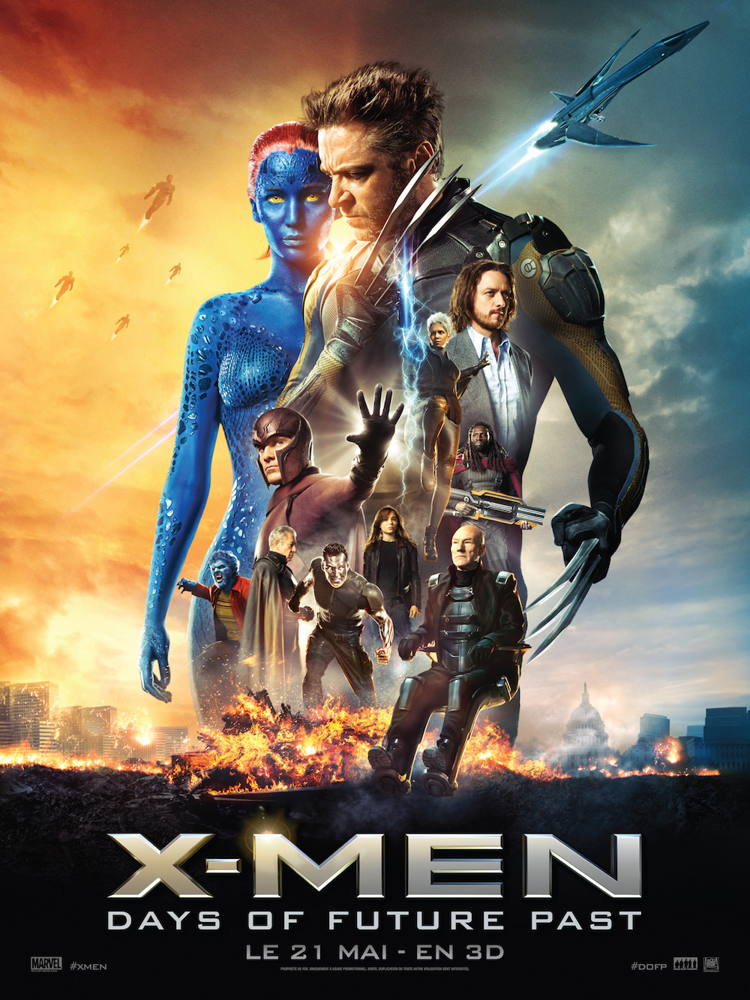
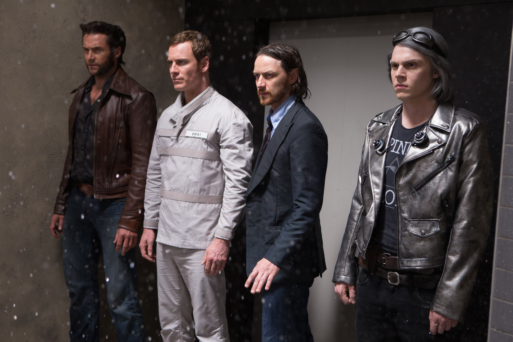

+++
type = "post"
titre = "<em>X-Men : Days of Future Past</em>, Bryan Singer"
title = "X-Men : Days of Future Past, Bryan Singer"
url = "/x-men-days-future-past-singer"
date = "2014-05-25T16:58:22"
Lastmod = "2014-05-26T12:06:38"
cover = "x-men-days-of-future-past-james-mcavoy-hugh-jackman-nicholas-hoult-singer.jpg"
categorie = [ "À voir" ]
tag = [ "Action", "Adaptation bande-dessinée", "Blockbuster", "Comics", "Dystopie", "Humour", "Science-Fiction", "Sorties du mois", "Superhéros", "Voyage temporel" ]
createur = [ "Bryan Singer" ]
acteur = [ "Ellen Page", "Evan Peters", "Hugh Jackman", "Ian McKellen", "James McAvoy", "Jennifer Lawrence", "Michael Fassbender", "Nicholas Hoult", "Patrick Stewart", "Peter Dinklage" ]
annee = [ "2014" ]
weight = 2014
saga = [ "X-Men" ]
pays = [ "États-Unis" ]

+++

La <a href="http://voiretmanger.fr/saga/x-men/">saga <em>X-Men</em></a> tient une place à part dans les adaptations de comics. Sans doute peut-être parce qu’elle a donné lieu au meilleur en la matière, mais aussi au pire. Après un <a href="http://voiretmanger.fr/x-men-singer/" title="X-Men, Bryan Singer"><em>X-Men</em></a>, puis un <a href="http://voiretmanger.fr/x-men-2-singer/" title="X-Men 2, Bryan Singer"><em>X-Men 2</em></a> très réussis, <a href="http://voiretmanger.fr/x-men-affrontement-final-ratner/" title="X-Men l’affrontement final, Brett Ratner"><em>X-Men l’affrontement final</em></a> concluait une trilogie de la pire manière qui soit, en oubliant tout ce qui distinguait la série des autres blockbusters, en tuant tous les personnages importants uniquement pour mettre un terme à la saga et en produisant un long-métrage certes spectaculaire, mais assez bête, ce qui n’était absolument pas le cas du travail ouvert par Bryan Singer. Depuis, la saga a aussi erré de spin-offs assez médiocres autour du personnage de Wolverine à un reboot très efficace. Trois ans après <a href="http://voiretmanger.fr/x-men-commencement-vaughn/" title="X-Men : Le Commencement, Matthew Vaughn"><em>X-Men : Le Commencement</em></a> qui a offert à la saga de nouvelles bases, Bryan Singer reprend les rênes pour un nouveau volet qui entend effacer tout ce qui a été fait jusque-là pour mieux repartir. <em>X-Men : Days of Future Past</em> n’est pas un blockbuster décérébré imaginé uniquement pour remplir les caisses : malin, le scénario joue du voyage temporel pour offrir une réalité alternative suffisamment crédible pour que le long-métrage s’intègre quand même à tout ce qui se précède. Bryan Singer signe un grand spectacle spectaculaire et divertissant, mais qui retrouve la finesse des premiers volets. Un excellent blockbuster !

Plus encore que sur <em>X-Men : Le Commencement</em> où il n’était que producteur et scénariste, Bryan Singer reprend la main sur la saga avec ce nouveau long-métrage qui commence dans un futur modelé selon ses envies. <em>X-Men : Days of Future Past</em> ouvre en effet sur un univers dystopique où les mutants ont quasiment été tous éliminés par les Sentinelles, de terrifiants robots capables de s’adapter à n’importe quel adversaire en récupérant ses pouvoirs. Sans que l’on ne sache très bien quoi, on comprend malgré tout que quelque chose s’est mal passé dans les années qui précèdent ce prologue et on sait que les Sentinelles ont finalement visé non seulement les mutants, mais aussi les humains. Pour éviter ce futur modelé non pas tant sur la base de la trilogie initiale, mais plutôt sur <em>X-Men : Le Commencement</em>, les pouvoirs d’une mutante capable d’envoyer l’esprit de n’importe qui dans son corps du passé sont utilisés pour tenter de modifier le passé et ainsi de changer le présent tel qu’il est décrit. Bryan Singer n’est pas le premier à s’intéresser au voyage temporel, en fait il entre même dans une <a href="http://voiretmanger.fr/tag/voyage-temporel/">longue tradition</a> de la science-fiction. En général, ces voyages dans le temps impliquent toujours des paradoxes et incohérences, surtout quand les récits multiplient les déplacements et les réalités parallèles. Rien de tel dans <em>X-Men : Days of Future Past</em> qui choisit une voie plus raisonnable, peut-être un peu décevante aussi. Ici, seul Wolverine qui est capable de survivre au déplacement est envoyé dans le passé pour altérer l’histoire déjà vécue et écrire une réalité alternative. On reste sur une situation simple et il faut reconnaître que c’est une bonne chose : le scénario est parfaitement cohérent, à tel point que l’on peut presque intégrer ce nouveau volet à la trilogie initiale. Presque, car le réalisateur ne s’est pas senti obligé de respecter ce qui avait été introduit par le passé, mais ce nouvel épisode s’inscrit très bien avec son prédécesseur et, sans trop en dévoiler, on peut simplement dire qu’il offre les bases parfaites pour des suites de qualité. En attendant, la cohérence du projet force le respect : tout ce que l&rsquo;on découvre ici a été préparé dans les précédents opus. C&rsquo;est sans conteste la force de Marvel, qui avait déjà prouvé son savoir-faire en la matière avec la <a href="http://voiretmanger.fr/saga/avengers/">saga <em>Avengers</em></a>.

Si le film commence dans un futur proche, l’essentiel de l’action se déroule en fait au cœur des années 1970, avec les mutants jeunes que l’on avait découverts dans <em>X-Men : Le Commencement</em>. Envoyé dans le passé, Wolverine doit convaincre les jeunes Charles Xavier et Magnéto d’arrêter Mystique. Cette mutante capable de se transformer était déjà au cœur des enjeux dans l’épisode précédent. Ici encore, elle est celle qui doit tout faire basculer : en tuant celui qui créera les Sentinelles, elle espère venger tous les mutants que le professeur Trask a tués, mais elle ne fera qu’encourager le programme en rendant la guerre inéluctable. Tout le problème naturellement, c’est que les deux personnages que l’on a découverts dans la trilogie initiale, n’ont rien à voir avec ceux qu’ils étaient, plus jeunes. <em>X-Men : Days of Future Past</em> joue d’abord sur le paradoxe du voyage dans le temps, avec un humour bienvenu quand Wolverine rencontre ceux qui deviendront ses amis, mais qui le considèrent comme un étonnant intrus dans ce film. La mission acceptée, peut-être un peu vite d’ailleurs, le scénario s’engage dans une course contre la montre : il faut, dans le passé, convaincre Mystique de ne pas agir, pendant que, dans le futur, les mutants se battent contre les terrifiantes Sentinelles. À bien des égards, la séquence finale qui voit se rapprocher passé et futur rappelle <a href="http://voiretmanger.fr/inception-nolan/" title="Inception, Christopher Nolan"><em>Inception</em></a> : sans aller aussi loin que Christopher Nolan, Bryan Singer a aussi imaginé un astucieux dispositif où les deux époques peuvent communiquer. Un personnage peut accéder par la pensée au Wolverine du futur et ainsi communiquer avec ce futur. À l’inverse, si le personnage prend des coups, sa version future souffre aussi. Puisque le futur dépend du passé en train d’être réécrit, le film bénéficie d’une bonne dose de suspense et même si on ne doute pas vraiment de la réussite du personnage, on est quand même pris par cette tension permanente. Une réussite, d’autant que <em>X-Men : Days of Future Past</em> multiplie les clins d’œil et allusions et joue avec l’énorme mythologie des <em>X-Men</em> pour piocher tel ou tel personnage quand c’est opportun. On découvre, entre autres, Vif-Argent qui se déplace extrêmement rapidement et qui est l’occasion d’une très belle scène d’évasion.

Le retour de Bryan Singer fait incontestablement du bien à la saga <em>X-Men</em>. Avec <em>X-Men : Days of Future Past</em>, on retrouve ce sérieux qui manquait aux épisodes souvent très désinvoltes qui ont suivi les deux premiers volets. Le réalisateur prend ces personnages très au sérieux, quand bien même il s’agirait de superhéros hautement improbables : l’important n’est pas qu’ils puissent exister, mais que l’on puisse y croire. Sur ce point, ce nouvel opus est d’une crédibilité irréprochable, et cela fait du bien. S’il prend son univers au sérieux, le cinéaste n’oublie pas qu’un peu de second degré ne fait jamais de mal et dans ses jeux dans le temps, il trouve matière à un humour bienvenu. Porté par d’excellents acteurs, <em>X-Men : Days of Future Past</em> est un très bon divertissement comme Hollywood sait aussi très bien les faire. Sans prétendre au chef-d’œuvre, Bryan Singer signe un blockbuster plaisant, malin et jouissif. Une vraie réussite !

