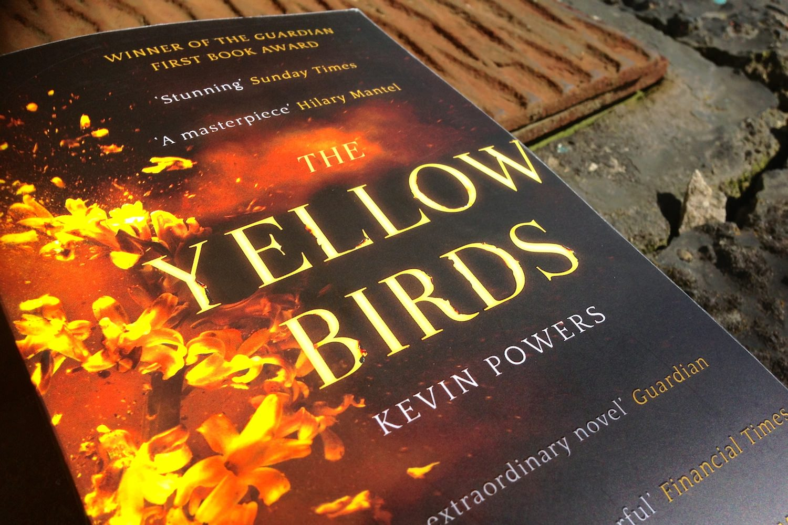
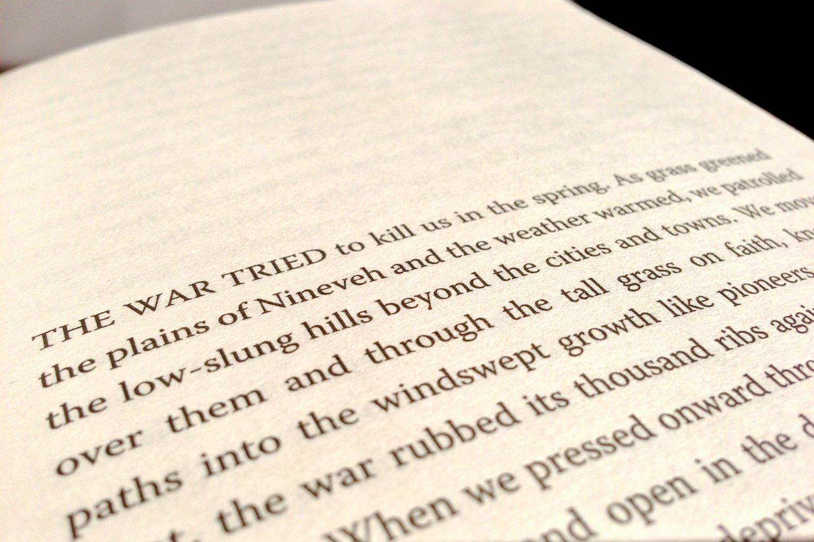

+++
type = "post"
titre = "<em>Yellow Birds</em>, Kevin Powers"
title = "Yellow Birds, Kevin Powers"
url = "/yellow-birds-power"
date = "2013-06-06T09:58:38"
Lastmod = "2013-06-06T11:19:15"
cover = "yellow-birds-kevin-powers.jpg"
categorie = [ "À lire" ]
tag = [ "Guerre", "Irak", "Mort", "Psychologie", "Société" ]
createur = [ "Kevin Powers" ]
annee = [ "2013" ]
weight = 2013
pays = [ "États-Unis" ]
original = "The Yellow Birds"

+++

La guerre en Irak a déjà été le sujet de plusieurs films, de <a href="/green-zone-greengrass/" title="Green Zone, Paul Greengrass"><em>Green Zone</em></a> à <a href="/demineurs-kathryn-bigelow/" title="Démineurs, Kathryn Bigelow"><em>Démineurs</em></a> pour ne citer qu’eux, elle est aussi un sujet de littérature. C’est encore le cas <em>Yellow Birds</em>, récit poignant d’un homme qui a connu la guerre de l’intérieur. Kevin Powers lui-même est un vétéran qui s’est engagé volontairement dans cette guerre en 2005, mais son premier roman n’est pas un récit autobiographique, en tout cas pas totalement. C’est en tout cas l’histoire si terriblement banale, mais saisissante d’un homme qui ne se remet pas d’une guerre qui l’a transformé sans doute à jamais. Un roman bref et intense, pas très joyeux évidemment, mais passionnant. 

<blockquote class="pull-quote">
La guerre prendrait ce qu’elle pourrait. Elle était patiente. Elle n’avait que faire des objectifs, des frontières. Elle se fichait de savoir si vous étiez aimé ou non. La guerre s’introduisit dans mes rêves cet été-là, et me révéla son seul et unique but : continuer, tout simplement continuer. Et je savais qu’elle irait jusqu’au bout.<cite class="author"> — Kevin Powers, Yellow Birds, 1 Septembre 2004</cite>

</blockquote>

Dès les premières lignes, <em>Yellow Birds</em> nous prend aux tripes et nous plonge dans l’enfer de la guerre en Irak. Kevin Powers ouvre son roman à <a href="https://maps.google.fr/maps?q=36.373751,42.451773&ll=36.372023,42.450142&spn=0.064825,0.103683&num=1&t=h&z=14">Tal Afar</a>, une ville de la province de Ninive, au nord du pays. On est alors en septembre 2004, plus d’un an après le début des hostilités et les États-Unis sont alors embourbés dans une guérilla urbaine dont ils n’arrivent pas à se dépêtrer. Bartle est l’un des soldats sur le front et c’est le narrateur du roman, à défaut d’en être vraiment un héros. Engagé volontaire, il est parti en Irak en quête d’aventure, pour changer un peu de vie, mais il ne s’attendait certainement pas à une telle difficulté. Sur place, tout, même un chien, peut être un ennemi à abattre pour ne pas mourir, la tension est extrême et on peut rapidement y perdre la tête, au sens figuré comme au propre. D’emblée, <em>Yellow Birds</em> témoigne de la difficulté de la guerre, certes, mais aussi et surtout du retour à la vie normale. Nonobstant un bref passage en 2003, juste avant le départ vers la guerre, et un bref détour en 2009 en guise d’épilogue, le bref roman est entièrement construit sur le mode de l’alternance. Kevin Powers évoque la guerre à Tal Afar en 2004, puis son retour au pays en 2005. Sans surprise, la guerre ne quitte jamais vraiment le récit et même quand il revient, Bartle reste encore un soldat au cœur du conflit. Sans doute parce qu’il l’a connue lui-même, le jeune romancier décrit mieux que quiconque la situation très difficile pour un vétéran de retour au pays. Sa main qui se ferme sur l’endroit où se trouvait son arme, son esprit qui ne parvient pas à échapper aux souvenirs de la guerre avec ces odeurs du fleuve qui remontent régulièrement… Le personnage principal est totalement perdu et incapable de retrouver une vie normale de société, mais c’est aussi et surtout parce qu’il est rongé par la culpabilité.

Si Bartle en est le narrateur, <em>Yellow Birds</em> contient un autre personnage essentiel : Murph. Alors que le premier a 21 ans au moment des combats, le second n’en a que 18. Il est tout jeune et on le place sous la protection de Bartle, comme c’est la coutume dans l’armée américaine. Dès les premières lignes, Kevin Powers casse toute forme de suspense en nous l’annonçant : Murph va mourir pendant la guerre et alors que Bartle part à deux, il revient seul d’Irak. Ce fait est acquis dès le départ, même si on ne saura qu’à la toute fin comment, exactement, est mort le soldat. Le plus important toutefois, c’est le deuxième chapitre du roman, quand le narrateur rencontre la mère de Murph alors que son régiment s’apprête à partir. Inquiète, celle-ci demande au soldat de protéger son fils, mais elle va jusqu’à lui demander une promesse : ramener son fils vivant. Désemparé, Bartle accepte et c’est précisément cette promesse qu’il ne peut pas tenir qui le ronge à son retour. Sans trop en dire — même si le suspense n’est pas un point fort de ce livre —, <em>Yellow Birds</em> est construit entièrement autour de cette promesse et de la mort de Murph et le lecteur attend, non sans une certaine inquiétude, le moment où elle va survenir et surtout le moment où Bartle devra avouer à la mère qu’il n’a pas su tenir sa promesse. L’ensemble permet à Kevin Powers de signer des pages très fortes, tandis que l’amitié qui unit les deux hommes est d’autant plus belle qu’on la sait sans avenir. Au total, ce roman est poignant à plus d’une reprise, sans doute aussi parce que le jeune romancier parvient à écrire avec une certaine poésie, même dans les moments les plus sombres. Sans rien épargner des détails horribles de la guerre, <em>Yellow Birds</em> parvient en effet à nous faire accepter l’inacceptable grâce à un style tout en finesse et très poétique, aussi bizarre que cela puisse paraître. 

Depuis la publication de <em>Yellow Birds</em>, Kevin Powers travaille sur un recueil de poèmes et il a reçu en 2012 une maîtrise de poésie à l’université d’Austin. On comprend alors mieux ce qui frappe le plus avec ce premier roman qui fait déjà d’une maturité étonnante. Loin du simple récit de la guerre en Irak, l’auteur signe un grand roman sur le conflit interne que mène son narrateur. Au fond, le contexte historique n’a que peu d’importance dans <em>Yellow Birds</em>, le récit aurait très bien pu se passer dans un autre contexte. Kevin Powers touche à l’universel, tout en offrant un récit saisissant d’émotion. Un roman passionnant, à lire !

<h3>Vous voulez m&rsquo;aider ?<a href="#footnote_0_9681" id="identifier_0_9681" class="footnote-link footnote-identifier-link" title="&Agrave; propos de la publicit&eacute;&hellip;">1</a></h3>
<ul>
<li><a href="http://www.amazon.fr/gp/product/2234073987/ref=as_li_ss_tl?ie=UTF8&tag=leblogdenic07-21&linkCode=as2&camp=1642&creative=19458&creativeASIN=2234073987">Acheter le livre en français sur Amazon</a> (<a href="http://www.amazon.fr/gp/product/B00BC032Y8/ref=as_li_ss_tl?ie=UTF8&tag=leblogdenic07-21&linkCode=as2&camp=1642&creative=19458&creativeASIN=B00BC032Y8">format Kindle</a>)</li>
<li><a href="http://www.amazon.fr/gp/product/144476876X/ref=as_li_ss_tl?ie=UTF8&tag=leblogdenic07-21&linkCode=as2&camp=1642&creative=19458&creativeASIN=144476876X">Acheter le livre en anglais sur Amazon</a> (<a href="http://www.amazon.fr/gp/product/B008MSI98C/ref=as_li_ss_tl?ie=UTF8&tag=leblogdenic07-21&linkCode=as2&camp=1642&creative=19458&creativeASIN=B008MSI98C">format Kindle</a>)</li>
<li>Acheter le livre sur l&rsquo;iBookstore : <a href="https://itunes.apple.com/fr/book/yellow-birds/id600438180?mt=11">en français</a> | <a href="https://itunes.apple.com/fr/book/the-yellow-birds/id542677383?mt=11">en anglais</a></li>
</ul>

<ol class="footnotes"><li id="footnote_0_9681" class="footnote"><a href="/soutien/">À propos de la publicité…</a> [<a href="#identifier_0_9681" class="footnote-link footnote-back-link">&#8617;</a>]</li></ol>
