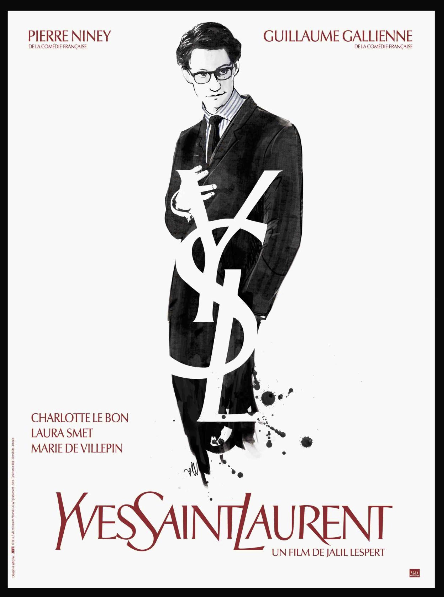
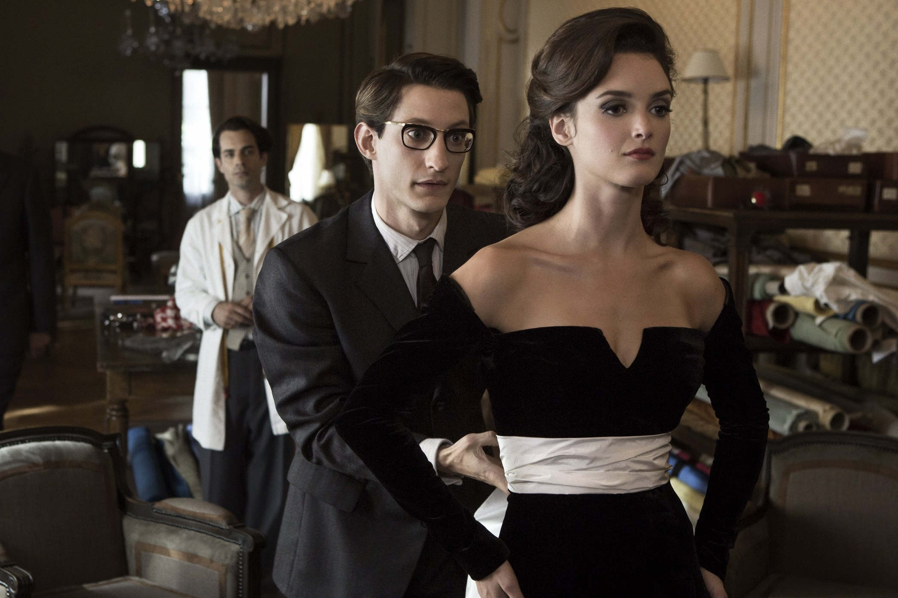
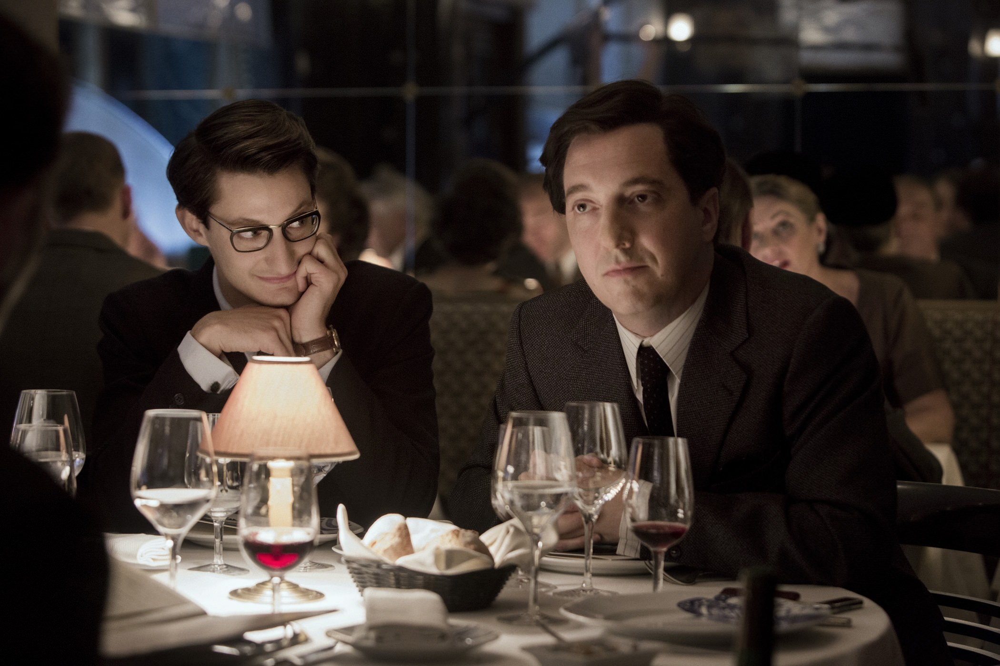

+++
type = "post"
titre = "<em>Yves Saint-Laurent</em>, Jalil Lespert"
title = "Yves Saint-Laurent, Jalil Lespert"
url = "/yves-saint-laurent-lespert"
date = "2015-02-21T19:43:34"
Lastmod = "2015-02-21T19:49:14"
cover = "yves-saint-laurent-pierre-niney.jpg"
position = "top"
categorie = [ "À voir" ]
tag = [ "Adaptation littéraire", "Amour", "Biopic", "Drame", "Histoire", "Histoire vraie", "Homosexualité", "Mode" ]
createur = [ "Jalil Lespert" ]
acteur = [ "Charlotte Le Bon", "Guillaume Gallienne", "Laura Smet", "Pierre Niney" ]
annee = [ "2014" ]
weight = 2014
pays = [ "France" ]

+++

2014 fut l&rsquo;année d&rsquo;Yves Saint-Laurent. Quelques mois avant le <a href="/saint-laurent-bonelllo/" title="Saint Laurent, Bertrand Bonello"><em>Saint Laurent</em></a> de Bertrand Bonello qui tentait de s&rsquo;éloigner du biopic sans y parvenir tout à fait, une première biographie filmée du grand couturier français sortait sur les écrans. Signé Jalil Lespert, <em>Yves Saint-Laurent</em> a beaucoup moins d&rsquo;ambition, puisqu&rsquo;il accepte tout à fait le genre du biopic et se contente de raconter l&rsquo;histoire du créateur. Les deux films se retrouvent sur beaucoup de points et celui-ci, comme son successeur, n&rsquo;évoque qu&rsquo;à peine le processus créatif pour mieux se concentrer sur l&rsquo;histoire d&rsquo;amour entre Yves Saint-Laurent et Pierre Bergé, à la fois compagnon et homme d&rsquo;affaires. L&rsquo;angle est intéressant et <em>Yves Saint-Laurent</em> parvient bien mieux à montrer leur amour à l&rsquo;écran. Pour autant, Jalil Lespert n&rsquo;a aucun angle particulier et son film manque sans doute d&rsquo;enjeux : on ne s&rsquo;ennuie pas, la reconstitution est efficace, mais on ne retiendra pas vraiment ce biopic très classique…

<em>Yves Saint-Laurent</em> remonte beaucoup plus loin que le <em>Saint Laurent</em> de Bertrand Bonello. Alors que ce dernier commençait après la rencontre de Pierre Bergé et surtout après la création de la maison Yves Saint-Laurent, Jalil Lespert ouvre son film bien avant, quand le créateur travaillait au service de la maison Dior. Ce choix permet au cinéaste de présenter son personnage comme un créateur génial, qui rencontre beaucoup de succès et qui, à la mort de Christian Dior, prend la direction artistique de cette grande entreprise de la mode française. Le film peut aussi plus facilement se concentrer sur l&rsquo;histoire d&rsquo;amour entre son personnage principal et Pierre Bergé. Le scénario détaille leur première rencontre, à un défilé de mode naturellement. Pierre tombe immédiatement amoureux d&rsquo;Yves, qui ne tarde pas à tomber sous le charme, lui aussi. Tout va très vite et les deux hommes finissent par emménager ensemble, et surtout créer une entreprise commune. <em>Yves Saint-Laurent</em> suit précisément la chronologie en rappelant que le grand couturier souffrait d&rsquo;une bipolarité qui l&rsquo;a conduit à être interné quelques jours peu après sa rencontre avec son compagnon. La maison Dior prend peur et le licencie, contribuant au passage sans le savoir à la création d&rsquo;une maison concurrente, celle d&rsquo;Yves Saint-Laurent. Dès le départ, c&rsquo;est Pierre Bergé qui finance l&rsquo;opération et c&rsquo;est lui qui la prend en charge, trouvant les capitaux et en constituant l&rsquo;équipe nécessaire. La suite est connue et Jalil Lespert montre les grands moments, avec les collections mythiques qui égrainent son film, des robes Mondrian jusqu&rsquo;à la collection inspirée par un séjour marocain, en 1976. Au total, une vingtaine d&rsquo;années et c&rsquo;est tout : le film ne s&rsquo;attarde pas vraiment sur les trente dernières années de la vie du créateur, même s&rsquo;il évoque brièvement la vente aux enchères organisée par Pierre Bergé après la mort de son compagnon.

La plus grosse différence entre les deux projets, c&rsquo;est sans doute que ce film a été approuvé par Pierre Bergé. L&rsquo;homme a même participé à son élaboration, conseillant Guillaume Gallienne qui l&rsquo;interprète par ailleurs très bien, mais aussi Pierre Niney qui recrée un Yves Saint-Laurent plus vrai que nature. Cette approbation a permis à Jalil Lespert d&rsquo;utiliser le logo de l&rsquo;entreprise, mais aussi d&rsquo;accéder à quelques-uns des costumes originaux ou encore à des dessins originaux du créateur. À moins d&rsquo;être un fin connaisseur de la mode, cet avantage risque bien de ne pas peser beaucoup de poids à l&rsquo;image, car <em>Yves Saint-Laurent</em> aurait très bien pu s&rsquo;en tirer avec des reproductions. Mais cette autorisation officielle<a href="#fn-13203-1" rel="footnote">1</a> explique sans doute aussi l&rsquo;orientation générale du film. Le réalisateur a beau expliquer qu&rsquo;il n&rsquo;a pas voulu masquer la part d&rsquo;ombre d&rsquo;Yves Saint-Laurent, on est loin, très loin, du portrait de <em>Saint Laurent</em>. Là où Bertrand Bonello insistait, peut-être un peu lourdement d&rsquo;ailleurs, sur les aventures sexuelles mêlées de drogue de son personnage, ici tout est adouci. La relation du grand couturier avec Jacques de Bascher est évacuée et on en voit encore moins sur ce que fait Pierre Bergé pour séparer les deux amants. On voit bien Yves consommer un peu de drogue ici ou là, mais son portrait est beaucoup plus sympathique dans l&rsquo;ensemble. Sa folie est surtout créatrice et autant son histoire d&rsquo;amour est très bien rendue, autant le film passe indiscutablement à côté de sa noirceur. C&rsquo;est dommage, d&rsquo;autant que le long-métrage ne montre absolument rien sur le processus de création — on ne pensait pas qu&rsquo;on pouvait faire pire que dans <em>Saint Laurent</em> — et il ne reste pas grand-chose au total.

Jamais déplaisant, <em>Yves Saint-Laurent</em> est un biopic bien trop sage pour rester dans les mémoires. Les deux acteurs principaux sont excellents, Pierre Niney fait revivre le créateur jusqu&rsquo;au ton de sa voix et sa manière de parler, mais tout ceci est la base du genre, tout de même. Jalil Lespert explique avoir été touché avant tout par l&rsquo;histoire d&rsquo;amour, et il est vrai qu&rsquo;il l&rsquo;a très bien rendue à l&rsquo;écran. Mais cette histoire domine tout, au point d&rsquo;éliminer toutes les spécificités de l&rsquo;histoire d&rsquo;Yves Saint-Laurent. Toutes les robes originales n&rsquo;y ont rien fait, <em>Yves Saint-Laurent</em> passe en grande partie à côté de la mode, dommage…

<h3>Vous voulez <a href="/soutien/">m&rsquo;aider</a> ?</h3>
<ul>
<li><a href="http://www.amazon.fr/gp/product/B00I8PZFH2/ref=as_li_ss_tl?ie=UTF8&amp;tag=leblogdenic07-21&amp;linkCode=as2&amp;camp=1642&amp;creative=19458&amp;creativeASIN=B00I8PZFH2">Acheter le film en Blu-ray sur Amazon</a></li>
<li><a href="http://www.amazon.fr/gp/product/B00HYJRKDA/ref=as_li_ss_tl?ie=UTF8&amp;tag=leblogdenic07-21&amp;linkCode=as2&amp;camp=1642&amp;creative=19458&amp;creativeASIN=B00HYJRKDA">Acheter le film en DVD sur Amazon</a></li>
<li><a href="https://itunes.apple.com/fr/movie/yves-saint-laurent/id806059030">Acheter ou louer le film sur l&rsquo;iTunes Store</a></li>
</ul>

<ol>
<li id="fn-13203-1">
Qui va même plus loin, de la part de Pierre Bergé. Ce dernier n&rsquo;a pas manqué de saluer le travail de Jalil Lespert, tout en critiquant celui de Bertrand Bonello. Et ce, jusqu&rsquo;à la cérémonie des César qui a salué le travail de Pierre Niney, plutôt que l&rsquo;interprétation de Gaspard Ulliel. Pierre Bergé s&rsquo;est alors fendu d&rsquo;<a href="https://twitter.com/pvgberge/status/568915528628232194">un tweet</a> pour féliciter l&rsquo;acteur, avant d&rsquo;en publier <a href="https://twitter.com/pvgberge/status/568927420088131584">un deuxième</a> où il qualifie <em>Saint Laurent</em> de « <em>film méchant, homophobe</em> ». Il a la rancœur tenace.&#160;<a href="#fnref-13203-1" rev="footnote">&#8617;</a>
</li>
</ol>

