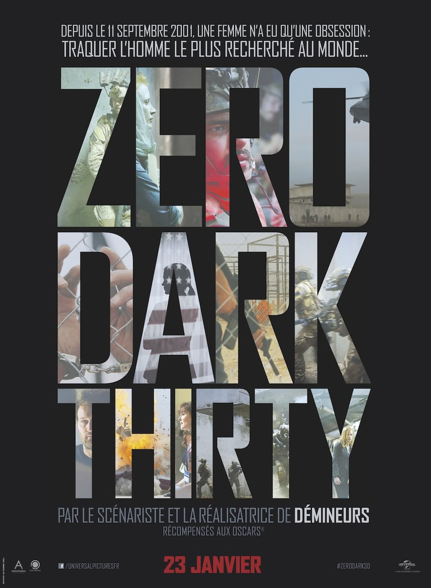
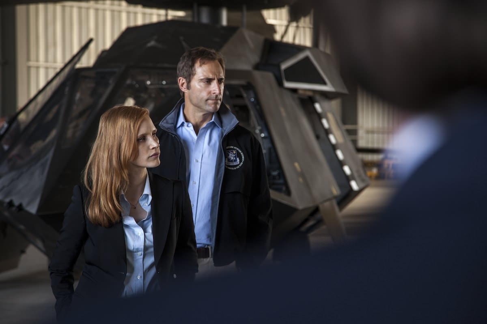
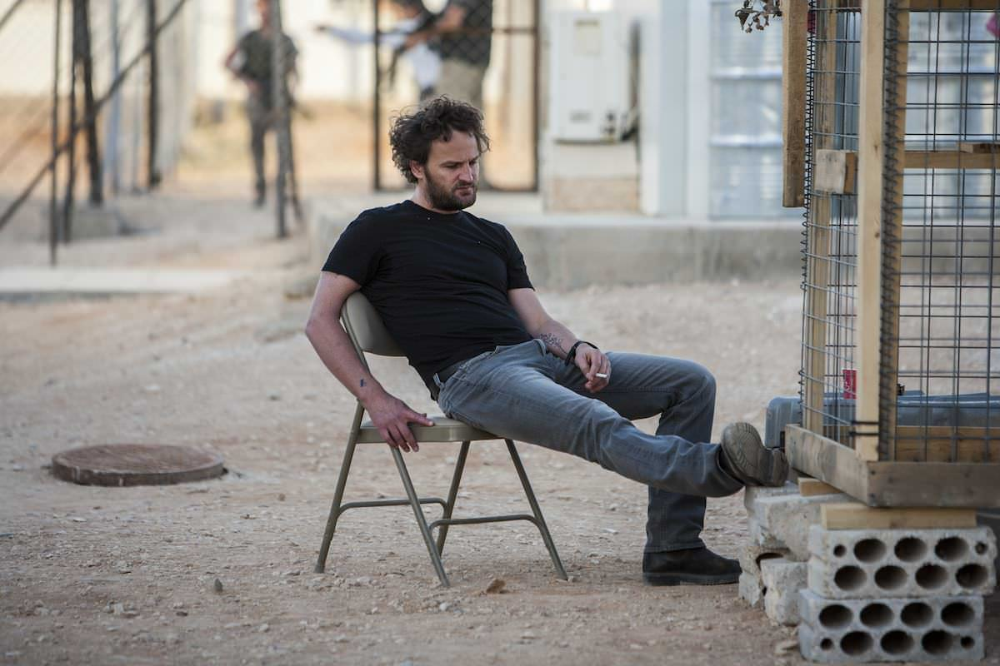

+++
type = "post"
titre = "<em>Zero Dark Thirty</em>, Kathryn Bigelow"
title = "Zero Dark Thirty, Kathryn Bigelow"
url = "/zero-dark-thirty-bigelow"
date = "2013-01-26T23:47:24"
Lastmod = "2015-06-11T15:20:32"
cover = "zero-dark-thirty-bigelow-jessica-chastain.jpg"
categorie = [ "À voir" ]
tag = [ "Action", "Blockbuster", "Guerre", "Histoire", "Histoire vraie", "Société", "Suspense", "Terrorisme", "Violence" ]
createur = [ "Kathryn Bigelow" ]
acteur = [ "Harold Perrineau", "Jessica Chastain", "Joel Edgerton", "Mark Strong" ]
annee = [ "2013" ]
weight = 2013
pays = [ "États-Unis" ]

+++

Filmer la traque et la chute de Ben Laden, un sujet en or pour un cinéaste. Kathryn Bigelow, qui s’était déjà emparée avec brio de l’actualité récente avec <a href="/2009/10/07/demineurs-kathryn-bigelow/" title="Démineurs, Kathryn Bigelow - À voir et à manger"><em>Démineurs</em></a>, s’est saisie de ce sujet passionnant. <em>Zero Dark Thirty</em> suit un agent de la CIA à la recherche de l’homme qui a réussi à terroriser les États-Unis avec les attentats du 11 septembre. Entre Pakistan, Afghanistan et États-Unis, le long-métrage explore la traque impitoyable et un peu à l’aveugle du terroriste, jusqu’à l’attaque contre sa maison et sa mise à mort. Loin de n’être qu’un documentaire, Kathryn Bigelow constitue un blockbuster très documenté, mais aussi extrêmement prenant, une réussite.

Ces images ont fait le tour du monde. Sur <a href="http://www.flickr.com/photos/whitehouse/5680724572/">la première</a>, on découvrait le président des États-Unis et son équipe dans la salle de crise de la Maison-Blanche. Les <a href="http://www.ina.fr/video/4452134002039/mort-de-oussama-ben-laden-l-operation-commando.fr.html">secondes</a>, ce sont les images de la maison où se cachait Oussama Ben Laden quand les forces spéciales américaines ont lancé l’assaut et les images du visage tuméfié de l’ennemi numéro un des États-Unis. C’était le 2 mai 2011, il n’y a même pas deux ans et déjà un film enregistre cet évènement comme un fait historique. <em>Zero Dark Thirty</em> consacre une large part à cet assaut, dans un final haletant, mais ce qui intéresse Kathryn Bigelow, c’est plutôt la recherche préalable. Avant les attentats du 11 septembre, Oussama Ben Laden était déjà un terroriste jugé extrêmement sérieusement par les États-Unis ; après l’effondrement du World Trade Center, sa traque justifie à elle seule deux guerres, en Afghanistan puis en Irak, et le pays ne ménage pas ses efforts pour le retrouver. Le film ouvre d’ailleurs longtemps avant la capture, en 2003 : Maya est une jeune recrue de la CIA envoyée à l’ambassade américaine au Pakistan. Son rôle est simple, retrouver le meneur d’Al-Qaïda, à n’importe quel prix. En ces années de guerre — celle d’Irak vient tout juste de commencer —, tous les moyens sont bons et tous ceux qui sont suspectés d’avoir participé, de près ou de loin, à des opérations terroristes sont torturés physiquement et psychologiquement jusqu’à les faire craquer. Les Américains ont beau obtenir des renseignements par ce biais, ils n’avancent pas vraiment et les années passent sans leur permettre de marquer des points contre l’organisation terroriste qui se révèle d’une redoutable efficacité. Alors que les attentats se multiplient dans la région, mais aussi à Londres et ailleurs en Occident, les pressions se font de plus en plus fortes sur Maya et ses collègues, mais le changement de politique qui suit les élections de 2008 ne simplifie pas les choses…

Après une introduction sonore qui rappelle le contexte — les attentats du 11 septembre —, <em>Zero Dark Thirty</em> ouvre sur une scène de torture. Maya vient juste d’arriver au Pakistan et son supérieur est en train de mener un interrogatoire musclé. Un homme qu’ils suspectent d’avoir servi de relai entre des terroristes et peut-être même d’avoir rencontré Oussama Ben Laden un jour. Brutale, cette scène d’ouverture ne ménage pas les spectateurs, d’autant que Kathryn Bigelow prend son temps pour bien la présenter et mettre en valeur toutes les pratiques abjectes d’alors. On est encore trop près des attentats pour prendre des pincettes ou s’inquiéter du respect des règles internationales : la fin justifie les moyens et même si Maya est d’abord un peu choquée, elle prend vite sur elle et devient pratiquement pire tortionnaire que son supérieur. <em>Zero Dark Thirty</em> est ainsi, un long-métrage long, dense et intense. Sur près de 2h30, la cinéaste déroule son sujet sans dévier une seule fois de sa traque, pour un film aussi impitoyable que son sujet. L’avertissement n’est pas de trop, on en prend plein la vue et certaines scènes — surtout les tortures au début et le massacre final — peuvent choquer les âmes les plus sensibles. Ce n’est pas de la violence gratuite toutefois, Kathryn Bigelow respecte son sujet de départ et il évoque un contexte violent qu’il était difficile d’évacuer. C’est d’autant moins le cas que <em>Zero Dark Thirty</em> entend coller au plus près à la réalité et son scénario, écrit par Mark Boal qui avait déjà travaillé sur <em>Démineurs</em>, s’est documenté de façon très sérieuse et il livre ici une version parfaitement crédible des évènements.

Le scénario de <em>Zero Dark Thirty</em> est parfaitement crédible et Kathryn Bigelow a opté pour une réalisation à hauteur de documentaire, au ras du sol. Dès cette première scène qui plonge le spectateur au cœur d’un interrogatoire musclé, on est transporté dans la guerre menée par la CIA et l’armée américaine contre le terrorisme. La cinéaste opte pour un cadrage frontal, sans cacher son sujet pourtant sensible et ce sera le cas pendant toute la durée de son film. La capture et la mise à mort d’Oussama Ben Laden à la fin du long-métrage sont éprouvantes précisément pour cette raison : on est avec les soldats, quasiment en temps réel, à entrer dans cette grande villa fortifiée. On a beau savoir exactement comment tout cela se terminera, la suspense est intense et on a vraiment parfois le sentiment d’être dans un documentaire plus que dans un blockbuster. C’est le cas autant sur le terrain que dans les bureaux américains où <em>Zero Dark Thirty</em> se déroule inévitablement. La bureaucratie d’un côté, les forces sur le terrain de l’autre, le film avance ainsi en suivant scrupuleusement la chronologie pour ne pas trop perdre ses spectateurs, mais en slalomant entre les personnages et les organismes. Ce n’est pas une critique, mais la densité de son scénario force à une attention de tous les instants : on est loin du vide relatif du précédent film de Kathryn Bigelow… Ici, on ne s’ennuie jamais vraiment, même si on se demande souvent comment la CIA va finir par tomber sur le terroriste. Le montage est efficace, mais la cinéaste a la bonne idée de ne pas trop jouer sur des mouvements de caméra trop rapides, un bon point par rapport à <a href="/2010/04/26/green-zone-greengrass/" title="Green Zone, Paul Greengrass - À voir et à manger"><em>Green Zone</em></a> qui se déroulait pendant la Guerre en Irak.

Peut-on vraiment parler de docufiction ? Pas vraiment, car les informations disponibles sont sans doute encore trop peu nombreuses pour offrir une lecture fiable de l’évènement. Qu’importe, après tout, <em>Zero Dark Thirty</em> offre une ambiance de documentaire et les informations données par Kathryn Bigelow sont toutes sérieuses et <em>a priori</em> fiables. Le long-métrage s’éloigne en revanche du genre en laissant une place importante à Maya : la jeune femme a été recrutée par la CIA quelques années avant le début du film et elle a passé sa carrière et sa vie quelque part à traquer Oussama Ben Laden. Cette tâche, on pourrait presque dire cette mission, devient un sacerdoce, sa raison de vivre et elle est obsédée à l’idée de remonter le réseau d’Al-Qaïda jusqu’à son dirigeant. C’est cette obsession qui justifie son acceptation de la torture, jugée par le personnage comme un mal nécessaire pour avancer. Plus tard, alors que la nouvelle administration américaine s’avère plus regardante, c’est sa détermination à faire avancer les choses qui frappent. La maison forte est découverte grâce à Maya, mais il faut ensuite plusieurs mois pour lancer l’assaut. <em>Zero Dark Thirty</em> montre bien l’obsession de la jeune femme qui se désespère de ne pas voir son dossier avancer. Il faut dire que l&rsquo;enquête patine beaucoup dans le film comme dans la vie et les 2h30 sont en grande partie faites de frustrations et d&rsquo;erreurs. Quand, enfin, l’assaut est lancé, Kathryn Bigelow transmet parfaitement bien son état de stress intense, un stress qui contamine le public qui sait pourtant qu’Oussama Ben Laden est bien dans la villa. Une fois l’ennemi numéro un abattu, Maya ne peut que ressentir un grand vide dans sa vie et le film se termine sur la vision assez émouvante de cette femme qui n’a jamais rien connu d’autre que la traque d’un homme et qui ressent un grand vide maintenant que cet homme est mort. <em>Zero Dark Thirty</em> avait besoin d’une excellente actrice pour interpréter avec justesse ce rôle et Kathryn Bigelow est incontestablement bien tombée avec Jessica Chastain, parfaitement juste.

Encore une fois, le cinéma américain prouve sa faculté à digérer les faits les plus récents. <em>Zero Dark Thirty</em> évoque des évènements qui n’ont même pas deux ans, et c’est déjà de l’Histoire. Kathryn Bigelow en tire aussi une histoire particulièrement prenante, un thriller extrêmement efficace et un film passionnant sur la détermination d’une femme. Seule la présentation de la torture comme un mal nécessaire peut choquer, mais elle se comprend dans le cadre d&rsquo;une représentation réaliste…

<h3>Vous voulez m&rsquo;aider ?</h3>
<ul>
<li><a href="http://www.amazon.fr/gp/product/B00B7GYQ4W/ref=as_li_ss_tl?ie=UTF8&tag=leblogdenic07-21&linkCode=as2&camp=1642&creative=19458&creativeASIN=B00B7GYQ4W">Acheter le film en Blu-Ray sur Amazon</a></li>
<li><a href="http://www.amazon.fr/gp/product/B00B7GYPPW/ref=as_li_ss_tl?ie=UTF8&tag=leblogdenic07-21&linkCode=as2&camp=1642&creative=19458&creativeASIN=B00B7GYPPW">Acheter le film en DVD sur Amazon</a></li>
<li><a href="https://itunes.apple.com/fr/movie/zero-dark-thirty/id615490170">Acheter ou louer le film sur l&rsquo;iTunes Store</a></li>
</ul>

