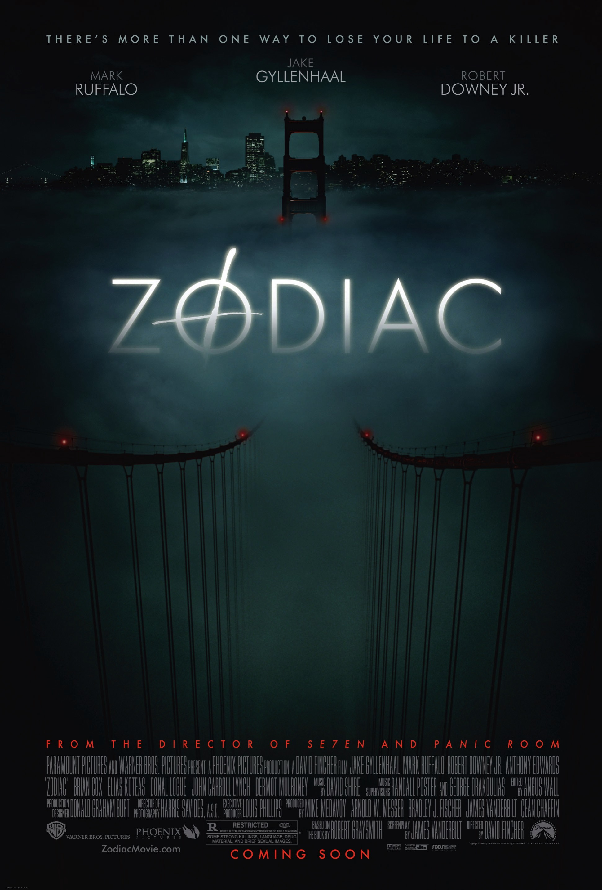
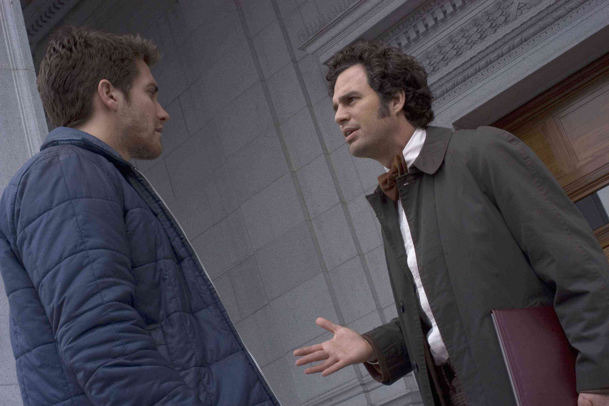
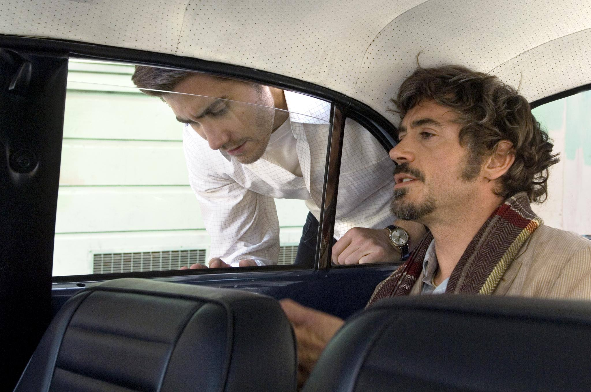

+++
type = "post"
titre = "<em>Zodiac</em>, David Fincher"
title = "Zodiac, David Fincher"
url = "/zodiac-fincher"
date = "2015-04-09T22:59:48"
Lastmod = "2015-04-09T23:00:33"
cover = "zodiac-david-fincher.jpg"
categorie = [ "À voir" ]
tag = [ "Adaptation littéraire", "Drame", "Enquête", "Histoire vraie", "Mort", "Police", "Serial-killer", "Thriller" ]
createur = [ "David Fincher" ]
acteur = [ "Anthony Edwards", "Chloë Sevigny", "Jake Gyllenhaal", "John Carroll Lynch", "Mark Ruffalo", "Robert Downey Jr" ]
annee = [ "2007" ]
weight = 2007
pays = [ "États-Unis" ]

+++

Pour la première fois de sa carrière, David Fincher réalise un film à partir de faits réels. En l&rsquo;occurrence, <em>Zodiac</em> plonge dans la Californie des années 1960 et 1970, à l&rsquo;époque où un serial-killer, surnommé « le tueur du Zodiaque » sévissait. Son histoire est intéressante, non pas tant par les meurtres en eux-mêmes, que par le fait étonnant que l&rsquo;affaire… n&rsquo;a jamais été résolue. Même si elle a été plus ou moins clôturée au début des années 2000, on ne sait pas officiellement qui était ce serial-killer et c&rsquo;est précisément ce qui intéresse David Fincher. Avec <em>Zodiac</em>, il ne raconte pas vraiment l&rsquo;histoire d&rsquo;un meurtrier ou de ses victimes, mais plutôt de ceux qui ont été sur ses traces pendant des décennies. Un angle intéressant, pour un long-métrage  passionnant, précisément parce qu&rsquo;il frustre par son manque de réponses.

<em>Zodiac</em> ouvre sur un meurtre. Il fait nuit, deux jeunes dans une voiture cherchent un coin tranquille quand une voiture sombre vient les déranger. La fille s&rsquo;inquiète, mais la voiture repart finalement… pour revenir quelques minutes plus tard. Un homme en sort avec une lampe torche à la main et un pistolet, il tue la jeune fille et blesse celui qui l&rsquo;accompagnait avant de fuir. Jusque-là, c&rsquo;est un meurtre assez banal, mais il prend une toute autre dimension quand le <em>San Francisco Chronicle</em> reçoit une lettre du tueur. Ce dernier s&rsquo;identifie en donnant des détails qui n&rsquo;ont jamais été publiés et il menace de tuer tous les enfants d&rsquo;un bus scolaire si le journal ne publie pas une grille qui est censée révéler son nom. C&rsquo;est là que l&rsquo;affaire prend un air étrange, et que le sixième long-métrage de David Fincher se met en place. Dans ce journal local travaille Robert Graysmith, un jeune dessinateur qui se montre d&rsquo;emblée très intéressé par ce tueur qui exprime clairement son plaisir à tuer et son désir de recommencer dans une lettre. Il s&rsquo;attelle aussi immédiatement à déchiffrer le message codé et y parvient assez facilement : alors qu&rsquo;il n&rsquo;est censé être qu&rsquo;un dessinateur, ce que ses supérieurs ne manquent pas de lui rappeler régulièrement, il se passionne pour cette histoire et il ne la lâche pas. Ceux qui devraient s&rsquo;en charger l&rsquo;abandonnent vite, de son collègue journaliste Paul Avery à Dave Toschi, l&rsquo;inspecteur en charge de l&rsquo;affaire. Pour des raisons différentes, ils finissent par abandonner le Zodiaque, mais pas ce dessinateur qui s&rsquo;accroche malgré tout et qui parvient d&rsquo;ailleurs à faire avancer l&rsquo;affaire. Mais comme on le disait en préambule, ça ne sert à rien finalement : <em>Zodiac</em> est, à cet égard, très frustrant, mais c&rsquo;est aussi ce qui fait sa réussite.

Quand le film commence, surtout si on ne connaît pas l&rsquo;histoire vraie qui l&rsquo;a inspiré, on s&rsquo;attend à une enquête resserrée, dans l&rsquo;esprit de <a href="http://voiretmanger.fr/seven-fincher/" title="Seven, David Fincher"><em>Seven</em></a>. On s&rsquo;aperçoit toutefois vite qu&rsquo;il n&rsquo;en est rien, et pour cause : ici, l&rsquo;enquête n&rsquo;avance pas rapidement, elle prend son temps et patine même sévèrement. David Fincher impose un rythme assez lent tout au long de son film et on n&rsquo;a jamais le sentiment d&rsquo;être dans un thriller énervé. On assiste plutôt à l&rsquo;échec d&rsquo;une police qui ne suit que des fausses pistes et à l&rsquo;échec personnel d&rsquo;un journaliste qui sombre dans l&rsquo;alcool. Rien ne fonctionne normalement dans cette enquête et on n&rsquo;est, au fond, pas surpris qu&rsquo;elle n&rsquo;aboutisse pas. Il y a ces policiers qui croisent le meurtrier sans l&rsquo;arrêter, car ils ne cherchaient qu&rsquo;un homme noir. Il y a cette scène de crime totalement ruinée par un autre policier qui, pensant bien faire,  Il y a aussi des éléments essentiels qui passent complètement à la trappe pendant l&rsquo;enquête, sans que l&rsquo;on sache très bien pourquoi. Et à la fin, il y a un suspect qui paraît idéal, mais qui sort totalement libre, faute de preuves concluantes. C&rsquo;est une enquête frustrante en ce sens, car elle avance parfois à grands pas, puis se referme brutalement. Ce qui explique les longueurs que l&rsquo;on peut ressentir, mais qui ne sont absolument pas gênantes. David Fincher se concentre sur trois personnages principaux et tout particulièrement sur Robert Graysmith, ce dessinateur qui devient enquêteur et qui finit par écrire un livre sur l&rsquo;affaire. À défaut de savoir qui est à l&rsquo;origine des crimes — même si <em>Zodiac</em> laisse assez peu de place au doute —, on s&rsquo;intéresse aux personnages et le film reste ainsi toujours très plaisant. Il est aussi une réussite formelle, avec une image toujours aussi parfaite et une narration toujours fluide, que l&rsquo;on suit facilement. Le scénario a beau se dérouler sur près de 40 ans, on n&rsquo;est ainsi jamais perdu.

Porté par un trio d&rsquo;acteurs principaux très convaincants — Jake Gyllenhaal parfait en dessinateur naïf, Robert Downey Jr excellent en journaliste alcoolique et Mark Ruffalo brillant en policier impuissant —, <em>Zodiac</em> est une réussite. Certes, David Fincher raconte une histoire policière qui peut être frustrante par sa fin irrésolue, mais son film n&rsquo;est absolument pas pénible à regarder. Lent, mais bien rythmé, le long-métrage convainc du début à la fin.

<h3>Vous voulez <a href="http://voiretmanger.fr/soutien/">m&rsquo;aider</a> ?</h3>
<ul>
<li><a href="http://www.amazon.fr/gp/product/B001927NA8/ref=as_li_ss_tl?ie=UTF8&amp;tag=leblogdenic07-21&amp;linkCode=as2&amp;camp=1642&amp;creative=19458&amp;creativeASIN=B001927NA8">Acheter le film en Blu-ray sur Amazon</a></li>
<li><a href="http://www.amazon.fr/gp/product/B000WVPYWG/ref=as_li_ss_tl?ie=UTF8&amp;tag=leblogdenic07-21&amp;linkCode=as2&amp;camp=1642&amp;creative=19458&amp;creativeASIN=B000WVPYWG">Acheter le film en DVD sur Amazon</a></li>
<li><a href="https://itunes.apple.com/fr/movie/zodiac/id389691968">Acheter ou louer le film sur l&rsquo;iTunes Store</a></li>
</ul>

