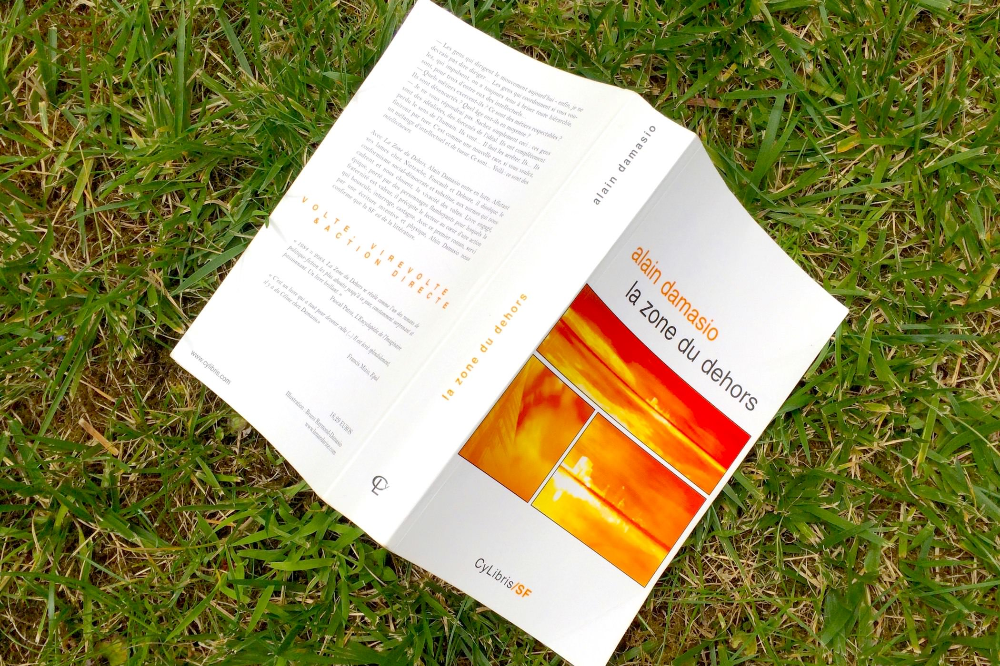
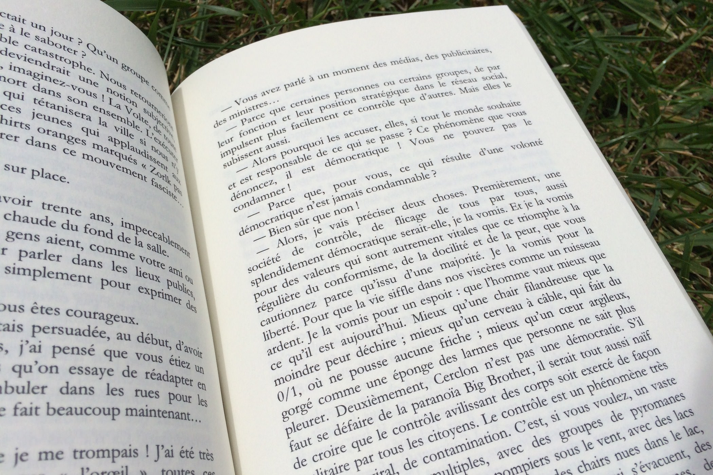
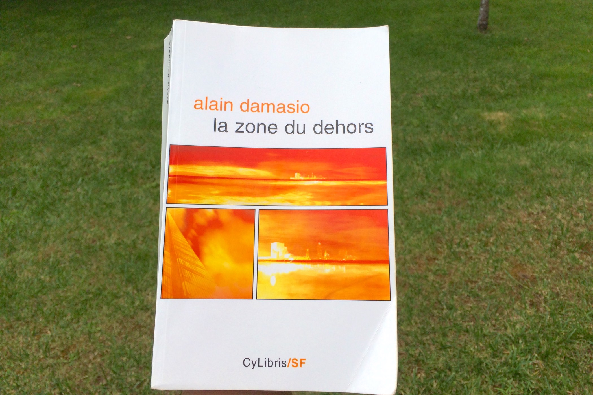

+++
titre = "<em>La Zone du Dehors</em>, Alain Damasio"
title = "La Zone du Dehors, Alain Damasio"
url = "/zone-dehors-damasio"
date = "2014-07-16T11:50:06"
Lastmod = "2014-07-16T11:59:11"
cover = "la-zone-du-dehors-alain-damasio.jpg"
categorie = [ "À lire" ]
tag = [ "Apocalypse", "Dystopie", "Philosophie", "Police", "Politique", "Roman", "Science-Fiction" ]
createur = [ "Alain Damasio" ]
annee = [ "1999" ]
weight = 1999
pays = [ "France" ]

+++

Pour son premier roman, le projet d’Alain Damasio semble classique, peut-être même déjà vu. <em>La Zone du Dehors</em> se déroule dans le futur, précisément en 2084 et cette date n’a, évidemment, pas été choisie au hasard. Posant ainsi son récit dans les traces du <em>1984</em> de Georges Orwell, le romancier français marque d’emblée l’une de ses inspirations. On aurait tort pourtant de penser qu’il ne s’agit que d’une relecture orwellienne, ou d’une remise à niveau en fonction des innovations technologiques que le romancier anglais n’avait pas pu prévoir. <em>La Zone du Dehors</em> est en fait un ouvrage bien plus ambitieux : se rapportant autant aux grands auteurs de la science-fiction qu’à Nietzsche ou encore à Foucault, cette dystopie est peut-être l’une des plus grandes critiques de nos démocraties modernes.

<blockquote class="pull-quote">
Nous n’avons jamais été aussi proches de ce que j’estime être le summum du pouvoir : une aliénation optimum sous les apparences d’une liberté totale.<cite class="author"> — Alain Damasio, La Zone du Dehors, Chapitre 10. « A »</cite>

</blockquote>

C’est en ces mots que le président de Cerclon définit la démocratie, ou du moins le régime mis en place dans la ville où se déroule l’action du roman. <em>La Zone du Dehors</em> imagine qu’une guerre chimique a détruit quasiment la totalité de la surface terrestre et qu’il ne reste plus que l’Afrique pour vivre sur Terre. En réaction, les plus riches ont quitté la planète pour s’installer sur des colonies installées sur un satellite de Saturne : sur un petit astéroïde, un espace a été aménagé pour permettre la vie. L’air y a été régulé et cette ville qui rassemble sept millions de personnes quand le récit commence a été organisée de manière très stricte. Créée <em>ex nihilo</em>, cette société spatiale a été pensée comme une société parfaite qui fonctionne de manière très régulée. Pour laisser sur Terre ce qui a été considéré comme des tares des sociétés traditionnelles, comme la pauvreté ou la violence, Cerclon a éliminé bon nombre d’éléments. Il n’y a pas de monnaie et tous les habitants sont organisés les uns par rapport aux autres : chaque personne a une place bien définie dans la société, et avec elle un rôle. Le président et son gouvernement sont vingt-six et ils se partagent ainsi les lettres de l’alphabet : A est président, puis de B à Z, on a les ministres. Viennent ensuite tous ceux qui aident le gouvernement et les citoyens les plus importants, d’Aa à Zz. Trois lettres sont données au rang suivant, puis quatre, cinq… jusqu’au dernier, Qzaac, le cancre de la société. L’originalité de la vision proposée par Alain Damasio est que cette organisation n’est pas définie à la naissance et inchangée ensuite. Tous les deux ans, le Clastre — c’est le nom de cette organisation — est remis en jeu et chaque citoyen jugé en fonction de critères objectifs. On peut ainsi perdre ou gagner des places en fonction de ses réussites professionnelles, mais aussi et surtout de son rôle dans la société et donc du jugement des proches.

Dans <em>1984</em>, le pouvoir extrêmement centralisé instauré une forme de dictature poussée à l’extrême. Dans <em>La Zone du Dehors</em>, c’est un autre régime qui a été poussé dans ses retranchements : la démocratie. Car c’est tout le génie du régime mis en place sur Cerclon de rester une démocratie. Tout est ouvert et démocratique et ce sont en fait les citoyens eux-mêmes qui choisissent du rang, et donc du rôle de tous les autres citoyens. Un professeur par exemple est évalué en fonction de l’avis de ses supérieurs, mais aussi de ses élèves et seul le plus populaire peut avoir un espoir de monter en grade. De ce fait, tout un chacun a intérêt à respecter au mieux les critères du Clastre s’il espère voir son rang s’élever. Alain Damasio insiste longuement dans son roman sur cet aspect : puisque tout est si démocratique, puisque tout le monde juge tout le monde, on se contraint tous à une censure qui n’est pas imposée d’en haut, mais qui vient de chacun de nous. Cette autocensure empêche les habitants de Cerclon de faire n’importe quoi, elle les appelle à respecter la norme. Ce respect envers et contre tout d’une norme permet <em>in fine</em> au gouvernement de faire respecter son ordre, sans même faire intervenir de forces armées. À l’image des gros humains impuissants de <a href="http://voiretmanger.fr/wall-e-dernier-bijou-des-studios-pixar/"><em>Wall-E</em></a>, la société leur offre tout ce qu’ils pourraient imaginer. Les habitants n’ont besoin de rien et ils ne veulent surtout rien faire pour nuire à leur avancement : ils sont totalement passifs et conditionnés.

<blockquote class="pull-quote">
Vous êtes de bonnes machines, les amis, des androïdes de qualité. Vos viscères sentent leur tuyau propre et curé. Vous prenez tout ce qui vient, toutes les normes et les modes, tous les désirs préformatés que font converger sur nous médias et annonceurs, contrôleurs et ministres,, et vous les répartissez dans les bonnes cases, comme des enfants doués. On vous remplit, et vous absorbez, vous absorbez, vous absorbez : il n’y a pas assez de bouteilles pour saturer vos têtes d’éponge !<cite class="author"> — Alain Damasio, La Zone du Dehors, Chapitre 7. Les Clameurs</cite>

</blockquote>

<em>La Zone du Dehors</em> imagine une révolution sourde dans cette société éteinte : la Volte n’est pas un mouvement révolutionnaire, d’où d’ailleurs son nom amputé d’une syllabe. L’enjeu est d’abord de réveiller les consciences pour espérer un soulèvement populaire, mais la société est tellement ensuquée que c’est une tâche quasiment impossible. Le roman évoque pourtant les évolutions du mouvement et suit pour cela Captp, professeur d’université qui est, avec quatre autres, à la tête de la Volte. Même si, comme toujours chez Alain Damasio, le narrateur n’est pas unique ici : on passe d’un personnage à l’autre à l’intérieur même d’un chapitre. L’auteur place un « > » pour signifier le changement, mais on peut aussi le lire dans le style : chaque voix a son style propre et le romancier a bien réussi à trouver autant d’écriture que de personnage. Projet de longue haleine — sept ans n’ont pas été de trop pour en venir à bout —, <em>La Zone du Dehors</em> est un écrit de jeunesse parfois imparfait, mais toujours passionnant. Au-delà du récit particulier, cette dystopie établit en effet l’une des critiques de notre société les plus fortes que l’on ait pu lire dans le domaine de la fiction au cours de ces dernières années. Derrière Cerclon, comment ne pas voir en effet nos propres démocraties ? Nous aussi, nous obtenons toujours plus de confort et nous tenons éloignés les conflits, tout en étant soumis à une surveillance toujours plus grande. Ce roman a été publié en 1999 et il contient pourtant en germe les écoutes de la NSA et les pleins pouvoirs que se donnent des régimes démocratiques dès qu’il faut répondre au terrorisme. Sur certains points, l’avancée technologique a doublé les idées d’Alain Damasio, mais sur beaucoup, l’écrivain avait totalement raison, au point que son premier roman en devient troublant.

Chaque quartier de Cerclon est construit autour d’une tour panoptique qui, reprenant l’idée développée par Foucault notamment, permet de surveiller chaque citoyen. Appartements en verre et accès libres à la tour de surveillance ajoutent une pointe diabolique à cette idée courante en science-fiction. Nous ne sommes pas à ce niveau aujourd’hui, mais la Volte proclamée par Alain Damasio est un bon moyen d’ouvrir les yeux sur certaines de nos réalités. Plus que jamais, <em>La Zone du Dehors</em> prouve que la science-fiction ne parle pas tant de sociétés imaginaires que de nous-mêmes. Un roman pas toujours facile à aborder, à la fois parce qu’il est souvent violent et désagréable, plein de mots qui nous touchent directement, mais aussi parce qu’il ne manque pas de références philosophiques et peut, par moment, sembler un peu didactique. Cette brutalité et ces erreurs que l’on peut qualifier de jeunesse sont aussi ce qui fait l’intérêt du roman et <em>La Zone du Dehors</em>, avec ses imperfections, mérite incontestablement une lecture !

<blockquote class="pull-quote">
La vérité est que nous n’avons jamais eu aussi peur de la liberté. Que plus fraiche et proche elle a été de nous, plus nous l’avons fuie, comme une femme magnifique et facile. La liberté est un feu. On veut bien s’asseoir autour pour s’y réchauffer. Éventuellement souffler sur les braises avec des mots. Mais pas se jeter dedans pour faire torche, ça non !<cite class="author"> — Alain Damasio, La Zone du Dehors, Chapitre 13. La vérité est produite</cite>

</blockquote>

<h3>Vous voulez <a href="http://voiretmanger.fr/soutien/">m’aider</a> ?</h3>
<ul>
<li><a href="http://www.amazon.fr/gp/product/2370490012/ref=as_li_ss_tl?ie=UTF8&amp;tag=leblogdenic07-21&amp;linkCode=as2&amp;camp=1642&amp;creative=19458&amp;creativeASIN=2370490012">Acheter le livre broché sur Amazon</a></li>
<li><a href="http://www.amazon.fr/gp/product/2070458261/ref=as_li_ss_tl?ie=UTF8&amp;tag=leblogdenic07-21&amp;linkCode=as2&amp;camp=1642&amp;creative=19458&amp;creativeASIN=2070458261">Acheter le livre en poche sur Amazon</a></li>
</ul>

