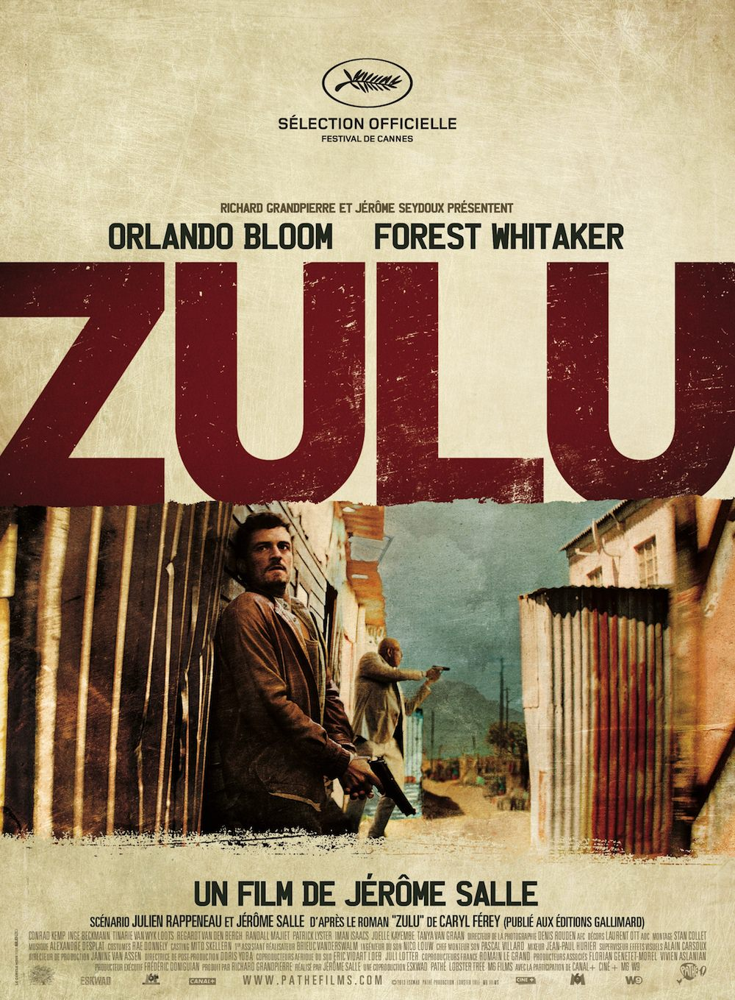
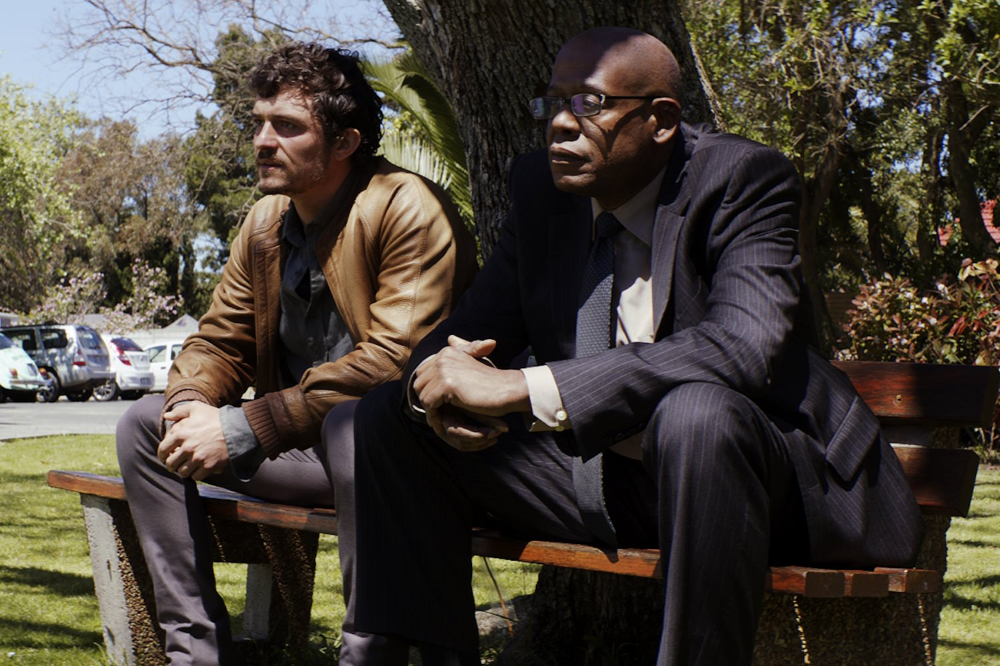
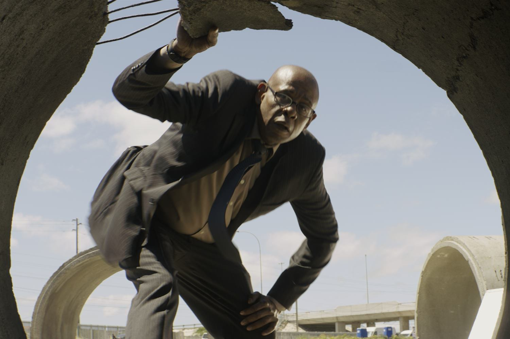

+++
type = "post"
titre = "<em>Zulu</em>, Jérôme Salle"
title = "Zulu, Jérôme Salle"
url = "/zulu-salle"
date = "2013-12-04T22:25:10"
Lastmod = "2013-12-15T17:56:23"
cover = "zulu-jerome-salle-orlando-bloom.jpg"
categorie = [ "À voir" ]
tag = [ "Adaptation littéraire", "Drogue", "Enquête", "Mafia", "Police", "Société", "Thriller", "Violence" ]
createur = [ "Jérôme Salle" ]
acteur = [ "Conrad Kemp", "Forest Whitaker", "Orlando Bloom" ]
annee = [ "2013" ]
weight = 2013
pays = [ "France" ]

+++

Après deux <a href="/largo-winch-2-salle/"><em>Largo Winch</em></a> assez moyens, Jérôme Salle change d’ambiance et de décors. Finie l’Europe, place à l’Afrique du Sud avec ce film policier au cœur des townships et de ce pays encore marqué par des années d’apartheid. Pour <em>Zulu</em>, le cinéaste français abandonne aussi les acteurs français au profit d’un casting international : les noms d’Orlando Bloom et de Forest Whitaker trônent fièrement sur l’affiche. On ne donnait pas cher de cet étrange film français, mais sans être totalement réussi, le résultat est une plutôt bonne surprise. Jérôme Salle n’évite pas certains pièges, mais la noirceur extrême de son traitement sauve le long-métrage. Imparfait, mais pas indigne, une plongée sud-africaine éprouvante qui mérite d’être suivie.

Au départ, une affaire qui s’annonce banale : une jeune fille est retrouvée morte dans un parc zoologique du Cap. Son corps est couvert de blessures et de coups et le constat est sans appel, elle a été tuée sous les coups de poings. En charge de l’enquête, Ali Sokhela et Brian Epkeen, un duo de policiers usés par la vie. Le premier est noir, insomniaque et incapable de profiter de la vie depuis une agression pendant son enfance, alors que l’on pouvait encore battre un homme pour sa couleur sans être inquiété. Le second est blanc, alcoolique et incapable de mener une vie rangée, comme son ex-femme et son fils ne cessent de lui rappeler. <em>Zulu</em> ne fait pas dans l’originalité avec ce duo de flics qui évoque quelques médiocres comédies américaines, l’humour en moins. Jérôme Salle qui adapte ici un roman de Caryl Ferey n’a pas choisi de faire dans la subtilité avec ces deux personnages, même si le récit permet fort heureusement d’oublier leurs antagonismes marqués. Le policier fatigué et à la limite de craquer est un cliché du genre, mais il faut reconnaître que ce cliché est bien mené ici. Forest Whitaker en particulier s’en donne à cœur joie dans le rôle de ce flic qui ne dort jamais et qui ne peut avoir aucune relation normale avec une femme. On sent bien le poids des années dans son visage fatigué et l’acteur est impressionnant par son mutisme permanent. De son côté, Orlando Bloom nous surprend avec son excellent jeu et c’est la première fois qu’on ne le remarque pas à cause de sa transparence. L’acteur s’est mis à nu — littéralement — et il interprète avec conviction son personnage d’alcoolique qui a un peu tout raté dans sa vie, son mariage, l’éducation de son enfant et même sa carrière. Ainsi, <em>Zulu</em> rattrape au fil de ses quasiment deux heures ces deux personnages que l’on pensait dans un premier temps sans grand intérêt et il faut reconnaître que Jérôme Salle s’en sort plutôt bien sur ce point.

<em>Zulu</em> n’est pas sans défaut pour autant, loin de là. Le long-métrage ouvre une scène que n’importe quel spectateur identifiera d’emblée à un flashback tant elle porte toutes les caractéristiques, ou plutôt tous les clichés attendus. Couleurs fades, grain marqué : la photographie de Jérôme Salle par ailleurs assez neutre est alors trop marquée et elle dénature complètement la scène. Le cinéaste a heureusement su se retenir dans l’ensemble, même s’il ne peut s’empêcher de nous servir cette même scène à une ou deux reprises encore, comme si on n’avait pas compris la première fois le traumatisme du personnage. <em>Zulu</em> semble constamment sous la menace de cette scène inaugurale, une menace que l’on pourrait résumer à de la lourdeur. Lourdeur quand on appuie plus que de raison sur le passé difficile de l’Afrique du Sud ; lourdeur d’une scène inutilement gore où des souris s’entretuent et se dévorent mutuellement ; lourdeur d’une scène de torture et surtout, le pire, lourdeur d’une musique qui entend appuyer à tout pris une émotion<a href="#footnote_0_10656" id="identifier_0_10656" class="footnote-link footnote-identifier-link" title="Cette musique, compos&eacute;e par Alexandre Desplat, n&rsquo;est pas mauvaise en plus, mais elle est bien trop pr&eacute;sente&hellip;">1</a>. Le cinéaste tombe plusieurs fois dans ce piège et, voulant bien faire, nuit <em>in fine</em> à son film qui aurait nécessité plus de sobriété. Pour autant, <em>Zulu</em> n’est pas le désastre que l’on pourrait craindre et même si le film tangue dangereusement dans certaines scènes, il parvient à rester du côté du bon goût. La noirceur absolue du récit et des personnages sauve, au fond, le quatrième long-métrage du cinéaste. On ne peut pas trop en dire pour ne pas dévoiler l’intrigue, mais disons simplement qu’aucun personnage ne sortira vraiment indemne de cette salle affaire. S’il en fait parfois trop, Jérôme Salle trouve aussi souvent le ton juste, à l’image de cette fin sobre très réussie. Et puis l’intrigue policière digne d’un téléfilm qui ouvre le film se complexifie rapidement et parvient à maintenir l’attention des spectateurs. 

À l’heure des bilans, on doit reconnaître que ce <em>Zulu</em> qui s’annonçait mal parvient à surprendre. On ne s’attendait pas à une telle noirceur et c’est en fait une plongée vraiment terrifiante dans une Afrique du Sud contemporaine toujours aussi marquée par les horreurs du passé qui nous est offerte. Certes, Jérôme Salle n’évite pas tous les pièges et tombe parfois dans le cliché et la lourdeur inutile, mais le résultat est indéniablement meilleur que ses réalisations précédentes. <em>Zulu</em> mérite d’être vu, du moins si vous ne cherchez pas une séance plaisante…

<ol class="footnotes"><li id="footnote_0_10656" class="footnote">Cette musique, composée par Alexandre Desplat, n&rsquo;est pas mauvaise en plus, mais elle est bien trop présente… [<a href="#identifier_0_10656" class="footnote-link footnote-back-link">&#8617;</a>]</li></ol>
